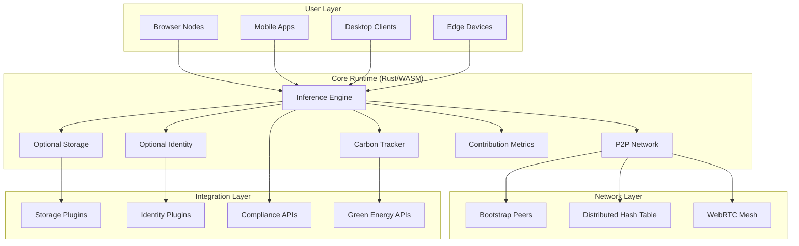
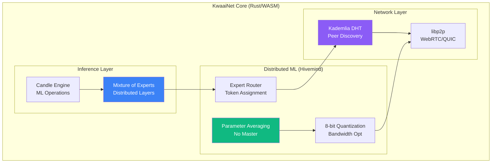

# KwaaiNet Architecture Specification
## Distributed AI Infrastructure Technical Design

**Version**: 2.0
**Date**: February 4, 2026
**Status**: Active Development - Open Source Project

---

## Executive Architecture Summary

KwaaiNet represents a **paradigm shift** from centralized AI infrastructure to a **distributed AI platform** where users maintain complete control over their compute contributions and data. Built as open-source infrastructure, KwaaiNet provides the foundation for decentralized AI with modular integration options.

### Core Design Principles

1. **User Sovereignty**: Users own and control all aspects of their participation
2. **Universal Runtime**: Single codebase deploys across all platforms via Rust/WASM
3. **Privacy by Design**: End-to-end encryption and regulatory compliance built-in
4. **Environmental Accountability**: Carbon footprint tracking and renewable energy monitoring
5. **Modular Architecture**: Optional integrations for storage, identity, and other services

---

## System Architecture Overview



---

## Component 1: Rust/WASM Core Engine

### Technical Requirements

**Primary Objective**: Universal AI inference engine with distributed deep learning capabilities, inspired by [Hivemind](https://github.com/learning-at-home/hivemind) patterns, that runs everywhere

> **Reference**: See [HIVEMIND_RUST_ARCHITECTURE.md](docs/HIVEMIND_RUST_ARCHITECTURE.md) for complete technical specifications on replicating Hivemind's distributed deep learning in Rust/WASM.

**Core Components**:
```rust
pub struct KwaaiNetCore {
    // Core Inference (existing)
    pub inference_engine: CandelEngine,
    pub model_manager: ModelManager,
    pub resource_manager: ResourceManager,

    // P2P Networking (enhanced with Hivemind patterns)
    pub network_layer: P2PNetwork,         // libp2p with WebRTC
    pub dht: KademliaDHT,                  // Peer discovery & model registry

    // Distributed ML (new - from Hivemind)
    pub moe: MixtureOfExperts,             // Distributed model layers
    pub averager: DecentralizedAverager,   // Parameter sync without master
    pub compressor: BlockwiseQuantizer,    // 8-bit gradient compression
}

impl KwaaiNetCore {
    pub async fn initialize(config: NodeConfig) -> Result<Self>;
    pub async fn load_model(model_id: &str) -> Result<ModelHandle>;
    pub async fn join_network(bootstrap_peers: Vec<PeerAddr>) -> Result<()>;

    // Local inference
    pub async fn run_inference(request: InferenceRequest) -> Result<InferenceResponse>;

    // Distributed inference (new - Hivemind patterns)
    pub async fn run_distributed_inference(request: InferenceRequest) -> Result<InferenceResponse>;
    pub async fn register_as_expert(expert_id: ExpertId, layer: ModelLayer) -> Result<()>;
    pub async fn participate_in_averaging() -> Result<AveragingResult>;
}
```

**Architecture Diagram**:


**Technical Specifications**:
- **Framework**: Rust with `candle-core` for ML operations
- **WASM Target**: `wasm32-unknown-unknown` with WebRTC support
- **P2P Networking**: `rust-libp2p` (native, not go-libp2p-daemon) with WebRTC transport
- **DHT**: Kademlia for peer discovery and expert registry
- **Model Loading**: GGUF format with IPFS/HTTP fallback
- **Memory Management**: Efficient model sharding for low-resource devices
- **Distributed ML**: Mixture of Experts (MoE) for distributed inference
- **Compression**: Blockwise 8-bit quantization (~4x bandwidth reduction)

**Performance Requirements**:
- **Browser**: < 100MB WASM bundle, < 2GB RAM for 7B parameter models
- **Mobile**: Background inference with < 5% battery drain per hour
- **Desktop**: Match or exceed current Python implementation performance
- **Edge**: ARM/MIPS support with < 1GB RAM requirements
- **Distributed**: < 200ms P2P latency, support for 10,000+ concurrent nodes

**Key Deliverables**:

*Core Infrastructure*:
1. Core Rust library with comprehensive test suite
2. WASM build pipeline and browser integration example
3. Model loading and sharding system
4. Performance benchmarks vs existing Python implementation
5. Documentation and API specification

*P2P Networking*:
6. libp2p networking with WebRTC transport (browser-native)
7. Kademlia DHT for peer discovery and model registry
8. NAT traversal (hole punching, relay circuits)

*Distributed ML - Hivemind Patterns*:
9. Mixture of Experts (MoE) distributed layer implementation
10. Expert router with load balancing
11. Decentralized parameter averaging
12. Blockwise 8-bit gradient compression
13. Fault-tolerant expert calling with retry/fallback

---

## Component 2: Optional Integration Framework

### Technical Requirements

**Primary Objective**: Modular framework for integrating storage and identity systems (Verida Network as reference implementation)

**Core Components**:
```rust
pub trait StorageProvider {
    async fn store_data(data: EncryptedData, acl: AccessControl) -> Result<StorageId>;
    async fn retrieve_data(storage_id: StorageId) -> Result<EncryptedData>;
    async fn delete_data(storage_id: StorageId) -> Result<()>;
}

pub trait IdentityProvider {
    async fn authenticate_user(credentials: AuthCredentials) -> Result<Identity>;
    async fn verify_identity(proof: IdentityProof) -> Result<VerificationStatus>;
    async fn get_permissions(identity: Identity) -> Result<PermissionSet>;
}

// Example implementations
pub struct VeridaStorage;     // Verida Network integration
pub struct IPFSStorage;        // IPFS integration
pub struct CustomStorage;      // Custom backend

pub struct VeridaIdentity;     // Verida DID system
pub struct WebAuthnIdentity;   // FIDO2/PassKeys
pub struct CustomIdentity;     // Custom provider
```

**Integration Framework Features**:
- **Storage Abstraction**: Pluggable storage backends (Verida, Solid, IPFS, Filecoin, custom)
- **Identity Abstraction**: Pluggable identity providers (DIDs, WebAuthn, custom)
- **Encryption Layer**: User-controlled private keys, zero-knowledge architecture
- **Access Control**: Fine-grained permissions for data sharing
- **Progressive Auth**: Anonymous → Email → Full identity flow
- **GDPR Compliance**: Right to deletion, data portability, consent management

**Example Integration: Verida Network**:
See [docs/VERIDA_INTEGRATION.md](docs/VERIDA_INTEGRATION.md) for a complete reference implementation using Verida Network as one optional backend.

**Key Deliverables**:
1. Storage provider trait and plugin system
2. Identity provider trait and plugin system
3. Example implementations (Verida, IPFS, WebAuthn)
4. Progressive authentication framework
5. Privacy compliance framework
6. Integration documentation and examples

---

## Component 3: Browser SDK Development

### Technical Requirements

**Primary Objective**: One-line website integration for distributed AI services

**SDK Interface**:
```javascript
// One-line integration
<script src="https://cdn.kwaai.ai/distributed-ai.js"
        data-services="compute,storage,identity,carbon"
        data-privacy-compliant="gdpr,ccpa,hipaa"
        data-max-resources="cpu:20,memory:1024,storage:5000">
</script>

// Programmatic API
const kwaainet = new KwaaiNet({
    services: ['compute', 'storage', 'identity'],
    privacyCompliance: ['gdpr', 'ccpa'],
    maxResources: { cpu: 20, memory: 1024, storage: 5000 }
});

await kwaainet.initialize();
kwaainet.on('contribution', (metrics) => console.log(`Contributed ${metrics.compute_hours} hours`));
kwaainet.on('environmentalImpact', (metrics) => updateGreenStats(metrics));
```

**Core Features**:
- **Distributed Services**: AI compute + optional storage + optional identity
- **Privacy-First Analytics**: Zero tracking, GDPR compliant by design
- **Environmental Tracking**: Carbon footprint monitoring and renewable energy detection
- **Contribution Tracking**: Monitor and display resource contributions
- **Progressive Disclosure**: Anonymous usage → authenticated participation

**Technical Implementation**:
- **WASM Integration**: Seamless loading of Rust/WASM core engine
- **WebRTC Networking**: Browser-native P2P communication
- **Service Workers**: Background processing for better user experience
- **Consent Management**: Built-in privacy controls without external banners
- **Performance Monitoring**: Real-time resource usage and optimization

**Key Deliverables**:
1. JavaScript SDK with TypeScript definitions
2. CDN-ready distribution package
3. Website integration examples and templates
4. Privacy-compliant analytics dashboard
5. Environmental impact tracking system
6. Developer documentation and integration guides

---

## Component 4: Enterprise Compliance Tools

### Technical Requirements

**Primary Objective**: Built-in regulatory compliance for enterprise AI deployment

**Compliance Framework**:
```rust
pub struct ComplianceFramework {
    pub gdpr: GDPRCompliance,
    pub hipaa: HIPAACompliance,
    pub soc2: SOC2Compliance,
    pub audit: AuditLogger,
    pub residency: DataResidency,
}

impl ComplianceFramework {
    pub async fn validate_data_processing(request: ProcessingRequest) -> Result<ComplianceStatus>;
    pub async fn generate_audit_report(timeframe: TimeRange) -> Result<AuditReport>;
    pub async fn enforce_data_residency(data: SensitiveData, region: Region) -> Result<()>;
    pub async fn handle_deletion_request(user_id: UserId) -> Result<DeletionStatus>;
}
```

**Regulatory Requirements**:
- **GDPR**: Right to deletion, data portability, consent management, lawful basis
- **HIPAA**: PHI protection, access controls, audit logs, breach notification
- **SOC2**: Security controls, availability, processing integrity, confidentiality
- **Data Residency**: Geographic data controls, regional compliance requirements

**Enterprise Features**:
- **Compliance Dashboard**: Real-time compliance status monitoring
- **Audit Logging**: Immutable logs of all data operations
- **Policy Engine**: Configurable compliance rules and enforcement
- **Breach Detection**: Automated anomaly detection and notification
- **Certification Support**: Automated evidence collection for audits

**Key Deliverables**:
1. Multi-framework compliance engine (GDPR, HIPAA, SOC2)
2. Automated audit logging and reporting system
3. Data residency controls with geographic enforcement
4. Enterprise compliance dashboard
5. Policy configuration and management tools
6. Certification and audit support documentation

---

## Component 5: Mobile Foundation

### Technical Requirements

**Primary Objective**: Native iOS/Android apps with privacy-first distributed AI

**Mobile Architecture**:
```swift
// iOS Implementation
class SovereignAIService: BackgroundTaskService {
    func contributeWhenOptimal() -> Promise<ContributionResult> {
        // Battery > 50%, WiFi connected, device idle
    }
    
    func detectEnergySource() -> EnergySource {
        // Solar charging detection via battery patterns
    }
    
    func manageIdentity() -> IdentityManager {
        // Biometric + hardware security module integration
    }
}
```

```kotlin
// Android Implementation  
class SovereignAIForegroundService: Service() {
    override fun onStartCommand(): Int {
        // More aggressive contribution than iOS
        // Persistent notification required
    }
    
    fun optimizeBatteryUsage(): BatteryOptimizer {
        // Android-specific power management
    }
}
```

**Core Features**:
- **Background Processing**: Contribute during charging + WiFi with battery awareness
- **Progressive Authentication**: Anonymous → biometric → full identity
- **Environmental Detection**: Solar vs grid charging detection
- **Community Features**: Contribution tracking, leaderboards, collaboration
- **Offline Capability**: Local inference when network unavailable

**Platform-Specific Optimization**:
- **iOS**: Background processing entitlements, CoreML integration, privacy labels
- **Android**: Foreground services, aggressive contribution modes, diverse hardware support
- **Cross-Platform**: Shared Rust core with native UI layers

**Key Deliverables**:
1. iOS native application with App Store compliance
2. Android native application with Play Store compliance
3. Shared Rust core library for mobile platforms
4. Battery-aware contribution algorithms
5. Progressive authentication UI/UX implementation
6. Community features and contribution tracking

---

## Component 6: Environmental Tracking

### Technical Requirements

**Primary Objective**: Carbon accountability for distributed computing with renewable energy monitoring

**Environmental Architecture**:
```rust
pub struct EnvironmentalSystem {
    pub carbon_tracker: CarbonFootprintTracker,
    pub energy_detector: RenewableEnergyDetector,
    pub impact_reporter: ImpactReporter,
    pub community_dashboard: CommunityDashboard,
}

impl EnvironmentalSystem {
    pub async fn detect_energy_source(device_metrics: DeviceMetrics) -> EnergySource;
    pub async fn calculate_carbon_impact(computation: ComputeJob) -> CarbonMetrics;
    pub async fn track_renewable_usage(node_id: NodeId) -> Result<RenewableMetrics>;
    pub async fn update_community_stats(impact: EnvironmentalImpact);
}
```

**Environmental Features**:
- **Energy Source Detection**: Solar vs grid power identification
- **Carbon Footprint Tracking**: Real-time computation impact measurement
- **Renewable Energy Monitoring**: Track clean energy usage patterns
- **Impact Reporting**: Transparent environmental accountability
- **Green Certifications**: Verified carbon-conscious infrastructure status

**Community Elements**:
- **Sustainability Tracking**: Monitor environmental impact milestones
- **Green Energy Leaderboards**: Community recognition for clean computing
- **Impact Visualization**: Personal and collective environmental dashboard
- **Corporate ESG Integration**: Enterprise sustainability reporting
- **Transparency**: Open data on network environmental footprint

**Key Deliverables**:
1. Carbon footprint tracking and calculation engine
2. Renewable energy detection algorithms
3. Community impact tracking system
4. Environmental leaderboard and recognition
5. Environmental impact visualization dashboard
6. Corporate ESG reporting and certification tools

---

## Optional Integration Examples

### Storage Systems
Multiple distributed storage networks can be integrated:
- **Verida Network**: Decentralized storage with built-in identity (reference implementation - see docs/VERIDA_INTEGRATION.md)
- **Solid Protocol**: Tim Berners-Lee's personal data pods with linked data standards
- **IPFS**: Content-addressed storage for models and data
- **Filecoin**: Persistent storage with cryptographic proofs and economic incentives
- **OrbitDB**: Distributed database option
- **Custom**: Implement your own storage backend

### Identity Systems
Multiple identity systems can be integrated:
- **W3C DIDs**: Decentralized Identifiers (Verida, ION, etc.)
- **Solid WebID**: Identity integrated with Solid data pods
- **WebAuthn/PassKeys**: FIDO2 authentication with device biometrics
- **ENS**: Ethereum Name Service integration
- **Custom**: Standard interface for any identity provider

### Payment/Reward Systems (Optional)
If the community desires payment or reward mechanisms, these can be added as optional modules. Any blockchain or token can be integrated. Not part of core KwaaiNet functionality.

---

## Development Guidelines

### Code Quality Standards
- **Test Coverage**: Minimum 80% unit test coverage
- **Documentation**: Comprehensive API documentation and examples
- **Security**: Regular security audits and vulnerability assessments
- **Performance**: Continuous benchmarking and optimization

### Architecture Principles
- **Modularity**: Clean separation between components
- **Extensibility**: Plugin architecture for future enhancements
- **Interoperability**: Standard protocols and APIs
- **Resilience**: Graceful degradation and error recovery

### Community Integration
- **Open Source**: MIT license for maximum adoption
- **Community Governance**: Transparent decision-making processes
- **Mentorship**: Experienced developers guide newcomers
- **Recognition**: Public attribution and ongoing maintenance opportunities

---

## Success Metrics

### Technical KPIs
- **Performance**: Match or exceed current Python baseline
- **Scalability**: Support 1M+ concurrent nodes
- **Reliability**: 99.9% uptime across all services
- **Security**: Zero critical vulnerabilities in production

### Community KPIs  
- **Participation**: 1000+ active developers across challenges
- **Quality**: High-quality submissions meeting all requirements
- **Integration**: Seamless integration between challenge components
- **Documentation**: Comprehensive developer resources

### Community KPIs
- **Network Growth**: Increasing node participation and diversity
- **Sustainability**: Long-term project viability through open-source governance
- **Environmental Impact**: Measurable carbon reduction through renewable energy usage
- **Value Creation**: Community-driven innovation and adoption

---

## Detailed Architecture Documentation

For comprehensive architectural diagrams and detailed technical specifications, see the following documentation:

### Component Architectures
**[docs/CHALLENGE_ARCHITECTURES.md](docs/CHALLENGE_ARCHITECTURES.md)**

Detailed Mermaid diagrams for all core components:
- Component 1: Rust/WASM Core Engine architecture, model loading flows, platform compilation targets
- Component 2: Optional Integration Framework, storage and identity abstraction, progressive authentication
- Component 3: Browser SDK architecture, one-line integration flow, service worker patterns
- Component 4: Enterprise Compliance framework, GDPR flows, data residency enforcement
- Component 5: Mobile Foundation cross-platform architecture, battery-aware contribution patterns
- Component 6: Environmental Tracking system, renewable energy detection, carbon calculation

### Data Flows & Authentication
**[docs/DATA_FLOWS.md](docs/DATA_FLOWS.md)**

Comprehensive data flow and authentication diagrams:
- Progressive Authentication: Anonymous → Email → Biometric → Full Identity flows
- Personal Data Integration: Multi-source data sync with privacy controls
- Privacy-Preserving AI Inference: End-to-end encryption and zero-knowledge patterns
- Optional Identity Systems: Cross-platform verification and data portability

### Deployment Architecture
**[docs/DEPLOYMENT_ARCHITECTURE.md](docs/DEPLOYMENT_ARCHITECTURE.md)**

Platform-specific deployment patterns:
- Browser Deployment: WASM loading, WebRTC mesh, service worker architecture
- Mobile Deployment: iOS (BGTaskScheduler, Metal) and Android (Foreground Service, Vulkan)
- Desktop Deployment: Cross-platform daemon, auto-update system, GPU acceleration
- Edge Device Deployment: Router firmware, IoT devices, resource-constrained patterns
- Enterprise/Server Deployment: Kubernetes, compliance integration, high availability

### Verida Integration Architecture (Optional Example)
**[docs/VERIDA_ARCHITECTURE.md](docs/VERIDA_ARCHITECTURE.md)**

Deep dive into Verida Network integration as one optional backend:
- Protocol Bridge Design: Message translation, state synchronization
- Identity Management: DID architecture, key management, multi-context identity
- Storage Layer: Private datastores, data schemas, sync engine
- Security Architecture: E2E encryption, zero-knowledge auth, threat model

### Distributed Deep Learning (Hivemind Patterns)
**[docs/HIVEMIND_RUST_ARCHITECTURE.md](docs/HIVEMIND_RUST_ARCHITECTURE.md)**

Comprehensive plan for replicating Hivemind's distributed deep learning in Rust/WASM:
- Component Mapping: Python → Rust translation for all Hivemind modules
- P2P Networking: Native rust-libp2p (replacing go-libp2p-daemon)
- Mixture of Experts: Distributed model layers across network participants
- Parameter Averaging: Decentralized gradient sync without master node
- Compression: Blockwise 8-bit quantization for bandwidth efficiency
- WASM Compilation: Full browser support via WebAssembly

### Supporting Documentation
- **[INTEGRATIONS.md](INTEGRATIONS.md)** - Optional integration framework and examples
- **[docs/CANDLE_ENGINE.md](docs/CANDLE_ENGINE.md)** - Candle framework technical details (includes distributed inference patterns)
- **[docs/VERIDA_INTEGRATION.md](docs/VERIDA_INTEGRATION.md)** - Optional Verida integration example

---

**This architecture represents the foundation for building open-source distributed AI infrastructure. Each component contributes to a unified vision of user-owned, privacy-preserving, environmentally accountable AI platform.**

*Ready to build the future of distributed AI? Let's democratize AI infrastructure together.*