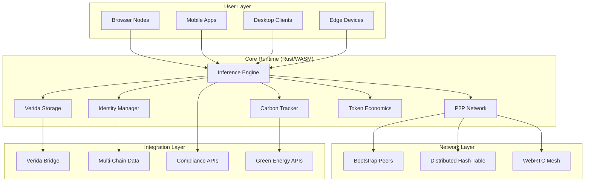

# KwaaiNet Architecture Specification
## Sovereign AI Infrastructure Technical Design

**Version**: 1.0  
**Date**: September 11, 2025  
**Status**: Specification Phase - Hackathon Challenges Pending

---

## Executive Architecture Summary

KwaaiNet represents a **paradigm shift** from centralized AI infrastructure to a **sovereign AI platform** where users maintain complete control over their compute contributions, data storage, and identity. Through integration with Verida Network, we deliver the world's first **triple-service AI platform**.

### Core Design Principles

1. **User Sovereignty**: Users own and control all aspects of their participation
2. **Universal Runtime**: Single codebase deploys across all platforms via Rust/WASM
3. **Privacy by Design**: End-to-end encryption and regulatory compliance built-in
4. **Environmental Sustainability**: Carbon-negative computing with renewable energy incentives
5. **Economic Alignment**: Unified VDA token economics across all services

---

## System Architecture Overview



---

## Challenge 1: Rust/WASM Core Engine
### Prize Pool: 750,000 VDA Tokens

#### Technical Requirements

**Primary Objective**: Universal AI inference engine that runs everywhere

**Core Components**:
```rust
pub struct KwaaiNetCore {
    pub inference_engine: CandelEngine,
    pub model_manager: ModelManager,
    pub network_layer: P2PNetwork,
    pub resource_manager: ResourceManager,
}

impl KwaaiNetCore {
    pub async fn initialize(config: NodeConfig) -> Result<Self>;
    pub async fn load_model(model_id: &str) -> Result<ModelHandle>;
    pub async fn run_inference(request: InferenceRequest) -> Result<InferenceResponse>;
    pub async fn join_network(bootstrap_peers: Vec<PeerAddr>) -> Result<()>;
}
```

**Technical Specifications**:
- **Framework**: Rust with `candle-core` for ML operations
- **WASM Target**: `wasm32-unknown-unknown` with WebRTC support
- **P2P Networking**: `libp2p` with WebRTC transport for browser compatibility
- **Model Loading**: GGUF format with IPFS/HTTP fallback
- **Memory Management**: Efficient model sharding for low-resource devices

**Performance Requirements**:
- **Browser**: < 100MB WASM bundle, < 2GB RAM for 7B parameter models
- **Mobile**: Background inference with < 5% battery drain per hour
- **Desktop**: Match or exceed current Python implementation performance
- **Edge**: ARM/MIPS support with < 1GB RAM requirements

**Deliverables**:
1. Core Rust library with comprehensive test suite
2. WASM build pipeline and browser integration example
3. P2P networking implementation with NAT traversal
4. Model loading and sharding system
5. Performance benchmarks vs existing Python implementation
6. Documentation and API specification

---

## Challenge 2: Verida Integration Layer
### Prize Pool: 600,000 VDA Tokens

#### Technical Requirements

**Primary Objective**: Seamless integration between KwaaiNet compute and Verida storage/identity

**Core Components**:
```rust
pub struct VeridaIntegration {
    pub bridge: ProtocolBridge,
    pub identity: IdentityManager,
    pub storage: PrivateStorage,
    pub verification: MultiChainVerifier,
}

impl VeridaIntegration {
    pub async fn authenticate_user(credentials: AuthCredentials) -> Result<Identity>;
    pub async fn store_private_data(data: EncryptedData, acl: AccessControl) -> Result<StorageId>;
    pub async fn verify_cross_chain(proof: IdentityProof) -> Result<VerificationStatus>;
    pub async fn sync_permissions(storage_id: StorageId) -> Result<PermissionSet>;
}
```

**Integration Requirements**:
- **Verida SDK**: Full integration with Verida Client SDK and protocol
- **Verida Wallet**: Complete VDA token management and multi-chain support
- **Identity Management**: Self-sovereign identity with user-controlled keys
- **Private Storage**: End-to-end encrypted database storage for AI model data
- **Token Economics**: VDA token staking, rewards, and payment integration
- **Multi-Chain Support**: Cross-blockchain data verification and portability (Polygon POS: 0x683565196c3eab450003c964d4bad1fd3068d4cc)
- **Progressive Auth**: Anonymous → Email → Full identity → Wallet connection flow

**Privacy & Security**:
- **Encryption**: User-controlled private keys, zero-knowledge architecture
- **Access Control**: Fine-grained permissions for data sharing
- **Audit Trail**: Immutable logs of data access and modifications
- **GDPR Compliance**: Right to deletion, data portability, consent management

**Deliverables**:
1. Protocol bridge between KwaaiNet and Verida networks
2. Verida wallet integration for seamless VDA token management
3. Self-sovereign identity management system with single sign-on
4. Private data storage with user-controlled encryption
5. VDA token economics integration (staking, rewards, payments)
6. Multi-chain data verification protocols
7. Progressive authentication: Anonymous → Email → Identity → Wallet connection
8. Privacy compliance framework and documentation

---

## Challenge 3: Browser SDK Development
### Prize Pool: 500,000 VDA Tokens

#### Technical Requirements

**Primary Objective**: One-line website integration for sovereign AI services

**SDK Interface**:
```javascript
// One-line integration
<script src="https://cdn.kwaai.ai/sovereign-ai.js" 
        data-services="compute,storage,identity,carbon"
        data-privacy-compliant="gdpr,ccpa,hipaa"
        data-reward-split="70/30"
        data-max-resources="cpu:20,memory:1024,storage:5000">
</script>

// Programmatic API
const kwaainet = new KwaaiNet({
    services: ['compute', 'storage', 'identity'],
    privacyCompliance: ['gdpr', 'ccpa'],
    rewardSplit: { site: 70, platform: 30 },
    maxResources: { cpu: 20, memory: 1024, storage: 5000 }
});

await kwaainet.initialize();
kwaainet.on('earnings', (amount) => console.log(`Earned ${amount} VDA`));
kwaainet.on('environmentalImpact', (metrics) => updateGreenStats(metrics));
```

**Core Features**:
- **Triple Service Integration**: AI compute + private storage + identity services
- **Privacy-First Analytics**: Zero tracking, GDPR compliant by design
- **Environmental Tracking**: Carbon footprint monitoring and renewable energy detection
- **Reward Distribution**: Automatic VDA token distribution to website owners
- **Progressive Disclosure**: Anonymous usage → authenticated rewards

**Technical Implementation**:
- **WASM Integration**: Seamless loading of Rust/WASM core engine
- **WebRTC Networking**: Browser-native P2P communication
- **Service Workers**: Background processing for better user experience
- **Consent Management**: Built-in privacy controls without external banners
- **Performance Monitoring**: Real-time resource usage and optimization

**Deliverables**:
1. JavaScript SDK with TypeScript definitions
2. CDN-ready distribution package
3. Website integration examples and templates
4. Privacy-compliant analytics dashboard
5. Environmental impact tracking system
6. Developer documentation and integration guides

---

## Challenge 4: Enterprise Compliance Tools
### Prize Pool: 450,000 VDA Tokens

#### Technical Requirements

**Primary Objective**: Built-in regulatory compliance for enterprise AI deployment

**Compliance Framework**:
```rust
pub struct ComplianceFramework {
    pub gdpr: GDPRCompliance,
    pub hipaa: HIPAACompliance,
    pub soc2: SOC2Compliance,
    pub audit: AuditLogger,
    pub residency: DataResidency,
}

impl ComplianceFramework {
    pub async fn validate_data_processing(request: ProcessingRequest) -> Result<ComplianceStatus>;
    pub async fn generate_audit_report(timeframe: TimeRange) -> Result<AuditReport>;
    pub async fn enforce_data_residency(data: SensitiveData, region: Region) -> Result<()>;
    pub async fn handle_deletion_request(user_id: UserId) -> Result<DeletionStatus>;
}
```

**Regulatory Requirements**:
- **GDPR**: Right to deletion, data portability, consent management, lawful basis
- **HIPAA**: PHI protection, access controls, audit logs, breach notification
- **SOC2**: Security controls, availability, processing integrity, confidentiality
- **Data Residency**: Geographic data controls, regional compliance requirements

**Enterprise Features**:
- **Compliance Dashboard**: Real-time compliance status monitoring
- **Audit Logging**: Immutable logs of all data operations
- **Policy Engine**: Configurable compliance rules and enforcement
- **Breach Detection**: Automated anomaly detection and notification
- **Certification Support**: Automated evidence collection for audits

**Deliverables**:
1. Multi-framework compliance engine (GDPR, HIPAA, SOC2)
2. Automated audit logging and reporting system
3. Data residency controls with geographic enforcement
4. Enterprise compliance dashboard
5. Policy configuration and management tools
6. Certification and audit support documentation

---

## Challenge 5: Mobile Foundation
### Prize Pool: 400,000 VDA Tokens

#### Technical Requirements

**Primary Objective**: Native iOS/Android apps with privacy-first sovereign AI

**Mobile Architecture**:
```swift
// iOS Implementation
class SovereignAIService: BackgroundTaskService {
    func contributeWhenOptimal() -> Promise<ContributionResult> {
        // Battery > 50%, WiFi connected, device idle
    }
    
    func detectEnergySource() -> EnergySource {
        // Solar charging detection via battery patterns
    }
    
    func manageIdentity() -> IdentityManager {
        // Biometric + hardware security module integration
    }
}
```

```kotlin
// Android Implementation  
class SovereignAIForegroundService: Service() {
    override fun onStartCommand(): Int {
        // More aggressive contribution than iOS
        // Persistent notification required
    }
    
    fun optimizeBatteryUsage(): BatteryOptimizer {
        // Android-specific power management
    }
}
```

**Core Features**:
- **Background Processing**: Contribute during charging + WiFi with battery awareness
- **Progressive Authentication**: Anonymous → biometric → full sovereign identity
- **Environmental Detection**: Solar vs grid charging detection
- **Social Features**: Earnings sharing, leaderboards, referral programs
- **Offline Capability**: Local inference when network unavailable

**Platform-Specific Optimization**:
- **iOS**: Background processing entitlements, CoreML integration, privacy labels
- **Android**: Foreground services, aggressive contribution modes, diverse hardware support
- **Cross-Platform**: Shared Rust core with native UI layers

**Deliverables**:
1. iOS native application with App Store compliance
2. Android native application with Play Store compliance  
3. Shared Rust core library for mobile platforms
4. Battery-aware contribution algorithms
5. Progressive authentication UI/UX implementation
6. Social features and gamification system

---

## Challenge 6: Environmental Gamification
### Prize Pool: 300,000 VDA Tokens

#### Technical Requirements

**Primary Objective**: Carbon-negative computing platform with renewable energy incentives

**Environmental Architecture**:
```rust
pub struct EnvironmentalSystem {
    pub carbon_tracker: CarbonFootprintTracker,
    pub energy_detector: RenewableEnergyDetector,
    pub offset_marketplace: CarbonOffsetMarketplace,
    pub gamification: GreenGamificationEngine,
}

impl EnvironmentalSystem {
    pub async fn detect_energy_source(device_metrics: DeviceMetrics) -> EnergySource;
    pub async fn calculate_carbon_impact(computation: ComputeJob) -> CarbonMetrics;
    pub async fn purchase_offsets(carbon_debt: CarbonAmount) -> Result<OffsetCertificate>;
    pub async fn update_leaderboard(user: UserId, impact: EnvironmentalImpact);
}
```

**Environmental Features**:
- **Energy Source Detection**: Solar vs grid power identification
- **Carbon Footprint Tracking**: Real-time computation impact measurement
- **Renewable Energy Bonus**: +30-70% VDA rewards for clean energy
- **Carbon Marketplace**: Automated offset purchasing and trading
- **Green Certifications**: Verified carbon-negative infrastructure status

**Gamification Elements**:
- **Sustainability Achievements**: Milestones for environmental impact
- **Green Energy Leaderboards**: Community competition for clean computing
- **Impact Visualization**: Personal and collective environmental dashboard
- **Corporate ESG Integration**: Enterprise sustainability reporting
- **Social Sharing**: "I offset X tons of CO2 this month" messaging

**Deliverables**:
1. Carbon footprint tracking and calculation engine
2. Renewable energy detection algorithms
3. Green energy marketplace integration
4. Sustainability achievement and leaderboard systems  
5. Environmental impact visualization dashboard
6. Corporate ESG reporting and certification tools

---

## Token Economics Architecture

### VDA Token Integration

**Unified Currency Model**:
```rust
pub struct VDAEconomics {
    pub compute_rewards: ComputeRewardCalculator,
    pub storage_rewards: StorageRewardCalculator, 
    pub identity_rewards: IdentityRewardCalculator,
    pub environmental_bonuses: EnvironmentalBonusCalculator,
}

// Reward Structure
const COMPUTE_RATE: u64 = 100; // VDA per hour
const STORAGE_RATE: u64 = 50;  // VDA per GB/month  
const IDENTITY_RATE: u64 = 25; // VDA per verification
const GREEN_BONUS: f64 = 0.5;  // 50% bonus for renewable energy
```

**Economic Flow**:
1. **Contribution**: Users earn VDA for compute/storage/identity services
2. **Consumption**: Users spend VDA for AI inference and data access
3. **Environmental Bonus**: Clean energy usage multiplies rewards
4. **Network Effects**: More users = more demand = higher VDA utility

---

## Development Guidelines

### Code Quality Standards
- **Test Coverage**: Minimum 80% unit test coverage
- **Documentation**: Comprehensive API documentation and examples
- **Security**: Regular security audits and vulnerability assessments
- **Performance**: Continuous benchmarking and optimization

### Architecture Principles
- **Modularity**: Clean separation between components
- **Extensibility**: Plugin architecture for future enhancements
- **Interoperability**: Standard protocols and APIs
- **Resilience**: Graceful degradation and error recovery

### Community Integration
- **Open Source**: MIT license for maximum adoption
- **Community Governance**: Transparent decision-making processes
- **Mentorship**: Experienced developers guide newcomers
- **Recognition**: Public attribution and ongoing maintenance opportunities

---

## Success Metrics

### Technical KPIs
- **Performance**: Match or exceed current Python baseline
- **Scalability**: Support 1M+ concurrent nodes
- **Reliability**: 99.9% uptime across all services
- **Security**: Zero critical vulnerabilities in production

### Community KPIs  
- **Participation**: 1000+ active developers across challenges
- **Quality**: High-quality submissions meeting all requirements
- **Integration**: Seamless integration between challenge components
- **Documentation**: Comprehensive developer resources

### Economic KPIs
- **Token Utility**: Increasing VDA demand through usage
- **Network Growth**: Exponential node growth post-launch
- **Revenue**: Sustainable economics supporting continued development
- **Value Creation**: VDA appreciation through infrastructure utility

---

## Detailed Architecture Documentation

For comprehensive architectural diagrams and detailed technical specifications, see the following documentation:

### Challenge-Specific Architectures
**[docs/CHALLENGE_ARCHITECTURES.md](docs/CHALLENGE_ARCHITECTURES.md)**

Detailed Mermaid diagrams for each of the 6 hackathon challenges:
- Challenge 1: Rust/WASM Core Engine component architecture, model loading flows, platform compilation targets
- Challenge 2: Verida Integration Layer protocol bridge, progressive authentication, VDA token economics
- Challenge 3: Browser SDK architecture, one-line integration flow, service worker patterns
- Challenge 4: Enterprise Compliance framework, GDPR flows, data residency enforcement
- Challenge 5: Mobile Foundation cross-platform architecture, battery-aware contribution patterns
- Challenge 6: Environmental Gamification system, renewable energy detection, carbon calculation

### Data Flows & Authentication
**[docs/DATA_FLOWS.md](docs/DATA_FLOWS.md)**

Comprehensive data flow and authentication diagrams:
- Progressive Authentication: Anonymous → Email → Biometric → Sovereign → Wallet flows
- Personal Data Integration: Multi-source data sync with privacy controls
- VDA Token Economics: Triple service rewards, staking tiers, payment flows
- Privacy-Preserving AI Inference: End-to-end encryption and zero-knowledge patterns
- Multi-Chain Identity: Cross-blockchain verification and data portability

### Deployment Architecture
**[docs/DEPLOYMENT_ARCHITECTURE.md](docs/DEPLOYMENT_ARCHITECTURE.md)**

Platform-specific deployment patterns:
- Browser Deployment: WASM loading, WebRTC mesh, service worker architecture
- Mobile Deployment: iOS (BGTaskScheduler, Metal) and Android (Foreground Service, Vulkan)
- Desktop Deployment: Cross-platform daemon, auto-update system, GPU acceleration
- Edge Device Deployment: Router firmware, IoT devices, resource-constrained patterns
- Enterprise/Server Deployment: Kubernetes, compliance integration, high availability

### Verida Integration Architecture
**[docs/VERIDA_ARCHITECTURE.md](docs/VERIDA_ARCHITECTURE.md)**

Deep dive into Verida Network integration:
- Protocol Bridge Design: Message translation, state synchronization
- Identity Management: DID architecture, key management, multi-context identity
- Storage Layer: Private datastores, data schemas, sync engine
- Token Economics Integration: VDA contract interaction, reward distribution, staking
- Security Architecture: E2E encryption, zero-knowledge auth, threat model

### Supporting Documentation
- **[HACKATHONS.md](HACKATHONS.md)** - Community structure and prize distribution
- **[docs/CANDLE_ENGINE.md](docs/CANDLE_ENGINE.md)** - Candle framework technical details
- **[docs/VERIDA_INTEGRATION.md](docs/VERIDA_INTEGRATION.md)** - Integration implementation guide

---

**This architecture represents the foundation for building the world's first sovereign AI infrastructure. Each challenge contributes to a unified vision of user-owned, privacy-preserving, environmentally sustainable AI platform.**

*Ready to build the future of decentralized AI? Let's democratize AI infrastructure together.*