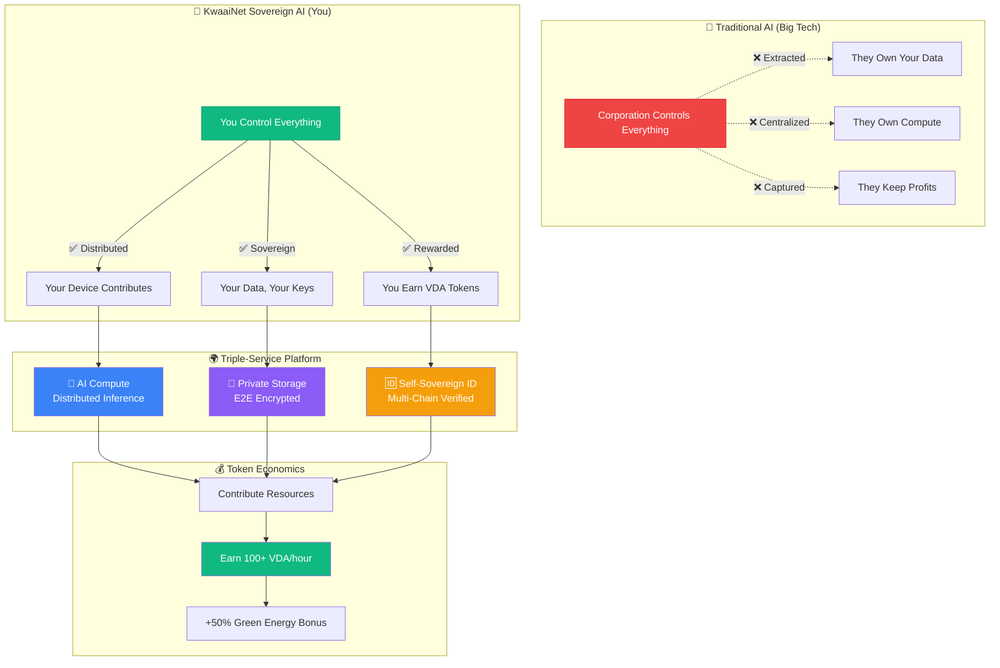
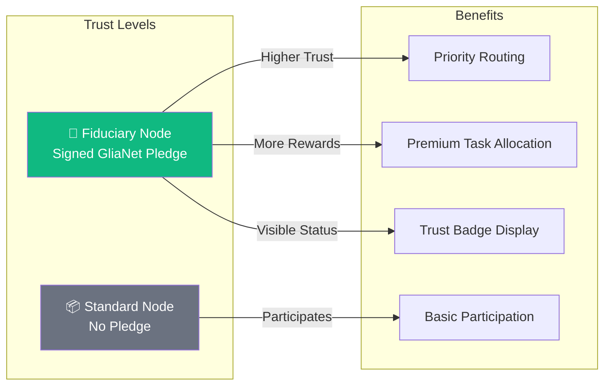

# KwaaiNet: Sovereign AI Infrastructure

> Building the world's first decentralized AI platform where users own their compute, storage, and data

## Vision

KwaaiNet is creating a new paradigm for AI infrastructure - one where **users maintain complete sovereignty** over their computational contributions and personal data. Through the integration with Verida Network, we're building the first truly **sovereign AI platform** that combines:

- **Decentralized AI Compute**: Distributed inference and training across millions of devices
- **Private Data Storage**: End-to-end encrypted databases with user-controlled keys
- **Self-Sovereign Identity**: Multi-chain identity verification and data ownership
- **Environmental Impact**: Carbon-negative computing with renewable energy incentives
https://youtu.be/ES9iQWkAFeY


**The shift is simple**: Instead of Big Tech profiting from your data and compute, **you own it, you control it, you earn from it**.

---

## Guiding Principles: GliaNet Fiduciary Pledge

Kwaai is a proud signatory of the [**GliaNet Fiduciary Pledge**](https://www.glianetalliance.org/pledge), committing KwaaiNet to the highest standards of user protection. This pledge becomes a foundational principle for the entire network.

### The PEP Model

| Duty | Commitment | How KwaaiNet Honors It |
|------|------------|----------------------|
| **🛡️ Protect** (Guardian) | Safeguard user data and well-being | E2E encryption, user-controlled keys, data minimization, no data leaves without consent |
| **⚖️ Enhance** (Mediator) | Resolve conflicts favoring users | No surveillance, no profiling, no third-party data sharing, privacy-by-design |
| **📣 Promote** (Advocate) | Advance user interests proactively | Token rewards, transparent governance, open source, user sovereignty first |

### Node Operator Trust Hierarchy

The GliaNet Fiduciary Pledge is **optional for node operators** but directly impacts network trust:



**Fiduciary Nodes** that sign the pledge receive:
- 🏅 **Trust Badge**: Visible "GliaNet Fiduciary" status on the network map
- ⚡ **Priority Routing**: Preferred for sensitive/enterprise workloads
- 💰 **Enhanced Rewards**: Bonus VDA allocation for maintaining fiduciary standards
- 🤝 **Enterprise Eligibility**: Required for GDPR/HIPAA compliant workloads

> *"By signing the GliaNet Fiduciary Pledge, node operators commit to putting users first—protecting their data, enhancing their experience, and promoting their interests above all else."*

---

## Architecture

KwaaiNet represents a fundamental shift from traditional centralized AI to a **triple-service sovereign model**:

```rust
pub struct SovereignAINode {
    // AI Compute Services
    inference_engine: CandelEngine,          // Rust/WASM inference
    p2p_network: P2PNetwork,                 // WebRTC mesh networking
    
    // Verida Integration
    verida_storage: VeridaDbStore,           // Private database storage
    identity_manager: SelfSovereignID,        // User-controlled identity
    encryption_layer: E2EEncryption,         // End-to-end encryption
    
    // Environmental & Economic
    carbon_tracker: EnvironmentalMetrics,    // Energy source detection
    token_economics: VDARewardSystem,        // Unified VDA token rewards
}
```

## Core Components

### 🦀 **Core Engine** (`/core`)
Rust/WASM universal runtime that deploys everywhere:
- Browser (WebAssembly + WebRTC)
- Mobile (Native iOS/Android)
- Desktop (Single binary)
- Embedded (ARM/MIPS cross-compile)

### 🌐 **Browser SDK** (`/browser-sdk`)
One-line website integration for sovereign AI:
```javascript
<script src="https://cdn.kwaai.ai/sovereign-ai.js" 
        data-services="compute,storage,identity,carbon"
        data-privacy-compliant="gdpr,ccpa,hipaa">
</script>
```

### 📱 **Mobile Foundation** (`/mobile`)
iOS/Android apps with privacy-first design:
- Background contribution during charging + WiFi
- Battery-aware algorithms
- Progressive authentication (Anonymous → Sovereign)

### 🔗 **Verida Integration** (`/verida-integration`)
Bridge layer connecting KwaaiNet compute with Verida storage:
- Protocol bridge development
- Self-sovereign identity management
- Multi-chain data verification

### 🏢 **Enterprise Compliance** (`/compliance`)
Built-in regulatory compliance frameworks:
- GDPR/HIPAA/SOC2 compliance by design
- Audit logging and reporting
- Data residency controls

### 🌱 **Environmental Gamification** (`/environmental`)
Carbon-negative computing platform:
- Renewable energy detection
- Carbon footprint tracking
- Green energy marketplace integration

## Token Economics

**Unified VDA Token Economy** powers all sovereign AI services:

```
Contribute 1 hour AI compute = 100 VDA tokens
Host 1GB private storage = 50 VDA tokens  
Identity verification service = 25 VDA tokens per verification
Multi-chain identity service = 2 VDA tokens per verification
```

**Revenue Model**: Triple service earnings (AI + Storage + Identity) with environmental bonuses (+30-70% for renewable energy)

## Development Roadmap

### Q4 2025: Architecture & Community Preparation
- Technical specification finalization
- 4000+ developer community engagement (900 Kwaai + 3000+ Verida)
- Hackathon infrastructure and governance frameworks

### Q1 2026: Foundation Hackathon Series
**6 Parallel Challenges - 3M+ VDA Token Prizes:**
1. **Rust/WASM Core Engine** - 750K VDA
2. **Verida Integration Layer** - 600K VDA  
3. **Browser SDK Development** - 500K VDA
4. **Enterprise Compliance Tools** - 450K VDA
5. **Mobile Foundation** - 400K VDA
6. **Environmental Gamification** - 300K VDA

### 2026-2027: Progressive Deployment
- **Q2 2026**: 1M+ nodes (Platform Deployment)
- **Q3 2026**: 10M+ nodes (Market Expansion) 
- **Q4 2026**: 100M+ nodes (Enterprise & Edge)
- **2027+**: OS-level integration toward 1B+ nodes

## Community & Governance

### Mission-Driven Development
KwaaiNet is built by and for the community that believes in **democratizing AI**. Our approach:

- **Architecture Centrally, Build Distributed**: Core team controls specifications, community implements
- **Hackathon-Driven Development**: Structured challenges with meaningful VDA rewards
- **Quality Gates**: Rigorous review and integration processes
- **Long-term Alignment**: VDA token holders become stakeholders in sovereign AI future

### Getting Started

**For Developers:**
1. Review [ARCHITECTURE.md](./ARCHITECTURE.md) for technical specifications
2. Explore the [detailed architecture diagrams](#-documentation) below
3. Check [HACKATHONS.md](./HACKATHONS.md) for active challenges
4. Follow [CONTRIBUTING.md](./CONTRIBUTING.md) for development guidelines
5. Join community discussions and mentorship programs

**For Users:**
- Browser extension (Coming Q2 2026)
- Mobile apps (Coming Q2 2026)
- Website integration SDK (Coming Q2 2026)

---

## 📚 Documentation

### Architecture Overview
| Document | Description |
|----------|-------------|
| [ARCHITECTURE.md](./ARCHITECTURE.md) | High-level system architecture and challenge specifications |
| [HACKATHONS.md](./HACKATHONS.md) | Community structure and prize distribution |

### Detailed Architecture Diagrams

| Document | Diagrams | Coverage |
|----------|----------|----------|
| [Challenge Architectures](./docs/CHALLENGE_ARCHITECTURES.md) | 24 | Component diagrams for all 6 hackathon challenges |
| [Data Flows](./docs/DATA_FLOWS.md) | 16 | Authentication, personal data, token economics, privacy |
| [Deployment Architecture](./docs/DEPLOYMENT_ARCHITECTURE.md) | 18 | Browser, mobile, desktop, edge, enterprise patterns |
| [Verida Architecture](./docs/VERIDA_ARCHITECTURE.md) | 14 | Protocol bridge, identity, storage, security |

### Technical Deep Dives
| Document | Description |
|----------|-------------|
| [Candle Engine](./docs/CANDLE_ENGINE.md) | Rust/WASM inference engine technical details |
| [Hivemind Rust Architecture](./docs/HIVEMIND_RUST_ARCHITECTURE.md) | Distributed deep learning patterns (MoE, DHT, parameter averaging) |
| [Verida Integration](./docs/VERIDA_INTEGRATION.md) | Complete Verida Network integration guide |

## License

This project is open source under [MIT License](./LICENSE) - building digital public infrastructure for humanity.

---

**"The future of AI is sovereign - owned by users, not corporations."**

*Building the BitTorrent of AI, one node at a time.*
