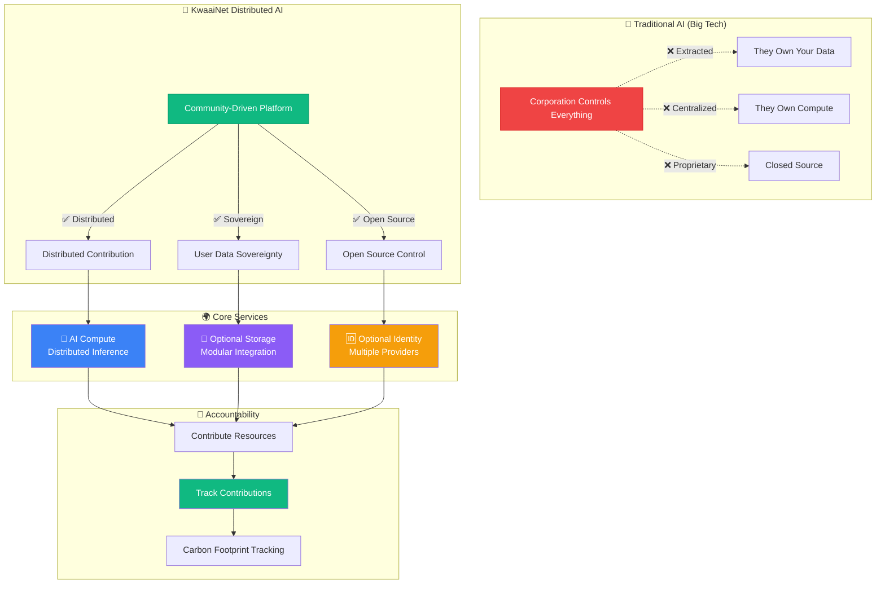
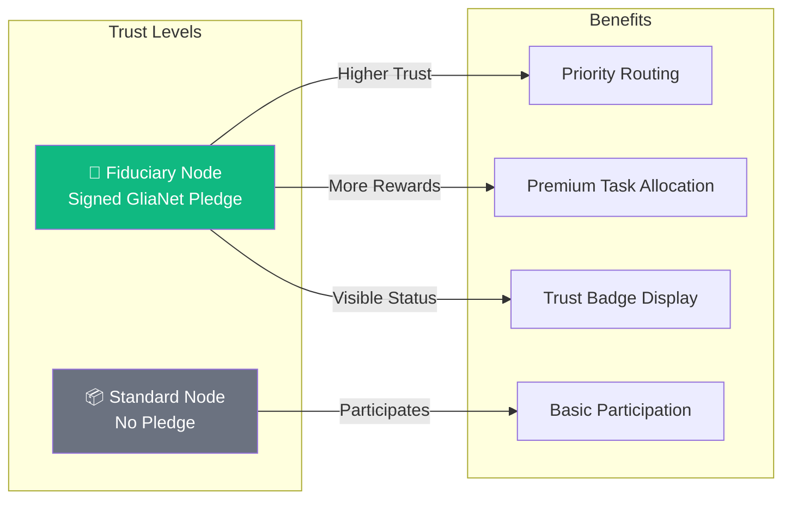

# KwaaiNet
[](https://youtu.be/ES9iQWkAFeY)

KwaaiNet is a decentralized AI node architecture for **Layer 8** — the trust and intelligence layer above the traditional network stack — built by the [Kwaai Foundation](https://www.kwaai.ai), a 501(c)(3) nonprofit AI lab focused on democratizing AI.

Each KwaaiNet node combines:

- A **decentralized trust graph** (cryptographic identity, verifiable credentials, local trust scores).
- **Shared, sharded LLM compute** over heterogeneous CPUs/GPUs using Petals-style distributed inference. Apple Silicon Macs use llama.cpp with Metal for 30+ tok/s local inference; Linux nodes use CUDA-accelerated block sharding.
- **Secure multi-tenant knowledge storage** via Virtual Private Knowledge (VPK) with encrypted vector search.
- **Local-first RAG and knowledge graphs** — retrieval-augmented generation over your own documents, with an optional link to VPK for network-outsourced storage.
- **Intent-based, peer-to-peer networking** that routes based on "what I need" (model, trust tier, latency), not just IP addresses.

From an app's point of view, KwaaiNet looks like a familiar chat-completion style HTTP API. Under the hood, it is a person-anchored Layer 8 fabric where every node is tied to an accountable human or organization.

---

## Table of Contents

- [Why KwaaiNet?](#why-kwaainet)
- [Quickstart: run a node and make a request](#quickstart-run-a-node-and-make-a-request)
- [Project status: where we are now](#project-status-where-we-are-now)
- [Vision](#vision)
- [Guiding Principles: GliaNet Fiduciary Pledge](#guiding-principles-glianet-fiduciary-pledge)
- [Decentralized Trust Graph (DTG)](#decentralized-trust-graph-dtg)
- [VPK Storage Fabric](#vpk-storage-fabric)
- [RAG Knowledge Base](#rag-knowledge-base)
- [Roadmap: destination vs current implementation](#roadmap-destination-vs-current-implementation)
- [Who is building KwaaiNet?](#who-is-building-kwaainet)
- [Documentation](#documentation)
- [Contributing](#contributing)

---

## Why KwaaiNet?

Today's "Layer 8" — the AI and agent layer that mediates how people see information and act in the world — is mostly provided by closed platforms you rent and cannot inspect.

KwaaiNet offers an alternative:

- **Owners, not renters** — Run intelligent agents on infrastructure you and your community own and govern, instead of renting access to proprietary stacks.
- **Trust-first, not anonymous compute** — Every node carries an Ed25519-anchored identity, W3C Verifiable Credentials, and a local, time-decayed trust score; there is no central trust registry.
- **Knowledge as a first-class, private citizen** — VPK lets you shard encrypted knowledge across nodes and query it without exposing raw content.
- **Intent-based networking** — Nodes route requests based on intents like "model X, minimum trust tier Verified, max latency Y," making the network semantic and economic, not just transport. See [docs/network-and-intent-routing.md](docs/network-and-intent-routing.md) for the full intent lifecycle.

For the full architectural and philosophical context, see:

- **Layer 8: The Decentralized AI Trust Layer** (whitepaper) — available via the [Kwaai website](https://www.kwaai.ai/kwaainet).
- **KwaaiNet: Decentralized AI Node Architecture for Layer 8** (technical architecture) — available via the [Kwaai website](https://www.kwaai.ai/kwaainet).

---

## Quickstart: run a node and make a request

This quickstart shows how to install the native Rust CLI, start a node, and send a simple chat-completion request against its OpenAI-compatible endpoint.

> **Note:** Exact flags and defaults may evolve. Check `kwaainet --help` for current options.

### 1. Install the `kwaainet` CLI

**Shell installer (macOS / Linux):**

```bash
curl --proto '=https' --tlsv1.2 -LsSf https://github.com/Kwaai-AI-Lab/KwaaiNet/releases/latest/download/kwaainet-installer.sh | sh
```

**PowerShell installer (Windows):**

```powershell
powershell -ExecutionPolicy Bypass -c "irm https://github.com/Kwaai-AI-Lab/KwaaiNet/releases/latest/download/kwaainet-installer.ps1 | iex"
```

**Homebrew (macOS / Linux — optional):**

```bash
brew install kwaai-ai-lab/tap/kwaainet
```

**cargo binstall (downloads prebuilt binary):**

```bash
cargo binstall kwaainet
```

**Nix (reproducible build):**

```bash
nix build github:Kwaai-AI-Lab/KwaaiNet
./result/bin/kwaainet --help
```

Or enter a development shell with all dependencies pinned:

```bash
nix develop github:Kwaai-AI-Lab/KwaaiNet
```

See **[nix/README.md](nix/README.md)** for the full Nix guide.

**RISC-V (cross-compile via Nix):**

```bash
nix build github:Kwaai-AI-Lab/KwaaiNet#kwaainet-riscv64-linux-gnu
file result-kwaainet-riscv64-linux-gnu/bin/kwaainet
# → ELF 64-bit LSB pie executable, UCB RISC-V
```

Copy the binary to your RISC-V board and run. See **[nix/README.md](nix/README.md)** for all cross-compilation targets (aarch64-musl, x86_64-musl, riscv64-gnu).

**Build from source:**

```bash
cargo install --git https://github.com/Kwaai-AI-Lab/KwaaiNet kwaainet
```

**Build from source with GPU auto-detection (recommended for CUDA machines):**

```bash
git clone https://github.com/Kwaai-AI-Lab/KwaaiNet && cd KwaaiNet
./scripts/build.sh          # auto-detects NVIDIA GPU + nvcc → enables CUDA + Flash Attention
./scripts/build.sh --no-gpu # force CPU-only build
./scripts/build.sh --install # build + cargo install
```

Then confirm:

```bash
kwaainet --help
```

**GPU support (NVIDIA CUDA):**

On Linux and Windows machines with an NVIDIA GPU, the installer automatically detects the GPU and installs the CUDA-enabled build with bundled runtime libraries — no CUDA toolkit installation required. Verify with:

```bash
kwaainet benchmark --gpu
```

**Apple Silicon (Metal):**

On macOS with a GGUF model available (via Ollama or `~/.kwaainet/models/`), the benchmark and API server automatically use llama.cpp with Metal GPU acceleration:

```bash
ollama pull llama3.1:8b    # download a GGUF model
kwaainet benchmark         # auto-detects GGUF → 36+ tok/s via Metal
```

To check how many model blocks your hardware can serve:

```bash
kwaainet calibrate
```

This reports GPU name, VRAM, and recommended block counts based on your hardware capacity.

### 2. Initialize and start a node

Initialize node identity and config:

```bash
kwaainet setup
```

This generates `~/.kwaainet/identity.key` (Ed25519 keypair) and creates a default config with a smart default node name (e.g. `alice-linux-aarch64`).

> If `kwaainet start` reports that `p2pd` is missing (e.g. manual install from a `.tar.xz`), run `kwaainet setup --get-deps` to download and install it automatically.

Start the node:

```bash
kwaainet start --daemon
```

The node will connect to bootstrap peers, announce itself on the DHT, auto-detect available hardware, and appear on [map.kwaai.ai](https://map.kwaai.ai). No Python, no build tools, no manual configuration required.

> **Pre-release note (< v1.0):** `kwaainet start --daemon` automatically starts shard serving (if a local model is present) and storage serving (if storage has been initialised). This opt-out default keeps the network dense during the insider phase. Run with `--no-contribute` to start the node without contributing, or permanently disable with `kwaainet config set contribute.shards false`.

### 3. Call the OpenAI-compatible API

```bash
curl http://localhost:11435/v1/chat/completions \
  -H "Content-Type: application/json" \
  -d '{
    "model": "your-model-id",
    "messages": [
      {"role": "user", "content": "Hello, KwaaiNet!"}
    ]
  }'
```

This sends a chat-completion request to your local node, which may route it through a shard chain of other nodes depending on configuration and trust requirements.

For a full walkthrough including platform specifics, model discovery, and Python/JS examples see **[docs/getting-started-node.md](docs/getting-started-node.md)** and **[docs/api-quickstart.md](docs/api-quickstart.md)**.

### 4. Distributed inference across the network

Download the model (or just the blocks you need):

```bash
kwaainet shard download
```

Run inference across the live KwaaiNet peer network:

```bash
kwaainet shard run "What is the capital of France?"
```

The coordinator discovers block servers via DHT, pins a stable peer path for the session, and forwards activations through the chain:

```
Pinned path:
  [ 1] blocks   0– 23  john-linux-draak-x86_64/v0.3.27
  [ 2] blocks  24– 31  john-linux-draca-x86_64/v0.3.27

  Assistant: The capital of France is Paris.
```

Add `--stats` to see per-token timing breakdown (prefill, decode, throughput). For local-only inference without networking: `kwaainet shard run "prompt" --local`.

On Apple Silicon Macs with a GGUF model (Ollama or `~/.kwaainet/models/`), inference automatically uses llama.cpp with Metal GPU acceleration (36+ tok/s). The shard API also supports this fast path:

```bash
kwaainet shard api --port 8080 --ollama-model llama3.1:8b
```

See **[docs/sharded-llm-processing.md](docs/sharded-llm-processing.md)** for the full architecture of block-sharded inference, KV-cache management, and data flow diagrams.

---

## Project status: where we are now

KwaaiNet is under active development. The Rust CLI and node implementation already ship many core capabilities across five areas; others are in progress or still research. This is a summary — full detail for storage and RAG lives in their own sections below, and everything else lives in [docs/](docs/).

### Trust & identity

- Native Rust binary (`kwaainet`) with pre-built cross-platform releases.
- Persistent Ed25519 keypair → stable `PeerId` / `did:peer:` DID at `~/.kwaainet/identity.key`.
- W3C Verifiable Credential wallet at `~/.kwaainet/credentials/` — `FiduciaryPledgeVC`, `VerifiedNodeVC`, `UptimeVC`, `ThroughputVC`, `EventAttendeeVC`, `PeerEndorsementVC`.
- Local, time-decayed trust scoring across four tiers (`Unknown` → `Known` → `Verified` → `Trusted`). See [Decentralized Trust Graph](#decentralized-trust-graph-dtg) below.

### Compute & inference

- **Block-sharded LLM inference** (CandleEngine) exposed through an OpenAI-compatible HTTP API — SafeTensors, RoPE, GQA, SwiGLU, per-session KV-cache, full sampling controls.
- **Distributed inference across multiple machines** with session-pinned peer paths, automatic gap-filling, and graceful failover when peers go offline.
- **Dual backends**: llama.cpp + Metal on Apple Silicon (36+ tok/s auto fast-path for GGUF models); candle + CUDA with Flash Attention on Linux (30–36 tok/s FP16 on an RTX A5000).
- Selective block download (`shard download --start-block N --blocks M`), reusable inference circuits (`shard circuit create`), and `shard run --local` model reuse for near-zero cold start.
- Auto-detects local models and network state, and appears on the public map when configured at [map.kwaai.ai](https://map.kwaai.ai).

### Storage — Virtual Private Knowledge (VPK)

- Run as an encrypted, multi-tenant **Eve storage node** (`kwaainet storage init`, `vpk enable --mode eve`) serving vector search to Bob nodes over the P2P fabric.
- **Discover VPK peers** (`vpk discover`) via DHT — PeerId, mode, capacity, tenant count; no IP addresses involved.
- **Benchmark storage** (`vpk bench`) — local HNSW vs WAN-sharded Eve vs Qdrant, with recall and upload-time breakdowns. See [VPK Storage Fabric](#vpk-storage-fabric) below.

### Knowledge — RAG

- **Local, private knowledge base** (`rag ingest/sync`) — `txt`, `md`, `pdf`, `docx`, `doc` chunked and embedded with no network required; hybrid BM25 + dense retrieval, grounded citations, HyDE query expansion, LLM reranking, and an eval harness.
- **GraphRAG** (`rag graph build`) — LLM-extracted entity/relation property graph (2300+ entities, 7900+ relations on a typical memoir-length corpus); graph-anchored retrieval reached 56.9% keyword recall on the D6 eval set (up from 24.6% baseline).
- **Dream RAG** (`rag dream run`) — autonomous, self-improving graph refinement: schema.org completeness scoring, LLM completion fan-out, auto-merge, auto-prune.
- **OpenAI-compatible RAG server** (`rag serve`) — point OpenWebUI or any compatible client at it as a custom base URL. See [RAG Knowledge Base](#rag-knowledge-base) below.

### Networking

- libp2p + Kademlia DHT swarm, Petals/Hivemind-compatible, with live diagnostics (`p2p info`, `p2p peers list/find`) and direct peer messaging (`p2p peers send`).
- **IDENTIFY-based public-IP detection** — auto-confirms and announces a node's public address with no manual config.
- **Trusted relays** and **stable bootstrap identities** (`start --identity-key`) so NATed and bootstrap nodes keep consistent routing and `PeerId` across restarts.

See the [latest GitHub Release](https://github.com/Kwaai-AI-Lab/KwaaiNet/releases/latest) for the most recent feature list and release notes.

---

## Vision

KwaaiNet is creating a new paradigm for AI infrastructure - one where users maintain complete sovereignty over their computational contributions and personal data. We're building an open-source distributed AI platform that combines:

- **Decentralized AI Compute**: Distributed inference across millions of devices
- **Privacy-First Architecture**: User-controlled data processing
- **Modular Integration**: Support for various storage/identity systems
- **Environmental Accountability**: Carbon-negative computing tracking

KwaaiNet is open-source infrastructure built collaboratively and owned by no single entity.

https://youtu.be/ES9iQWkAFeY


```mermaid
graph TB
    subgraph "🏢 Traditional AI (Big Tech)"
        BigTech[Corporation Controls Everything]
        TheirData[They Own Your Data]
        TheirCompute[They Own Compute]
        TheirProfit[Closed Source]
    end

    subgraph "👤 KwaaiNet Distributed AI"
        You[Community-Driven Platform]
        YourData[User Data Sovereignty]
        YourCompute[Distributed Contribution]
        YourControl[Open Source Control]
    end

    subgraph "🌍 Core Services"
        AI[🤖 AI Compute<br/>Distributed Inference]
        Storage[🔐 Optional Storage<br/>Modular Integration]
        Identity[🆔 Optional Identity<br/>Multiple Providers]
    end

    subgraph "🌱 Accountability"
        Contribute[Contribute Resources]
        Track[Track Contributions]
        Green[Carbon Footprint Tracking]
    end

    BigTech -.->|❌ Extracted| TheirData
    BigTech -.->|❌ Centralized| TheirCompute
    BigTech -.->|❌ Proprietary| TheirProfit

    You -->|✅ Sovereign| YourData
    You -->|✅ Distributed| YourCompute
    You -->|✅ Open Source| YourControl

    YourData --> Storage
    YourCompute --> AI
    YourControl --> Identity

    AI --> Contribute
    Storage --> Contribute
    Identity --> Contribute
    Contribute --> Track
    Track --> Green

    style You fill:#10B981,color:#fff,stroke:#059669
    style BigTech fill:#EF4444,color:#fff,stroke:#DC2626
    style AI fill:#3B82F6,color:#fff
    style Storage fill:#8B5CF6,color:#fff
    style Identity fill:#F59E0B,color:#fff
    style Track fill:#10B981,color:#fff
```

**The shift is simple**: Instead of Big Tech controlling AI infrastructure, the community builds and maintains it collaboratively.

---

## Guiding Principles: GliaNet Fiduciary Pledge

Kwaai is a proud signatory of the [**GliaNet Fiduciary Pledge**](https://www.glianetalliance.org/pledge), committing KwaaiNet to the highest standards of user protection. This pledge becomes a foundational principle for the entire network.

### The PEP Model
 

### Node Operator Trust Hierarchy

The GliaNet Fiduciary Pledge is **optional for node operators** but directly impacts network trust:


```mermaid
graph LR
    subgraph "Trust Levels"
        Pledged[🏅 Fiduciary Node<br/>Signed GliaNet Pledge]
        Standard[📦 Standard Node<br/>No Pledge]
    end

    subgraph "Benefits"
        Priority[Priority Routing]
        Premium[Premium Task Allocation]
        Badge[Trust Badge Display]
        Basic[Basic Participation]
    end

    Pledged -->|Higher Trust| Priority
    Pledged -->|More Rewards| Premium
    Pledged -->|Visible Status| Badge
    Standard -->|Participates| Basic

    style Pledged fill:#10B981,color:#fff
    style Standard fill:#6B7280,color:#fff
```

**Fiduciary Nodes** that sign the pledge receive:
- 🏅 **Trust Badge**: Visible "GliaNet Fiduciary" status on the network map
- ⚡ **Priority Routing**: Preferred for sensitive/enterprise workloads
- 🎯 **Enhanced Reputation**: `FiduciaryPledgeVC` adds 0.30 to the node's trust score (the single highest-weight credential)
- 🤝 **Enterprise Eligibility**: Required for GDPR/HIPAA compliant workloads

The pledge is enforced via the trust graph: signing generates a `FiduciaryPledgeVC` issued by the GliaNet Foundation and stored in the node's credential wallet. The credential travels with the node in every DHT announcement. Violation triggers VC revocation, immediately dropping the node's trust score.

> *"By signing the GliaNet Fiduciary Pledge, node operators commit to putting users first—protecting their data, enhancing their experience, and promoting their interests above all else."*

---

## Decentralized Trust Graph (DTG)

KwaaiNet implements the [ToIP/DIF Decentralized Trust Graph](https://trustoverip.org) framework — a four-layer model that gives every node a portable, verifiable reputation without any central authority.

### Layer 1 — Identity (already live)

Every node's libp2p `PeerId` (Ed25519 keypair) is a self-certifying identity anchor, functionally equivalent to a `did:key`. KwaaiNet exposes it as a `did:peer:` DID:

```
did:peer:QmYyQSo1c1Ym7orWxLYvCuxRjeczyuq4GNGbMaFfkMhp4
```

The keypair is persisted at `~/.kwaainet/identity.key` so the DID is stable across restarts.

### Layer 2 — Verifiable Credentials

Credentials are cryptographically signed W3C VCs, stored at `~/.kwaainet/credentials/` and included in DHT announcements.

| Credential | Issuer | What it proves | Phase |
|------------|--------|----------------|-------|
| `SummitAttendeeVC` | Kwaai summit server | Attended a Kwaai Personal AI Summit | **1 — live** |
| `FiduciaryPledgeVC` | GliaNet Foundation | Signed the GliaNet Fiduciary Pledge | 2 |
| `VerifiedNodeVC` | Kwaai Foundation | Passed node onboarding checks | 2 |
| `UptimeVC` | Bootstrap servers | Observed uptime ≥ threshold over N days | 3 |
| `ThroughputVC` | Peer nodes | Peer-witnessed throughput within X% of announced | 3 |
| `PeerEndorsementVC` | Any node | "I have transacted with this node reliably" | 4 |

### Layer 3 — Trust Scoring

```
NodeTrustScore = Σ weight(VC_type) × 0.5^(age_days/365)
```

| Score | Tier | Typical credentials |
|-------|------|---------------------|
| ≥ 0.70 | **Trusted** | FiduciaryPledge + VerifiedNode + Uptime |
| ≥ 0.40 | **Verified** | VerifiedNode present |
| ≥ 0.10 | **Known** | SummitAttendee or similar |
| < 0.10 | **Unknown** | No recognised credentials |

Scores are **local to the querier** — your trust graph may differ from mine. A node's earned VCs travel with it if it changes infrastructure. Phase 4 adds full EigenTrust propagation (Sybil-resistant through endorsement-weight decay).

### Layer 4 — Governance

- **Trusted issuers**: GliaNet Foundation (FiduciaryPledge), Kwaai Foundation (VerifiedNode), bootstrap servers (Uptime/Throughput)
- **Revocation**: `FiduciaryPledgeVC` can be revoked if the pledge is violated
- **Enterprise routing**: minimum trust score thresholds for HIPAA/GDPR workloads (Phase 2)

---

## VPK Storage Fabric

Virtual Private Knowledge (VPK) is KwaaiNet's encrypted vector storage layer. Bob encrypts vectors locally before they leave his machine; Eve nodes store and search opaque ciphertext. No raw knowledge ever touches a storage node.

### Architecture

```
Bob (any node)                         Eve (storage node)
  │                                         │
  │── kwaainet vpk discover ──────────────▶ DHT
  │   returns PeerId, mode, capacity        │  (no IP addresses)
  │                                         │
  │── /kwaai/storage/1.0.0 ───────────────▶ kwaainet (Eve)
  │   libp2p, Noise-encrypted, PeerId-routed│── redb + HNSW index
  │   CreateTenant / UploadVectors /        │   (multi-tenant)
  │   SearchVectors → {id, score} only      │
  │                                         │
  └── http://127.0.0.1:7432 ─────────────▶ local operator console only
```

Eve returns only `{id, score}` pairs — vectors never travel back over the wire. Nodes are addressed by PeerId; NAT traversal and routing are handled by the P2P relay layer, never by IP addresses.

### Current status (v0.4.51)

| Capability | Status |
|------------|--------|
| Auto-contribute on daemon start (shard + storage, opt-out with `--no-contribute`) | ✅ Shipped |
| Local peer reputation system (`kwaainet reputation list/show/reset`) | ✅ Shipped |
| Gemma3/4 GGUF inference support (candle 0.10, BF16) | ✅ Shipped |
| Eve storage node (`kwaainet storage init`, `kwaainet vpk enable --mode eve`) | ✅ Shipped |
| Multi-tenant vector store (redb + hnsw_rs, cosine distance) | ✅ Shipped |
| P2P vector protocol (`/kwaai/storage/1.0.0` — CreateTenant, UploadVectors, SearchVectors, DeleteTenant) | ✅ Shipped |
| DHT advertisement (`_kwaai.vpk.nodes`, PeerId-addressed, no IP) | ✅ Shipped |
| Eve discovery (`kwaainet vpk discover`) | ✅ Shipped |
| Self-update preserves CUDA DLLs on Windows (`kwaainet update`) | ✅ Shipped |
| Performance benchmark (`kwaainet vpk bench`) | ✅ Shipped |
| P2P live diagnostics (`kwaainet p2p info`, `kwaainet p2p peers list/find`) | ✅ Shipped |
| Unicode-correct terminal box alignment (emoji + CJK in headers) | ✅ Shipped |
| RAG knowledge base — local-first, no network required (`kwaainet rag init/ingest/query/chat/docs/destroy`) | ✅ Shipped |
| Hybrid BM25 (tantivy) + dense vector retrieval with exact search for small corpora | ✅ Shipped |
| Lost-in-the-middle context reordering before LLM prompt construction | ✅ Shipped |
| Folder sync with change detection (`kwaainet rag sync --watch`) | ✅ Shipped |
| PDF, DOCX, DOC document parsing (native Rust, no external tools for PDF/DOCX) | ✅ Shipped |
| OpenAI-compatible RAG HTTP server with embedded UI (`kwaainet rag serve`) | ✅ Shipped |
| External drive support for RAG corpus (`rag init --rag-dir <path>`) | ✅ Shipped |
| Configurable chunking (`rag sync/ingest --chunk-size`, `--chunk-overlap`, `--min-chunk-len`) | ✅ Shipped |
| Tuned HNSW build params: ef_construction 64→200, adaptive ef_search; exact search below 2K vectors | ✅ Shipped |
| Knowledge graph extraction (`rag graph build`) — entity/relation graph from corpus via LLM | ✅ Shipped |
| Graph-anchored retrieval (`rag query --mode graph`) — BFS entity traversal + RRF fusion with vector results | ✅ Shipped |
| **Dream RAG** — autonomous graph refinement: schema.org 3-pillar health scorer, fan-out LLM completion, dedup, prune (`rag graph score`, `rag dream run/status`) | ✅ Shipped |
| Semantic query cache (`rag cache stats/clear`) — 24h TTL, cosine similarity dedup, redb-backed | ✅ Shipped |
| Obsidian vault & MediaWiki ingestion (`rag ingest` with markdown/wiki format detection) | ✅ Shipped |
| Obsidian vault export/import (`rag export/import`) — human-in-the-loop knowledge graph curation via Obsidian Graph View | ✅ Shipped |
| Grounded RAG answers — mandatory inline citations [1], hard hallucination refusal | ✅ Shipped |
| HyDE query expansion (`rag query/chat --hyde`) — embeds hypothetical answer for better doc alignment | ✅ Shipped |
| LLM listwise reranker (`rag query/chat --rerank`) — one LLM call re-orders retrieval candidates | ✅ Shipped |
| Fix `--understand` with Ollama — model param now threaded correctly | ✅ Shipped |
| Semantic paragraph chunking (`rag sync/ingest --chunk-strategy paragraph`) | ✅ Shipped |
| Eval harness (`rag eval --questions file.json`) — keyword hit rate scoring, markdown report | ✅ Shipped |
| PHE encryption layer (vectors encrypted before leaving Bob) | 🔄 Phase 3 |
| Bob fan-out to multiple Eves (`kwaainet vpk shard`) | 🔄 Phase 2 |
| DHT-backed shard resolution (`kwaainet vpk resolve`) | 🔄 Phase 3 |
| Federated multi-KB RAG across nodes (`rag kb-share`, `rag serve --kb-ids`) | 🔄 Phase 3 |

### Benchmark results

Two runs, 50K vectors, dim=384:

**Run 1 — 2026-05-02, K=2 metro Eves (WAN RTT p50 = 25.6 ms)**

| Backend | Search p50 | Upload (50K vecs) |
|---------|-----------|-------------------|
| KwaaiNet local HNSW | **2.5 ms** | 53 s |
| KwaaiNet WAN K=2 | 31 ms | 224 s |
| Qdrant local Docker | 1.2 ms | 2.8 s |
| Qdrant Cloud (us-west-1) | 67 ms † | 298 s |

**Run 2 — 2026-05-05, K=11 geographically diverse Eves (WAN RTT p50 = 92.5 ms)**

| Backend | Search p50 | Upload (50K vecs) |
|---------|-----------|-------------------|
| KwaaiNet local HNSW | **2.6 ms** | 53 s |
| KwaaiNet WAN K=11 | 115 ms | 298 s |
| Qdrant local Docker | 1.2 ms | 2.8 s |

† 50K spike — likely index-rebuild threshold on the free-tier cluster.

**Key finding:** WAN sharding is RTT-dominated and cannot reduce search latency at any corpus size. 7 of 11 nodes sat at 95–105 ms; every fan-out query pays that floor regardless of shard count or corpus size. Sharding is justified by **capacity** — distributing a corpus too large for one machine's RAM — not latency. LAN-range Eves (≤1 ms RTT) break even at K ≈ 11. PHE-encrypted vectors work equally well on Qdrant; KwaaiNet Eve's unique value is **decentralised, peer-owned storage** with no company intermediary.

Full write-up: [docs/vpk-shard-bench/README.md](docs/vpk-shard-bench/README.md)

### Run as an Eve node

If you run a KwaaiNet node, you can contribute storage capacity to the network:

```bash
kwaainet update                                  # get v0.4.24+
kwaainet storage init --capacity-gb 10           # initialise local vector store
kwaainet vpk enable --mode eve                   # advertise as Eve
kwaainet start --daemon                          # join the network
kwaainet vpk discover                            # verify you appear to peers
```

---

## RAG Knowledge Base

KwaaiNet includes a built-in Retrieval-Augmented Generation (RAG) pipeline. The knowledge base runs entirely on your local node — **no network, no Eve node required**. Documents are chunked, embedded with `nomic-embed-text`, and stored in an embedded vector database. Retrieval uses a hybrid BM25 + dense cosine similarity strategy with lost-in-the-middle context reordering so the most relevant chunks land at the edges of the LLM prompt (not buried in the middle). Vectors can optionally be outsourced to an Eve node on the network for large corpora.

### Quickstart (local, no network required)

```bash
# 1. Pull the embedding model (768-dim, runs locally via Ollama)
ollama pull nomic-embed-text

# 2. Initialize a local knowledge base (no Eve node needed)
kwaainet rag init

# Optional: store on an external drive for large corpora
kwaainet rag init --rag-dir /Volumes/WD2/kwaainet-rag

# 3. Ingest documents
kwaainet rag ingest /path/to/document.pdf
kwaainet rag ingest /path/to/report.docx

# 4. Sync a whole folder (incremental — only ingests new/changed files)
kwaainet rag sync /path/to/my-documents/

# Optional: tune chunking strategy (defaults: 800/200/100)
kwaainet rag sync /path/to/my-documents/ --chunk-size 600 --chunk-overlap 150 --min-chunk-len 80

# 5. Hybrid semantic + keyword search (no LLM required)
kwaainet rag query "What are the main risk factors?"

# 6. RAG-augmented chat (streams from your shard API)
kwaainet shard api --port 8080 &
kwaainet rag chat

# 7. OpenAI-compatible RAG HTTP server (for OpenWebUI or any API client)
kwaainet rag serve --port 9090
# → Point OpenWebUI at http://localhost:9090 as a custom OpenAI base URL

# Connect to an Eve node to outsource vector storage (optional)
kwaainet rag connect-eve <PEER_ID>
```

### Document types supported

| Format | Method |
|--------|--------|
| `.txt`, `.md`, `.rst`, `.csv`, `.json`, `.yaml`, `.toml` | Read as UTF-8 |
| `.pdf` | Native Rust extraction (no external tools) |
| `.docx` | Pure-Rust OOXML parser (no LibreOffice needed) |
| `.doc` | `antiword` or LibreOffice headless (must be installed) |

### Folder sync

`kwaainet rag sync` tracks each file's modification time and size. On each run it ingests new files, re-ingests changed files, and (with `--delete`) removes vectors for files that no longer exist.

```bash
# One-shot sync
kwaainet rag sync ~/Documents/research/

# Watch mode — re-syncs every 60 seconds
kwaainet rag sync ~/Documents/research/ --watch --interval 60

# Only specific extensions
kwaainet rag sync ~/Documents/ --extensions "pdf,docx,md"

# Delete vectors for removed files
kwaainet rag sync ~/Documents/ --delete
```

### RAG commands

| Command | What it does |
|---------|-------------|
| `rag init` | Initialize a local embedded knowledge base (no network required) |
| `rag connect-eve <peer>` | Outsource vector storage to an Eve node on the network |
| `rag ingest <file>` | Chunk, embed, and upload a single document |
| `rag sync <folder>` | Incrementally sync a directory (new/changed/deleted files) |
| `rag query <text>` | Hybrid BM25 + vector search — returns top-K chunks, no LLM |
| `rag chat` | Interactive REPL: retrieve → reorder context → stream LLM answer |
| `rag docs` | List all ingested documents |
| `rag delete-doc <name>` | Remove a document's vectors and metadata |
| `rag serve [--port 9090]` | OpenAI-compatible RAG HTTP server with embedded web UI |
| `rag destroy` | Permanently wipe the knowledge base and all its data |
| `rag graph score [--kb <name>]` | Print a schema.org 3-pillar health report (type / summary / relation completeness) |
| `rag dream run [--kb <name>]` | Run one autonomous refinement cycle: complete, merge, prune |
| `rag dream status [--kb <name>]` | Show the last dream cycle report |

### External drive support

Large corpora can exceed local disk. Point chunk metadata and cached text at any path:

```bash
kwaainet rag init --eve-peer-id <PEER> --rag-dir /Volumes/WD2/kwaainet-rag
```

The Eve vector store path is set separately at init time:

```bash
kwaainet storage init --capacity-gb 500 --data-dir /Volumes/WD2/kwaainet-storage
```

---

## Roadmap: destination vs current implementation

KwaaiNet's roadmap is defined as the **gap** between the aspirational Layer 8 architecture in the whitepapers and the currently shipping Rust implementation.

| Area    | Aspirational (whitepapers)                                                                 | Current implementation (Rust node)                                       |
|---------|--------------------------------------------------------------------------------------------|---------------------------------------------------------------------------|
| Trust   | 5-layer trust pipeline including Testable Credentials (PVP-1) and EigenTrust propagation. | Identity + VC wallet + local time-decayed trust scores shipped; ToIP work in progress. |
| Compute | Sharded inference, decentralized training, safe tool-calling with trust-gated policies.   | Dual backend: llama.cpp for 30+ tok/s local on Apple Silicon, candle for distributed block sharding on Linux/CUDA. Auto-detected GPU with bundled CUDA runtime (no toolkit install needed). Inference circuits, session-pinned paths, selective download, OpenAI-compatible API shipped. |
| Storage | Fully distributed personal AI memory via cross-node VPK sharding and DHT-backed resolution. | **VPK Phase 1 complete**: Eve nodes serve multi-tenant vector storage over `/kwaai/storage/1.0.0` libp2p RPC; Bob nodes discover Eves by PeerId via DHT; `kwaainet vpk bench` benchmarks sharded vs local vs Qdrant performance. **RAG Phase 2 complete**: local-first embedded knowledge base, hybrid BM25 (tantivy) + dense retrieval, brute-force exact search for small corpora (< 2K vectors), lost-in-the-middle context reordering, `rag destroy`, configurable chunking. HNSW tuned to m=16, ef_construction=200 (benchmarked: 97–99% recall on text embeddings at all corpus sizes up to 50K). PHE encryption (Phase 3) is next. See [VPK Shard Benchmark](docs/vpk-shard-bench/README.md) and [HNSW Parameter Study](docs/hnsw_vs_brute_force.md). |
| Network | Intent-casting as a Layer 8 business protocol with economic settlement and neutrality guarantees. | libp2p + Kademlia DHT, trust-gated routing by model/trust/latency shipped. |

See **[docs/roadmap.md](docs/roadmap.md)** for the full living roadmap with contribution ideas for each area.

---

## Who is building KwaaiNet?

KwaaiNet is developed by the **[Kwaai Foundation](https://www.kwaai.ai)**, a 501(c)(3) nonprofit AI lab and proud signatory of the [GliaNet Fiduciary Pledge](https://www.glianetalliance.org/pledge).

- **Mission:** democratize AI by building open, person-anchored infrastructure and Personal AI systems.
- **Values:** personal control, self-sovereign identity, transparency, openness.
- **Role of KwaaiNet:** serve as the decentralized AI trust and compute layer (Layer 8) for the broader Kwaai ecosystem and allied open-source projects.

Kwaai is working closely with the **[Linux Foundation Trust Over IP (ToIP) – Decentralized Trust Graph Working Group](https://trustoverip.org)**, which defines socio-technical standards for decentralized trust graphs that span people, organizations, and AI agents. This collaboration helps align KwaaiNet's Layer 8 trust fabric with emerging open standards for decentralized identifiers, verifiable credentials, and trust graphs at Internet scale.

Kwaai is also collaborating with:

- **[Mozilla / Mozilla.ai](https://mozilla.ai)** — on shared aims around trustworthy, user-controlled AI and open tooling for agentic systems.
- **[SingularityNET](https://singularitynet.io)** — exploring best-of-breed combinations of decentralized AI infrastructure and open model ecosystems.
- **[IEEE P7012](https://standards.ieee.org/ieee/P7012)** — Standard for Machine Readable Personal Privacy Terms, bringing Layer 8's person-anchored agents and trust fabric into conversation with machine-readable privacy and consent standards.

Learn more at [kwaai.ai](https://www.kwaai.ai) and the [Kwaai-AI-Lab GitHub organization](https://github.com/Kwaai-AI-Lab).

---

## Documentation

| Document | Description |
|----------|-------------|
| [docs/README.md](docs/README.md) | Docs index — audience map and navigation guide |
| [docs/getting-started-node.md](docs/getting-started-node.md) | Install, initialize, and run your first node |
| [docs/api-quickstart.md](docs/api-quickstart.md) | Call the OpenAI-compatible API from curl, Python, and JS |
| [docs/roadmap.md](docs/roadmap.md) | Layer 8 destination vs current implementation vs gaps |
| [docs/reputation.md](docs/reputation.md) | Local trust scores, EigenTrust propagation, endorsement accountability |
| [docs/sharded-llm-processing.md](docs/sharded-llm-processing.md) | Block-sharded inference pipeline, KV-cache, and activation data flows |
| [docs/network-and-intent-routing.md](docs/network-and-intent-routing.md) | P2P fabric, trust-gated routing, and the full intent lifecycle |
| [docs/METAL_PERFORMANCE_ANALYSIS.md](docs/METAL_PERFORMANCE_ANALYSIS.md) | Metal GPU performance analysis and optimization roadmap |
| [docs/MLX_BACKEND_PLAN.md](docs/MLX_BACKEND_PLAN.md) | MLX backend research — investigation results and path forward |
| [docs/ARCHITECTURE.md](docs/ARCHITECTURE.md) | Node architecture, lobes, and Layer 8 stack |
| [docs/WHITEPAPER.md](docs/WHITEPAPER.md) | Layer 8: The Decentralized AI Trust Layer (whitepaper) |
| [docs/vpk-shard-bench/README.md](docs/vpk-shard-bench/README.md) | VPK shard benchmark — sharded Eve vs local HNSW vs Qdrant, with chart and analysis |
| [docs/hnsw_vs_brute_force.md](docs/hnsw_vs_brute_force.md) | HNSW parameter study — ef_search, ef_construction, and m sweeps for dim=768 RAG workloads |
| [nix/README.md](nix/README.md) | Nix build, dev shell, and test infrastructure |
| [docs/contributor-guide.md](docs/contributor-guide.md) | How to contribute — 1 hour / 1 day / 1 week paths |
| [docs/NODE_UI_PLANNING.md](docs/NODE_UI_PLANNING.md) | Node dashboard UI plan — status, config, logs, identity |
| [CONTRIBUTING.md](CONTRIBUTING.md) | Development workflow and code contribution guidelines |
| [CONTRIBUTORS.md](CONTRIBUTORS.md) | Project contributors |
| [CHANGELOG.md](CHANGELOG.md) | Release history |

---

## Contributing

KwaaiNet welcomes contributions from node operators, application developers, protocol researchers, and documentation writers.

- Read **[docs/contributor-guide.md](docs/contributor-guide.md)** for "1 hour / 1 day / 1 week" entry points mapped to the roadmap.
- Read **[CONTRIBUTING.md](CONTRIBUTING.md)** for the development workflow and code contribution guidelines.
- Explore [open issues](https://github.com/Kwaai-AI-Lab/KwaaiNet/issues) and join Kwaai community channels at [kwaai.ai](https://www.kwaai.ai).
