# KwaaiNet: Sovereign AI Infrastructure

> Building the world's first decentralized AI platform where users own their compute, storage, and data

## ✅ Status: Network Live & Operational

**Latest Achievement (Dec 2025):**
- ✅ **Full Petals DHT Protocol Compatibility** - KwaaiNet nodes successfully appear on distributed network maps
- ✅ **Cross-Platform Support** - Tested on macOS ARM64, Linux, and Windows
- ✅ **Production-Ready Build System** - Automated multi-platform setup and deployment
- 🌐 **Live Test Node**: Successfully announced and visible on map.kwaai.ai ([PR #1](https://github.com/Kwaai-AI-Lab/KwaaiNet/pull/1))

**What This Means:** KwaaiNet infrastructure is operational and ready for distributed AI compute. Nodes can join the network, announce their presence, and participate in the Petals/Hivemind distributed inference network.

## Vision

KwaaiNet is creating a new paradigm for AI infrastructure - one where **users maintain complete sovereignty** over their computational contributions and personal data. Through the integration with Verida Network, we're building the first truly **sovereign AI platform** that combines:

- **Decentralized AI Compute**: Distributed inference and training across millions of devices
- **Private Data Storage**: End-to-end encrypted databases with user-controlled keys
- **Self-Sovereign Identity**: Multi-chain identity verification and data ownership
- **Environmental Impact**: Carbon-negative computing with renewable energy incentives
  
https://youtu.be/ES9iQWkAFeY


**The shift is simple**: Instead of Big Tech profiting from your data and compute, **you own it, you control it, you earn from it**.

---

## Guiding Principles: GliaNet Fiduciary Pledge

Kwaai is a proud signatory of the [**GliaNet Fiduciary Pledge**](https://www.glianetalliance.org/pledge), committing KwaaiNet to the highest standards of user protection. This pledge becomes a foundational principle for the entire network.

### The PEP Model

| Duty | Commitment | How KwaaiNet Honors It |
|------|------------|----------------------|
| **🛡️ Protect** (Guardian) | Safeguard user data and well-being | E2E encryption, user-controlled keys, data minimization, no data leaves without consent |
| **⚖️ Enhance** (Mediator) | Resolve conflicts favoring users | No surveillance, no profiling, no third-party data sharing, privacy-by-design |
| **📣 Promote** (Advocate) | Advance user interests proactively | Token rewards, transparent governance, open source, user sovereignty first |

### Node Operator Trust Hierarchy

The GliaNet Fiduciary Pledge is **optional for node operators** but directly impacts network trust:

```mermaid
graph LR
    subgraph "Trust Levels"
        Pledged[🏅 Fiduciary Node<br/>Signed GliaNet Pledge]
        Standard[📦 Standard Node<br/>No Pledge]
    end

    subgraph "Benefits"
        Priority[Priority Routing]
        Premium[Premium Task Allocation]
        Badge[Trust Badge Display]
        Basic[Basic Participation]
    end

    Pledged -->|Higher Trust| Priority
    Pledged -->|More Rewards| Premium
    Pledged -->|Visible Status| Badge
    Standard -->|Participates| Basic

    style Pledged fill:#10B981,color:#fff
    style Standard fill:#6B7280,color:#fff
```



**Fiduciary Nodes** that sign the pledge receive:
- 🏅 **Trust Badge**: Visible "GliaNet Fiduciary" status on the network map
- ⚡ **Priority Routing**: Preferred for sensitive/enterprise workloads
- 💰 **Enhanced Rewards**: Bonus VDA allocation for maintaining fiduciary standards
- 🤝 **Enterprise Eligibility**: Required for GDPR/HIPAA compliant workloads

> *"By signing the GliaNet Fiduciary Pledge, node operators commit to putting users first—protecting their data, enhancing their experience, and promoting their interests above all else."*

---

## Architecture

KwaaiNet represents a fundamental shift from traditional centralized AI to a **triple-service sovereign model**:

```rust
pub struct SovereignAINode {
    // AI Compute Services
    inference_engine: CandelEngine,          // Rust/WASM inference
    p2p_network: P2PNetwork,                 // WebRTC mesh networking
    
    // Verida Integration
    verida_storage: VeridaDbStore,           // Private database storage
    identity_manager: SelfSovereignID,        // User-controlled identity
    encryption_layer: E2EEncryption,         // End-to-end encryption
    
    // Environmental & Economic
    carbon_tracker: EnvironmentalMetrics,    // Energy source detection
    token_economics: VDARewardSystem,        // Unified VDA token rewards
}
```

## Core Components

### 🦀 **Core Engine** (`/core`)
Rust/WASM universal runtime that deploys everywhere:
- Browser (WebAssembly + WebRTC)
- Mobile (Native iOS/Android)
- Desktop (Single binary)
- Embedded (ARM/MIPS cross-compile)

### 🌐 **Browser SDK** (`/browser-sdk`)
One-line website integration for sovereign AI:
```javascript
<script src="https://cdn.kwaai.ai/sovereign-ai.js" 
        data-services="compute,storage,identity,carbon"
        data-privacy-compliant="gdpr,ccpa,hipaa">
</script>
```

### 📱 **Mobile Foundation** (`/mobile`)
iOS/Android apps with privacy-first design:
- Background contribution during charging + WiFi
- Battery-aware algorithms
- Progressive authentication (Anonymous → Sovereign)

### 🔗 **Verida Integration** (`/verida-integration`)
Bridge layer connecting KwaaiNet compute with Verida storage:
- Protocol bridge development
- Self-sovereign identity management
- Multi-chain data verification

### 🏢 **Enterprise Compliance** (`/compliance`)
Built-in regulatory compliance frameworks:
- GDPR/HIPAA/SOC2 compliance by design
- Audit logging and reporting
- Data residency controls

### 🌱 **Environmental Gamification** (`/environmental`)
Carbon-negative computing platform:
- Renewable energy detection
- Carbon footprint tracking
- Green energy marketplace integration

## Development Roadmap

### Q4 2025: Architecture & Community Preparation
- Technical specification finalization

### 2026-2027: Progressive Deployment
- **Q2 2026**: 1K+ nodes (Platform Deployment)
- **Q3 2026**: 10K+ nodes (Market Expansion) 
- **Q4 2026**: 100K+ nodes (Enterprise & Edge)
- **2027+**: OS-level integration toward 1B+ nodes

## Community & Governance

### Mission-Driven Development
KwaaiNet is built by and for the community that believes in **democratizing AI**. Our approach:

- **Architecture Centrally, Build Distributed**: Core team controls specifications, community implements
- **Hackathon-Driven Development**: Structured challenges with meaningful VDA rewards
- **Quality Gates**: Rigorous review and integration processes
- **Long-term Alignment**: VDA token holders become stakeholders in sovereign AI future

### Getting Started

#### Running Your Own Node (Live on Network)

**Launch a KwaaiNet node and see it appear on map.kwaai.ai:**

```bash
# Quick start (default settings)
cargo run --release --example petals_visible

# Custom configuration
cargo run --release --example petals_visible -- \
  --name "YourNodeName" \
  --model "Llama-3.3-70B-Instruct" \
  --start-block 0 \
  --end-block 8
```

**What happens:**
1. 🚀 Daemon spawns and connects to Kwaai bootstrap servers
2. 🔗 Node announces itself to the DHT network
3. 📡 Blocks are registered (e.g., `Llama-3-3-70B-Instruct-hf.0` through `.7`)
4. ✅ Node becomes visible on network map within 30-60 seconds
5. 🔄 Automatic re-announcement every 120 seconds keeps node alive

**Verified Working:**
- ✅ macOS (ARM64 & Intel)
- ✅ Linux (Ubuntu 20.04+)
- ✅ Windows 11 (via setup.ps1)

**Example Output:**
```
✅ Announced 8 blocks to bootstrap peer
✅ Announced model info to _petals.models registry
📊 DHT Storage: 9 total entries, 9 valid
[STATUS] Node is running!
```

Check your node on the map: **[map.kwaai.ai](http://map.kwaai.ai)**

#### Quick Setup (All Platforms)

**Automated setup scripts handle all prerequisites:**

**Linux / macOS:**
```bash
chmod +x setup.sh
./setup.sh
cargo build
cargo run --example petals_visible
```

**Windows (PowerShell):**
```powershell
powershell -ExecutionPolicy Bypass -File setup.ps1
cargo build
cargo run --example petals_visible
```

The setup scripts automatically install:
- ✅ **Rust** 1.80+ (for edition2024 support)
- ✅ **Go** 1.20+ (for go-libp2p-daemon)
- ✅ **Git** (for repository management)
- ✅ **System tools** (curl, unzip, etc.)

**Manual Prerequisites (if needed):**

| Tool | Minimum Version | Purpose |
|------|----------------|---------|
| [Rust](https://rustup.rs/) | 1.80+ | Core codebase |
| [Go](https://golang.org/dl/) | 1.20+ | p2p daemon |
| [Git](https://git-scm.com/) | Any recent | Version control |

#### Build System Architecture

KwaaiNet uses a **multi-tiered cross-platform build system**:

1. **build.rs automation** - Handles platform detection, downloads binaries, compiles dependencies
2. **Platform-specific scripts** - `setup.sh` (Linux/macOS), `setup.ps1` (Windows)
3. **Cargo workspace** - Unified build across all crates

**Key cross-platform features:**
- Auto-detects OS (Windows/Linux/macOS) and architecture (x86_64/aarch64)
- Downloads platform-specific protoc compiler automatically
- Builds go-libp2p-daemon using system Go toolchain
- Handles Windows (TCP) vs Unix (socket) IPC automatically
- Cleans up stale resources (Unix sockets, etc.)

**For Developers:**
1. Review [ARCHITECTURE.md](./ARCHITECTURE.md) for technical specifications
2. Explore the [detailed architecture diagrams](#-documentation) below
3. Check [HACKATHONS.md](./HACKATHONS.md) for active challenges
4. Follow [CONTRIBUTING.md](./CONTRIBUTING.md) for development guidelines
5. Join community discussions and mentorship programs

**For Users:**
- Browser extension (Coming Q2 2026)
- Mobile apps (Coming Q2 2026)
- Website integration SDK (Coming Q2 2026)

---

## 📚 Documentation

### Architecture Overview
| Document | Description |
|----------|-------------|
| [ARCHITECTURE.md](./ARCHITECTURE.md) | High-level system architecture and challenge specifications |
| [HACKATHONS.md](./HACKATHONS.md) | Community structure and prize distribution |

### Detailed Architecture Diagrams

| Document | Diagrams | Coverage |
|----------|----------|----------|
| [Challenge Architectures](./docs/CHALLENGE_ARCHITECTURES.md) | 24 | Component diagrams for all 6 hackathon challenges |
| [Data Flows](./docs/DATA_FLOWS.md) | 16 | Authentication, personal data, token economics, privacy |
| [Deployment Architecture](./docs/DEPLOYMENT_ARCHITECTURE.md) | 18 | Browser, mobile, desktop, edge, enterprise patterns |
| [Verida Architecture](./docs/VERIDA_ARCHITECTURE.md) | 14 | Protocol bridge, identity, storage, security |

### Technical Deep Dives
| Document | Description |
|----------|-------------|
| [Candle Engine](./docs/CANDLE_ENGINE.md) | Rust/WASM inference engine technical details |
| [Hivemind Rust Architecture](./docs/HIVEMIND_RUST_ARCHITECTURE.md) | Distributed deep learning patterns (MoE, DHT, parameter averaging) |
| [Verida Integration](./docs/VERIDA_INTEGRATION.md) | Complete Verida Network integration guide |
| [Debugging Map Visibility](./docs/DEBUGGING_MAP_VISIBILITY.md) | Why Rust nodes don't appear on map.kwaai.ai and how to fix it |

## License

This project is open source under [MIT License](./LICENSE) - building digital public infrastructure for humanity.

---

**"The future of AI is sovereign - owned by users, not corporations."**

*Building the BitTorrent of AI, one node at a time.*
