<div align="center">
  
</div>

# KwaaiNet: Sovereign AI Infrastructure

> Building the world's first decentralized AI platform where users own their compute, storage, and data

## ✅ Status: Network Live & Operational

**Latest Achievements:**
- ✅ **`kwaainet start --daemon`** — one command starts a fully managed background node, confirmed **online** on [map.kwaai.ai](https://map.kwaai.ai)
- ✅ **Native Rust CLI** — `kwaainet` binary runs nodes directly via `kwaai-p2p` + `kwaai-hivemind-dht` (no Python required)
- ✅ **Smart Model Selection** — reads the live network map at startup, cross-references locally installed Ollama models, and auto-selects the best model to serve (most popular on the network that you have locally)
- ✅ **Canonical DHT Prefix** — uses the map's official `dht_prefix` (e.g. `Llama-3-1-8B-Instruct-hf`) so your node joins the correct swarm instead of creating a broken separate entry
- ✅ **Metal GPU Inference** — native Apple Silicon GPU acceleration via candle + Metal; **33+ tok/s** on M4 Pro with GGUF Q4_K_M
- ✅ **`kwaainet benchmark`** — fast throughput measurement (warm-up + 20 timed decode steps, completes in <1 s) saved to cache for accurate DHT announcements
- ✅ **Direct Connection Detection** — announces `using_relay: false` when a public IP is configured, giving full throughput credit on the map
- ✅ **Full Petals/Hivemind DHT Compatibility** — DHT announcements, RPC health checks, 120-second re-announcement
- ✅ **Cross-Platform Support** — Tested on macOS ARM64, Linux, and Windows
- 🌐 **Live Node**: `KwaaiNet-RUST-Node` serving `Llama-3.1-8B-Instruct` blocks 0–7 at **33.2 tok/s**

**What This Means:** A single `kwaainet start --daemon` command reads the network map, picks the best locally-available model, and launches a production-ready distributed AI node in the background. The node joins the correct DHT swarm, responds to health monitor RPC queries, and stays visible on the network map — all in native Rust, no Python required.

## Vision

KwaaiNet is creating a new paradigm for AI infrastructure - one where users maintain complete sovereignty over their computational contributions and personal data. We're building an open-source distributed AI platform that combines:

- **Decentralized AI Compute**: Distributed inference across millions of devices
- **Privacy-First Architecture**: User-controlled data processing
- **Modular Integration**: Support for various storage/identity systems
- **Environmental Accountability**: Carbon-negative computing tracking

KwaaiNet is open-source infrastructure built collaboratively and owned by no single entity.

https://youtu.be/ES9iQWkAFeY

```mermaid
graph TB
    subgraph "🏢 Traditional AI (Big Tech)"
        BigTech[Corporation Controls Everything]
        TheirData[They Own Your Data]
        TheirCompute[They Own Compute]
        TheirProfit[Closed Source]
    end

    subgraph "👤 KwaaiNet Distributed AI"
        You[Community-Driven Platform]
        YourData[User Data Sovereignty]
        YourCompute[Distributed Contribution]
        YourControl[Open Source Control]
    end

    subgraph "🌍 Core Services"
        AI[🤖 AI Compute<br/>Distributed Inference]
        Storage[🔐 Optional Storage<br/>Modular Integration]
        Identity[🆔 Optional Identity<br/>Multiple Providers]
    end

    subgraph "🌱 Accountability"
        Contribute[Contribute Resources]
        Track[Track Contributions]
        Green[Carbon Footprint Tracking]
    end

    BigTech -.->|❌ Extracted| TheirData
    BigTech -.->|❌ Centralized| TheirCompute
    BigTech -.->|❌ Proprietary| TheirProfit

    You -->|✅ Sovereign| YourData
    You -->|✅ Distributed| YourCompute
    You -->|✅ Open Source| YourControl

    YourData --> Storage
    YourCompute --> AI
    YourControl --> Identity

    AI --> Contribute
    Storage --> Contribute
    Identity --> Contribute
    Contribute --> Track
    Track --> Green

    style You fill:#10B981,color:#fff,stroke:#059669
    style BigTech fill:#EF4444,color:#fff,stroke:#DC2626
    style AI fill:#3B82F6,color:#fff
    style Storage fill:#8B5CF6,color:#fff
    style Identity fill:#F59E0B,color:#fff
    style Track fill:#10B981,color:#fff
```



**The shift is simple**: Instead of Big Tech controlling AI infrastructure, the community builds and maintains it collaboratively.

---

## Guiding Principles: GliaNet Fiduciary Pledge

Kwaai is a proud signatory of the [**GliaNet Fiduciary Pledge**](https://www.glianetalliance.org/pledge), committing KwaaiNet to the highest standards of user protection. This pledge becomes a foundational principle for the entire network.

### The PEP Model

| Duty | Commitment | How KwaaiNet Honors It |
|------|------------|----------------------|
| **🛡️ Protect** (Guardian) | Safeguard user data and well-being | E2E encryption, user-controlled keys, data minimization, no data leaves without consent |
| **⚖️ Enhance** (Mediator) | Resolve conflicts favoring users | No surveillance, no profiling, no third-party data sharing, privacy-by-design |
| **📣 Promote** (Advocate) | Advance user interests proactively | Token rewards, transparent governance, open source, user sovereignty first |

### Node Operator Trust Hierarchy

The GliaNet Fiduciary Pledge is **optional for node operators** but directly impacts network trust:

```mermaid
graph LR
    subgraph "Trust Levels"
        Pledged[🏅 Fiduciary Node<br/>Signed GliaNet Pledge]
        Standard[📦 Standard Node<br/>No Pledge]
    end

    subgraph "Benefits"
        Priority[Priority Routing]
        Premium[Premium Task Allocation]
        Badge[Trust Badge Display]
        Basic[Basic Participation]
    end

    Pledged -->|Higher Trust| Priority
    Pledged -->|More Rewards| Premium
    Pledged -->|Visible Status| Badge
    Standard -->|Participates| Basic

    style Pledged fill:#10B981,color:#fff
    style Standard fill:#6B7280,color:#fff
```



**Fiduciary Nodes** that sign the pledge receive:
- 🏅 **Trust Badge**: Visible "GliaNet Fiduciary" status on the network map
- ⚡ **Priority Routing**: Preferred for sensitive/enterprise workloads
- 🎯 **Enhanced Reputation**: Higher trust score in the network
- 🤝 **Enterprise Eligibility**: Required for GDPR/HIPAA compliant workloads

> *"By signing the GliaNet Fiduciary Pledge, node operators commit to putting users first—protecting their data, enhancing their experience, and promoting their interests above all else."*

---

## Architecture

KwaaiNet represents a fundamental shift from traditional centralized AI to a **triple-service sovereign model**:

```rust
pub struct DistributedAINode {
    // AI Compute Services
    inference_engine: CandelEngine,          // Rust/WASM inference
    p2p_network: P2PNetwork,                 // WebRTC mesh networking

    // Optional Integrations
    storage: Option<StorageProvider>,        // Pluggable storage (Verida, Solid, IPFS, Filecoin, etc.)
    identity: Option<IdentityProvider>,      // Pluggable identity systems (DIDs, WebAuthn, etc.)
    encryption_layer: E2EEncryption,         // End-to-end encryption

    // Tracking & Accountability
    carbon_tracker: EnvironmentalMetrics,    // Energy source detection
    contribution_tracker: ResourceMetrics,   // Resource contribution tracking
}
```

## Core Components

### 🦀 **Core Engine** (`/core`)
Rust/WASM universal runtime that deploys everywhere:
- Browser (WebAssembly + WebRTC)
- Mobile (Native iOS/Android)
- Desktop (Single binary)
- Embedded (ARM/MIPS cross-compile)

### 🌐 **Browser SDK** (`/browser-sdk`)
One-line website integration for sovereign AI:
```javascript
<script src="https://cdn.kwaai.ai/sovereign-ai.js" 
        data-services="compute,storage,identity,carbon"
        data-privacy-compliant="gdpr,ccpa,hipaa">
</script>
```

### 📱 **Mobile Foundation** (`/mobile`)
iOS/Android apps with privacy-first design:
- Background contribution during charging + WiFi
- Battery-aware algorithms
- Progressive authentication (Anonymous → Sovereign)

### 🔗 **Optional Integrations** (`/integrations`)
Modular integration framework for distributed storage and identity systems:
- Distributed storage networks (Verida, Solid, IPFS, Filecoin)
- W3C DID-compliant identity providers
- WebAuthn/PassKeys authentication
- Custom backend adapters

### 🏢 **Enterprise Compliance** (`/compliance`)
Built-in regulatory compliance frameworks:
- GDPR/HIPAA/SOC2 compliance by design
- Audit logging and reporting
- Data residency controls

### 🌱 **Environmental Tracking** (`/environmental`)
Carbon accountability for distributed computing:
- Renewable energy detection
- Carbon footprint tracking
- Green energy marketplace integration
- Energy efficiency monitoring

## Development Roadmap

### Q4 2025: Architecture & Community Preparation
- Technical specification finalization
- Open-source community engagement
- Development infrastructure and governance frameworks

### Q1 2026: Foundation Development
**Core Components:**
1. **Rust/WASM Core Engine** - Universal inference runtime
2. **Optional Integration Framework** - Modular storage/identity support
3. **Browser SDK Development** - One-line website integration
4. **Enterprise Compliance Tools** - GDPR/HIPAA compliance
5. **Mobile Foundation** - iOS/Android native apps
6. **Environmental Tracking** - Carbon accountability

### 2026-2027: Progressive Deployment
- **Q2 2026**: 1K+ nodes (Platform Deployment)
- **Q3 2026**: 10K+ nodes (Market Expansion)
- **Q4 2026**: 100K+ nodes (Enterprise & Edge)
- **2027+**: OS-level integration toward 1B+ nodes

## Community & Governance

### Mission-Driven Development
KwaaiNet is built by and for the community that believes in **democratizing AI**. Our approach:

- **Open Architecture**: Transparent technical specifications and decision-making
- **Community-Driven Development**: Collaborative building with merit-based recognition
- **Quality Gates**: Rigorous review and integration processes
- **Long-term Sustainability**: Open-source governance and community ownership

### Getting Started

#### `kwaainet` — Native Rust CLI

The `kwaainet` binary is a fully native Rust CLI for managing your KwaaiNet node. It requires **no Python** and runs the node directly via the `kwaai-p2p` and `kwaai-hivemind-dht` crates.

**Build:**
```bash
cargo build --release -p kwaai-cli
# Binary at: target/release/kwaainet
```

**First-time setup:**
```bash
kwaainet setup                                     # create dirs, write default config
kwaainet config --set public_ip <YOUR_PUBLIC_IP>   # required for map visibility + direct connection
kwaainet config --set public_name "YourName@kwaai" # shown on the map
kwaainet calibrate --apply recommended             # auto-set block count for your RAM
```

> **Model selection is automatic.** On startup, `kwaainet` reads the live network map, lists your locally installed Ollama models, and picks the best match. No need to set a model manually unless you want a specific one.

**Measure throughput (run once before starting):**
```bash
# Fast benchmark — primes GPU caches, measures 20 decode steps, saves to cache
kwaainet benchmark
# → Throughput: 33.2 tok/s  (saved to ~/.kwaainet/throughput_cache.json)
```

**Running a node:**
```bash
# Start as a background daemon (recommended)
kwaainet start --daemon

# Check status
kwaainet status

# View logs
kwaainet logs --follow

# Stop the node
kwaainet stop

# Force a specific model (skip map auto-selection)
kwaainet start --model llama3.1:8b --daemon
```

**What happens when you `kwaainet start`:**
1. 🗺  Fetches the live network map from [map.kwaai.ai](https://map.kwaai.ai)
2. 🔍 Lists locally installed Ollama models
3. 🤖 Selects the locally-available model with the most active network servers
4. 💾 Saves the canonical DHT prefix (e.g. `Llama-3-1-8B-Instruct-hf`) to config
5. 🚀 go-libp2p-daemon spawns, listening on your configured port
6. 🔗 Registers Hivemind RPC handlers (`rpc_ping`, `rpc_store`, `rpc_find`)
7. ⏳ Waits 30 s for DHT bootstrap connections to stabilise
8. ⚡ Measures network bandwidth; computes `effective_tps = min(compute, network)`
9. 📡 Announces blocks + model info to the DHT with the correct swarm prefix
10. ✅ Node appears on [map.kwaai.ai](https://map.kwaai.ai) under the right model
11. 🔄 Re-announces every 120 s to stay visible

**Configuration:**
```bash
kwaainet config --view                              # print current config
kwaainet config --set blocks 8
kwaainet config --set port 8080
kwaainet config --set public_ip 203.0.113.1        # your external IP (enables direct connection)
kwaainet config --set public_name "MyNode@kwaai"
```

**Full command reference:**

| Command | Description |
|---------|-------------|
| `kwaainet start [--daemon]` | Start the node (reads map, auto-selects model, foreground or background) |
| `kwaainet start --model <m>` | Start with a specific model (skips map auto-selection) |
| `kwaainet stop` | Stop the daemon |
| `kwaainet restart` | Restart the daemon |
| `kwaainet status` | Show PID, CPU%, memory, uptime |
| `kwaainet logs [--follow] [--lines N]` | View daemon logs |
| `kwaainet config --view` | Print current config |
| `kwaainet config --set KEY VALUE` | Update a config value |
| `kwaainet benchmark [--steps N]` | Measure decode throughput and save to cache |
| `kwaainet generate <model> <prompt>` | Run a full generation (also saves throughput) |
| `kwaainet calibrate [--apply min\|recommended\|max]` | Estimate optimal block count for your RAM |
| `kwaainet service install\|uninstall\|status` | Manage auto-start service (launchd/systemd) |
| `kwaainet health-status\|health-enable\|health-disable` | Health monitoring |
| `kwaainet monitor stats\|alert` | P2P connection statistics and alerts |
| `kwaainet update [--check]` | Check for new releases |
| `kwaainet setup` | Initialize directories and default config |

**Node appears on the network map within 30–60 seconds of starting.**
Check it at: **[map.kwaai.ai](http://map.kwaai.ai)**

---

#### Quick Setup (All Platforms)

**Automated setup scripts handle all prerequisites:**

**Linux / macOS:**
```bash
chmod +x setup.sh
./setup.sh
cargo build
cargo run --example petals_visible
```

**Windows (PowerShell):**
```powershell
powershell -ExecutionPolicy Bypass -File setup.ps1
cargo build
cargo run --example petals_visible
```

The setup scripts automatically install:
- ✅ **Rust** 1.80+ (for edition2024 support)
- ✅ **Go** 1.20+ (for go-libp2p-daemon)
- ✅ **Git** (for repository management)
- ✅ **System tools** (curl, unzip, etc.)

**Manual Prerequisites (if needed):**

| Tool | Minimum Version | Purpose |
|------|----------------|---------|
| [Rust](https://rustup.rs/) | 1.80+ | Core codebase |
| [Go](https://golang.org/dl/) | 1.20+ | p2p daemon |
| [Git](https://git-scm.com/) | Any recent | Version control |

#### Build System Architecture

KwaaiNet uses a **multi-tiered cross-platform build system**:

1. **build.rs automation** - Handles platform detection, downloads binaries, compiles dependencies
2. **Platform-specific scripts** - `setup.sh` (Linux/macOS), `setup.ps1` (Windows)
3. **Cargo workspace** - Unified build across all crates

**Key cross-platform features:**
- Auto-detects OS (Windows/Linux/macOS) and architecture (x86_64/aarch64)
- Downloads platform-specific protoc compiler automatically
- Builds go-libp2p-daemon using system Go toolchain
- Handles Windows (TCP) vs Unix (socket) IPC automatically
- Cleans up stale resources (Unix sockets, etc.)

**For Developers:**
1. Review [ARCHITECTURE.md](./ARCHITECTURE.md) for technical specifications
2. Explore the [detailed architecture diagrams](#-documentation) below
3. Check [INTEGRATIONS.md](./INTEGRATIONS.md) for modular integration options
4. Follow [CONTRIBUTING.md](./CONTRIBUTING.md) for development guidelines
5. See [CONTRIBUTORS.md](./CONTRIBUTORS.md) for the contributor list and open TODO items
6. Join community discussions and collaboration channels

**For Users:**
- Browser extension (Coming Q2 2026)
- Mobile apps (Coming Q2 2026)
- Website integration SDK (Coming Q2 2026)

---

## 📚 Documentation

### Architecture Overview
| Document | Description |
|----------|-------------|
| [ARCHITECTURE.md](./ARCHITECTURE.md) | High-level system architecture and component specifications |
| [INTEGRATIONS.md](./INTEGRATIONS.md) | Optional integration framework for storage and identity systems |

### Detailed Architecture Diagrams

| Document | Diagrams | Coverage |
|----------|----------|----------|
| [Component Architectures](./docs/CHALLENGE_ARCHITECTURES.md) | 24 | Technical diagrams for all core components |
| [Data Flows](./docs/DATA_FLOWS.md) | 16 | Authentication, personal data, privacy patterns |
| [Deployment Architecture](./docs/DEPLOYMENT_ARCHITECTURE.md) | 18 | Browser, mobile, desktop, edge, enterprise patterns |
| [Verida Architecture](./docs/VERIDA_ARCHITECTURE.md) | 14 | Protocol bridge, identity, storage, security |

### Technical Deep Dives
| Document | Description |
|----------|-------------|
| [Candle Engine](./docs/CANDLE_ENGINE.md) | Rust/WASM inference engine technical details |
| [Hivemind Rust Architecture](./docs/HIVEMIND_RUST_ARCHITECTURE.md) | Distributed deep learning patterns (MoE, DHT, parameter averaging) |
| [Verida Integration](./docs/VERIDA_INTEGRATION.md) | Optional Verida Network integration example |
| [Debugging Map Visibility](./docs/DEBUGGING_MAP_VISIBILITY.md) | Why Rust nodes don't appear on map.kwaai.ai and how to fix it |

## License

This project is open source under [MIT License](./LICENSE) - building digital public infrastructure for humanity.

---

**"The future of AI is distributed - built by the community, for the community."**

*Building the BitTorrent of AI, one node at a time.*
