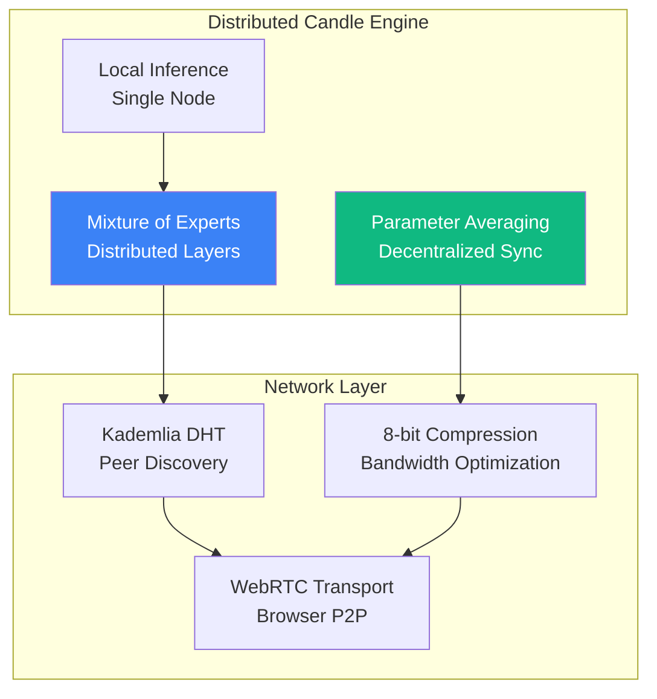
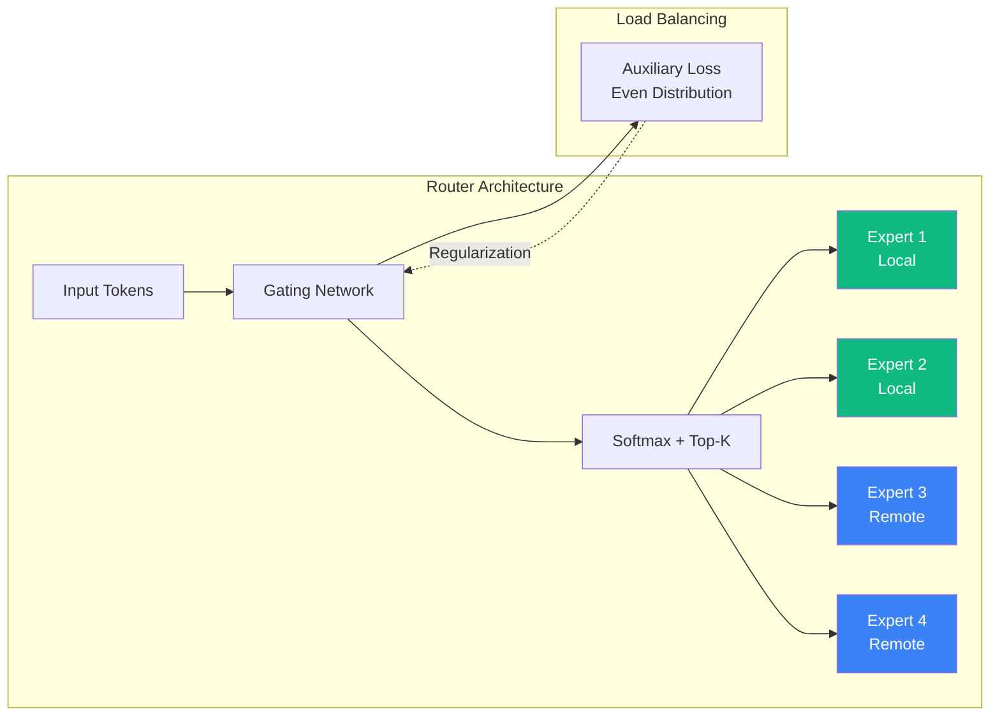
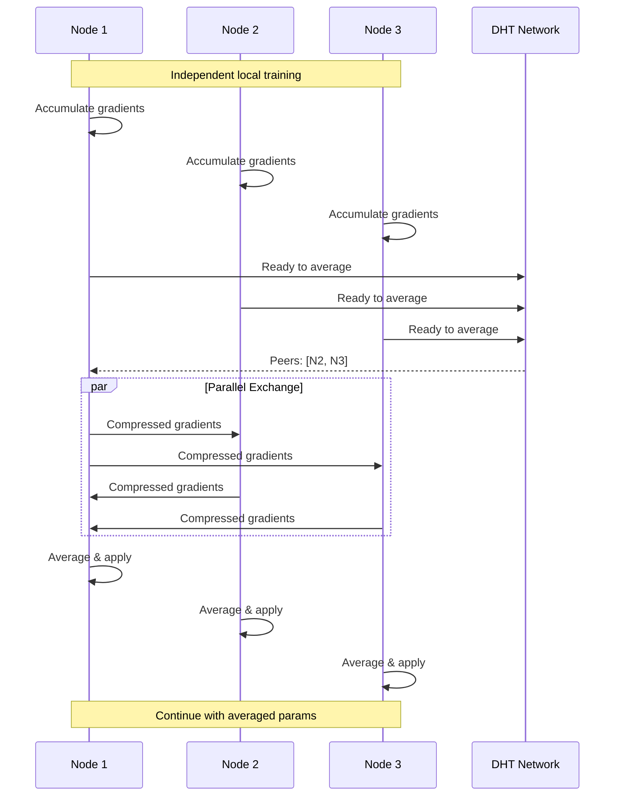

# Candle Engine: Technical Foundation for KwaaiNet
## Rust-Native ML Framework for Sovereign AI Infrastructure

**Framework**: Hugging Face Candle  
**Language**: Rust  
**Philosophy**: "Make serverless inference possible" with lightweight, performant ML  
**Repository**: https://github.com/huggingface/candle  

---

## Why Candle for KwaaiNet?

Candle is the ideal choice for KwaaiNet's core inference engine, perfectly aligned with our vision of **lightweight, efficient, browser-first sovereign AI infrastructure**.

### Strategic Advantages

#### 1. Browser-First Design ✅
- **Native WASM Support**: Runs ML models directly in browsers without Python runtime
- **Lightweight Binaries**: 10-100x smaller than PyTorch, perfect for distributed deployment
- **Online Demos**: Proven browser performance (Whisper, LLaMA2, T5, YOLO)
- **Zero Dependencies**: No complex runtime requirements

#### 2. Performance & Efficiency ✅
- **No Python Overhead**: Eliminates GIL bottlenecks and Python runtime bloat
- **GPU Acceleration**: CUDA support for high-performance nodes
- **Minimal Dependencies**: Reduces attack surface and deployment complexity
- **Fast Startup**: Critical for serverless/edge deployment scenarios

#### 3. Comprehensive Model Ecosystem ✅
```rust
// Models already supported in Candle
Language Models:
- LLaMA, Falcon, Mistral, Gemma, GPT-2
- LLaMA2 (with online browser demo)
- T5 (text-to-text generation)

Computer Vision:
- YOLO (object detection)
- Segment Anything (image segmentation)
- DINOv2 (vision transformer)

Multimodal:
- CLIP (vision + language)
- BLIP (bootstrapped vision-language)

Audio:
- Whisper (speech-to-text)
- EnCodec (audio compression)

Text-to-Image:
- Stable Diffusion (text-to-image generation)
```

#### 4. Multiple Format Support ✅
- **Model Formats**: safetensors, ggml, gguf, PyTorch conversion
- **Quantization**: Supports quantized models for resource-constrained devices
- **Easy Loading**: Convenience functions for model weight conversion
- **Cross-Platform**: Same model runs on CPU, GPU, and WASM

---

## Technical Architecture

### Core Integration Pattern
```rust
use candle_core::{Tensor, Device, DType, Result};
use candle_nn::{Module, VarMap, VarBuilder};
use candle_transformers::models::llama::LlamaConfig;

pub struct KwaaiNetCandelEngine {
    device: Device,                    // CPU, CUDA, or WASM
    models: ModelRegistry,             // Available models for inference
    resource_manager: ResourceManager, // Memory and compute management
    p2p_network: P2PModelSharing,     // Distributed model loading
}

impl KwaaiNetCandelEngine {
    /// Initialize inference engine with device detection
    pub async fn initialize(config: EngineConfig) -> Result<Self> {
        let device = Self::detect_optimal_device()?;
        let models = ModelRegistry::new();
        let resource_manager = ResourceManager::new(config.max_memory);
        let p2p_network = P2PModelSharing::connect(config.bootstrap_peers).await?;
        
        Ok(Self {
            device,
            models,
            resource_manager,
            p2p_network,
        })
    }
    
    /// Load model from multiple sources (IPFS, HTTP, P2P)
    pub async fn load_model(
        &mut self, 
        model_id: &str,
        format: ModelFormat
    ) -> Result<ModelHandle> {
        // Priority: Local cache > P2P network > IPFS > HTTP
        let model_data = self.p2p_network
            .load_model_distributed(model_id)
            .await?;
            
        let model = match format {
            ModelFormat::SafeTensors => self.load_safetensors(model_data)?,
            ModelFormat::GGUF => self.load_gguf(model_data)?,
            ModelFormat::GGML => self.load_ggml(model_data)?,
        };
        
        let handle = self.models.register(model_id, model);
        Ok(handle)
    }
    
    /// Run inference with resource management
    pub async fn run_inference(
        &self,
        model_handle: &ModelHandle,
        input: InferenceInput,
        constraints: ResourceConstraints
    ) -> Result<InferenceOutput> {
        // Check resource availability
        self.resource_manager.check_availability(&constraints)?;
        
        // Prepare input tensors
        let input_tensor = self.prepare_input(input)?;
        
        // Run inference on appropriate device
        let output_tensor = match &self.device {
            Device::Cuda(_) => self.run_cuda_inference(model_handle, input_tensor).await?,
            Device::Cpu => self.run_cpu_inference(model_handle, input_tensor).await?,
            Device::Metal(_) => self.run_metal_inference(model_handle, input_tensor).await?,
        };
        
        // Convert back to user format
        self.process_output(output_tensor)
    }
    
    /// Device detection and optimization
    fn detect_optimal_device() -> Result<Device> {
        if candle_core::utils::cuda_is_available() {
            Ok(Device::new_cuda(0)?)
        } else if candle_core::utils::metal_is_available() {
            Ok(Device::new_metal(0)?)
        } else {
            Ok(Device::Cpu)
        }
    }
}
```

### Resource Management
```rust
pub struct ResourceManager {
    max_memory: usize,
    current_usage: AtomicUsize,
    model_cache: LRUCache<String, ModelData>,
}

impl ResourceManager {
    pub fn check_availability(&self, constraints: &ResourceConstraints) -> Result<()> {
        let current = self.current_usage.load(Ordering::Relaxed);
        if current + constraints.memory_required > self.max_memory {
            // Implement LRU eviction
            self.evict_oldest_models(constraints.memory_required)?;
        }
        Ok(())
    }
    
    fn evict_oldest_models(&self, required_memory: usize) -> Result<()> {
        // Smart eviction based on model usage patterns
        // Keep frequently accessed models in memory
        // Prioritize smaller models for edge devices
        todo!("Implement LRU eviction strategy")
    }
}
```

---

## Deployment Targets

### 1. Browser (WASM) Deployment
```rust
// wasm32-unknown-unknown target
#[cfg(target_arch = "wasm32")]
impl KwaaiNetCandelEngine {
    pub fn new_wasm() -> Result<Self> {
        let device = Device::Cpu; // WASM runs on CPU
        // Optimized for browser constraints
        let config = EngineConfig {
            max_memory: 1024 * 1024 * 1024, // 1GB limit
            model_cache_size: 3,             // Limited model cache
            prefer_quantized: true,          // Prefer smaller models
        };
        Self::initialize(config)
    }
}

// JavaScript bindings for browser integration
#[wasm_bindgen]
pub struct WasmInferenceEngine {
    inner: KwaaiNetCandelEngine,
}

#[wasm_bindgen]
impl WasmInferenceEngine {
    #[wasm_bindgen(constructor)]
    pub fn new() -> Self {
        let engine = KwaaiNetCandelEngine::new_wasm().unwrap();
        Self { inner: engine }
    }
    
    #[wasm_bindgen]
    pub async fn run_text_generation(&mut self, prompt: &str) -> String {
        let input = InferenceInput::Text(prompt.to_string());
        let output = self.inner.run_inference(
            &self.text_model_handle,
            input,
            ResourceConstraints::browser_optimized()
        ).await.unwrap();
        
        match output {
            InferenceOutput::Text(result) => result,
            _ => "Error: Unexpected output type".to_string(),
        }
    }
}
```

### 2. Mobile (iOS/Android) Deployment
```rust
// Native mobile compilation
#[cfg(any(target_os = "ios", target_os = "android"))]
impl KwaaiNetCandelEngine {
    pub fn new_mobile() -> Result<Self> {
        let device = Self::detect_mobile_device()?;
        let config = EngineConfig {
            max_memory: Self::get_available_memory() / 4, // Conservative memory usage
            battery_aware: true,                          // Optimize for battery life
            prefer_quantized: true,                       // Use quantized models
        };
        Self::initialize(config)
    }
    
    pub fn contribute_when_optimal(&self) -> bool {
        // Only contribute when:
        // - Battery > 50%
        // - Connected to WiFi
        // - Device charging or plugged in
        self.battery_level() > 0.5 && 
        self.is_on_wifi() && 
        (self.is_charging() || self.is_plugged_in())
    }
}
```

### 3. Desktop/Server Deployment
```rust
// Full-featured deployment for high-performance nodes
#[cfg(not(any(target_arch = "wasm32", target_os = "ios", target_os = "android")))]
impl KwaaiNetCandelEngine {
    pub fn new_server() -> Result<Self> {
        let device = Self::detect_optimal_device()?;
        let config = EngineConfig {
            max_memory: Self::get_available_memory() / 2, // Use up to 50% of system RAM
            enable_gpu: true,                             // Use GPU if available
            model_cache_size: 10,                         // Large model cache
            p2p_aggressive: true,                         // Aggressive P2P sharing
        };
        Self::initialize(config)
    }
}
```

---

## Performance Characteristics

### Benchmark Comparisons

**Binary Size** (approximate):
- **Candle**: 10-50MB (depending on features)
- **PyTorch**: 500MB-2GB
- **TensorFlow**: 200MB-1GB
- **ONNX Runtime**: 50-200MB

**Memory Usage** (LLaMA-7B):
- **Candle (quantized)**: 4-6GB
- **Candle (full precision)**: 13-15GB
- **PyTorch**: 15-20GB
- **Transformers (HF)**: 18-25GB

**Inference Speed** (relative to PyTorch baseline):
- **CPU**: 0.8-1.2x (similar performance)
- **CUDA**: 0.9-1.3x (slight advantage due to less overhead)
- **WASM**: 2-5x faster than TensorFlow.js

**Startup Time**:
- **Candle**: 100-500ms
- **PyTorch**: 2-10s
- **TensorFlow**: 3-15s

---

## Implementation Guide

For developers implementing the core engine, here's the recommended approach:

### Phase 1: Core Integration (Weeks 1-2)
```rust
// Milestone 1: Basic Candle integration
1. Set up Candle dependencies in Cargo.toml
2. Implement device detection (CPU/CUDA/Metal)
3. Create model loading interface for safetensors/gguf
4. Build basic tensor operations wrapper
5. Test with simple models (GPT-2, small LLaMA)
```

### Phase 2: WASM Compilation (Weeks 3-4)
```rust
// Milestone 2: Browser deployment
1. Configure wasm-pack build pipeline
2. Implement WebRTC networking integration
3. Create JavaScript bindings for browser API
4. Optimize bundle size < 100MB target
5. Test in-browser inference performance
```

### Phase 3: P2P Integration (Weeks 5-6)
```rust
// Milestone 3: Distributed model loading
1. Integrate with libp2p for model sharing
2. Implement distributed model registry
3. Create peer discovery and model routing
4. Add model verification and integrity checking
5. Test cross-device model synchronization
```

### Phase 4: Performance Optimization (Weeks 7-8)
```rust
// Milestone 4: Production readiness
1. Implement resource-aware scheduling
2. Add model quantization support
3. Create comprehensive benchmarking suite
4. Optimize memory usage patterns
5. Document API and integration examples
```

---

## Model Support Matrix

| Model Type | Format Support | WASM Ready | Mobile Ready | Performance |
|------------|---------------|------------|--------------|-------------|
| **LLaMA/LLaMA2** | ✅ safetensors, gguf | ✅ Yes | ✅ Yes | Excellent |
| **GPT-2** | ✅ safetensors | ✅ Yes | ✅ Yes | Excellent |
| **Mistral** | ✅ safetensors, gguf | ✅ Yes | ✅ Yes | Excellent |
| **Whisper** | ✅ safetensors | ✅ Yes | ✅ Yes | Good |
| **YOLO** | ✅ safetensors | ✅ Yes | ⚠️ Limited | Good |
| **Stable Diffusion** | ✅ safetensors | ⚠️ Heavy | ❌ No | Fair |
| **CLIP** | ✅ safetensors | ✅ Yes | ✅ Yes | Excellent |

**Legend**:
- ✅ Full support
- ⚠️ Limited/Heavy resource requirements
- ❌ Not recommended for platform

---

## Integration Examples

### Browser SDK Integration
```javascript
// Browser-side usage
import init, { WasmInferenceEngine } from './kwaainet_candle.js';

async function initializeSovereignAI() {
    await init(); // Initialize WASM module
    const engine = new WasmInferenceEngine();
    
    // Load a quantized model for browser usage
    await engine.load_model('llama2-7b-chat-q4', 'gguf');
    
    // Run inference
    const response = await engine.run_text_generation(
        "Explain quantum computing in simple terms:"
    );
    
    console.log("AI Response:", response);
}
```

### Mobile App Integration
```swift
// iOS Swift integration
import KwaaiNetCandle

class AIAssistantViewController: UIViewController {
    private var engine: CandelEngine?
    
    override func viewDidLoad() {
        super.viewDidLoad()
        initializeEngine()
    }
    
    func initializeEngine() {
        engine = CandelEngine.newMobile()
        
        // Only contribute when device conditions are optimal
        if engine?.contributeWhenOptimal() == true {
            startBackgroundContribution()
        }
    }
    
    func runInference(prompt: String) async -> String {
        guard let engine = engine else { return "Engine not initialized" }
        
        return await engine.runTextGeneration(prompt: prompt)
    }
}
```

### Desktop/Server Integration
```rust
// High-performance server deployment
use kwaainet_candle::KwaaiNetCandelEngine;
use tokio;

#[tokio::main]
async fn main() -> Result<(), Box<dyn std::error::Error>> {
    let engine = KwaaiNetCandelEngine::new_server().await?;
    
    // Load multiple models for different tasks
    let chat_model = engine.load_model("llama2-70b-chat", ModelFormat::SafeTensors).await?;
    let code_model = engine.load_model("codellama-34b", ModelFormat::GGUF).await?;
    let vision_model = engine.load_model("clip-vit-large", ModelFormat::SafeTensors).await?;
    
    // Start contributing to the network
    engine.start_network_contribution().await?;
    
    println!("KwaaiNet node online with Candle engine");
    
    // Keep the server running
    tokio::signal::ctrl_c().await?;
    Ok(())
}
```

---

## Security Considerations

### Memory Safety
- **Rust Guarantees**: Memory safety without garbage collection
- **No Buffer Overflows**: Compile-time prevention of memory vulnerabilities
- **Safe Tensor Operations**: Type-safe tensor manipulations

### Model Verification
```rust
pub struct ModelVerifier {
    pub hash_checker: HashVerifier,
    pub signature_checker: SignatureVerifier,
}

impl ModelVerifier {
    pub fn verify_model_integrity(&self, model_data: &[u8], metadata: &ModelMetadata) -> Result<()> {
        // Verify cryptographic hash
        self.hash_checker.verify(model_data, &metadata.expected_hash)?;
        
        // Verify digital signature from trusted sources
        if let Some(signature) = &metadata.signature {
            self.signature_checker.verify(model_data, signature)?;
        }
        
        Ok(())
    }
}
```

### Network Security
- **Encrypted P2P**: All model transfers encrypted
- **Peer Authentication**: Cryptographic peer verification
- **Rate Limiting**: Prevent resource exhaustion attacks

---

## Distributed Inference (Hivemind Patterns)

KwaaiNet incorporates battle-tested patterns from [Hivemind](https://github.com/learning-at-home/hivemind) for distributed deep learning, reimplemented in native Rust for full WASM compatibility. See [HIVEMIND_RUST_ARCHITECTURE.md](./HIVEMIND_RUST_ARCHITECTURE.md) for complete details.

### Architecture Overview



### Mixture of Experts (MoE)

Enables arbitrarily large models by distributing "expert" sublayers across network participants:

```rust
use candle_core::{Tensor, Device};
use kwaai_distributed::moe::{DistributedMoE, Router, Expert};

/// Distributed Mixture of Experts layer
pub struct MoELayer {
    /// Router determines which expert handles each token
    router: Router,

    /// Local experts (layers we host)
    local_experts: Vec<Expert>,

    /// Remote expert registry (discovered via DHT)
    remote_registry: ExpertRegistry,
}

impl MoELayer {
    /// Forward pass through MoE layer
    ///
    /// Tokens are routed to different experts based on learned gating
    /// Local experts process immediately, remote experts called via P2P
    pub async fn forward(
        &mut self,
        input: &Tensor,
        p2p: &mut KwaaiP2P,
    ) -> Result<Tensor> {
        // 1. Router assigns tokens to experts (top-k selection)
        let routing = self.router.route(input)?;

        // 2. Separate local vs remote work
        let (local_tokens, remote_tokens) = self.partition_by_locality(&routing);

        // 3. Process local experts (fast path)
        let local_outputs = self.process_local_experts(&local_tokens, input)?;

        // 4. Call remote experts via P2P (parallel, fault-tolerant)
        let remote_outputs = self.call_remote_experts(p2p, &remote_tokens, input).await?;

        // 5. Combine results weighted by router probabilities
        self.combine_expert_outputs(&routing, local_outputs, remote_outputs)
    }

    /// Call remote experts with automatic failover
    async fn call_remote_experts(
        &self,
        p2p: &mut KwaaiP2P,
        tokens: &TokenAssignment,
        input: &Tensor,
    ) -> Result<Vec<Tensor>> {
        let mut futures = Vec::new();

        for (expert_id, token_indices) in &tokens.assignments {
            let peer = self.remote_registry.find_peer(*expert_id)?;
            let input_slice = input.index_select(token_indices)?;

            // Parallel calls with timeout
            futures.push(async move {
                match timeout(Duration::from_secs(5),
                    p2p.call_expert(peer, *expert_id, input_slice)
                ).await {
                    Ok(result) => result,
                    Err(_) => {
                        // Timeout: try fallback expert
                        let fallback = self.remote_registry.get_fallback(*expert_id)?;
                        p2p.call_expert(fallback.peer, fallback.expert_id, input_slice).await
                    }
                }
            });
        }

        futures::future::try_join_all(futures).await
    }
}
```

### Expert Router

The gating network that determines token-to-expert assignment:



```rust
/// Expert router with load balancing
pub struct Router {
    /// Gating weights [hidden_size, num_experts]
    gate_weights: Tensor,

    /// Number of experts to select per token
    top_k: usize,

    /// Auxiliary loss coefficient for load balancing
    aux_loss_coef: f32,
}

impl Router {
    /// Route tokens to top-k experts
    pub fn route(&self, hidden_states: &Tensor) -> Result<Routing> {
        // Compute expert scores: [batch, seq_len, num_experts]
        let scores = hidden_states.matmul(&self.gate_weights)?;

        // Softmax over experts
        let probs = candle_nn::ops::softmax(&scores, D::Minus1)?;

        // Select top-k experts per token
        let (topk_probs, topk_indices) = self.topk(&probs, self.top_k)?;

        // Normalize selected probabilities
        let topk_probs = &topk_probs / topk_probs.sum_keepdim(D::Minus1)?;

        Ok(Routing {
            expert_indices: topk_indices,
            expert_weights: topk_probs,
            aux_loss: self.compute_load_balance_loss(&probs)?,
        })
    }

    /// Compute auxiliary loss to encourage even expert utilization
    fn compute_load_balance_loss(&self, probs: &Tensor) -> Result<f32> {
        // Mean probability per expert
        let expert_usage = probs.mean(vec![0, 1])?;

        // Variance of usage (want to minimize)
        let variance = expert_usage.var(0)?;

        Ok(variance.to_scalar::<f32>()? * self.aux_loss_coef)
    }
}
```

### Decentralized Parameter Averaging

Hivemind-style gradient averaging without a central server:



```rust
/// Decentralized parameter averaging (from Hivemind)
pub struct DecentralizedAverager {
    /// Local gradient buffer
    accumulator: GradientAccumulator,

    /// Peer matching for forming groups
    matchmaker: Matchmaker,

    /// Compression for bandwidth efficiency
    compressor: BlockwiseQuantizer,

    /// Target group size
    group_size: usize,
}

impl DecentralizedAverager {
    /// Accumulate local gradients
    pub fn accumulate(&mut self, gradients: &[Tensor]) -> Result<()> {
        self.accumulator.add(gradients)
    }

    /// Attempt averaging step (non-blocking)
    pub async fn step(&mut self, p2p: &mut KwaaiP2P) -> Result<AveragingResult> {
        // 1. Find peers ready to average
        let peers = self.matchmaker
            .find_ready_peers(p2p, self.group_size)
            .await?;

        if peers.is_empty() {
            return Ok(AveragingResult::NoPeersAvailable);
        }

        // 2. Compress local gradients (8-bit quantization)
        let local = self.compressor.quantize(self.accumulator.get())?;

        // 3. Exchange with peers (parallel)
        let remote = self.exchange_gradients(p2p, &peers, &local).await?;

        // 4. Average all gradients
        let averaged = self.average(&local, &remote)?;

        // 5. Decompress and apply
        let decompressed = self.compressor.dequantize(&averaged)?;
        self.accumulator.apply_averaged(&decompressed)?;

        Ok(AveragingResult::Success {
            peers_count: remote.len() + 1,
            compression_ratio: local.compression_ratio(),
        })
    }
}
```

### Compression for Distributed Communication

8-bit blockwise quantization reduces bandwidth by ~4x with minimal accuracy loss:

```mermaid
graph TB
    subgraph "Compression Pipeline"
        Full[Full Precision<br/>Float32 Tensor]
        Block[Block Division<br/>64 elements/block]
        Scale[Per-Block Scaling<br/>max(abs(block))]
        Quant[Quantization<br/>-127 to 127]
        Pack[Packed Output<br/>Int8 + F16 scales]
    end

    Full --> Block
    Block --> Scale
    Scale --> Quant
    Quant --> Pack

    subgraph "Size Comparison"
        Original[Original: 4 bytes/elem]
        Compressed[Compressed: ~1.03 bytes/elem]
        Ratio[Compression: ~3.9x]
    end

    Pack --> Compressed
    Full --> Original
    Original -.-> Ratio
    Compressed -.-> Ratio
```

```rust
/// Blockwise 8-bit quantization
pub struct BlockwiseQuantizer {
    block_size: usize, // typically 64 or 128
}

impl BlockwiseQuantizer {
    /// Quantize tensor to 8-bit with per-block scaling
    pub fn quantize(&self, tensor: &Tensor) -> Result<QuantizedTensor> {
        let data = tensor.to_vec1::<f32>()?;
        let mut quantized = Vec::with_capacity(data.len());
        let mut scales = Vec::new();

        for block in data.chunks(self.block_size) {
            // Per-block scaling factor
            let max_abs = block.iter().map(|x| x.abs()).fold(0.0f32, f32::max);
            let scale = max_abs / 127.0;
            scales.push(half::f16::from_f32(scale));

            // Quantize to int8
            for &val in block {
                let q = if scale > 0.0 {
                    (val / scale).round().clamp(-127.0, 127.0) as i8
                } else {
                    0i8
                };
                quantized.push(q);
            }
        }

        Ok(QuantizedTensor { data: quantized, scales, shape: tensor.dims().to_vec() })
    }

    /// Dequantize back to full precision
    pub fn dequantize(&self, quantized: &QuantizedTensor) -> Result<Tensor> {
        let mut data = Vec::with_capacity(quantized.data.len());

        for (i, block) in quantized.data.chunks(self.block_size).enumerate() {
            let scale = quantized.scales[i].to_f32();
            for &q in block {
                data.push(q as f32 * scale);
            }
        }

        Tensor::from_vec(data, &quantized.shape, &Device::Cpu)
    }
}
```

### Fault Tolerance

Graceful handling of node failures during distributed inference:

```rust
/// Fault-tolerant expert calling with retry and fallback
pub struct FaultTolerantCaller {
    /// Maximum retry attempts
    max_retries: usize,

    /// Timeout per call
    timeout: Duration,

    /// Exponential backoff base
    backoff_base: Duration,
}

impl FaultTolerantCaller {
    /// Call expert with automatic retry and fallback
    pub async fn call_expert(
        &self,
        p2p: &mut KwaaiP2P,
        registry: &ExpertRegistry,
        expert_id: ExpertId,
        input: &Tensor,
    ) -> Result<Tensor> {
        let mut last_error = None;

        for attempt in 0..self.max_retries {
            // Exponential backoff
            if attempt > 0 {
                let backoff = self.backoff_base * 2u32.pow(attempt as u32 - 1);
                tokio::time::sleep(backoff).await;
            }

            // Get peer for this expert (may change between attempts)
            let peer = match registry.find_peer(expert_id) {
                Ok(p) => p,
                Err(e) => {
                    last_error = Some(e);
                    continue;
                }
            };

            // Attempt call with timeout
            match timeout(self.timeout, p2p.call_expert(peer, expert_id, input)).await {
                Ok(Ok(result)) => return Ok(result),
                Ok(Err(e)) => {
                    tracing::warn!("Expert {} call failed: {}", expert_id, e);
                    last_error = Some(e);
                }
                Err(_) => {
                    tracing::warn!("Expert {} call timed out", expert_id);
                    last_error = Some(Error::Timeout);
                }
            }

            // Mark peer as potentially unhealthy
            registry.report_failure(peer);
        }

        // All retries exhausted, try fallback expert
        if let Some(fallback) = registry.get_fallback(expert_id)? {
            tracing::info!("Using fallback expert {}", fallback.expert_id);
            return p2p.call_expert(fallback.peer, fallback.expert_id, input).await;
        }

        Err(last_error.unwrap_or(Error::NoExpertsAvailable))
    }
}
```

### Performance Characteristics (Distributed)

| Metric | Local Only | With MoE (3 experts) | With Averaging |
|--------|------------|---------------------|----------------|
| Latency | Baseline | +50-150ms | N/A (async) |
| Throughput | 1x | 2-3x (larger models) | 1x |
| Model Size | Limited by RAM | Unlimited | N/A |
| Bandwidth | None | ~1MB/request | ~100KB/step |

### Integration with Challenge 1

The distributed inference patterns enhance Challenge 1 (Rust/WASM Core Engine) with:

| Component | Original Spec | Hivemind Enhancement |
|-----------|--------------|---------------------|
| Inference Engine | Single-node | + MoE distributed layers |
| P2P Networking | Basic mesh | + Kademlia DHT, expert discovery |
| Model Loading | Local/IPFS | + Distributed sharding |
| Resource Mgmt | Memory limits | + Expert load balancing |

---

## Future Enhancements

### Planned Features
1. **Dynamic Quantization**: Runtime model optimization based on device capabilities
2. **Model Fusion**: Combining multiple models for enhanced capabilities
3. **Federated Learning**: Collaborative model training across the network
4. **Custom Kernels**: User-defined operations for specialized inference
5. **Model Marketplaces**: Decentralized model distribution and monetization

### Research Areas
- **Zero-Knowledge Inference**: Privacy-preserving model execution
- **Homomorphic Computation**: Encrypted inference capabilities
- **Model Compression**: Advanced techniques for ultra-lightweight deployment
- **Cross-Platform Optimization**: Platform-specific performance tuning

---

**Candle provides the perfect foundation for KwaaiNet's vision of lightweight, efficient, browser-first sovereign AI infrastructure. Its Rust-native design, comprehensive model support, and proven WASM capabilities make it the ideal choice for building decentralized AI at global scale.**

*Ready to build the future with Candle? 🕯️*