# Challenge-Specific Architecture Diagrams
## Detailed Component Architectures for KwaaiNet Hackathon Challenges

**Version**: 1.0
**Date**: November 20, 2025
**Status**: Technical Specification
**Related Documents**: [ARCHITECTURE.md](../ARCHITECTURE.md), [HACKATHONS.md](../HACKATHONS.md)

---

## Table of Contents

1. [Challenge 1: Rust/WASM Core Engine](#challenge-1-rustwasm-core-engine)
2. [Challenge 2: Verida Integration Layer](#challenge-2-verida-integration-layer)
3. [Challenge 3: Browser SDK Development](#challenge-3-browser-sdk-development)
4. [Challenge 4: Enterprise Compliance Tools](#challenge-4-enterprise-compliance-tools)
5. [Challenge 5: Mobile Foundation](#challenge-5-mobile-foundation)
6. [Challenge 6: Environmental Gamification](#challenge-6-environmental-gamification)

---

## Challenge 1: Rust/WASM Core Engine
### Prize Pool: 750,000 VDA Tokens

### 1.1 Core Component Architecture

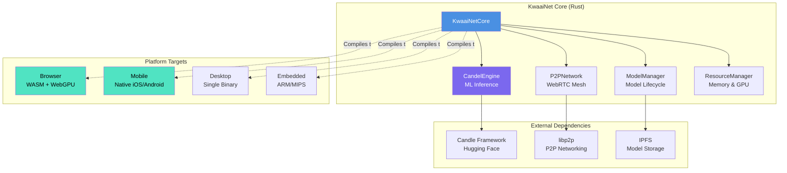
```mermaid
graph TB
    subgraph "KwaaiNet Core (Rust)"
        Core[KwaaiNetCore]
        Engine[CandelEngine<br/>ML Inference]
        ModelMgr[ModelManager<br/>Model Lifecycle]
        Network[P2PNetwork<br/>WebRTC Mesh]
        Resource[ResourceManager<br/>Memory & GPU]
    end

    subgraph "Platform Targets"
        Browser[Browser<br/>WASM + WebGPU]
        Mobile[Mobile<br/>Native iOS/Android]
        Desktop[Desktop<br/>Single Binary]
        Embedded[Embedded<br/>ARM/MIPS]
    end

    subgraph "External Dependencies"
        Candle[Candle Framework<br/>Hugging Face]
        LibP2P[libp2p<br/>P2P Networking]
        IPFS[IPFS<br/>Model Storage]
    end

    Core --> Engine
    Core --> ModelMgr
    Core --> Network
    Core --> Resource

    Engine --> Candle
    Network --> LibP2P
    ModelMgr --> IPFS

    Core -.Compiles to.-> Browser
    Core -.Compiles to.-> Mobile
    Core -.Compiles to.-> Desktop
    Core -.Compiles to.-> Embedded

    style Core fill:#4A90E2,color:#fff
    style Engine fill:#7B68EE,color:#fff
    style Browser fill:#50E3C2,color:#000
    style Mobile fill:#50E3C2,color:#000
```

### 1.2 Model Loading & Inference Flow

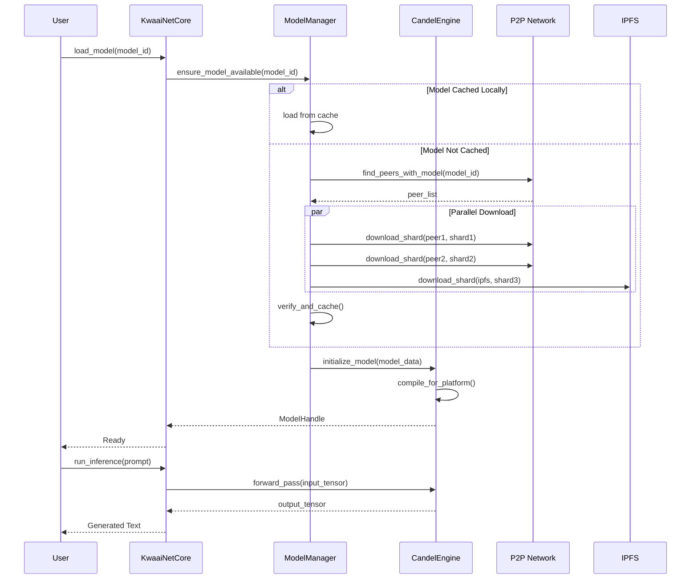
```mermaid
sequenceDiagram
    participant User
    participant Core as KwaaiNetCore
    participant ModelMgr as ModelManager
    participant Engine as CandelEngine
    participant Network as P2P Network
    participant IPFS

    User->>Core: load_model(model_id)
    Core->>ModelMgr: ensure_model_available(model_id)

    alt Model Cached Locally
        ModelMgr->>ModelMgr: load from cache
    else Model Not Cached
        ModelMgr->>Network: find_peers_with_model(model_id)
        Network-->>ModelMgr: peer_list

        par Parallel Download
            ModelMgr->>Network: download_shard(peer1, shard1)
            ModelMgr->>Network: download_shard(peer2, shard2)
            ModelMgr->>IPFS: download_shard(ipfs, shard3)
        end

        ModelMgr->>ModelMgr: verify_and_cache()
    end

    ModelMgr->>Engine: initialize_model(model_data)
    Engine->>Engine: compile_for_platform()
    Engine-->>Core: ModelHandle
    Core-->>User: Ready

    User->>Core: run_inference(prompt)
    Core->>Engine: forward_pass(input_tensor)
    Engine-->>Core: output_tensor
    Core-->>User: Generated Text
```

### 1.3 Platform Compilation Targets

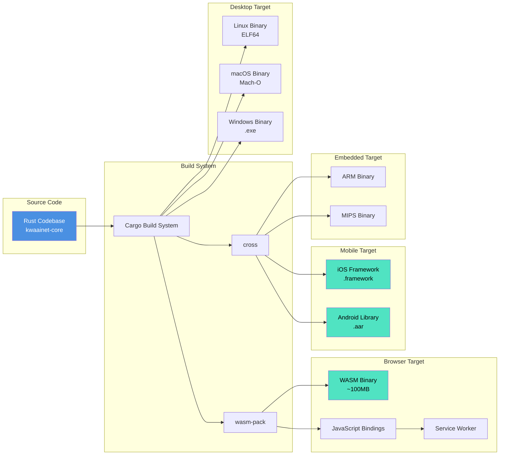
```mermaid
graph LR
    subgraph "Source Code"
        Rust[Rust Codebase<br/>kwaainet-core]
    end

    subgraph "Build System"
        Cargo[Cargo Build System]
        WasmPack[wasm-pack]
        CrossCompile[cross]
    end

    subgraph "Browser Target"
        WASM[WASM Binary<br/>~100MB]
        JS[JavaScript Bindings]
        WebWorker[Service Worker]
    end

    subgraph "Mobile Target"
        iOS[iOS Framework<br/>.framework]
        Android[Android Library<br/>.aar]
    end

    subgraph "Desktop Target"
        Linux[Linux Binary<br/>ELF64]
        MacOS[macOS Binary<br/>Mach-O]
        Windows[Windows Binary<br/>.exe]
    end

    subgraph "Embedded Target"
        ARM[ARM Binary]
        MIPS[MIPS Binary]
    end

    Rust --> Cargo
    Cargo --> WasmPack
    Cargo --> CrossCompile

    WasmPack --> WASM
    WasmPack --> JS
    JS --> WebWorker

    CrossCompile --> iOS
    CrossCompile --> Android

    Cargo --> Linux
    Cargo --> MacOS
    Cargo --> Windows

    CrossCompile --> ARM
    CrossCompile --> MIPS

    style Rust fill:#4A90E2,color:#fff
    style WASM fill:#50E3C2,color:#000
    style iOS fill:#50E3C2,color:#000
    style Android fill:#50E3C2,color:#000
```

### 1.4 Resource Management Architecture

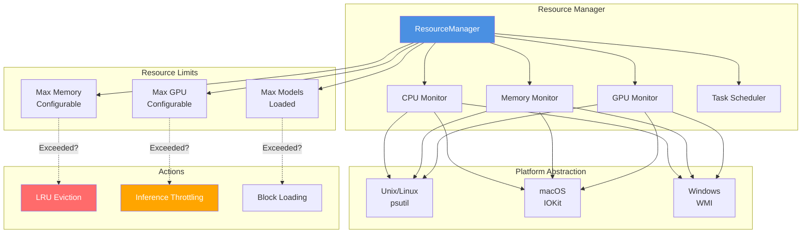
```mermaid
graph TB
    subgraph "Resource Manager"
        Mgr[ResourceManager]
        CPU[CPU Monitor]
        Memory[Memory Monitor]
        GPU[GPU Monitor]
        Scheduler[Task Scheduler]
    end

    subgraph "Platform Abstraction"
        Unix[Unix/Linux<br/>psutil]
        Darwin[macOS<br/>IOKit]
        Win[Windows<br/>WMI]
    end

    subgraph "Resource Limits"
        MaxMem[Max Memory<br/>Configurable]
        MaxGPU[Max GPU<br/>Configurable]
        MaxModels[Max Models<br/>Loaded]
    end

    subgraph "Actions"
        Evict[LRU Eviction]
        Throttle[Inference Throttling]
        Block[Block Loading]
    end

    Mgr --> CPU
    Mgr --> Memory
    Mgr --> GPU
    Mgr --> Scheduler

    CPU --> Unix
    CPU --> Darwin
    CPU --> Win

    Memory --> Unix
    Memory --> Darwin
    Memory --> Win

    GPU --> Unix
    GPU --> Darwin
    GPU --> Win

    Mgr --> MaxMem
    Mgr --> MaxGPU
    Mgr --> MaxModels

    MaxMem -.Exceeded?.-> Evict
    MaxGPU -.Exceeded?.-> Throttle
    MaxModels -.Exceeded?.-> Block

    style Mgr fill:#4A90E2,color:#fff
    style Evict fill:#FF6B6B,color:#fff
    style Throttle fill:#FFA500,color:#fff
```

---

## Challenge 2: Verida Integration Layer
### Prize Pool: 600,000 VDA Tokens

### 2.1 Verida Integration Architecture

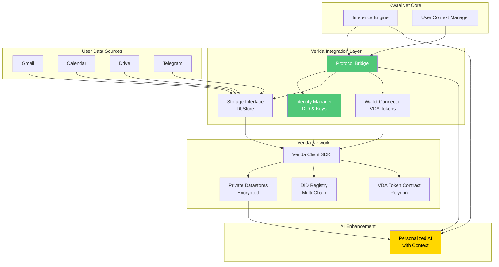
```mermaid
graph TB
    subgraph "KwaaiNet Core"
        InferenceEngine[Inference Engine]
        UserContext[User Context Manager]
    end

    subgraph "Verida Integration Layer"
        Bridge[Protocol Bridge]
        IdentityMgr[Identity Manager<br/>DID & Keys]
        StorageIface[Storage Interface<br/>DbStore]
        WalletConn[Wallet Connector<br/>VDA Tokens]
    end

    subgraph "Verida Network"
        VeridaClient[Verida Client SDK]
        Datastore[Private Datastores<br/>Encrypted]
        DIDRegistry[DID Registry<br/>Multi-Chain]
        VDAContract[VDA Token Contract<br/>Polygon]
    end

    subgraph "User Data Sources"
        Gmail[Gmail]
        Calendar[Calendar]
        Drive[Drive]
        Telegram[Telegram]
    end

    subgraph "AI Enhancement"
        PersonalAI[Personalized AI<br/>with Context]
    end

    InferenceEngine --> Bridge
    UserContext --> Bridge

    Bridge --> IdentityMgr
    Bridge --> StorageIface
    Bridge --> WalletConn

    IdentityMgr --> VeridaClient
    StorageIface --> VeridaClient
    WalletConn --> VeridaClient

    VeridaClient --> Datastore
    VeridaClient --> DIDRegistry
    VeridaClient --> VDAContract

    Gmail --> StorageIface
    Calendar --> StorageIface
    Drive --> StorageIface
    Telegram --> StorageIface

    Bridge --> PersonalAI
    InferenceEngine --> PersonalAI
    Datastore --> PersonalAI

    style Bridge fill:#50C878,color:#fff
    style IdentityMgr fill:#50C878,color:#fff
    style PersonalAI fill:#FFD700,color:#000
```

### 2.2 Progressive Authentication Flow

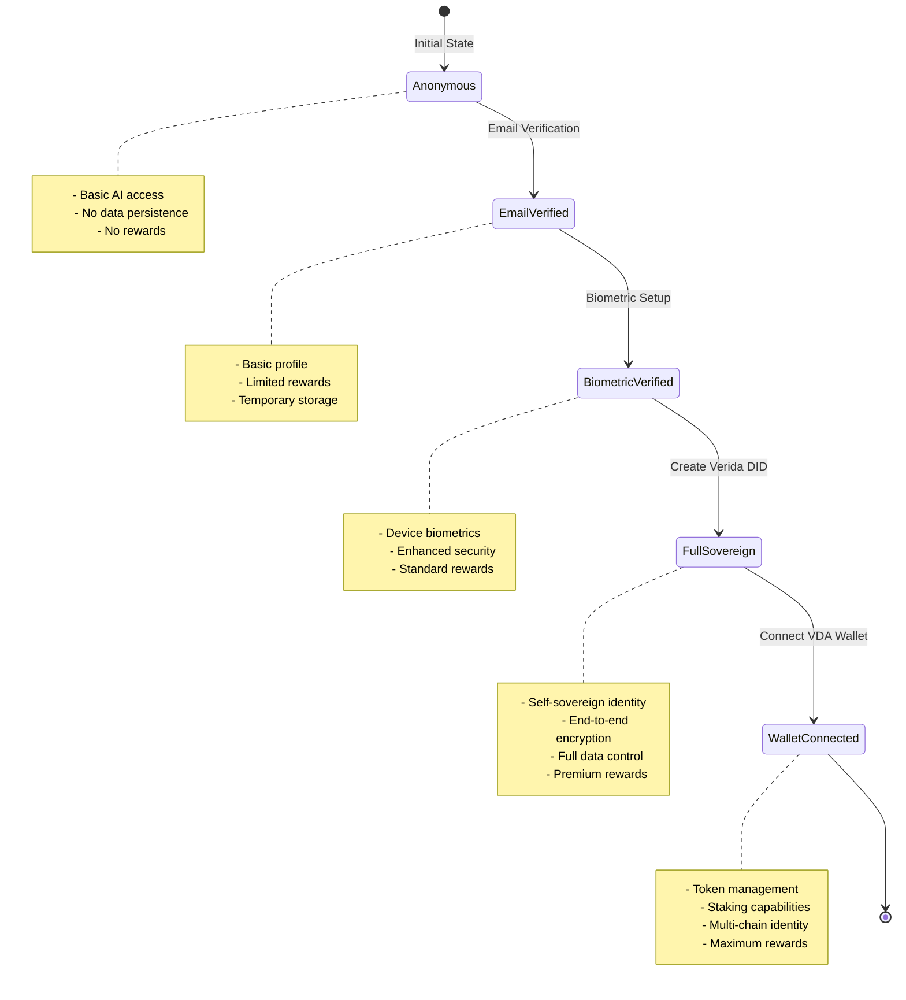
```mermaid
stateDiagram-v2
    [*] --> Anonymous: Initial State

    Anonymous --> EmailVerified: Email Verification
    note right of Anonymous
        - Basic AI access
        - No data persistence
        - No rewards
    end note

    EmailVerified --> BiometricVerified: Biometric Setup
    note right of EmailVerified
        - Basic profile
        - Limited rewards
        - Temporary storage
    end note

    BiometricVerified --> FullSovereign: Create Verida DID
    note right of BiometricVerified
        - Device biometrics
        - Enhanced security
        - Standard rewards
    end note

    FullSovereign --> WalletConnected: Connect VDA Wallet
    note right of FullSovereign
        - Self-sovereign identity
        - End-to-end encryption
        - Full data control
        - Premium rewards
    end note

    note right of WalletConnected
        - Token management
        - Staking capabilities
        - Multi-chain identity
        - Maximum rewards
    end note

    WalletConnected --> [*]
```

### 2.3 Personal Data Integration Flow

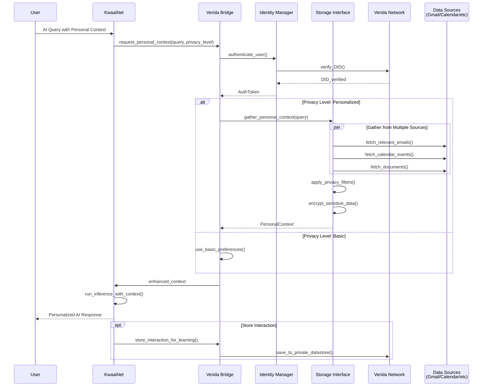
```mermaid
sequenceDiagram
    participant User
    participant KwaaiNet
    participant Bridge as Verida Bridge
    participant Identity as Identity Manager
    participant Storage as Storage Interface
    participant Verida as Verida Network
    participant DataSources as Data Sources<br/>(Gmail/Calendar/etc)

    User->>KwaaiNet: AI Query with Personal Context
    KwaaiNet->>Bridge: request_personal_context(query, privacy_level)

    Bridge->>Identity: authenticate_user()
    Identity->>Verida: verify_DID()
    Verida-->>Identity: DID_verified
    Identity-->>Bridge: AuthToken

    alt Privacy Level: Personalized
        Bridge->>Storage: gather_personal_context(query)

        par Gather from Multiple Sources
            Storage->>DataSources: fetch_relevant_emails()
            Storage->>DataSources: fetch_calendar_events()
            Storage->>DataSources: fetch_documents()
        end

        Storage->>Storage: apply_privacy_filters()
        Storage->>Storage: encrypt_sensitive_data()
        Storage-->>Bridge: PersonalContext
    else Privacy Level: Basic
        Bridge->>Bridge: use_basic_preferences()
    end

    Bridge->>KwaaiNet: enhanced_context
    KwaaiNet->>KwaaiNet: run_inference_with_context()
    KwaaiNet-->>User: Personalized AI Response

    opt Store Interaction
        KwaaiNet->>Bridge: store_interaction_for_learning()
        Bridge->>Verida: save_to_private_datastore()
    end
```

### 2.4 VDA Token Economics Integration

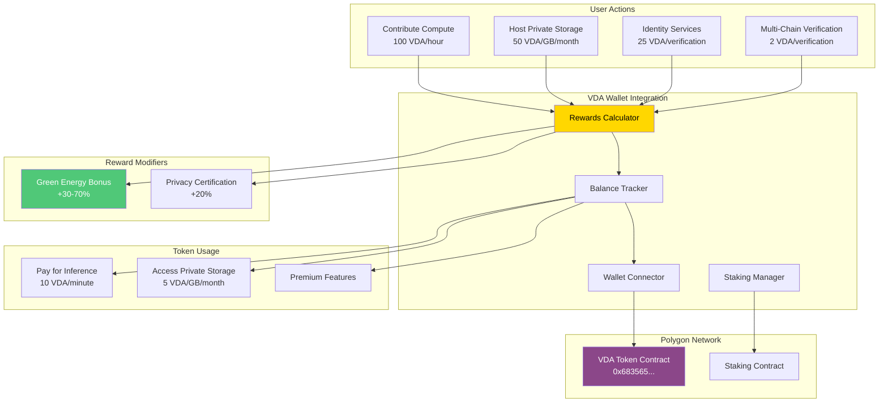
```mermaid
graph TB
    subgraph "User Actions"
        Compute[Contribute Compute<br/>100 VDA/hour]
        Storage[Host Private Storage<br/>50 VDA/GB/month]
        Identity[Identity Services<br/>25 VDA/verification]
        MultiChain[Multi-Chain Verification<br/>2 VDA/verification]
    end

    subgraph "VDA Wallet Integration"
        WalletConn[Wallet Connector]
        Balance[Balance Tracker]
        Staking[Staking Manager]
        Rewards[Rewards Calculator]
    end

    subgraph "Polygon Network"
        VDAContract[VDA Token Contract<br/>0x683565...]
        StakingContract[Staking Contract]
    end

    subgraph "Reward Modifiers"
        GreenBonus[Green Energy Bonus<br/>+30-70%]
        PrivacyBonus[Privacy Certification<br/>+20%]
    end

    subgraph "Token Usage"
        InferencePay[Pay for Inference<br/>10 VDA/minute]
        StorageAccess[Access Private Storage<br/>5 VDA/GB/month]
        PremiumFeatures[Premium Features]
    end

    Compute --> Rewards
    Storage --> Rewards
    Identity --> Rewards
    MultiChain --> Rewards

    Rewards --> GreenBonus
    Rewards --> PrivacyBonus

    Rewards --> Balance
    Balance --> WalletConn

    WalletConn --> VDAContract
    Staking --> StakingContract

    Balance --> InferencePay
    Balance --> StorageAccess
    Balance --> PremiumFeatures

    style Rewards fill:#FFD700,color:#000
    style VDAContract fill:#8B4789,color:#fff
    style GreenBonus fill:#50C878,color:#fff
```

---

## Challenge 3: Browser SDK Development
### Prize Pool: 500,000 VDA Tokens

### 3.1 Browser SDK Architecture

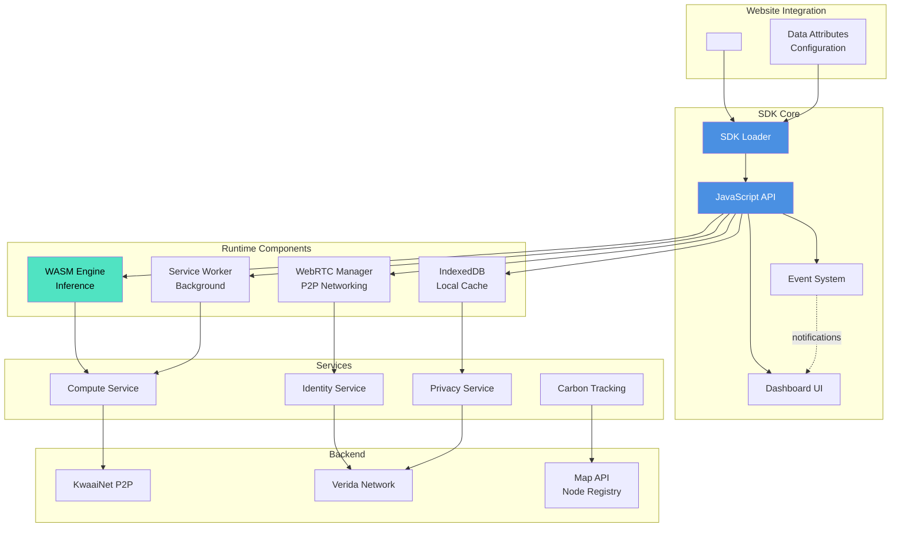
```mermaid
graph TB
    subgraph "Website Integration"
        Script[<script> Tag<br/>One-Line Integration]
        Config[Data Attributes<br/>Configuration]
    end

    subgraph "SDK Core"
        Loader[SDK Loader]
        API[JavaScript API]
        Events[Event System]
        UI[Dashboard UI]
    end

    subgraph "Runtime Components"
        WASM[WASM Engine<br/>Inference]
        Worker[Service Worker<br/>Background]
        WebRTC[WebRTC Manager<br/>P2P Networking]
        Storage[IndexedDB<br/>Local Cache]
    end

    subgraph "Services"
        Compute[Compute Service]
        Identity[Identity Service]
        Privacy[Privacy Service]
        Carbon[Carbon Tracking]
    end

    subgraph "Backend"
        Network[KwaaiNet P2P]
        Verida[Verida Network]
        MapAPI[Map API<br/>Node Registry]
    end

    Script --> Loader
    Config --> Loader

    Loader --> API
    API --> Events
    API --> UI

    API --> WASM
    API --> Worker
    API --> WebRTC
    API --> Storage

    WASM --> Compute
    Worker --> Compute
    WebRTC --> Identity
    Storage --> Privacy

    Compute --> Network
    Identity --> Verida
    Privacy --> Verida
    Carbon --> MapAPI

    Events -.notifications.-> UI

    style Loader fill:#4A90E2,color:#fff
    style API fill:#4A90E2,color:#fff
    style WASM fill:#50E3C2,color:#000
```

### 3.2 One-Line Integration Flow

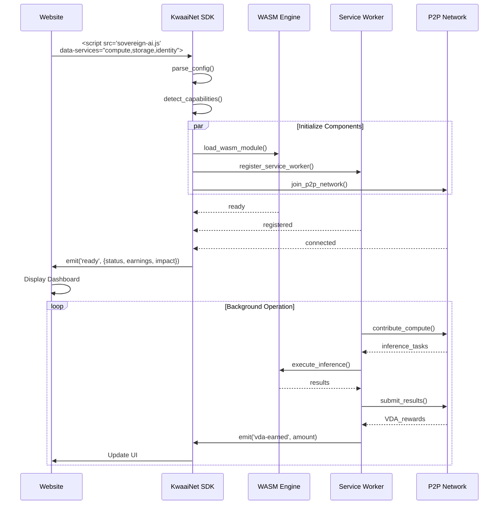
```mermaid
sequenceDiagram
    participant Website
    participant SDK as KwaaiNet SDK
    participant WASM as WASM Engine
    participant Worker as Service Worker
    participant Network as P2P Network

    Website->>SDK: <script src="sovereign-ai.js"<br/>data-services="compute,storage,identity">
    SDK->>SDK: parse_config()
    SDK->>SDK: detect_capabilities()

    par Initialize Components
        SDK->>WASM: load_wasm_module()
        SDK->>Worker: register_service_worker()
        SDK->>Network: join_p2p_network()
    end

    WASM-->>SDK: ready
    Worker-->>SDK: registered
    Network-->>SDK: connected

    SDK->>Website: emit('ready', {status, earnings, impact})

    Website->>Website: Display Dashboard

    loop Background Operation
        Worker->>Network: contribute_compute()
        Network-->>Worker: inference_tasks
        Worker->>WASM: execute_inference()
        WASM-->>Worker: results
        Worker->>Network: submit_results()
        Network-->>Worker: VDA_rewards

        Worker->>SDK: emit('vda-earned', amount)
        SDK->>Website: Update UI
    end
```

### 3.3 Service Worker Architecture

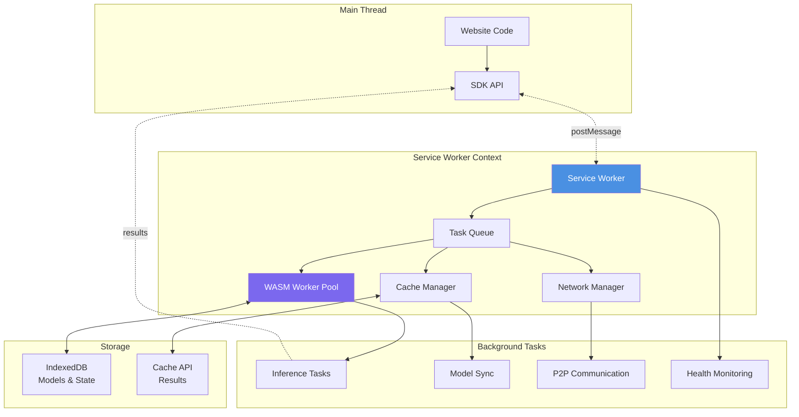
```mermaid
graph TB
    subgraph "Main Thread"
        Website[Website Code]
        SDKAPI[SDK API]
    end

    subgraph "Service Worker Context"
        SW[Service Worker]
        TaskQueue[Task Queue]
        WASMWorker[WASM Worker Pool]
        NetworkMgr[Network Manager]
        CacheMgr[Cache Manager]
    end

    subgraph "Background Tasks"
        Inference[Inference Tasks]
        ModelSync[Model Sync]
        P2PComm[P2P Communication]
        Monitoring[Health Monitoring]
    end

    subgraph "Storage"
        IndexedDB[IndexedDB<br/>Models & State]
        CacheAPI[Cache API<br/>Results]
    end

    Website --> SDKAPI
    SDKAPI <-.postMessage.-> SW

    SW --> TaskQueue
    TaskQueue --> WASMWorker
    TaskQueue --> NetworkMgr
    TaskQueue --> CacheMgr

    WASMWorker --> Inference
    NetworkMgr --> P2PComm
    CacheMgr --> ModelSync
    SW --> Monitoring

    WASMWorker <--> IndexedDB
    CacheMgr <--> CacheAPI

    Inference -.results.-> SDKAPI

    style SW fill:#4A90E2,color:#fff
    style WASMWorker fill:#7B68EE,color:#fff
```

---

## Challenge 4: Enterprise Compliance Tools
### Prize Pool: 450,000 VDA Tokens

### 4.1 Compliance Framework Architecture

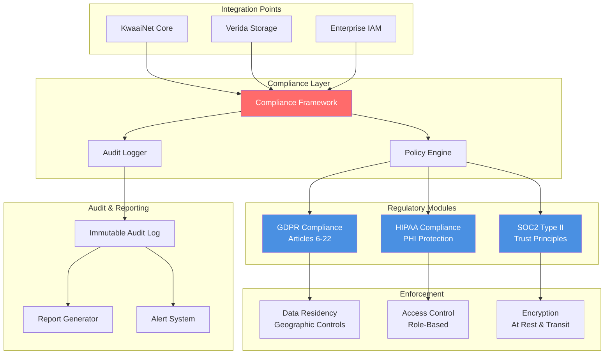
```mermaid
graph TB
    subgraph "Compliance Layer"
        Framework[Compliance Framework]
        PolicyEngine[Policy Engine]
        AuditLogger[Audit Logger]
    end

    subgraph "Regulatory Modules"
        GDPR[GDPR Compliance<br/>Articles 6-22]
        HIPAA[HIPAA Compliance<br/>PHI Protection]
        SOC2[SOC2 Type II<br/>Trust Principles]
    end

    subgraph "Enforcement"
        DataResidency[Data Residency<br/>Geographic Controls]
        AccessControl[Access Control<br/>Role-Based]
        Encryption[Encryption<br/>At Rest & Transit]
    end

    subgraph "Audit & Reporting"
        ImmutableLog[Immutable Audit Log]
        ReportGen[Report Generator]
        Alerts[Alert System]
    end

    subgraph "Integration Points"
        KwaaiNet[KwaaiNet Core]
        Verida[Verida Storage]
        Enterprise[Enterprise IAM]
    end

    Framework --> PolicyEngine
    Framework --> AuditLogger

    PolicyEngine --> GDPR
    PolicyEngine --> HIPAA
    PolicyEngine --> SOC2

    GDPR --> DataResidency
    HIPAA --> AccessControl
    SOC2 --> Encryption

    AuditLogger --> ImmutableLog
    ImmutableLog --> ReportGen
    ImmutableLog --> Alerts

    KwaaiNet --> Framework
    Verida --> Framework
    Enterprise --> Framework

    style Framework fill:#FF6B6B,color:#fff
    style GDPR fill:#4A90E2,color:#fff
    style HIPAA fill:#4A90E2,color:#fff
    style SOC2 fill:#4A90E2,color:#fff
```

### 4.2 GDPR Compliance Flow

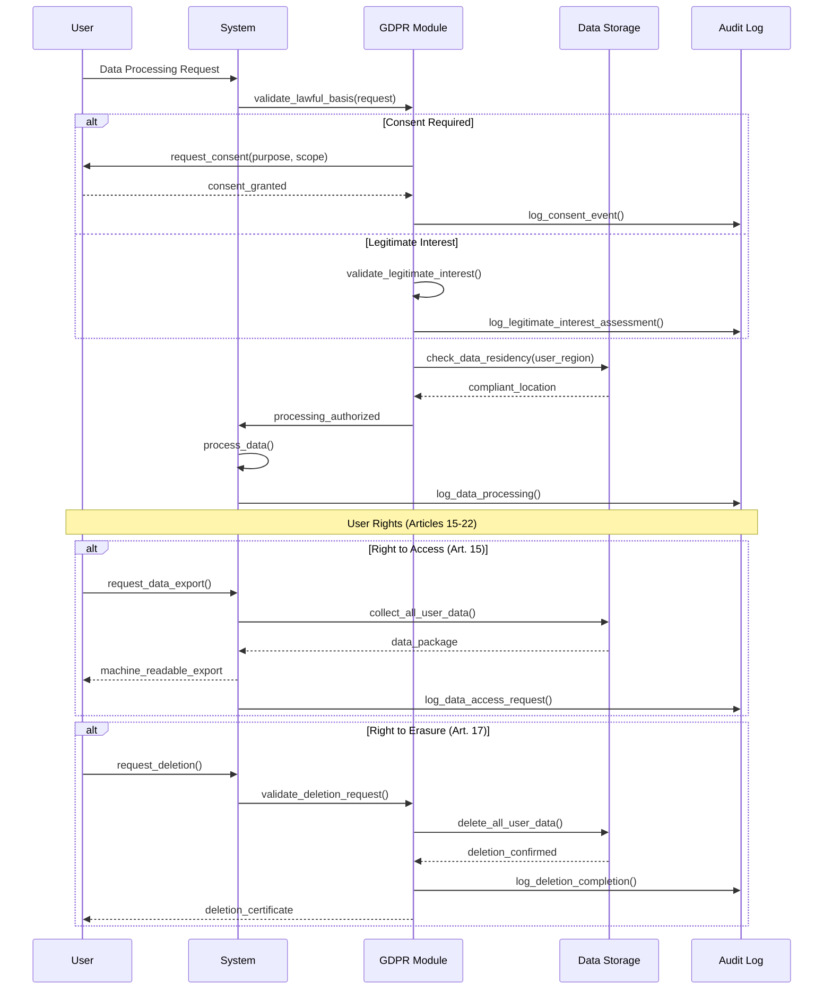
```mermaid
sequenceDiagram
    participant User
    participant System
    participant GDPR as GDPR Module
    participant Storage as Data Storage
    participant Audit as Audit Log

    User->>System: Data Processing Request
    System->>GDPR: validate_lawful_basis(request)

    alt Consent Required
        GDPR->>User: request_consent(purpose, scope)
        User-->>GDPR: consent_granted
        GDPR->>Audit: log_consent_event()
    else Legitimate Interest
        GDPR->>GDPR: validate_legitimate_interest()
        GDPR->>Audit: log_legitimate_interest_assessment()
    end

    GDPR->>Storage: check_data_residency(user_region)
    Storage-->>GDPR: compliant_location

    GDPR->>System: processing_authorized
    System->>System: process_data()
    System->>Audit: log_data_processing()

    Note over User,Audit: User Rights (Articles 15-22)

    alt Right to Access (Art. 15)
        User->>System: request_data_export()
        System->>Storage: collect_all_user_data()
        Storage-->>System: data_package
        System-->>User: machine_readable_export
        System->>Audit: log_data_access_request()
    end

    alt Right to Erasure (Art. 17)
        User->>System: request_deletion()
        System->>GDPR: validate_deletion_request()
        GDPR->>Storage: delete_all_user_data()
        Storage-->>GDPR: deletion_confirmed
        GDPR->>Audit: log_deletion_completion()
        GDPR-->>User: deletion_certificate
    end
```

### 4.3 Data Residency Enforcement

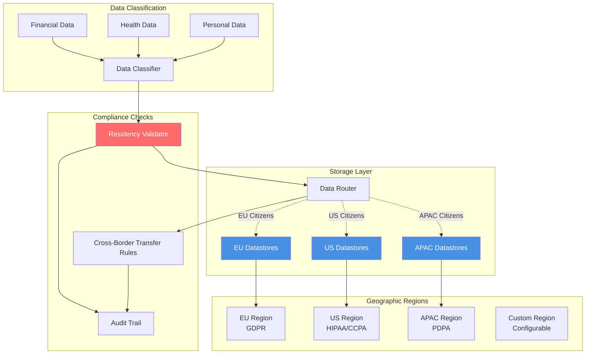
```mermaid
graph TB
    subgraph "Data Classification"
        Classifier[Data Classifier]
        PII[Personal Data]
        PHI[Health Data]
        Financial[Financial Data]
    end

    subgraph "Geographic Regions"
        EU[EU Region<br/>GDPR]
        US[US Region<br/>HIPAA/CCPA]
        APAC[APAC Region<br/>PDPA]
        Custom[Custom Region<br/>Configurable]
    end

    subgraph "Storage Layer"
        Router[Data Router]
        EUStorage[EU Datastores]
        USStorage[US Datastores]
        APACStorage[APAC Datastores]
    end

    subgraph "Compliance Checks"
        Validator[Residency Validator]
        CrossBorder[Cross-Border Transfer Rules]
        Audit[Audit Trail]
    end

    PII --> Classifier
    PHI --> Classifier
    Financial --> Classifier

    Classifier --> Validator

    Validator --> Router

    Router -.EU Citizens.-> EUStorage
    Router -.US Citizens.-> USStorage
    Router -.APAC Citizens.-> APACStorage

    EUStorage --> EU
    USStorage --> US
    APACStorage --> APAC

    Router --> CrossBorder
    CrossBorder --> Audit
    Validator --> Audit

    style Validator fill:#FF6B6B,color:#fff
    style EUStorage fill:#4A90E2,color:#fff
    style USStorage fill:#4A90E2,color:#fff
    style APACStorage fill:#4A90E2,color:#fff
```

---

## Challenge 5: Mobile Foundation
### Prize Pool: 400,000 VDA Tokens

### 5.1 Cross-Platform Mobile Architecture

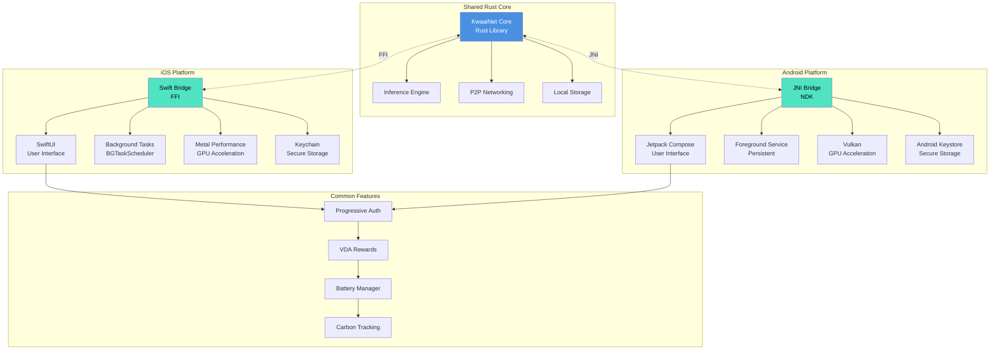
```mermaid
graph TB
    subgraph "Shared Rust Core"
        Core[KwaaiNet Core<br/>Rust Library]
        Inference[Inference Engine]
        Network[P2P Networking]
        Storage[Local Storage]
    end

    subgraph "iOS Platform"
        iOSUI[SwiftUI<br/>User Interface]
        iOSBridge[Swift Bridge<br/>FFI]
        Background[Background Tasks<br/>BGTaskScheduler]
        Metal[Metal Performance<br/>GPU Acceleration]
        Keychain[Keychain<br/>Secure Storage]
    end

    subgraph "Android Platform"
        AndroidUI[Jetpack Compose<br/>User Interface]
        JNI[JNI Bridge<br/>NDK]
        FGService[Foreground Service<br/>Persistent]
        Vulkan[Vulkan<br/>GPU Acceleration]
        Keystore[Android Keystore<br/>Secure Storage]
    end

    subgraph "Common Features"
        Auth[Progressive Auth]
        Rewards[VDA Rewards]
        Battery[Battery Manager]
        Carbon[Carbon Tracking]
    end

    Core --> Inference
    Core --> Network
    Core --> Storage

    Core <-.FFI.-> iOSBridge
    Core <-.JNI.-> JNI

    iOSBridge --> iOSUI
    iOSBridge --> Background
    iOSBridge --> Metal
    iOSBridge --> Keychain

    JNI --> AndroidUI
    JNI --> FGService
    JNI --> Vulkan
    JNI --> Keystore

    iOSUI --> Auth
    AndroidUI --> Auth

    Auth --> Rewards
    Rewards --> Battery
    Battery --> Carbon

    style Core fill:#4A90E2,color:#fff
    style iOSBridge fill:#50E3C2,color:#000
    style JNI fill:#50E3C2,color:#000
```

### 5.2 Battery-Aware Contribution Flow

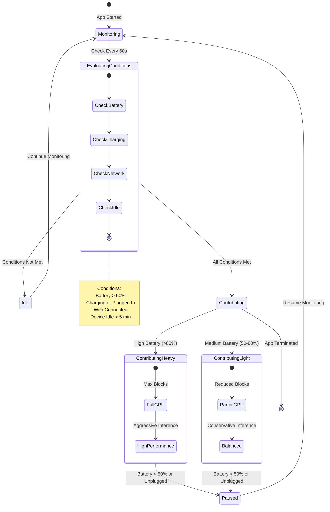
```mermaid
stateDiagram-v2
    [*] --> Monitoring: App Started

    Monitoring --> EvaluatingConditions: Check Every 60s

    state EvaluatingConditions {
        [*] --> CheckBattery
        CheckBattery --> CheckCharging
        CheckCharging --> CheckNetwork
        CheckNetwork --> CheckIdle
        CheckIdle --> [*]
    }

    EvaluatingConditions --> Idle: Conditions Not Met
    EvaluatingConditions --> Contributing: All Conditions Met

    note right of EvaluatingConditions
        Conditions:
        - Battery > 50%
        - Charging or Plugged In
        - WiFi Connected
        - Device Idle > 5 min
    end note

    Contributing --> ContributingHeavy: High Battery (>80%)
    Contributing --> ContributingLight: Medium Battery (50-80%)

    state ContributingHeavy {
        [*] --> FullGPU: Max Blocks
        FullGPU --> HighPerformance: Aggressive Inference
    }

    state ContributingLight {
        [*] --> PartialGPU: Reduced Blocks
        PartialGPU --> Balanced: Conservative Inference
    }

    ContributingHeavy --> Paused: Battery < 50% or Unplugged
    ContributingLight --> Paused: Battery < 50% or Unplugged

    Paused --> Monitoring: Resume Monitoring

    Idle --> Monitoring: Continue Monitoring

    Contributing --> [*]: App Terminated
```

### 5.3 iOS Background Processing Architecture

```mermaid
sequenceDiagram
    participant iOS as iOS System
    participant App
    participant BG as BGTaskScheduler
    participant Core as Rust Core
    participant Network as P2P Network

    iOS->>App: App Launched
    App->>BG: register(BGProcessingTask)

    Note over App,BG: Configure permitted background time<br/>Up to 30 seconds per execution

    App->>BG: schedule(task, earliest: 15min)
    App->>iOS: enterBackground()

    iOS->>BG: System decides to run task
    BG->>App: launchHandler(task)

    App->>App: check_contribution_conditions()

    alt Conditions Met (Charging + WiFi)
        App->>Core: initialize_minimal_mode()
        Core->>Network: connect_to_peers()

        loop While Time Remaining
            Network->>Core: receive_inference_request()
            Core->>Core: execute_inference()
            Core->>Network: send_results()

            App->>App: monitor_battery_and_time()

            alt Battery Low or Time Expired
                App->>Core: shutdown_gracefully()
                break
            end
        end

        App->>BG: task.setTaskCompleted(success: true)
    else Conditions Not Met
        App->>BG: task.setTaskCompleted(success: false)
    end

    BG->>App: Schedule Next Execution

    Note over iOS,Network: iOS provides up to 30s per task<br/>Maximum frequency: every 15 minutes<br/>Actual frequency: system decides
```

### 5.4 Android Foreground Service Architecture

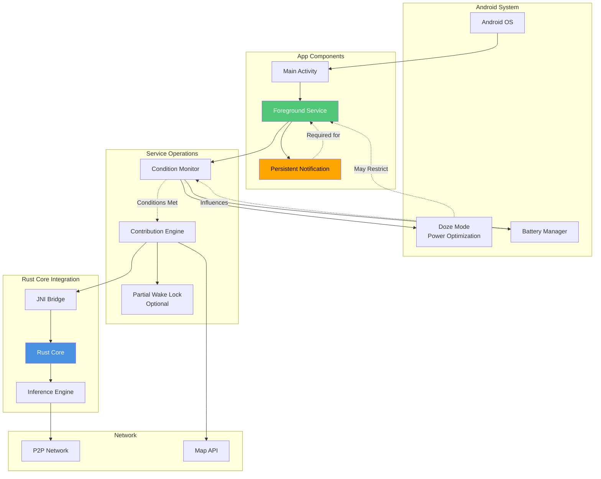
```mermaid
graph TB
    subgraph "Android System"
        System[Android OS]
        Doze[Doze Mode<br/>Power Optimization]
        Battery[Battery Manager]
    end

    subgraph "App Components"
        Activity[Main Activity]
        FGService[Foreground Service]
        Notification[Persistent Notification]
    end

    subgraph "Service Operations"
        Monitor[Condition Monitor]
        Contribution[Contribution Engine]
        WakeLock[Partial Wake Lock<br/>Optional]
    end

    subgraph "Rust Core Integration"
        JNI[JNI Bridge]
        Core[Rust Core]
        Inference[Inference Engine]
    end

    subgraph "Network"
        P2P[P2P Network]
        MapAPI[Map API]
    end

    System --> Activity
    Activity --> FGService
    FGService --> Notification

    Notification -.Required for.-> FGService

    FGService --> Monitor
    Monitor --> Battery
    Monitor --> Doze

    Monitor -.Conditions Met.-> Contribution
    Contribution --> WakeLock

    Contribution --> JNI
    JNI --> Core
    Core --> Inference

    Inference --> P2P
    Contribution --> MapAPI

    Doze -.May Restrict.-> FGService
    Battery -.Influences.-> Monitor

    style FGService fill:#50C878,color:#fff
    style Notification fill:#FFA500,color:#000
    style Core fill:#4A90E2,color:#fff
```

---

## Challenge 6: Environmental Gamification
### Prize Pool: 300,000 VDA Tokens

### 6.1 Environmental Intelligence Architecture

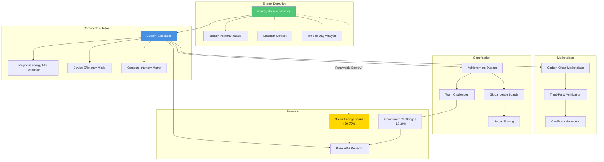
```mermaid
graph TB
    subgraph "Energy Detection"
        Detector[Energy Source Detector]
        BatteryMonitor[Battery Pattern Analyzer]
        LocationContext[Location Context]
        TimeAnalysis[Time-of-Day Analysis]
    end

    subgraph "Carbon Calculation"
        Calculator[Carbon Calculator]
        RegionalMix[Regional Energy Mix Database]
        DeviceEfficiency[Device Efficiency Model]
        ComputeIntensity[Compute Intensity Matrix]
    end

    subgraph "Marketplace"
        OffsetMarket[Carbon Offset Marketplace]
        Verification[Third-Party Verification]
        CertGen[Certificate Generator]
    end

    subgraph "Gamification"
        Achievements[Achievement System]
        Leaderboard[Global Leaderboards]
        SocialShare[Social Sharing]
        Challenges[Team Challenges]
    end

    subgraph "Rewards"
        BaseReward[Base VDA Rewards]
        GreenBonus[Green Energy Bonus<br/>+30-70%]
        CommunityBonus[Community Challenges<br/>+10-20%]
    end

    Detector --> BatteryMonitor
    Detector --> LocationContext
    Detector --> TimeAnalysis

    Detector --> Calculator

    Calculator --> RegionalMix
    Calculator --> DeviceEfficiency
    Calculator --> ComputeIntensity

    Calculator --> OffsetMarket
    OffsetMarket --> Verification
    Verification --> CertGen

    Calculator --> Achievements
    Achievements --> Leaderboard
    Leaderboard --> SocialShare
    Achievements --> Challenges

    Detector -.Renewable Energy?.-> GreenBonus
    Calculator --> BaseReward
    GreenBonus --> BaseReward
    Challenges --> CommunityBonus
    CommunityBonus --> BaseReward

    style Detector fill:#50C878,color:#fff
    style Calculator fill:#4A90E2,color:#fff
    style GreenBonus fill:#FFD700,color:#000
```

### 6.2 Renewable Energy Detection Flow

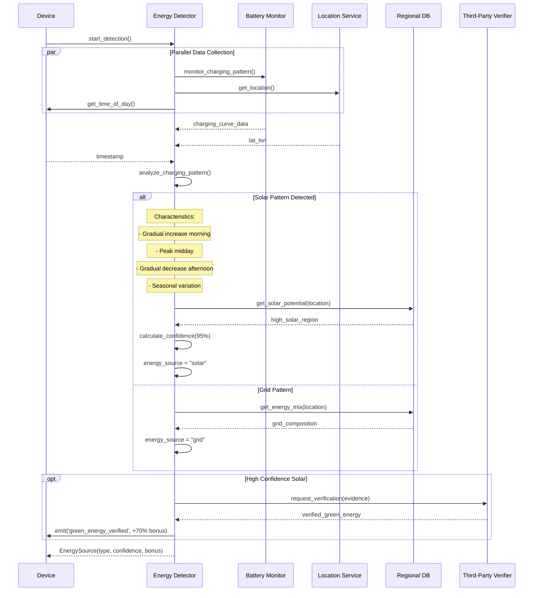
```mermaid
sequenceDiagram
    participant Device
    participant Detector as Energy Detector
    participant Battery as Battery Monitor
    participant Location as Location Service
    participant Regional as Regional DB
    participant Verifier as Third-Party Verifier

    Device->>Detector: start_detection()

    par Parallel Data Collection
        Detector->>Battery: monitor_charging_pattern()
        Detector->>Location: get_location()
        Detector->>Device: get_time_of_day()
    end

    Battery-->>Detector: charging_curve_data
    Location-->>Detector: lat_lon
    Device-->>Detector: timestamp

    Detector->>Detector: analyze_charging_pattern()

    alt Solar Pattern Detected
        Note over Detector: Characteristics:
        Note over Detector: - Gradual increase morning
        Note over Detector: - Peak midday
        Note over Detector: - Gradual decrease afternoon
        Note over Detector: - Seasonal variation

        Detector->>Regional: get_solar_potential(location)
        Regional-->>Detector: high_solar_region

        Detector->>Detector: calculate_confidence(95%)
        Detector->>Detector: energy_source = "solar"
    else Grid Pattern
        Detector->>Regional: get_energy_mix(location)
        Regional-->>Detector: grid_composition
        Detector->>Detector: energy_source = "grid"
    end

    opt High Confidence Solar
        Detector->>Verifier: request_verification(evidence)
        Verifier-->>Detector: verified_green_energy
        Detector->>Device: emit('green_energy_verified', +70% bonus)
    end

    Detector-->>Device: EnergySource(type, confidence, bonus)
```

### 6.3 Carbon Impact Calculation

```mermaid
graph TB
    subgraph "Input Data"
        Compute[Computation Job<br/>Duration, GPU/CPU, Blocks]
        Device[Device Info<br/>Type, Hardware]
        Energy[Energy Source<br/>Solar/Grid/Wind]
        Location[Geographic Location]
    end

    subgraph "Calculation Engine"
        PowerCalc[Power Consumption<br/>Calculation]
        EnergyMix[Regional Energy Mix<br/>gCO2/kWh]
        Efficiency[Device Efficiency<br/>Factor]
    end

    subgraph "Carbon Output"
        Total[Total Carbon<br/>gCO2]
        Breakdown[Breakdown<br/>Scope 1/2/3]
        Offset[Offset Required<br/>Carbon Credits]
    end

    subgraph "Actions"
        Display[Display to User]
        Marketplace[Offset Marketplace]
        Leaderboard[Update Leaderboard]
        Rewards[Calculate Bonus]
    end

    Compute --> PowerCalc
    Device --> PowerCalc
    Energy --> PowerCalc
    Location --> EnergyMix

    PowerCalc --> Total
    EnergyMix --> Total
    Efficiency --> Total

    Total --> Breakdown
    Breakdown --> Offset

    Total --> Display
    Offset --> Marketplace
    Total --> Leaderboard

    Energy -.Renewable?.-> Rewards
    Total --> Rewards

    style PowerCalc fill:#4A90E2,color:#fff
    style Total fill:#50C878,color:#fff
    style Rewards fill:#FFD700,color:#000
```

### 6.4 Gamification Achievement System

```mermaid
graph TB
    subgraph "Achievement Categories"
        Green[Green Energy]
        Carbon[Carbon Negative]
        Social[Social Impact]
        Milestones[Milestones]
    end

    subgraph "Green Energy Achievements"
        Solar100[100% Solar Week]
        GreenStreak[30-Day Green Streak]
        Pioneer[Regional Pioneer]
    end

    subgraph "Carbon Achievements"
        Neutral[Carbon Neutral]
        Negative[Carbon Negative]
        Offset100[100kg CO2 Offset]
    end

    subgraph "Social Achievements"
        Team[Team Captain]
        Referral[10 Referrals]
        Community[Community Leader]
    end

    subgraph "Milestone Achievements"
        First[First Contribution]
        Hours100[100 Hours]
        Models10[10 Models Served]
    end

    subgraph "Rewards"
        Badge[Digital Badges]
        VDABonus[VDA Bonus Rewards]
        Leaderboard[Leaderboard Position]
        NFT[Verifiable NFT Certificates]
    end

    Green --> Solar100
    Green --> GreenStreak
    Green --> Pioneer

    Carbon --> Neutral
    Carbon --> Negative
    Carbon --> Offset100

    Social --> Team
    Social --> Referral
    Social --> Community

    Milestones --> First
    Milestones --> Hours100
    Milestones --> Models10

    Solar100 --> Badge
    GreenStreak --> VDABonus
    Pioneer --> Leaderboard

    Negative --> VDABonus
    Offset100 --> NFT

    Team --> VDABonus
    Community --> Leaderboard

    style Solar100 fill:#FFD700,color:#000
    style GreenStreak fill:#FFD700,color:#000
    style Negative fill:#FFD700,color:#000
```

---

## Cross-Challenge Integration

### Overall System Integration

```mermaid
graph TB
    subgraph "Challenge 1: Core Engine"
        Core[Rust/WASM Core]
    end

    subgraph "Challenge 2: Verida Integration"
        Verida[Verida Layer]
    end

    subgraph "Challenge 3: Browser SDK"
        Browser[Browser SDK]
    end

    subgraph "Challenge 4: Compliance"
        Compliance[Compliance Tools]
    end

    subgraph "Challenge 5: Mobile"
        Mobile[Mobile Apps]
    end

    subgraph "Challenge 6: Environmental"
        Environmental[Environmental System]
    end

    Core --> Browser
    Core --> Mobile

    Verida --> Core
    Verida --> Browser
    Verida --> Mobile

    Compliance --> Verida
    Compliance --> Core

    Environmental --> Core
    Environmental --> Browser
    Environmental --> Mobile

    Browser --> Compliance
    Mobile --> Compliance

    style Core fill:#4A90E2,color:#fff
    style Verida fill:#50C878,color:#fff
    style Environmental fill:#FFD700,color:#000
```

---

## Related Documentation

- [Main Architecture](../ARCHITECTURE.md) - High-level system architecture
- [Hackathon Details](../HACKATHONS.md) - Challenge specifications and requirements
- [Data Flows](./DATA_FLOWS.md) - Authentication and data flow diagrams
- [Deployment Architecture](./DEPLOYMENT_ARCHITECTURE.md) - Platform-specific deployment patterns
- [Verida Architecture](./VERIDA_ARCHITECTURE.md) - Detailed Verida integration

---

**Document Status**: Draft - Technical Specification
**Next Review**: December 2025
**Maintainer**: KwaaiNet Architecture Team
