# Data Flows & Authentication Architecture
## Progressive Authentication, Personal Data Integration, and Token Economics

**Version**: 1.0
**Date**: November 20, 2025
**Status**: Technical Specification
**Related Documents**: [ARCHITECTURE.md](../ARCHITECTURE.md), [VERIDA_INTEGRATION.md](../VERIDA_INTEGRATION.md), [CHALLENGE_ARCHITECTURES.md](./CHALLENGE_ARCHITECTURES.md)

---

## Table of Contents

1. [Progressive Authentication](#progressive-authentication)
2. [Personal Data Integration](#personal-data-integration)
3. [VDA Token Economics](#vda-token-economics)
4. [Privacy-Preserving AI Inference](#privacy-preserving-ai-inference)
5. [Multi-Chain Identity](#multi-chain-identity)

---

## Progressive Authentication

### 1.1 Authentication Levels Overview

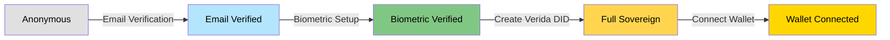

**Access Levels by Authentication State:**

| Level | Data Access | AI Capabilities | Rewards | Identity |
|-------|------------|----------------|---------|----------|
| **Anonymous** | None | Basic inference | None | Session only |
| **Email Verified** | Basic profile | Enhanced inference | 10% rewards | Email-based |
| **Biometric Verified** | Device storage | Personal AI | 50% rewards | Device-bound |
| **Full Sovereign** | Private datastore | Fully personal AI | 100% rewards | Self-sovereign DID |
| **Wallet Connected** | Multi-chain data | Premium AI | 100% + bonuses | Multi-chain verified |

### 1.2 Complete Authentication Flow

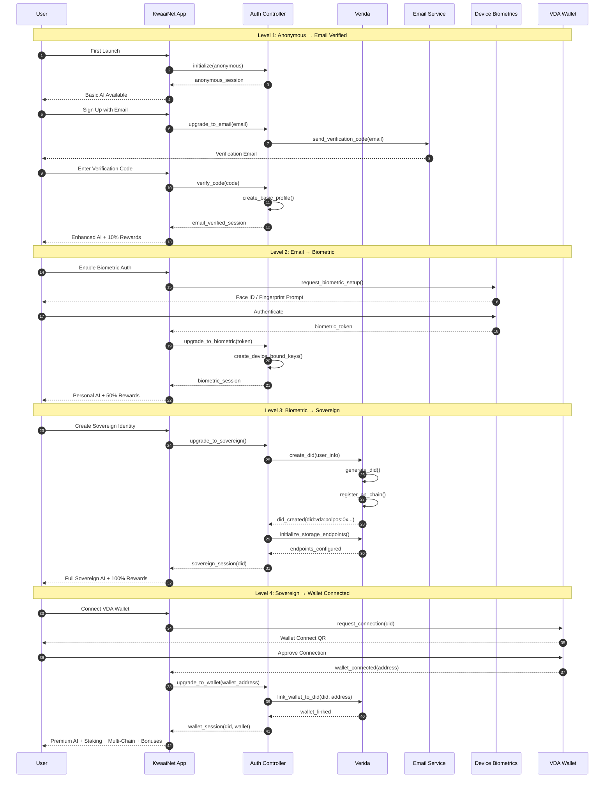

### 1.3 Authentication State Machine

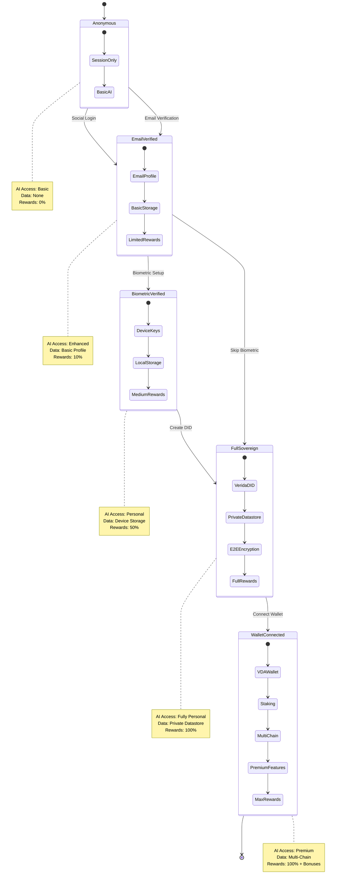

---

## Personal Data Integration

### 2.1 Multi-Source Personal Data Flow

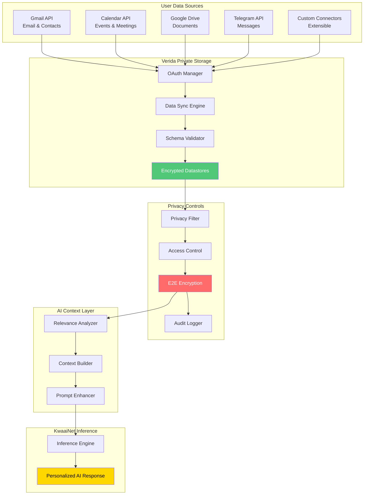

### 2.2 Personal Data Access Flow with Privacy Levels

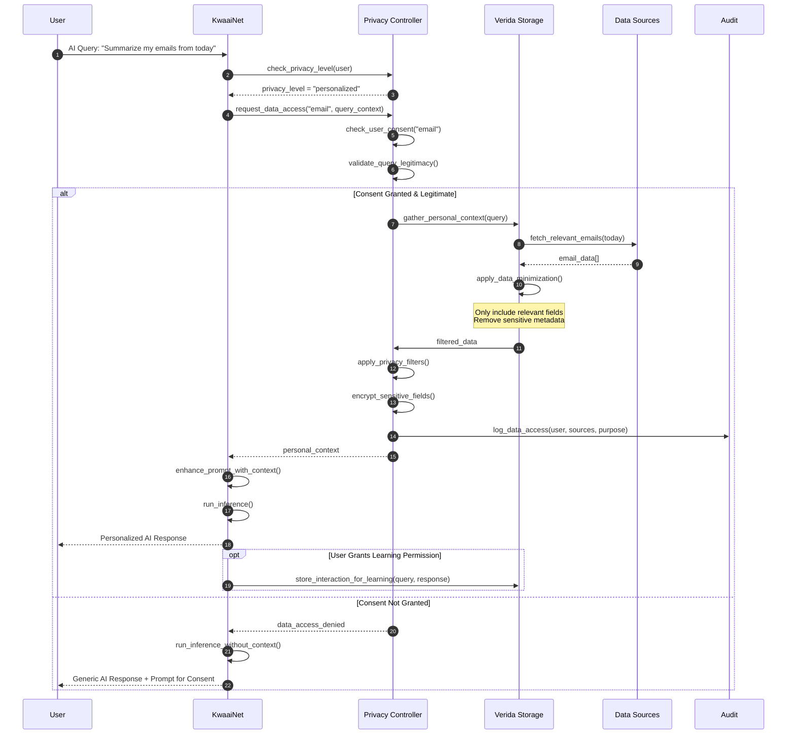

### 2.3 Data Minimization & Privacy Filtering

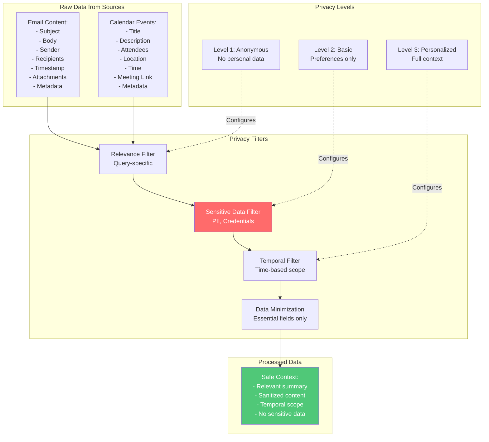

---

## VDA Token Economics

### 3.1 Triple Service Token Economy

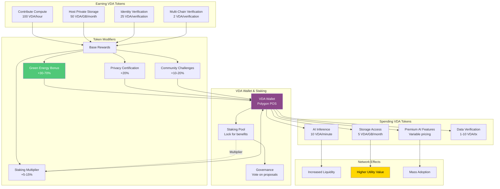

### 3.2 VDA Token Lifecycle Flow

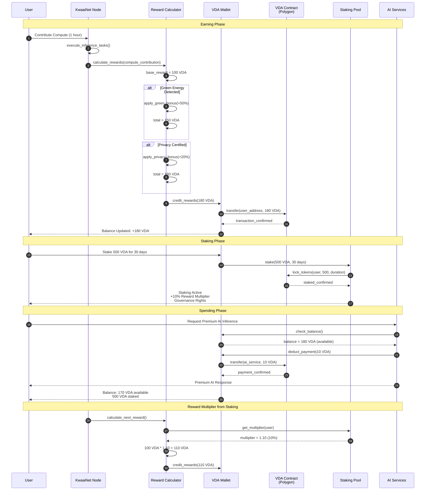

### 3.3 Economic Incentive Alignment

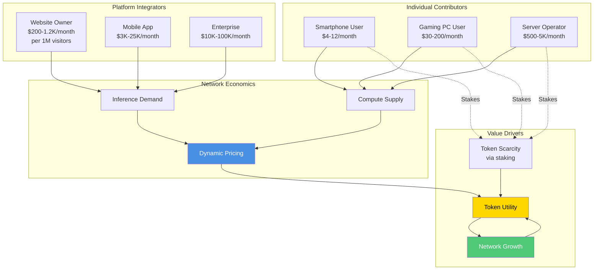

---

## Privacy-Preserving AI Inference

### 4.1 Privacy-Preserving Inference Architecture

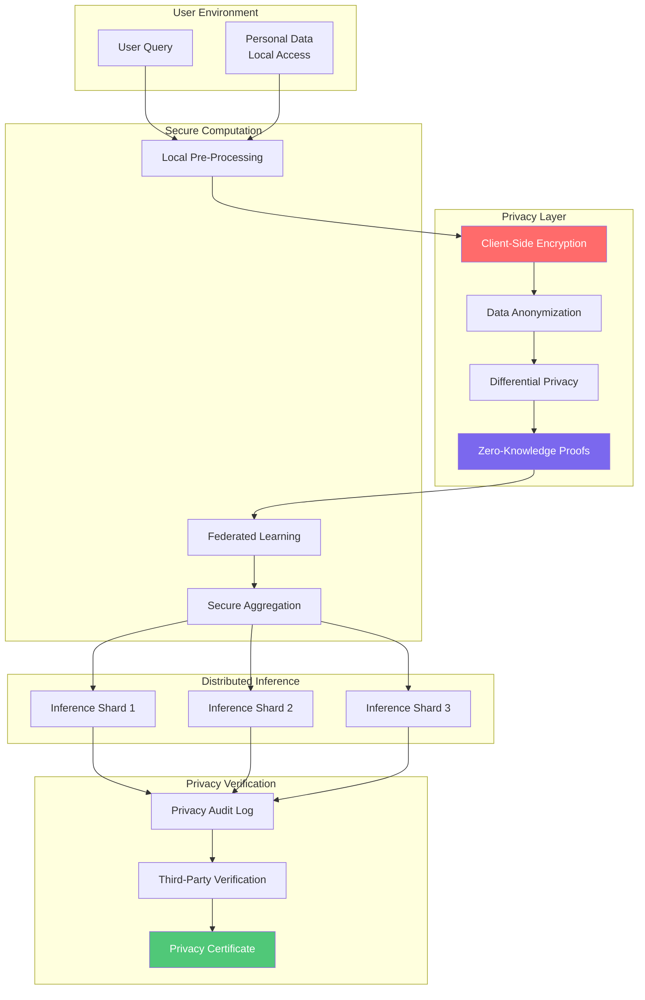

### 4.2 End-to-End Encrypted Inference Flow

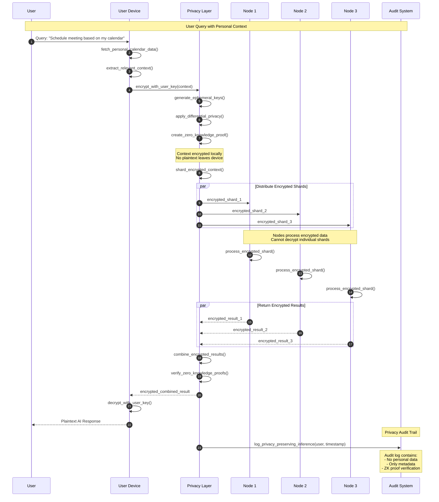

### 4.3 Privacy Level Configuration

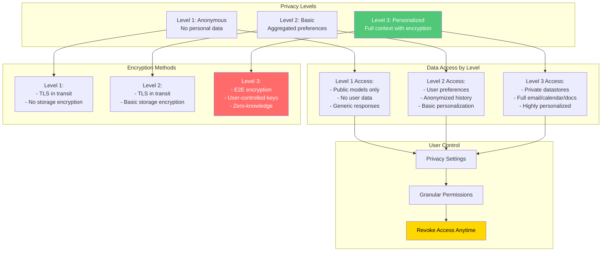

---

## Multi-Chain Identity

### 5.1 Multi-Chain Identity Architecture

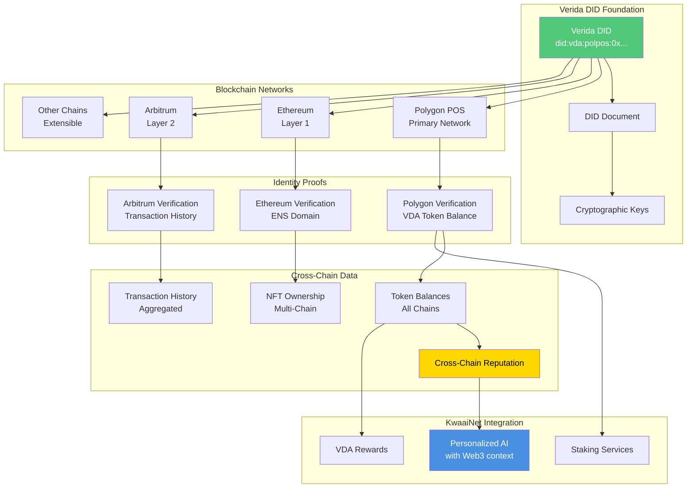

### 5.2 Cross-Chain Verification Flow

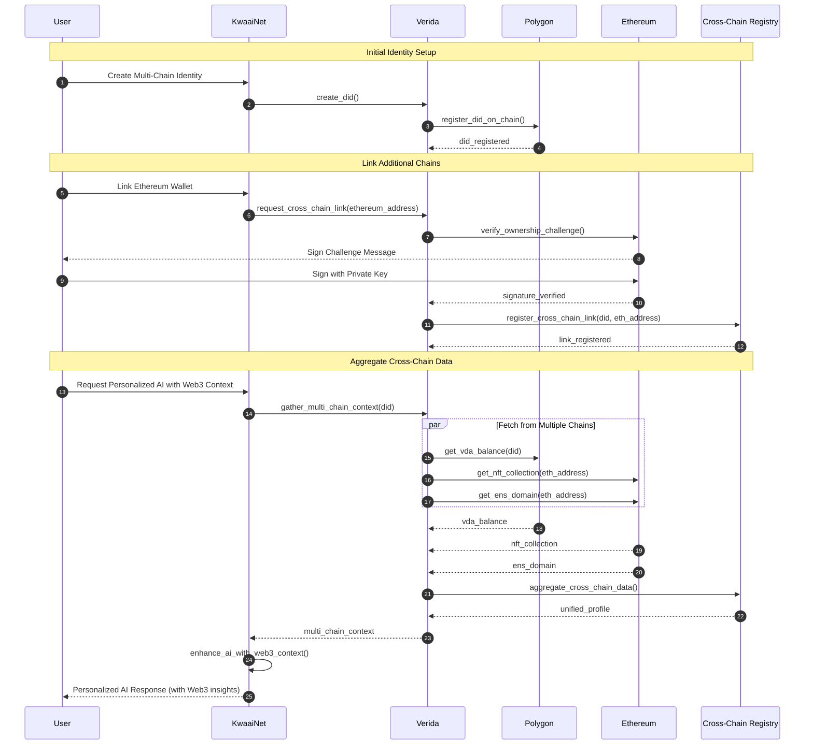

### 5.3 Identity Data Portability

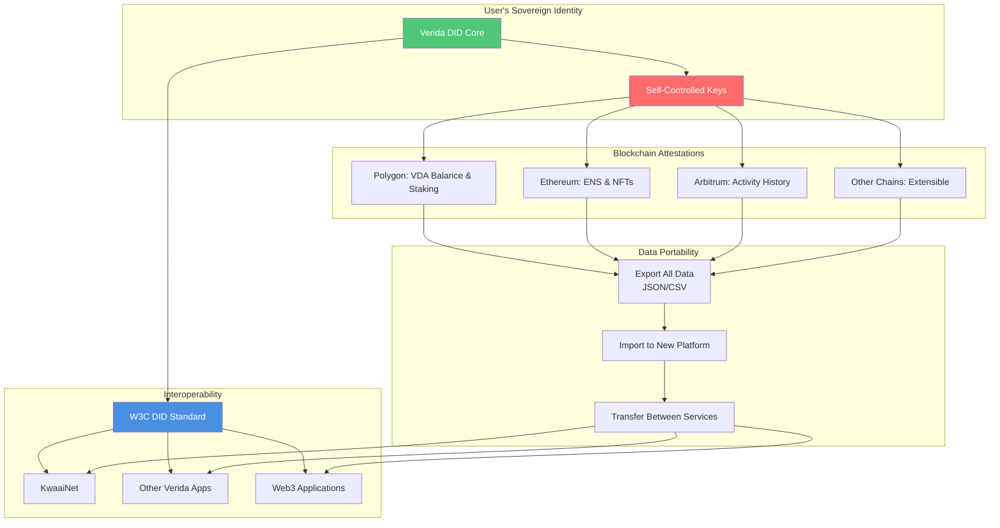

---

## Related Documentation

- [Main Architecture](../ARCHITECTURE.md) - High-level system architecture
- [Challenge Architectures](./CHALLENGE_ARCHITECTURES.md) - Detailed component diagrams
- [Verida Architecture](./VERIDA_ARCHITECTURE.md) - Deep dive into Verida integration
- [Deployment Architecture](./DEPLOYMENT_ARCHITECTURE.md) - Platform deployment patterns
- [Verida Integration Documentation](../docs/VERIDA_INTEGRATION.md) - Complete integration guide

---

**Document Status**: Draft - Technical Specification
**Next Review**: December 2025
**Maintainer**: KwaaiNet Architecture Team
