# Data Flows & Authentication Architecture
## Progressive Authentication, Personal Data Integration, and Privacy Patterns

**Version**: 2.0
**Date**: February 4, 2026
**Status**: Technical Specification
**Related Documents**: [ARCHITECTURE.md](../ARCHITECTURE.md), [VERIDA_INTEGRATION.md](../VERIDA_INTEGRATION.md), [CHALLENGE_ARCHITECTURES.md](./CHALLENGE_ARCHITECTURES.md)

---

## Table of Contents

1. [Progressive Authentication](#progressive-authentication)
2. [Personal Data Integration](#personal-data-integration)
3. [Privacy-Preserving AI Inference](#privacy-preserving-ai-inference)
4. [Multi-Chain Identity (Optional)](#multi-chain-identity)

---

## Progressive Authentication

### 1.1 Authentication Levels Overview

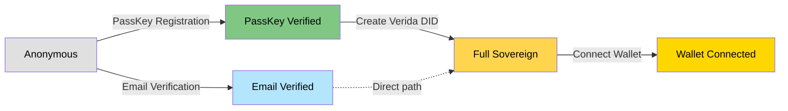

**Primary Path (Recommended):** Anonymous → PassKey → Sovereign → Wallet
**Legacy Path:** Anonymous → Email → Sovereign → Wallet

**Access Levels by Authentication State:**

| Level | Data Access | AI Capabilities | Identity | Security |
|-------|-------------|-----------------|----------|----------|
| **Anonymous** | None | Basic inference | Session only | None |
| **PassKey Verified** | Device + cloud sync | Personal AI | FIDO2 credential | Phishing-resistant |
| **Email Verified** *(legacy)* | Basic profile | Enhanced inference | Email-based | Medium |
| **Full Identity** | Private datastore | Fully personal AI | Self-sovereign DID | High |
| **Optional Wallet** | Multi-chain data (optional) | Full features | Multi-chain verified | Maximum |

### 1.2 PassKey Technology Overview

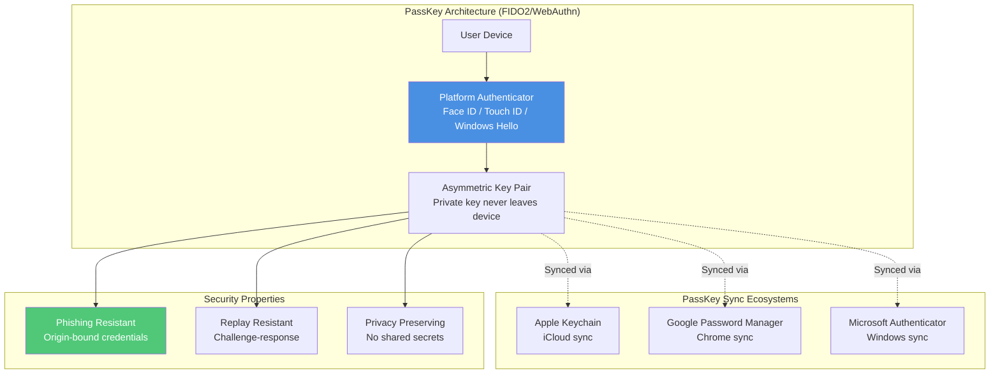

### 1.3 Complete Authentication Flow (Primary Path with PassKeys)

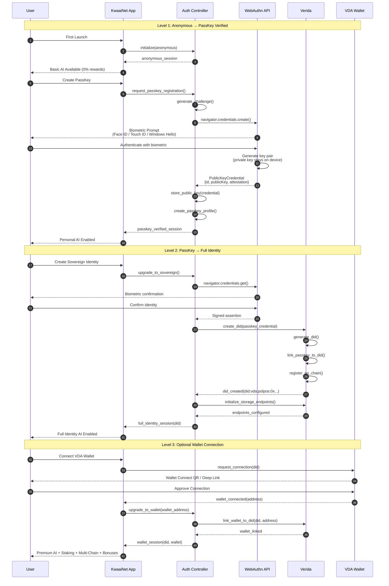

### 1.4 Legacy Authentication Flow (Email Fallback)

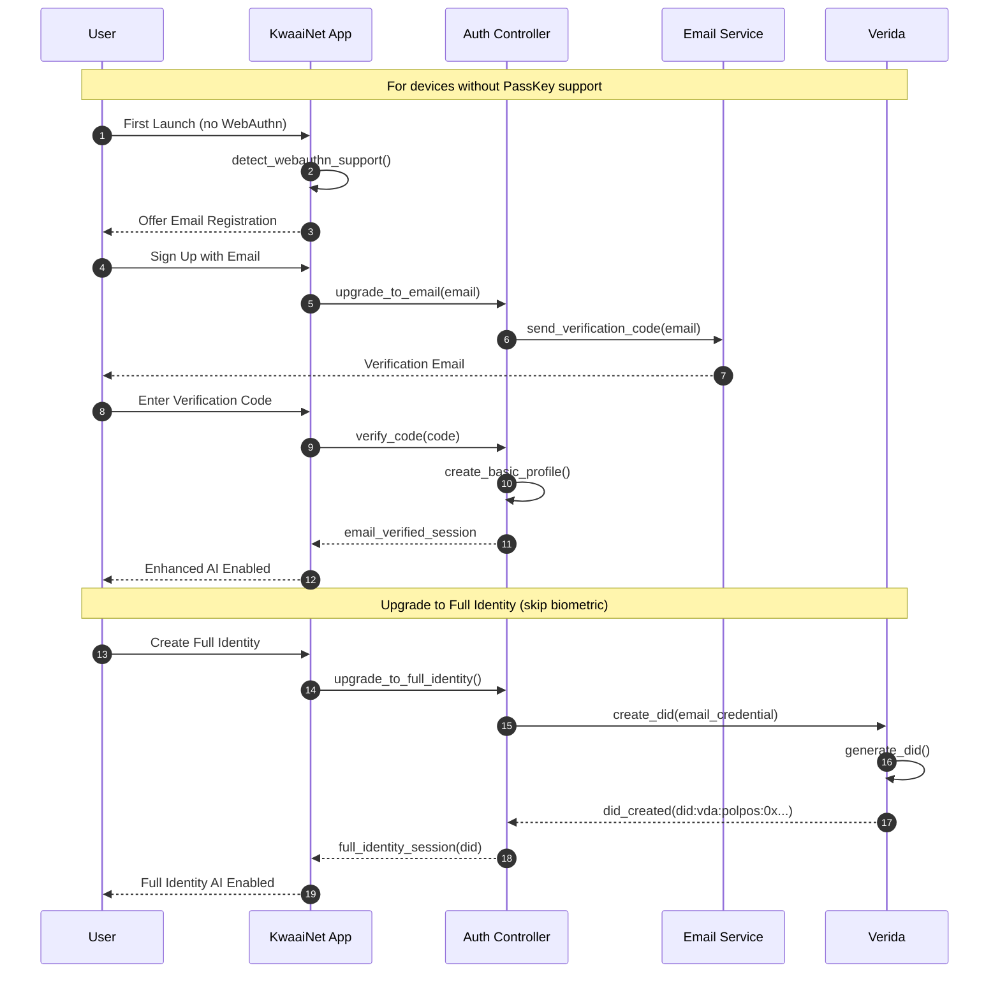

### 1.5 Authentication State Machine

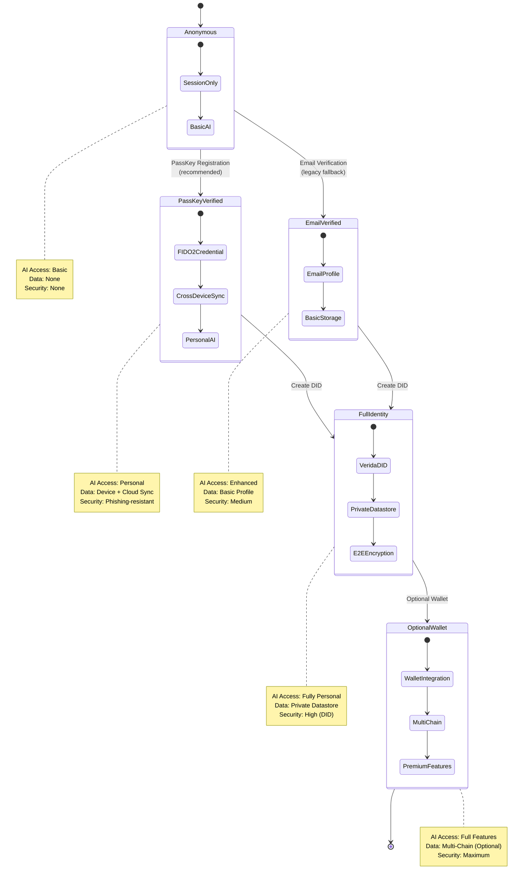

### 1.6 PassKey Registration & Authentication Detail

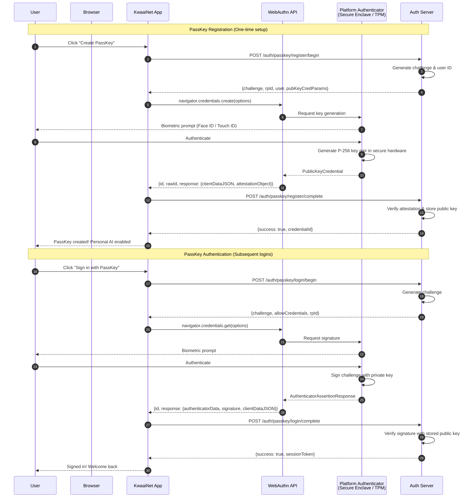

---

## Personal Data Integration

### 2.1 Multi-Source Personal Data Flow

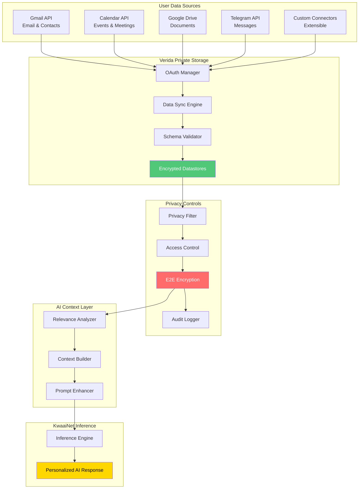

### 2.2 Personal Data Access Flow with Privacy Levels

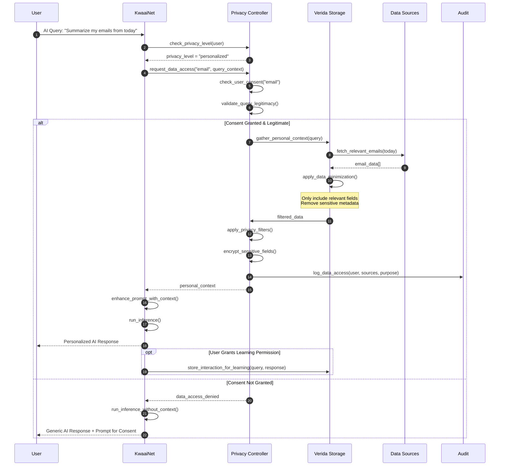

### 2.3 Data Minimization & Privacy Filtering

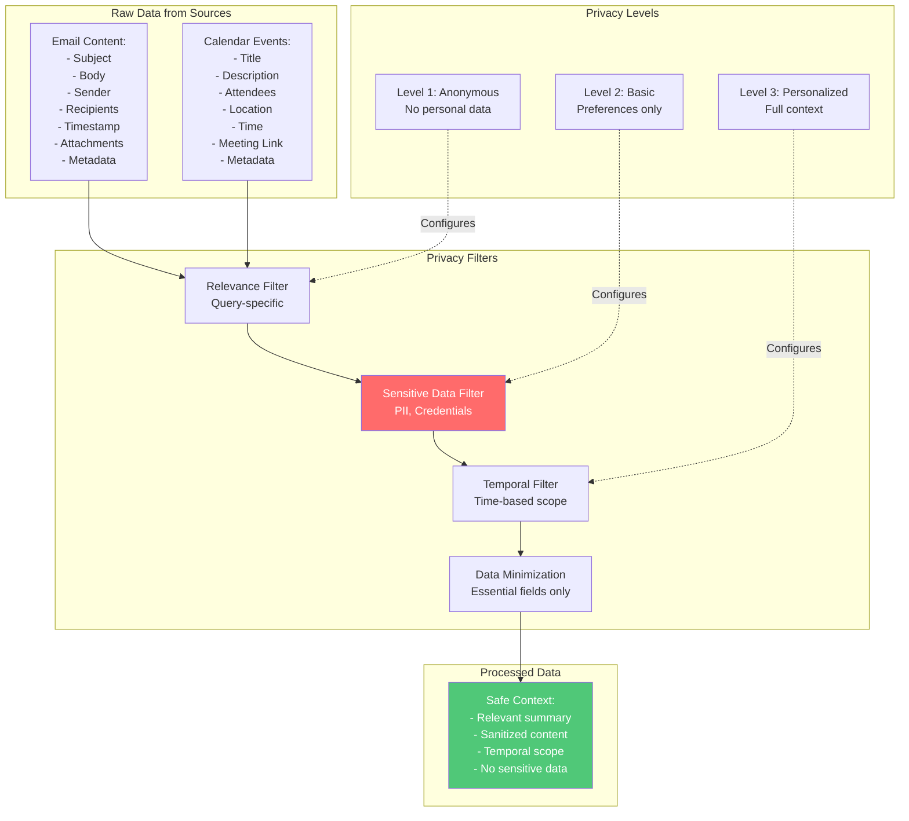

---

## Privacy-Preserving AI Inference

### 4.1 Privacy-Preserving Inference Architecture

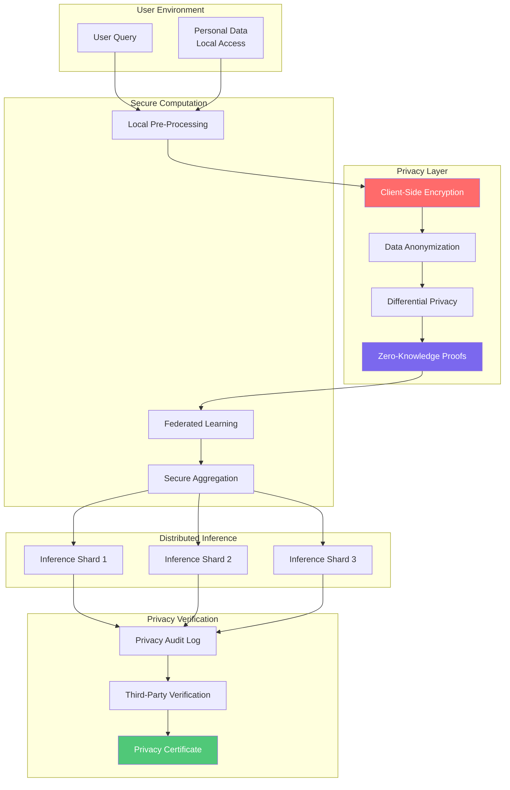

### 4.2 End-to-End Encrypted Inference Flow

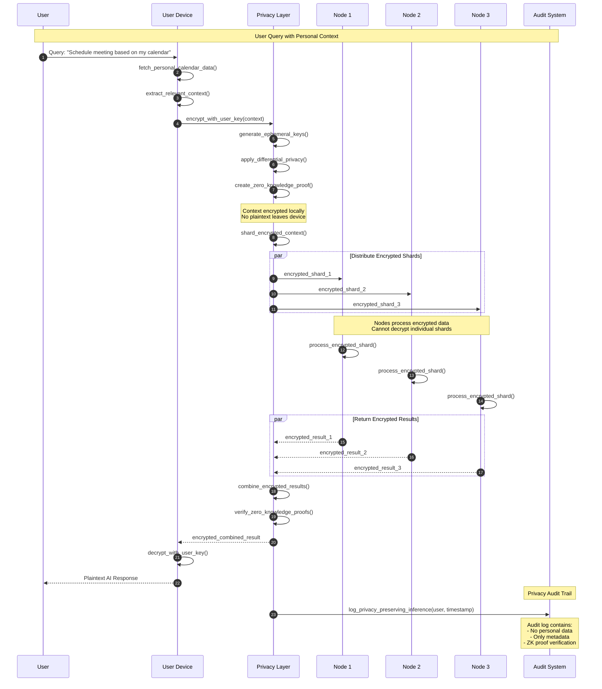

### 4.3 Privacy Level Configuration

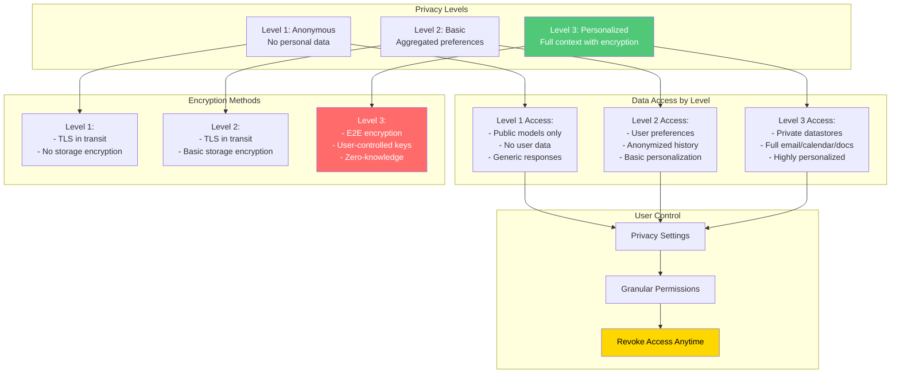

---

## Multi-Chain Identity

### 5.1 Multi-Chain Identity Architecture

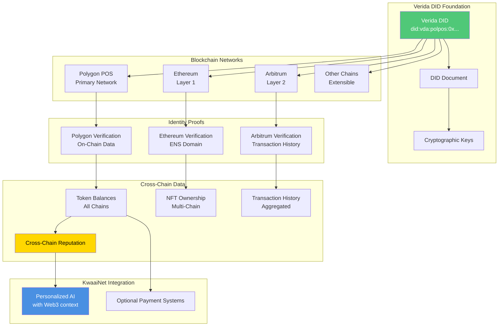

### 5.2 Cross-Chain Verification Flow

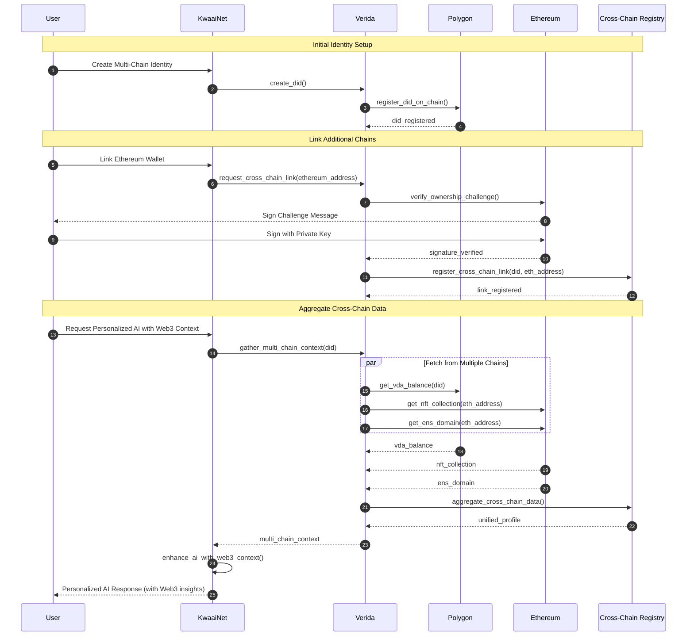

### 5.3 Identity Data Portability

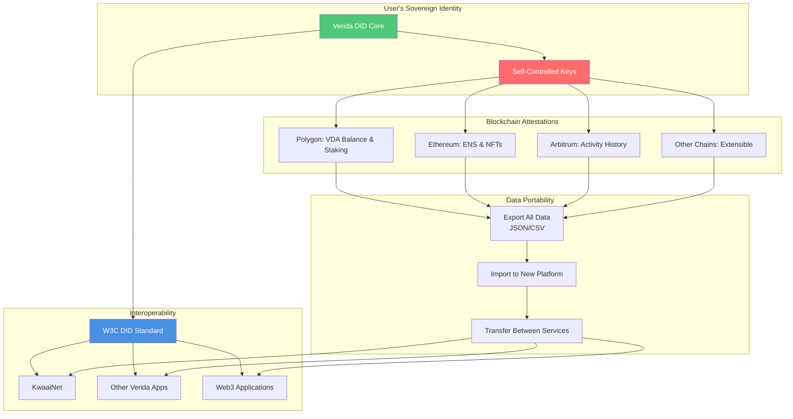

---

## Related Documentation

- [Main Architecture](../ARCHITECTURE.md) - High-level system architecture
- [Challenge Architectures](./CHALLENGE_ARCHITECTURES.md) - Detailed component diagrams
- [Verida Architecture](./VERIDA_ARCHITECTURE.md) - Deep dive into Verida integration
- [Deployment Architecture](./DEPLOYMENT_ARCHITECTURE.md) - Platform deployment patterns
- [Verida Integration Documentation](../docs/VERIDA_INTEGRATION.md) - Complete integration guide

---

**Document Status**: Draft - Technical Specification
**Next Review**: December 2025
**Maintainer**: KwaaiNet Architecture Team
