# Deployment Architecture
## Platform-Specific Deployment Patterns for KwaaiNet

**Version**: 1.0
**Date**: November 20, 2025
**Status**: Technical Specification
**Related Documents**: [ARCHITECTURE.md](../ARCHITECTURE.md), [MASS_ADOPTION_STRATEGY.md](../MASS_ADOPTION_STRATEGY.md)

---

## Table of Contents

1. [Browser Deployment](#browser-deployment)
2. [Mobile Deployment](#mobile-deployment)
3. [Desktop Deployment](#desktop-deployment)
4. [Edge Device Deployment](#edge-device-deployment)
5. [Enterprise/Server Deployment](#enterpriseserver-deployment)
6. [Deployment Decision Matrix](#deployment-decision-matrix)

---

## Browser Deployment

### 1.1 Browser Deployment Architecture

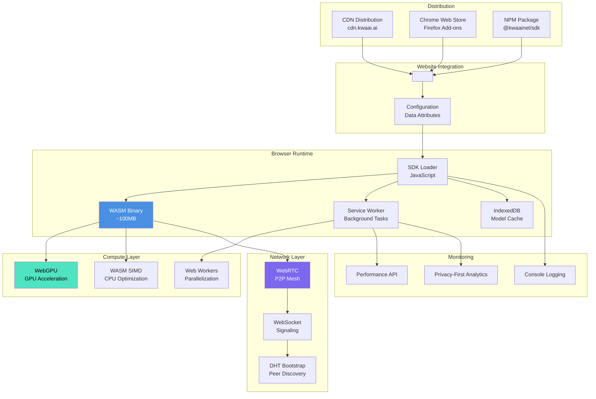
```mermaid
graph TB
    subgraph "Distribution"
        CDN[CDN Distribution<br/>cdn.kwaai.ai]
        WebStore[Chrome Web Store<br/>Firefox Add-ons]
        NPM[NPM Package<br/>@kwaainet/sdk]
    end

    subgraph "Website Integration"
        Script[<script> Tag<br/>One-Line Integration]
        Config[Configuration<br/>Data Attributes]
    end

    subgraph "Browser Runtime"
        Loader[SDK Loader<br/>JavaScript]
        WASM[WASM Binary<br/>~100MB]
        Worker[Service Worker<br/>Background Tasks]
        IndexedDB[IndexedDB<br/>Model Cache]
    end

    subgraph "Compute Layer"
        WebGPU[WebGPU<br/>GPU Acceleration]
        SIMD[WASM SIMD<br/>CPU Optimization]
        Threads[Web Workers<br/>Parallelization]
    end

    subgraph "Network Layer"
        WebRTC[WebRTC<br/>P2P Mesh]
        WS[WebSocket<br/>Signaling]
        DHT[DHT Bootstrap<br/>Peer Discovery]
    end

    subgraph "Monitoring"
        Perf[Performance API]
        Console[Console Logging]
        Analytics[Privacy-First Analytics]
    end

    CDN --> Script
    WebStore --> Script
    NPM --> Script

    Script --> Config
    Config --> Loader

    Loader --> WASM
    Loader --> Worker
    Loader --> IndexedDB

    WASM --> WebGPU
    WASM --> SIMD
    Worker --> Threads

    WASM --> WebRTC
    WebRTC --> WS
    WS --> DHT

    Worker --> Perf
    Loader --> Console
    Worker --> Analytics

    style WASM fill:#4A90E2,color:#fff
    style WebGPU fill:#50E3C2,color:#000
    style WebRTC fill:#7B68EE,color:#fff
```

### 1.2 Browser Extension Deployment

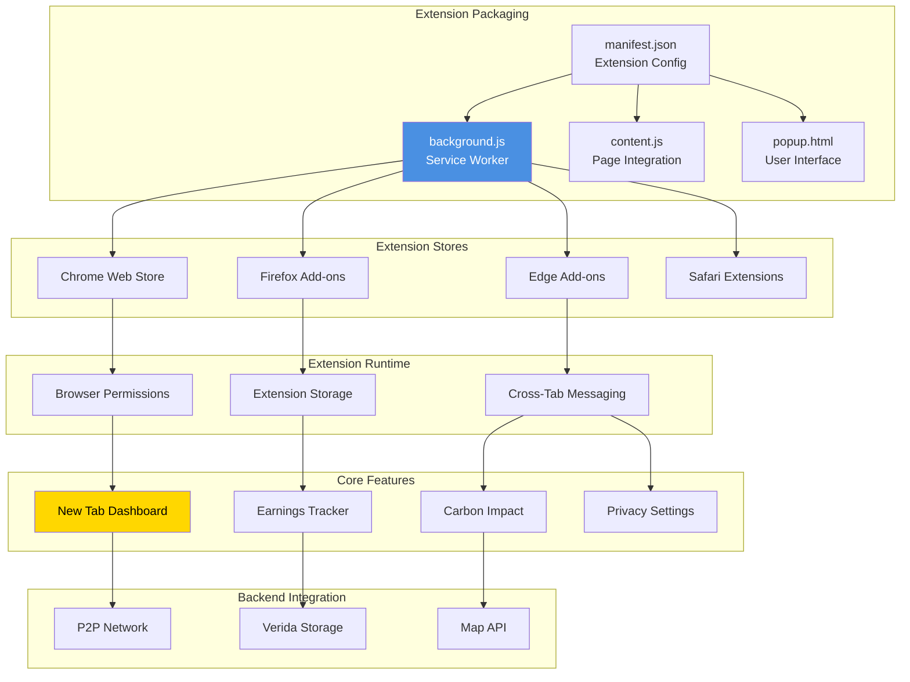
```mermaid
graph TB
    subgraph "Extension Packaging"
        Manifest[manifest.json<br/>Extension Config]
        Background[background.js<br/>Service Worker]
        Content[content.js<br/>Page Integration]
        Popup[popup.html<br/>User Interface]
    end

    subgraph "Extension Stores"
        Chrome[Chrome Web Store]
        Firefox[Firefox Add-ons]
        Edge[Edge Add-ons]
        Safari[Safari Extensions]
    end

    subgraph "Extension Runtime"
        Permissions[Browser Permissions]
        Storage[Extension Storage]
        Messaging[Cross-Tab Messaging]
    end

    subgraph "Core Features"
        Dashboard[New Tab Dashboard]
        Earnings[Earnings Tracker]
        Carbon[Carbon Impact]
        Settings[Privacy Settings]
    end

    subgraph "Backend Integration"
        P2P[P2P Network]
        Verida[Verida Storage]
        MapAPI[Map API]
    end

    Manifest --> Background
    Manifest --> Content
    Manifest --> Popup

    Background --> Chrome
    Background --> Firefox
    Background --> Edge
    Background --> Safari

    Chrome --> Permissions
    Firefox --> Storage
    Edge --> Messaging

    Permissions --> Dashboard
    Storage --> Earnings
    Messaging --> Carbon
    Messaging --> Settings

    Dashboard --> P2P
    Earnings --> Verida
    Carbon --> MapAPI

    style Background fill:#4A90E2,color:#fff
    style Dashboard fill:#FFD700,color:#000
```

### 1.3 Browser Deployment Flow

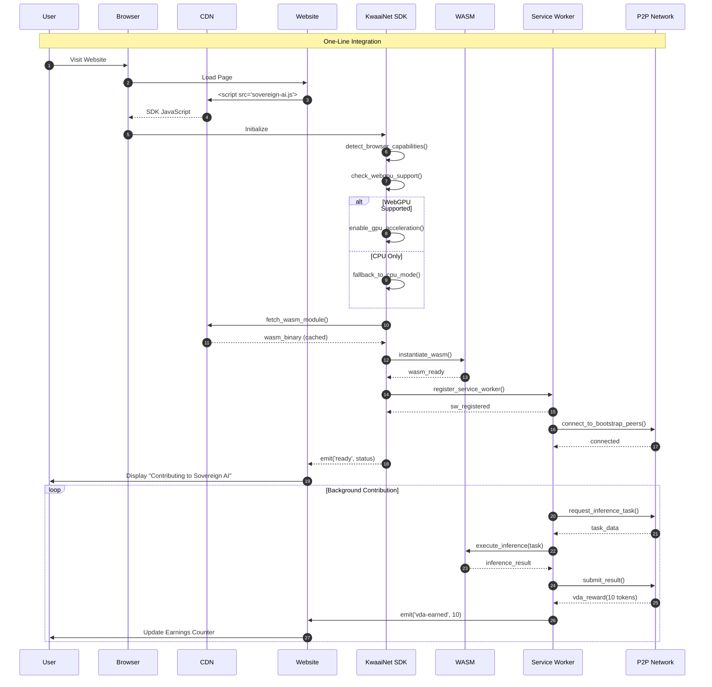
```mermaid
sequenceDiagram
    autonumber
    participant User
    participant Browser
    participant CDN
    participant Website
    participant SDK as KwaaiNet SDK
    participant WASM
    participant Worker as Service Worker
    participant Network as P2P Network

    Note over User,Network: One-Line Integration

    User->>Browser: Visit Website
    Browser->>Website: Load Page
    Website->>CDN: <script src="sovereign-ai.js">
    CDN-->>Browser: SDK JavaScript

    Browser->>SDK: Initialize
    SDK->>SDK: detect_browser_capabilities()
    SDK->>SDK: check_webgpu_support()

    alt WebGPU Supported
        SDK->>SDK: enable_gpu_acceleration()
    else CPU Only
        SDK->>SDK: fallback_to_cpu_mode()
    end

    SDK->>CDN: fetch_wasm_module()
    CDN-->>SDK: wasm_binary (cached)

    SDK->>WASM: instantiate_wasm()
    WASM-->>SDK: wasm_ready

    SDK->>Worker: register_service_worker()
    Worker-->>SDK: sw_registered

    Worker->>Network: connect_to_bootstrap_peers()
    Network-->>Worker: connected

    SDK-->>Website: emit('ready', status)
    Website->>User: Display "Contributing to Sovereign AI"

    loop Background Contribution
        Worker->>Network: request_inference_task()
        Network-->>Worker: task_data
        Worker->>WASM: execute_inference(task)
        WASM-->>Worker: inference_result
        Worker->>Network: submit_result()
        Network-->>Worker: vda_reward(10 tokens)
        Worker->>Website: emit('vda-earned', 10)
        Website->>User: Update Earnings Counter
    end
```

---

## Mobile Deployment

### 2.1 iOS Deployment Architecture

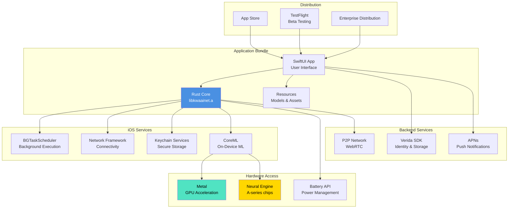
```mermaid
graph TB
    subgraph "Distribution"
        AppStore[App Store]
        TestFlight[TestFlight<br/>Beta Testing]
        Enterprise[Enterprise Distribution]
    end

    subgraph "Application Bundle"
        SwiftUI[SwiftUI App<br/>User Interface]
        RustCore[Rust Core<br/>libkwaainet.a]
        Resources[Resources<br/>Models & Assets]
    end

    subgraph "iOS Services"
        BGTask[BGTaskScheduler<br/>Background Execution]
        Network[Network Framework<br/>Connectivity]
        Keychain[Keychain Services<br/>Secure Storage]
        CoreML[CoreML<br/>On-Device ML]
    end

    subgraph "Hardware Access"
        Metal[Metal<br/>GPU Acceleration]
        NeuralEngine[Neural Engine<br/>A-series chips]
        BatteryAPI[Battery API<br/>Power Management]
    end

    subgraph "Backend Services"
        P2P[P2P Network<br/>WebRTC]
        Verida[Verida SDK<br/>Identity & Storage]
        Push[APNs<br/>Push Notifications]
    end

    AppStore --> SwiftUI
    TestFlight --> SwiftUI
    Enterprise --> SwiftUI

    SwiftUI --> RustCore
    SwiftUI --> Resources

    RustCore --> BGTask
    RustCore --> Network
    RustCore --> Keychain
    RustCore --> CoreML

    CoreML --> Metal
    CoreML --> NeuralEngine
    RustCore --> BatteryAPI

    RustCore --> P2P
    SwiftUI --> Verida
    SwiftUI --> Push

    style RustCore fill:#4A90E2,color:#fff
    style Metal fill:#50E3C2,color:#000
    style NeuralEngine fill:#FFD700,color:#000
```

### 2.2 Android Deployment Architecture

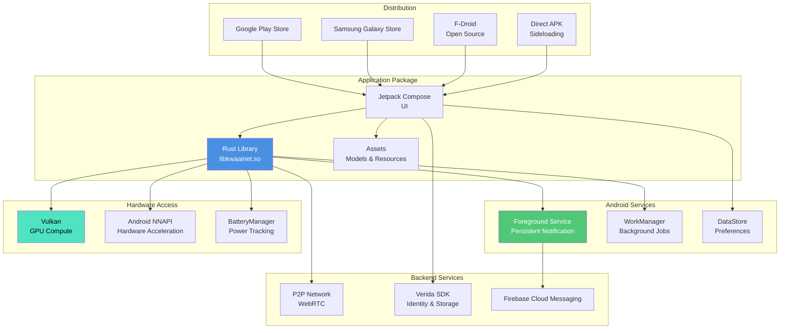
```mermaid
graph TB
    subgraph "Distribution"
        PlayStore[Google Play Store]
        GalaxyStore[Samsung Galaxy Store]
        FDroid[F-Droid<br/>Open Source]
        APK[Direct APK<br/>Sideloading]
    end

    subgraph "Application Package"
        Compose[Jetpack Compose<br/>UI]
        RustLib[Rust Library<br/>libkwaainet.so]
        Assets[Assets<br/>Models & Resources]
    end

    subgraph "Android Services"
        FGService[Foreground Service<br/>Persistent Notification]
        WorkManager[WorkManager<br/>Background Jobs]
        DataStore[DataStore<br/>Preferences]
    end

    subgraph "Hardware Access"
        Vulkan[Vulkan<br/>GPU Compute]
        NNAPI[Android NNAPI<br/>Hardware Acceleration]
        BatteryManager[BatteryManager<br/>Power Tracking]
    end

    subgraph "Backend Services"
        P2P[P2P Network<br/>WebRTC]
        Verida[Verida SDK<br/>Identity & Storage]
        FCM[Firebase Cloud Messaging]
    end

    PlayStore --> Compose
    GalaxyStore --> Compose
    FDroid --> Compose
    APK --> Compose

    Compose --> RustLib
    Compose --> Assets

    RustLib --> FGService
    RustLib --> WorkManager
    Compose --> DataStore

    RustLib --> Vulkan
    RustLib --> NNAPI
    RustLib --> BatteryManager

    RustLib --> P2P
    Compose --> Verida
    FGService --> FCM

    style RustLib fill:#4A90E2,color:#fff
    style FGService fill:#50C878,color:#fff
    style Vulkan fill:#50E3C2,color:#000
```

### 2.3 Mobile Battery-Aware Deployment

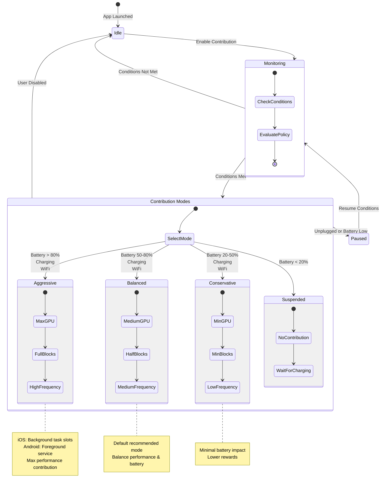
```mermaid
stateDiagram-v2
    [*] --> Idle: App Launched

    Idle --> Monitoring: Enable Contribution

    state Monitoring {
        [*] --> CheckConditions
        CheckConditions --> EvaluatePolicy
        EvaluatePolicy --> [*]
    }

    Monitoring --> Idle: Conditions Not Met

    state "Contribution Modes" as ContribModes {
        [*] --> SelectMode

        state SelectMode <<choice>>
        SelectMode --> Aggressive: Battery > 80%<br/>Charging<br/>WiFi
        SelectMode --> Balanced: Battery 50-80%<br/>Charging<br/>WiFi
        SelectMode --> Conservative: Battery 20-50%<br/>Charging<br/>WiFi
        SelectMode --> Suspended: Battery < 20%

        state Aggressive {
            [*] --> MaxGPU
            MaxGPU --> FullBlocks
            FullBlocks --> HighFrequency
        }

        state Balanced {
            [*] --> MediumGPU
            MediumGPU --> HalfBlocks
            HalfBlocks --> MediumFrequency
        }

        state Conservative {
            [*] --> MinGPU
            MinGPU --> MinBlocks
            MinBlocks --> LowFrequency
        }

        state Suspended {
            [*] --> NoContribution
            NoContribution --> WaitForCharging
        }
    }

    Monitoring --> ContribModes: Conditions Met

    ContribModes --> Paused: Unplugged or Battery Low
    ContribModes --> Idle: User Disabled

    Paused --> Monitoring: Resume Conditions

    note right of Aggressive
        iOS: Background task slots
        Android: Foreground service
        Max performance contribution
    end note

    note right of Balanced
        Default recommended mode
        Balance performance & battery
    end note

    note right of Conservative
        Minimal battery impact
        Lower rewards
    end note
```

---

## Desktop Deployment

### 3.1 Desktop Deployment Architecture

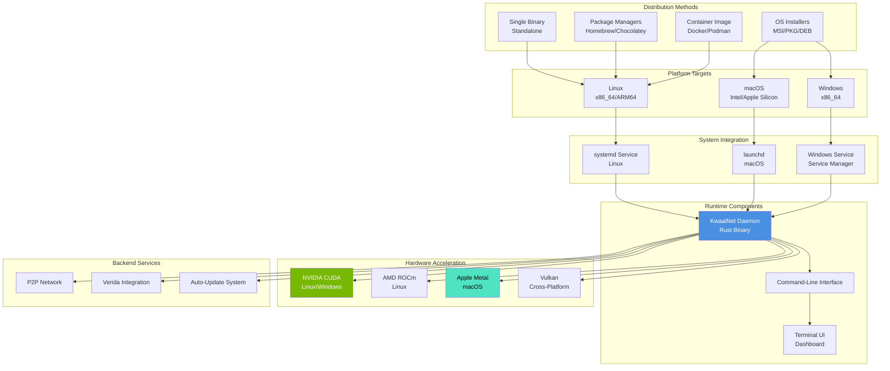
```mermaid
graph TB
    subgraph "Distribution Methods"
        Binary[Single Binary<br/>Standalone]
        Installer[OS Installers<br/>MSI/PKG/DEB]
        Package[Package Managers<br/>Homebrew/Chocolatey]
        Container[Container Image<br/>Docker/Podman]
    end

    subgraph "Platform Targets"
        Linux[Linux<br/>x86_64/ARM64]
        MacOS[macOS<br/>Intel/Apple Silicon]
        Windows[Windows<br/>x86_64]
    end

    subgraph "System Integration"
        Systemd[systemd Service<br/>Linux]
        Launchd[launchd<br/>macOS]
        WinService[Windows Service<br/>Service Manager]
    end

    subgraph "Runtime Components"
        Daemon[KwaaiNet Daemon<br/>Rust Binary]
        CLI[Command-Line Interface]
        TUI[Terminal UI<br/>Dashboard]
    end

    subgraph "Hardware Acceleration"
        CUDA[NVIDIA CUDA<br/>Linux/Windows]
        ROCm[AMD ROCm<br/>Linux]
        Metal[Apple Metal<br/>macOS]
        Vulkan[Vulkan<br/>Cross-Platform]
    end

    subgraph "Backend Services"
        P2P[P2P Network]
        Verida[Verida Integration]
        Updates[Auto-Update System]
    end

    Binary --> Linux
    Installer --> MacOS
    Installer --> Windows
    Package --> Linux
    Container --> Linux

    Linux --> Systemd
    MacOS --> Launchd
    Windows --> WinService

    Systemd --> Daemon
    Launchd --> Daemon
    WinService --> Daemon

    Daemon --> CLI
    CLI --> TUI

    Daemon --> CUDA
    Daemon --> ROCm
    Daemon --> Metal
    Daemon --> Vulkan

    Daemon --> P2P
    Daemon --> Verida
    Daemon --> Updates

    style Daemon fill:#4A90E2,color:#fff
    style CUDA fill:#76B900,color:#fff
    style Metal fill:#50E3C2,color:#000
```

### 3.2 Cross-Platform Desktop Daemon

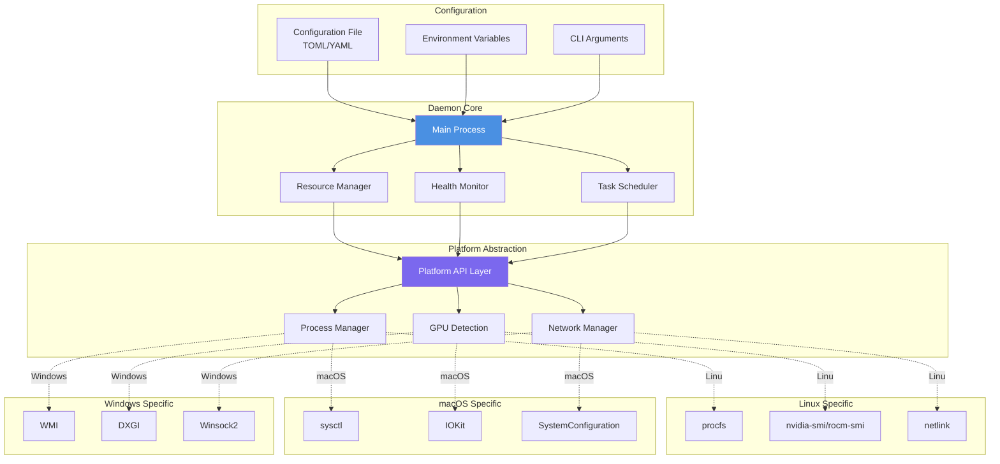
```mermaid
graph TB
    subgraph "Configuration"
        Config[Configuration File<br/>TOML/YAML]
        Env[Environment Variables]
        CLI_Args[CLI Arguments]
    end

    subgraph "Daemon Core"
        Main[Main Process]
        Resource[Resource Manager]
        Health[Health Monitor]
        Scheduler[Task Scheduler]
    end

    subgraph "Platform Abstraction"
        PlatformAPI[Platform API Layer]
        ProcessMgr[Process Manager]
        GPUDetect[GPU Detection]
        NetworkMgr[Network Manager]
    end

    subgraph "Linux Specific"
        LinuxProc[procfs]
        LinuxGPU[nvidia-smi/rocm-smi]
        LinuxNet[netlink]
    end

    subgraph "macOS Specific"
        DarwinSysctl[sysctl]
        DarwinIOKit[IOKit]
        DarwinNet[SystemConfiguration]
    end

    subgraph "Windows Specific"
        WinWMI[WMI]
        WinDXGI[DXGI]
        WinWSock[Winsock2]
    end

    Config --> Main
    Env --> Main
    CLI_Args --> Main

    Main --> Resource
    Main --> Health
    Main --> Scheduler

    Resource --> PlatformAPI
    Health --> PlatformAPI
    Scheduler --> PlatformAPI

    PlatformAPI --> ProcessMgr
    PlatformAPI --> GPUDetect
    PlatformAPI --> NetworkMgr

    ProcessMgr -.Linux.-> LinuxProc
    GPUDetect -.Linux.-> LinuxGPU
    NetworkMgr -.Linux.-> LinuxNet

    ProcessMgr -.macOS.-> DarwinSysctl
    GPUDetect -.macOS.-> DarwinIOKit
    NetworkMgr -.macOS.-> DarwinNet

    ProcessMgr -.Windows.-> WinWMI
    GPUDetect -.Windows.-> WinDXGI
    NetworkMgr -.Windows.-> WinWSock

    style Main fill:#4A90E2,color:#fff
    style PlatformAPI fill:#7B68EE,color:#fff
```

### 3.3 Desktop Auto-Update Flow

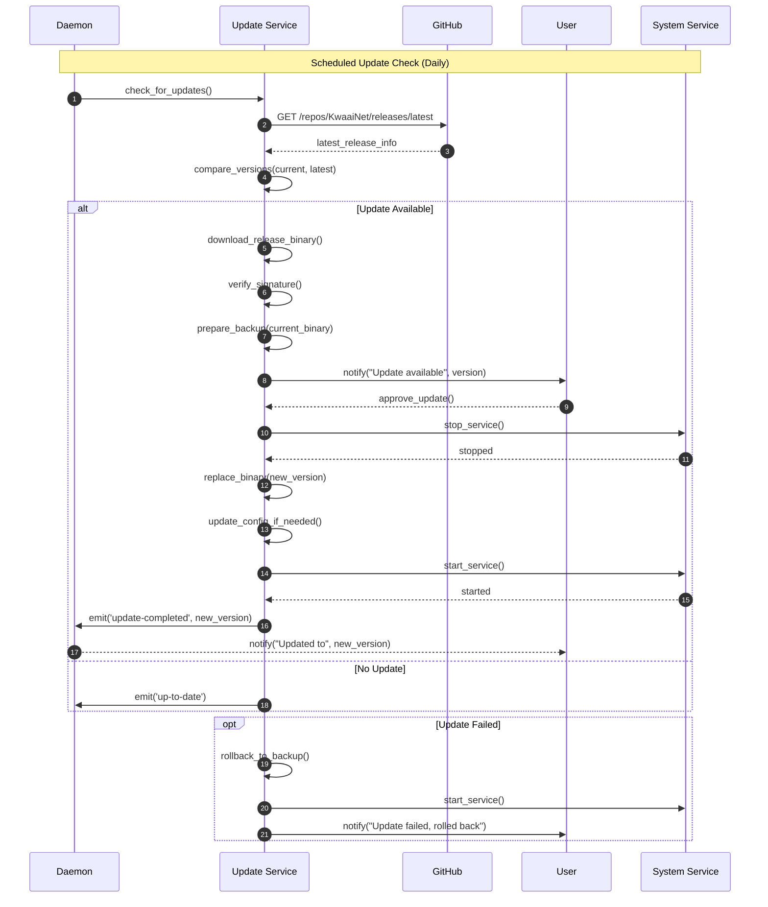
```mermaid
sequenceDiagram
    autonumber
    participant Daemon
    participant Update as Update Service
    participant GitHub
    participant User
    participant Service as System Service

    Note over Daemon,Service: Scheduled Update Check (Daily)

    Daemon->>Update: check_for_updates()
    Update->>GitHub: GET /repos/KwaaiNet/releases/latest
    GitHub-->>Update: latest_release_info

    Update->>Update: compare_versions(current, latest)

    alt Update Available
        Update->>Update: download_release_binary()
        Update->>Update: verify_signature()
        Update->>Update: prepare_backup(current_binary)

        Update->>User: notify("Update available", version)
        User-->>Update: approve_update()

        Update->>Service: stop_service()
        Service-->>Update: stopped

        Update->>Update: replace_binary(new_version)
        Update->>Update: update_config_if_needed()

        Update->>Service: start_service()
        Service-->>Update: started

        Update->>Daemon: emit('update-completed', new_version)
        Daemon-->>User: notify("Updated to", new_version)

    else No Update
        Update->>Daemon: emit('up-to-date')
    end

    opt Update Failed
        Update->>Update: rollback_to_backup()
        Update->>Service: start_service()
        Update->>User: notify("Update failed, rolled back")
    end
```

---

## Edge Device Deployment

### 4.1 Router Firmware Integration

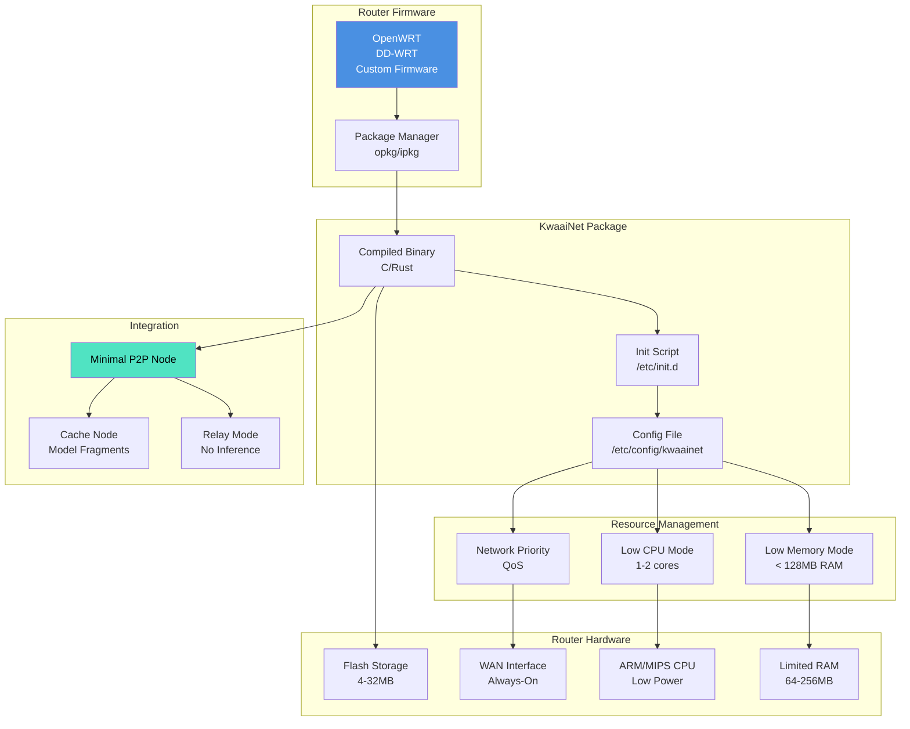
```mermaid
graph TB
    subgraph "Router Firmware"
        OpenWRT[OpenWRT<br/>DD-WRT<br/>Custom Firmware]
        PackageManager[Package Manager<br/>opkg/ipkg]
    end

    subgraph "KwaaiNet Package"
        BinaryC[Compiled Binary<br/>C/Rust]
        InitScript[Init Script<br/>/etc/init.d]
        Config[Config File<br/>/etc/config/kwaainet]
    end

    subgraph "Resource Management"
        LowMemory[Low Memory Mode<br/>< 128MB RAM]
        LowCPU[Low CPU Mode<br/>1-2 cores]
        NetworkPriority[Network Priority<br/>QoS]
    end

    subgraph "Router Hardware"
        CPU[ARM/MIPS CPU<br/>Low Power]
        RAM[Limited RAM<br/>64-256MB]
        Flash[Flash Storage<br/>4-32MB]
        WAN[WAN Interface<br/>Always-On]
    end

    subgraph "Integration"
        Lightweight[Minimal P2P Node]
        Relay[Relay Mode<br/>No Inference]
        Storage[Cache Node<br/>Model Fragments]
    end

    OpenWRT --> PackageManager
    PackageManager --> BinaryC
    BinaryC --> InitScript
    InitScript --> Config

    Config --> LowMemory
    Config --> LowCPU
    Config --> NetworkPriority

    LowMemory --> RAM
    LowCPU --> CPU
    BinaryC --> Flash
    NetworkPriority --> WAN

    BinaryC --> Lightweight
    Lightweight --> Relay
    Lightweight --> Storage

    style OpenWRT fill:#4A90E2,color:#fff
    style Lightweight fill:#50E3C2,color:#000
```

### 4.2 IoT Device Deployment

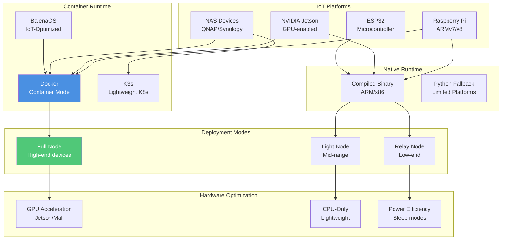
```mermaid
graph TB
    subgraph "IoT Platforms"
        RaspberryPi[Raspberry Pi<br/>ARMv7/v8]
        JetsonNano[NVIDIA Jetson<br/>GPU-enabled]
        ESP32[ESP32<br/>Microcontroller]
        NAS[NAS Devices<br/>QNAP/Synology]
    end

    subgraph "Container Runtime"
        Docker[Docker<br/>Container Mode]
        Balena[BalenaOS<br/>IoT-Optimized]
        K3s[K3s<br/>Lightweight K8s]
    end

    subgraph "Native Runtime"
        Binary[Compiled Binary<br/>ARM/x86]
        Python[Python Fallback<br/>Limited Platforms]
    end

    subgraph "Deployment Modes"
        FullNode[Full Node<br/>High-end devices]
        LightNode[Light Node<br/>Mid-range]
        RelayNode[Relay Node<br/>Low-end]
    end

    subgraph "Hardware Optimization"
        GPUAccel[GPU Acceleration<br/>Jetson/Mali]
        CPUOnly[CPU-Only<br/>Lightweight]
        LowPower[Power Efficiency<br/>Sleep modes]
    end

    RaspberryPi --> Docker
    RaspberryPi --> Binary
    JetsonNano --> Docker
    JetsonNano --> Binary
    ESP32 --> Binary
    NAS --> Docker
    NAS --> K3s

    Docker --> FullNode
    Binary --> LightNode
    Binary --> RelayNode

    FullNode --> GPUAccel
    LightNode --> CPUOnly
    RelayNode --> LowPower

    Balena --> Docker

    style Docker fill:#4A90E2,color:#fff
    style FullNode fill:#50C878,color:#fff
```

### 4.3 Edge Device Contribution Patterns

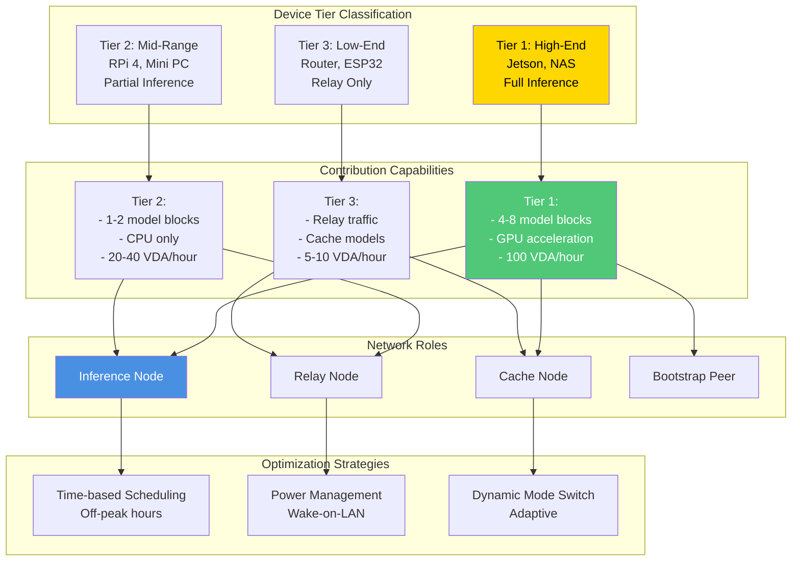
```mermaid
graph TB
    subgraph "Device Tier Classification"
        Tier1[Tier 1: High-End<br/>Jetson, NAS<br/>Full Inference]
        Tier2[Tier 2: Mid-Range<br/>RPi 4, Mini PC<br/>Partial Inference]
        Tier3[Tier 3: Low-End<br/>Router, ESP32<br/>Relay Only]
    end

    subgraph "Contribution Capabilities"
        T1Contrib[Tier 1:<br/>- 4-8 model blocks<br/>- GPU acceleration<br/>- 100 VDA/hour]
        T2Contrib[Tier 2:<br/>- 1-2 model blocks<br/>- CPU only<br/>- 20-40 VDA/hour]
        T3Contrib[Tier 3:<br/>- Relay traffic<br/>- Cache models<br/>- 5-10 VDA/hour]
    end

    subgraph "Network Roles"
        Inference[Inference Node]
        Relay[Relay Node]
        Cache[Cache Node]
        Bootstrap[Bootstrap Peer]
    end

    subgraph "Optimization Strategies"
        Scheduling[Time-based Scheduling<br/>Off-peak hours]
        PowerMgmt[Power Management<br/>Wake-on-LAN]
        Dynamic[Dynamic Mode Switch<br/>Adaptive]
    end

    Tier1 --> T1Contrib
    Tier2 --> T2Contrib
    Tier3 --> T3Contrib

    T1Contrib --> Inference
    T1Contrib --> Cache
    T1Contrib --> Bootstrap

    T2Contrib --> Inference
    T2Contrib --> Relay

    T3Contrib --> Relay
    T3Contrib --> Cache

    Inference --> Scheduling
    Relay --> PowerMgmt
    Cache --> Dynamic

    style Tier1 fill:#FFD700,color:#000
    style T1Contrib fill:#50C878,color:#fff
    style Inference fill:#4A90E2,color:#fff
```

---

## Enterprise/Server Deployment

### 5.1 Enterprise Deployment Architecture

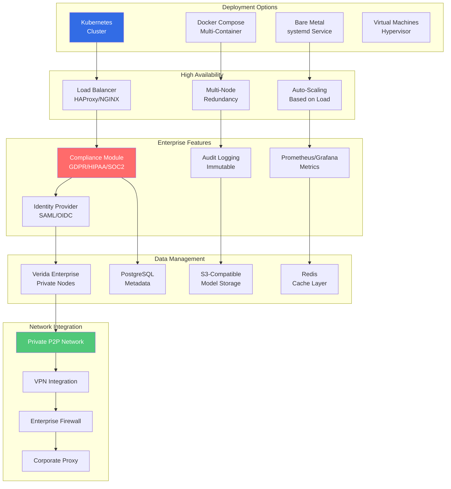
```mermaid
graph TB
    subgraph "Deployment Options"
        K8s[Kubernetes<br/>Cluster]
        Docker[Docker Compose<br/>Multi-Container]
        Bare[Bare Metal<br/>systemd Service]
        VM[Virtual Machines<br/>Hypervisor]
    end

    subgraph "High Availability"
        LoadBalancer[Load Balancer<br/>HAProxy/NGINX]
        MultiNode[Multi-Node<br/>Redundancy]
        AutoScale[Auto-Scaling<br/>Based on Load]
    end

    subgraph "Enterprise Features"
        Compliance[Compliance Module<br/>GDPR/HIPAA/SOC2]
        Audit[Audit Logging<br/>Immutable]
        Monitoring[Prometheus/Grafana<br/>Metrics]
        IAM[Identity Provider<br/>SAML/OIDC]
    end

    subgraph "Data Management"
        Postgres[PostgreSQL<br/>Metadata]
        S3[S3-Compatible<br/>Model Storage]
        Redis[Redis<br/>Cache Layer]
        Verida[Verida Enterprise<br/>Private Nodes]
    end

    subgraph "Network Integration"
        PrivateP2P[Private P2P Network]
        VPN[VPN Integration]
        Firewall[Enterprise Firewall]
        Proxy[Corporate Proxy]
    end

    K8s --> LoadBalancer
    Docker --> MultiNode
    Bare --> AutoScale

    LoadBalancer --> Compliance
    MultiNode --> Audit
    AutoScale --> Monitoring
    Compliance --> IAM

    Compliance --> Postgres
    Audit --> S3
    Monitoring --> Redis
    IAM --> Verida

    Verida --> PrivateP2P
    PrivateP2P --> VPN
    VPN --> Firewall
    Firewall --> Proxy

    style K8s fill:#326CE5,color:#fff
    style Compliance fill:#FF6B6B,color:#fff
    style PrivateP2P fill:#50C878,color:#fff
```

### 5.2 Kubernetes Deployment

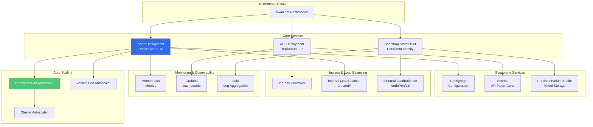
```mermaid
graph TB
    subgraph "Kubernetes Cluster"
        Namespace[kwaainet Namespace]
    end

    subgraph "Core Services"
        NodeDeployment[Node Deployment<br/>ReplicaSet: 3-10]
        APIDeployment[API Deployment<br/>ReplicaSet: 2-5]
        BootstrapStateful[Bootstrap StatefulSet<br/>Persistent Identity]
    end

    subgraph "Supporting Services"
        ConfigMap[ConfigMap<br/>Configuration]
        Secrets[Secrets<br/>API Keys, Certs]
        PVC[PersistentVolumeClaim<br/>Model Storage]
    end

    subgraph "Ingress & Load Balancing"
        Ingress[Ingress Controller]
        InternalLB[Internal LoadBalancer<br/>ClusterIP]
        ExternalLB[External LoadBalancer<br/>NodePort/LB]
    end

    subgraph "Monitoring & Observability"
        Prometheus[Prometheus<br/>Metrics]
        Grafana[Grafana<br/>Dashboards]
        Loki[Loki<br/>Log Aggregation]
    end

    subgraph "Auto-Scaling"
        HPA[Horizontal Pod Autoscaler]
        VPA[Vertical Pod Autoscaler]
        ClusterAutoscaler[Cluster Autoscaler]
    end

    Namespace --> NodeDeployment
    Namespace --> APIDeployment
    Namespace --> BootstrapStateful

    NodeDeployment --> ConfigMap
    APIDeployment --> Secrets
    BootstrapStateful --> PVC

    APIDeployment --> Ingress
    NodeDeployment --> InternalLB
    BootstrapStateful --> ExternalLB

    NodeDeployment --> Prometheus
    APIDeployment --> Grafana
    BootstrapStateful --> Loki

    NodeDeployment --> HPA
    NodeDeployment --> VPA
    HPA --> ClusterAutoscaler

    style NodeDeployment fill:#326CE5,color:#fff
    style HPA fill:#50C878,color:#fff
```

### 5.3 Enterprise Compliance Deployment

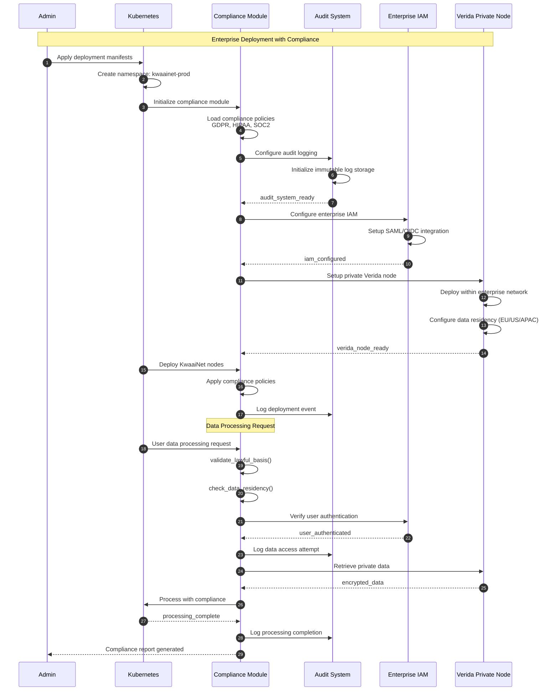
```mermaid
sequenceDiagram
    autonumber
    participant Admin
    participant K8s as Kubernetes
    participant Compliance as Compliance Module
    participant Audit as Audit System
    participant IAM as Enterprise IAM
    participant Verida as Verida Private Node

    Note over Admin,Verida: Enterprise Deployment with Compliance

    Admin->>K8s: Apply deployment manifests
    K8s->>K8s: Create namespace: kwaainet-prod

    K8s->>Compliance: Initialize compliance module
    Compliance->>Compliance: Load compliance policies<br/>GDPR, HIPAA, SOC2

    Compliance->>Audit: Configure audit logging
    Audit->>Audit: Initialize immutable log storage
    Audit-->>Compliance: audit_system_ready

    Compliance->>IAM: Configure enterprise IAM
    IAM->>IAM: Setup SAML/OIDC integration
    IAM-->>Compliance: iam_configured

    Compliance->>Verida: Setup private Verida node
    Verida->>Verida: Deploy within enterprise network
    Verida->>Verida: Configure data residency (EU/US/APAC)
    Verida-->>Compliance: verida_node_ready

    K8s->>Compliance: Deploy KwaaiNet nodes
    Compliance->>Compliance: Apply compliance policies
    Compliance->>Audit: Log deployment event

    Note over Compliance: Data Processing Request

    K8s->>Compliance: User data processing request
    Compliance->>Compliance: validate_lawful_basis()
    Compliance->>Compliance: check_data_residency()

    Compliance->>IAM: Verify user authentication
    IAM-->>Compliance: user_authenticated

    Compliance->>Audit: Log data access attempt
    Compliance->>Verida: Retrieve private data
    Verida-->>Compliance: encrypted_data

    Compliance->>K8s: Process with compliance
    K8s-->>Compliance: processing_complete
    Compliance->>Audit: Log processing completion

    Compliance-->>Admin: Compliance report generated
```

---

## Deployment Decision Matrix

### 6.1 Platform Comparison

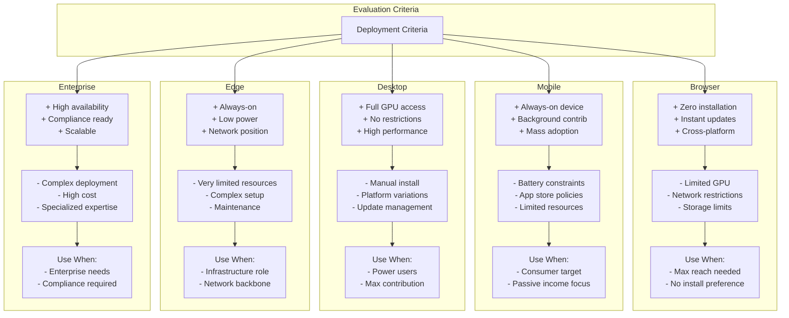
```mermaid
graph TB
    subgraph "Evaluation Criteria"
        Criteria[Deployment Criteria]
    end

    subgraph "Browser"
        B_Pros[+ Zero installation<br/>+ Instant updates<br/>+ Cross-platform]
        B_Cons[- Limited GPU<br/>- Network restrictions<br/>- Storage limits]
        B_Use[Use When:<br/>- Max reach needed<br/>- No install preference]
    end

    subgraph "Mobile"
        M_Pros[+ Always-on device<br/>+ Background contrib<br/>+ Mass adoption]
        M_Cons[- Battery constraints<br/>- App store policies<br/>- Limited resources]
        M_Use[Use When:<br/>- Consumer target<br/>- Passive income focus]
    end

    subgraph "Desktop"
        D_Pros[+ Full GPU access<br/>+ No restrictions<br/>+ High performance]
        D_Cons[- Manual install<br/>- Platform variations<br/>- Update management]
        D_Use[Use When:<br/>- Power users<br/>- Max contribution]
    end

    subgraph "Edge"
        E_Pros[+ Always-on<br/>+ Low power<br/>+ Network position]
        E_Cons[- Very limited resources<br/>- Complex setup<br/>- Maintenance]
        E_Use[Use When:<br/>- Infrastructure role<br/>- Network backbone]
    end

    subgraph "Enterprise"
        Ent_Pros[+ High availability<br/>+ Compliance ready<br/>+ Scalable]
        Ent_Cons[- Complex deployment<br/>- High cost<br/>- Specialized expertise]
        Ent_Use[Use When:<br/>- Enterprise needs<br/>- Compliance required]
    end

    Criteria --> B_Pros
    Criteria --> M_Pros
    Criteria --> D_Pros
    Criteria --> E_Pros
    Criteria --> Ent_Pros

    B_Pros --> B_Cons
    M_Pros --> M_Cons
    D_Pros --> D_Cons
    E_Pros --> E_Cons
    Ent_Pros --> Ent_Cons

    B_Cons --> B_Use
    M_Cons --> M_Use
    D_Cons --> D_Use
    E_Cons --> E_Use
    Ent_Cons --> Ent_Use
```

### 6.2 Deployment Wave Strategy

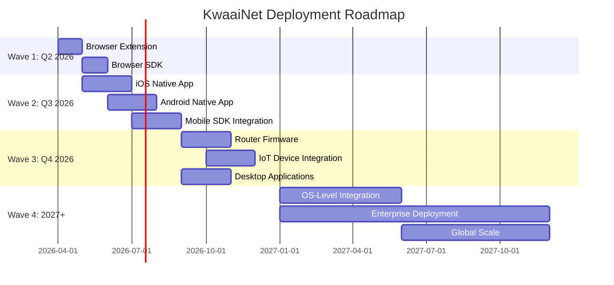
```mermaid
gantt
    title KwaaiNet Deployment Roadmap
    dateFormat YYYY-MM
    section Wave 1: Q2 2026
    Browser Extension         :w1b, 2026-04, 2026-05
    Browser SDK               :w1s, 2026-05, 2026-06
    section Wave 2: Q3 2026
    iOS Native App            :w2i, 2026-05, 2026-07
    Android Native App        :w2a, 2026-06, 2026-08
    Mobile SDK Integration    :w2m, 2026-07, 2026-09
    section Wave 3: Q4 2026
    Router Firmware           :w3r, 2026-09, 2026-11
    IoT Device Integration    :w3i, 2026-10, 2026-12
    Desktop Applications      :w3d, 2026-09, 2026-11
    section Wave 4: 2027+
    OS-Level Integration      :w4o, 2027-01, 2027-06
    Enterprise Deployment     :w4e, 2027-01, 2027-12
    Global Scale              :w4g, 2027-06, 2027-12
```

---

## Related Documentation

- [Main Architecture](../ARCHITECTURE.md) - High-level system architecture
- [Challenge Architectures](./CHALLENGE_ARCHITECTURES.md) - Detailed component diagrams
- [Data Flows](./DATA_FLOWS.md) - Authentication and data flow diagrams
- [Verida Architecture](./VERIDA_ARCHITECTURE.md) - Deep dive into Verida integration
- [Mass Adoption Strategy](../MASS_ADOPTION_STRATEGY.md) - Deployment wave strategy
- [OpenAI-Petal Patterns](../../OpenAI-Petal/docs/REUSABLE_PATTERNS.md) - Lessons learned

---

**Document Status**: Draft - Technical Specification
**Next Review**: December 2025
**Maintainer**: KwaaiNet Architecture Team
