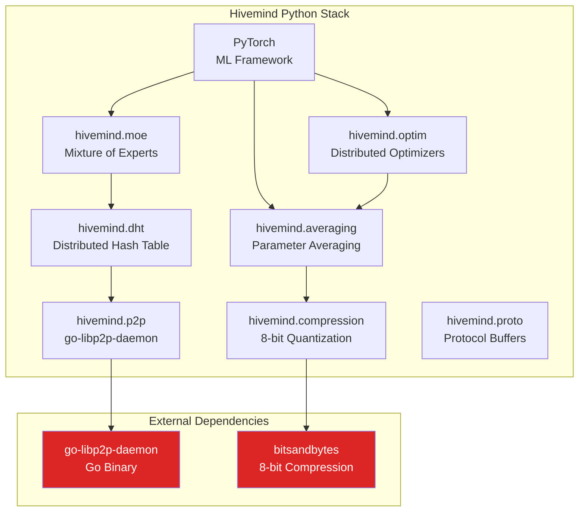
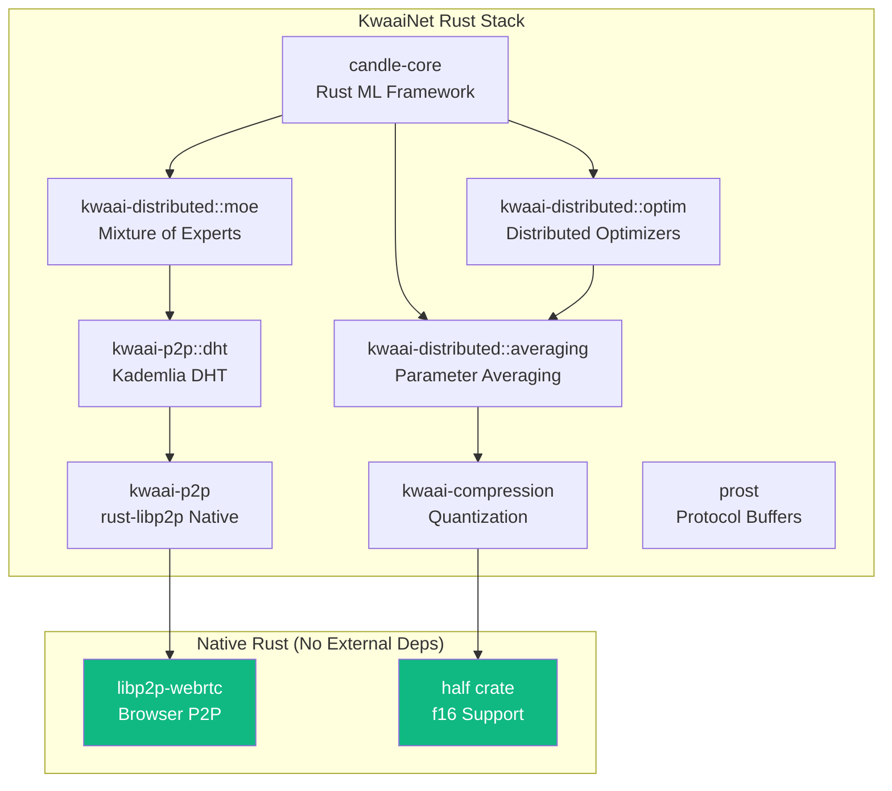
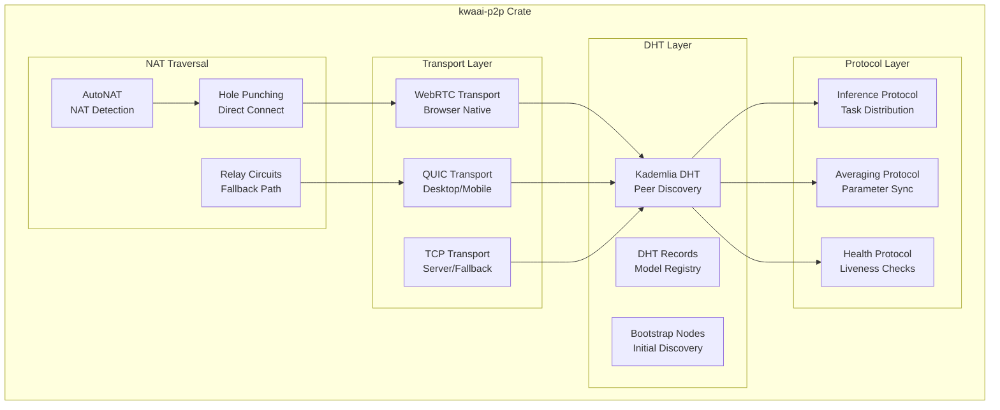
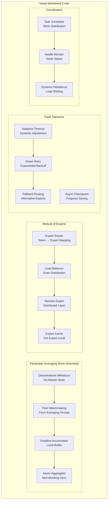
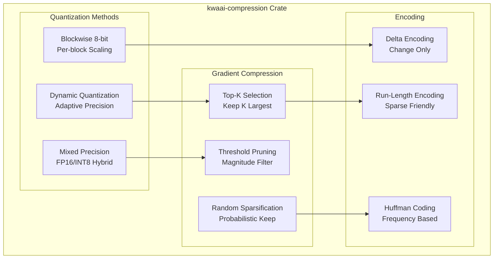
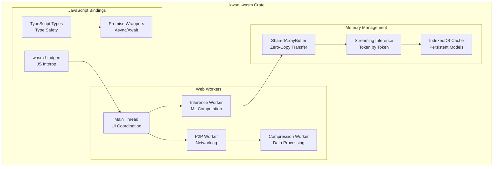
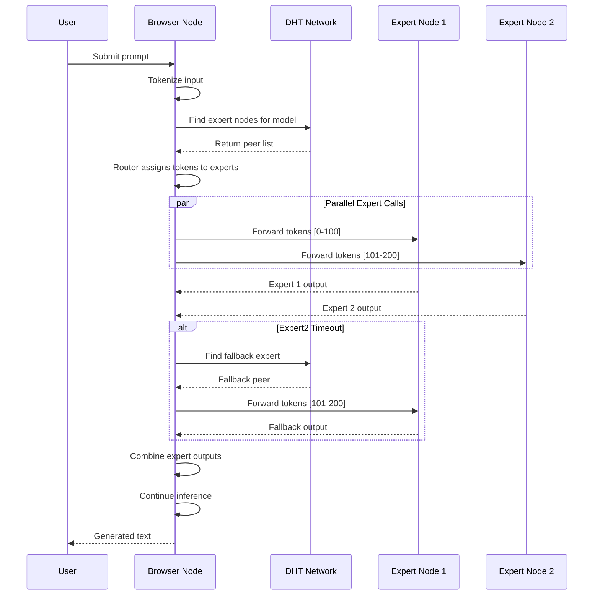
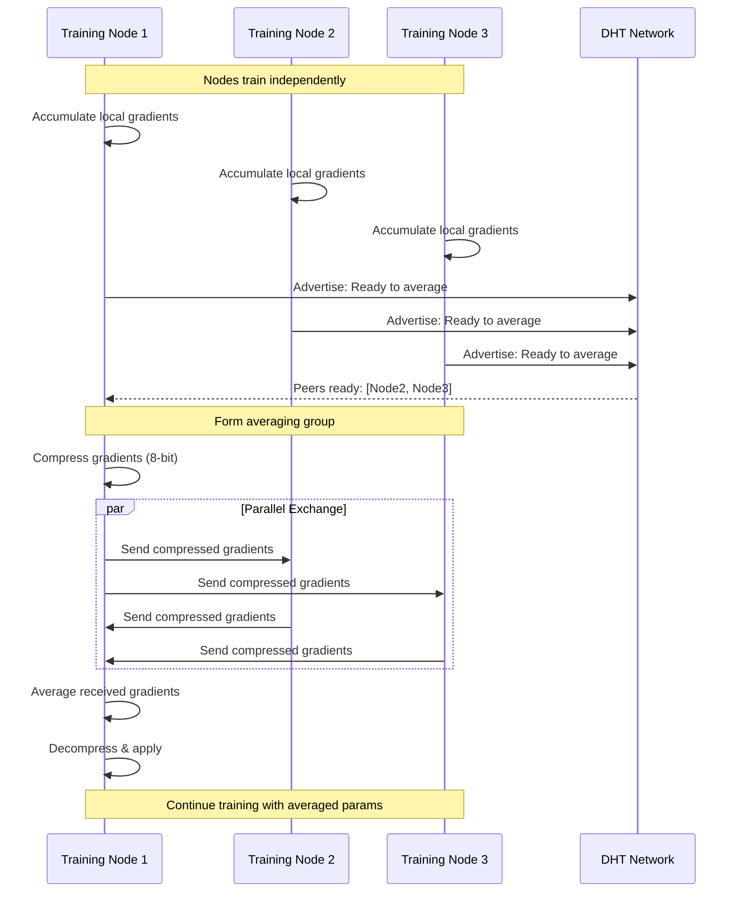
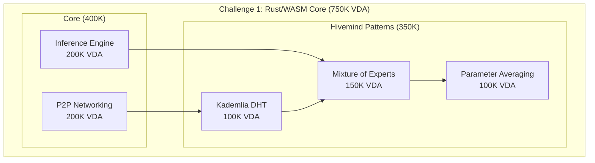

# Hivemind → Rust/WASM Architecture
## Replicating Decentralized Deep Learning for KwaaiNet

**Version**: 1.0
**Date**: November 2025
**Status**: Specification Phase

---

## Executive Summary

This document details the architectural plan for replicating [Hivemind](https://github.com/learning-at-home/hivemind)'s decentralized deep learning capabilities in Rust with full WASM/browser support. By porting Hivemind's battle-tested patterns to Rust, KwaaiNet gains:

- **Native WASM Support**: Browser-based distributed inference without external dependencies
- **Unified Runtime**: Single codebase for browser, mobile, desktop, and edge
- **Performance**: Rust's zero-cost abstractions for efficient ML operations
- **No Go Dependency**: Native `rust-libp2p` replaces `go-libp2p-daemon`

---

## Hivemind Component Analysis

### Original Architecture (Python)



### Target Architecture (Rust/WASM)



---

## Module Mapping

### Complete Component Translation

| Hivemind (Python) | KwaaiNet (Rust) | Crate/Dependency | WASM Ready |
|-------------------|-----------------|------------------|------------|
| `hivemind.dht` | `kwaai_p2p::dht` | `libp2p-kad` | ✅ |
| `hivemind.p2p` | `kwaai_p2p::transport` | `libp2p`, `libp2p-webrtc` | ✅ |
| `hivemind.averaging` | `kwaai_distributed::averaging` | Custom + `candle` | ✅ |
| `hivemind.moe` | `kwaai_distributed::moe` | Custom + `candle-nn` | ✅ |
| `hivemind.compression` | `kwaai_compression` | `half`, custom | ✅ |
| `hivemind.optim` | `kwaai_distributed::optim` | Custom + `candle` | ✅ |
| `hivemind.proto` | Protocol definitions | `prost` | ✅ |
| `hivemind.utils` | `kwaai_utils` | Various | ✅ |
| PyTorch | Candle | `candle-core`, `candle-nn` | ✅ |
| go-libp2p-daemon | Native libp2p | `libp2p` | ✅ |
| bitsandbytes | Custom quantization | `half`, custom | ✅ |

---

## Crate Architecture

### Project Structure

```
kwaai-core/
├── Cargo.toml                    # Workspace root
├── crates/
│   ├── kwaai-p2p/               # P2P networking layer
│   │   ├── Cargo.toml
│   │   └── src/
│   │       ├── lib.rs
│   │       ├── dht.rs           # Kademlia DHT
│   │       ├── transport.rs     # WebRTC/QUIC transports
│   │       ├── protocols/
│   │       │   ├── mod.rs
│   │       │   ├── inference.rs # Inference coordination protocol
│   │       │   ├── averaging.rs # Parameter sync protocol
│   │       │   └── discovery.rs # Peer discovery protocol
│   │       └── nat.rs           # NAT traversal
│   │
│   ├── kwaai-inference/         # Core inference engine
│   │   ├── Cargo.toml
│   │   └── src/
│   │       ├── lib.rs
│   │       ├── engine.rs        # Candle-based inference
│   │       ├── model.rs         # Model loading (GGUF)
│   │       ├── sharding.rs      # Model sharding for distributed
│   │       └── runtime.rs       # Execution runtime
│   │
│   ├── kwaai-distributed/       # Distributed ML operations
│   │   ├── Cargo.toml
│   │   └── src/
│   │       ├── lib.rs
│   │       ├── averaging.rs     # Decentralized parameter averaging
│   │       ├── moe.rs           # Mixture of Experts routing
│   │       ├── fault_tolerance.rs # Failure handling
│   │       └── coordinator.rs   # Task coordination
│   │
│   ├── kwaai-compression/       # Communication optimization
│   │   ├── Cargo.toml
│   │   └── src/
│   │       ├── lib.rs
│   │       ├── quantization.rs  # 8-bit blockwise quantization
│   │       ├── sparse.rs        # Sparse gradient compression
│   │       └── delta.rs         # Delta encoding
│   │
│   └── kwaai-wasm/              # WASM bindings
│       ├── Cargo.toml
│       └── src/
│           ├── lib.rs
│           ├── bindings.rs      # JavaScript interop
│           └── worker.rs        # Web Worker support
│
└── examples/
    ├── browser/                 # Browser demo
    ├── distributed/             # Multi-node example
    └── inference/               # Single-node inference
```

---

## Detailed Component Specifications

### 1. kwaai-p2p: Networking Layer



#### Rust Implementation

```rust
// kwaai-p2p/src/lib.rs

use libp2p::{
    kad::{Kademlia, KademliaConfig, KademliaEvent},
    swarm::{NetworkBehaviour, Swarm},
    webrtc, quic, tcp,
    PeerId, Multiaddr,
};

/// Main P2P network manager for KwaaiNet
pub struct KwaaiP2P {
    swarm: Swarm<KwaaiBehaviour>,
    dht: DhtManager,
    protocols: ProtocolHandler,
}

#[derive(NetworkBehaviour)]
pub struct KwaaiBehaviour {
    /// Kademlia DHT for peer discovery and model registry
    kademlia: Kademlia<MemoryStore>,

    /// Custom inference coordination protocol
    inference: InferenceProtocol,

    /// Parameter averaging protocol (from Hivemind)
    averaging: AveragingProtocol,

    /// Health/liveness checking
    health: HealthProtocol,

    /// NAT traversal behaviors
    autonat: autonat::Behaviour,
    relay: relay::client::Behaviour,
    dcutr: dcutr::Behaviour,
}

impl KwaaiP2P {
    /// Create new P2P network with WebRTC support for browsers
    pub async fn new(config: P2PConfig) -> Result<Self, P2PError> {
        let transport = Self::build_transport(&config)?;
        let behaviour = KwaaiBehaviour::new(&config)?;
        let swarm = Swarm::new(transport, behaviour, config.local_peer_id);

        Ok(Self {
            swarm,
            dht: DhtManager::new(),
            protocols: ProtocolHandler::new(),
        })
    }

    /// Build transport layer (WebRTC for browser, QUIC for native)
    fn build_transport(config: &P2PConfig) -> Result<Boxed<(PeerId, StreamMuxerBox)>, P2PError> {
        #[cfg(target_arch = "wasm32")]
        {
            // Browser: WebRTC only
            webrtc::Transport::new(config.webrtc_config.clone())
        }

        #[cfg(not(target_arch = "wasm32"))]
        {
            // Native: QUIC preferred, TCP fallback
            let quic = quic::tokio::Transport::new(config.quic_config.clone());
            let tcp = tcp::tokio::Transport::new(tcp::Config::default());
            quic.or_transport(tcp)
        }
    }

    /// Join the network via bootstrap peers
    pub async fn bootstrap(&mut self, peers: Vec<Multiaddr>) -> Result<(), P2PError> {
        for addr in peers {
            self.swarm.dial(addr)?;
        }
        self.dht.bootstrap().await
    }

    /// Register this node's capabilities in DHT
    pub async fn register_capabilities(&mut self, caps: NodeCapabilities) -> Result<(), P2PError> {
        let record = caps.to_dht_record();
        self.dht.put_record(record).await
    }

    /// Find peers capable of running a specific model
    pub async fn find_model_peers(&mut self, model_id: &str) -> Result<Vec<PeerId>, P2PError> {
        self.dht.get_providers(model_id).await
    }
}
```

### 2. kwaai-distributed: Decentralized ML Operations



#### Decentralized Parameter Averaging

This is the core Hivemind pattern - averaging gradients across peers without a central server:

```rust
// kwaai-distributed/src/averaging.rs

use candle_core::{Tensor, Device};
use crate::compression::Compressor;

/// Hivemind-style decentralized parameter averaging
///
/// Unlike traditional AllReduce which requires synchronization across ALL nodes,
/// this implementation forms small groups that average independently,
/// then gradually propagate updates across the network.
pub struct DecentralizedAverager {
    /// Local gradient accumulator
    accumulator: GradientAccumulator,

    /// Peer matchmaking for forming averaging groups
    matchmaker: Matchmaker,

    /// Compression for bandwidth efficiency
    compressor: Box<dyn Compressor>,

    /// Averaging group size (typically 2-8 peers)
    group_size: usize,

    /// Target averaging interval
    target_interval: Duration,
}

impl DecentralizedAverager {
    /// Accumulate local gradients
    pub fn accumulate(&mut self, gradients: &[Tensor]) -> Result<(), AveragingError> {
        self.accumulator.add(gradients)
    }

    /// Attempt to form an averaging group and exchange gradients
    /// Returns immediately if no peers available (non-blocking)
    pub async fn step(&mut self, p2p: &mut KwaaiP2P) -> Result<AveragingResult, AveragingError> {
        // 1. Find peers ready to average
        let peers = self.matchmaker.find_ready_peers(p2p, self.group_size).await?;

        if peers.is_empty() {
            return Ok(AveragingResult::NoPeersAvailable);
        }

        // 2. Compress local gradients
        let local_compressed = self.compressor.compress(self.accumulator.get())?;

        // 3. Exchange with peers (parallel, fault-tolerant)
        let remote_gradients = self.exchange_gradients(p2p, &peers, &local_compressed).await?;

        // 4. Average received gradients
        let averaged = self.average_gradients(&remote_gradients)?;

        // 5. Decompress and apply
        let decompressed = self.compressor.decompress(&averaged)?;

        Ok(AveragingResult::Success {
            peers_participated: remote_gradients.len(),
            compression_ratio: local_compressed.compression_ratio(),
        })
    }

    /// Exchange gradients with peers, handling failures gracefully
    async fn exchange_gradients(
        &self,
        p2p: &mut KwaaiP2P,
        peers: &[PeerId],
        local: &CompressedGradients,
    ) -> Result<Vec<CompressedGradients>, AveragingError> {
        let mut results = Vec::new();
        let mut futures = Vec::new();

        for peer in peers {
            let fut = self.send_receive_gradients(p2p, *peer, local.clone());
            futures.push(fut);
        }

        // Wait for responses with timeout, don't fail if some peers unresponsive
        let responses = futures::future::join_all(futures).await;

        for response in responses {
            match response {
                Ok(gradients) => results.push(gradients),
                Err(e) => {
                    // Log but continue - fault tolerant
                    tracing::warn!("Peer failed during averaging: {}", e);
                }
            }
        }

        // Need at least one successful exchange
        if results.is_empty() {
            return Err(AveragingError::AllPeersFailed);
        }

        Ok(results)
    }
}

/// Peer matchmaking for forming averaging groups
pub struct Matchmaker {
    /// DHT key for advertising readiness
    readiness_key: String,

    /// Timeout for waiting for group formation
    group_timeout: Duration,
}

impl Matchmaker {
    /// Find peers that are ready to average
    /// Uses DHT to discover and coordinate
    pub async fn find_ready_peers(
        &self,
        p2p: &mut KwaaiP2P,
        target_size: usize,
    ) -> Result<Vec<PeerId>, MatchmakingError> {
        // 1. Advertise our readiness in DHT
        p2p.dht.put_record(DhtRecord {
            key: self.readiness_key.clone(),
            value: ReadinessAdvertisement {
                peer_id: p2p.local_peer_id(),
                timestamp: Instant::now(),
                model_id: self.model_id.clone(),
            }.encode(),
            ttl: Duration::from_secs(30),
        }).await?;

        // 2. Find other ready peers
        let candidates = p2p.dht.get_providers(&self.readiness_key).await?;

        // 3. Filter to compatible peers and select group
        let group = self.select_group(candidates, target_size);

        Ok(group)
    }
}
```

#### Mixture of Experts (Distributed Layers)

```rust
// kwaai-distributed/src/moe.rs

use candle_core::{Tensor, Device};
use std::collections::HashMap;

/// Distributed Mixture of Experts
///
/// Enables training/inference of arbitrarily large models by distributing
/// different "expert" sublayers across network participants.
pub struct DistributedMoE {
    /// Local experts (layers we host)
    local_experts: HashMap<ExpertId, Expert>,

    /// Remote expert registry (discovered via DHT)
    remote_experts: ExpertRegistry,

    /// Router network (determines which expert handles each token)
    router: Router,

    /// Load balancer for even distribution
    load_balancer: LoadBalancer,

    /// Cache for frequently accessed remote experts
    expert_cache: ExpertCache,
}

impl DistributedMoE {
    /// Forward pass through MoE layer
    ///
    /// 1. Router determines expert assignment for each token
    /// 2. Local experts process locally
    /// 3. Remote experts are called via P2P
    /// 4. Results are combined
    pub async fn forward(
        &mut self,
        input: &Tensor,
        p2p: &mut KwaaiP2P,
    ) -> Result<Tensor, MoEError> {
        // 1. Get expert assignments from router
        let routing = self.router.route(input)?;

        // 2. Separate local vs remote work
        let (local_work, remote_work) = self.partition_work(&routing);

        // 3. Process local experts
        let local_results = self.process_local(&local_work, input)?;

        // 4. Call remote experts (parallel, fault-tolerant)
        let remote_results = self.call_remote_experts(p2p, &remote_work, input).await?;

        // 5. Combine results according to routing weights
        let output = self.combine_results(&routing, local_results, remote_results)?;

        Ok(output)
    }

    /// Call remote experts with fault tolerance
    async fn call_remote_experts(
        &mut self,
        p2p: &mut KwaaiP2P,
        work: &RemoteWork,
        input: &Tensor,
    ) -> Result<HashMap<ExpertId, Tensor>, MoEError> {
        let mut results = HashMap::new();

        for (expert_id, tokens) in &work.assignments {
            // Try cached expert first
            if let Some(cached) = self.expert_cache.get(expert_id) {
                let result = cached.forward(&input.index_select(tokens)?)?;
                results.insert(*expert_id, result);
                continue;
            }

            // Find peer hosting this expert
            let peer = self.remote_experts.find_peer(expert_id)?;

            // Call remote with timeout and retry
            match self.call_with_retry(p2p, peer, *expert_id, input, tokens).await {
                Ok(result) => {
                    results.insert(*expert_id, result);
                }
                Err(e) => {
                    // Fault tolerance: try fallback expert
                    tracing::warn!("Expert {} failed, trying fallback: {}", expert_id, e);
                    let fallback = self.load_balancer.get_fallback(*expert_id)?;
                    let result = self.call_fallback(p2p, fallback, input, tokens).await?;
                    results.insert(*expert_id, result);
                }
            }
        }

        Ok(results)
    }
}

/// Expert router - determines which expert handles each token
pub struct Router {
    /// Gating network weights
    gate: Tensor,

    /// Number of experts to route to (top-k)
    top_k: usize,

    /// Temperature for softmax
    temperature: f32,
}

impl Router {
    /// Route tokens to experts
    pub fn route(&self, input: &Tensor) -> Result<Routing, RouterError> {
        // Compute gating scores
        let scores = input.matmul(&self.gate)?;
        let probs = candle_nn::ops::softmax(&(scores / self.temperature as f64), 1)?;

        // Select top-k experts per token
        let (values, indices) = probs.topk(self.top_k)?;

        Ok(Routing {
            expert_indices: indices,
            expert_weights: values,
        })
    }
}
```

### 3. kwaai-compression: Communication Optimization



```rust
// kwaai-compression/src/quantization.rs

use candle_core::Tensor;
use half::f16;

/// Blockwise 8-bit quantization (Hivemind pattern)
///
/// Quantizes tensors in blocks, with per-block scaling factors.
/// Achieves ~4x compression with minimal accuracy loss.
pub struct BlockwiseQuantizer {
    /// Block size for quantization
    block_size: usize,
}

impl BlockwiseQuantizer {
    pub fn new(block_size: usize) -> Self {
        Self { block_size }
    }

    /// Quantize tensor to 8-bit with per-block scaling
    pub fn quantize(&self, tensor: &Tensor) -> Result<QuantizedTensor, CompressionError> {
        let data = tensor.to_vec1::<f32>()?;
        let mut quantized = Vec::with_capacity(data.len());
        let mut scales = Vec::with_capacity(data.len() / self.block_size + 1);

        for block in data.chunks(self.block_size) {
            // Find max absolute value in block
            let max_abs = block.iter()
                .map(|x| x.abs())
                .fold(f32::NEG_INFINITY, f32::max);

            let scale = max_abs / 127.0;
            scales.push(f16::from_f32(scale));

            // Quantize block
            for &val in block {
                let q = if scale > 0.0 {
                    (val / scale).round().clamp(-127.0, 127.0) as i8
                } else {
                    0i8
                };
                quantized.push(q);
            }
        }

        Ok(QuantizedTensor {
            data: quantized,
            scales,
            shape: tensor.dims().to_vec(),
            block_size: self.block_size,
        })
    }

    /// Dequantize back to full precision
    pub fn dequantize(&self, quantized: &QuantizedTensor) -> Result<Tensor, CompressionError> {
        let mut data = Vec::with_capacity(quantized.data.len());

        for (block_idx, block) in quantized.data.chunks(quantized.block_size).enumerate() {
            let scale = quantized.scales[block_idx].to_f32();
            for &q in block {
                data.push(q as f32 * scale);
            }
        }

        Tensor::from_vec(data, &quantized.shape, &Device::Cpu)
            .map_err(CompressionError::from)
    }
}

#[derive(Clone, Debug)]
pub struct QuantizedTensor {
    pub data: Vec<i8>,
    pub scales: Vec<f16>,
    pub shape: Vec<usize>,
    pub block_size: usize,
}

impl QuantizedTensor {
    /// Compression ratio achieved
    pub fn compression_ratio(&self) -> f32 {
        let original_size = self.data.len() * 4; // f32 = 4 bytes
        let compressed_size = self.data.len() + self.scales.len() * 2; // i8 + f16
        original_size as f32 / compressed_size as f32
    }
}

/// Top-K gradient sparsification
pub struct TopKCompressor {
    /// Fraction of gradients to keep (0.0 - 1.0)
    k_fraction: f32,
}

impl TopKCompressor {
    /// Keep only top-k largest gradients by magnitude
    pub fn compress(&self, tensor: &Tensor) -> Result<SparseGradient, CompressionError> {
        let data = tensor.to_vec1::<f32>()?;
        let k = (data.len() as f32 * self.k_fraction) as usize;

        // Find indices of top-k by magnitude
        let mut indexed: Vec<_> = data.iter().enumerate().collect();
        indexed.sort_by(|a, b| b.1.abs().partial_cmp(&a.1.abs()).unwrap());

        let top_k: Vec<_> = indexed.into_iter().take(k).collect();

        Ok(SparseGradient {
            indices: top_k.iter().map(|(i, _)| *i as u32).collect(),
            values: top_k.iter().map(|(_, v)| **v).collect(),
            original_size: data.len(),
        })
    }
}
```

### 4. kwaai-wasm: Browser Integration



```rust
// kwaai-wasm/src/lib.rs

use wasm_bindgen::prelude::*;
use js_sys::{Promise, Uint8Array};
use web_sys::{Worker, MessageEvent};

/// Main entry point for browser integration
#[wasm_bindgen]
pub struct KwaaiNet {
    p2p: KwaaiP2P,
    inference: InferenceEngine,
    distributed: DistributedCoordinator,
}

#[wasm_bindgen]
impl KwaaiNet {
    /// Create new KwaaiNet instance
    #[wasm_bindgen(constructor)]
    pub async fn new(config: JsValue) -> Result<KwaaiNet, JsError> {
        // Initialize logging for browser console
        console_error_panic_hook::set_once();
        tracing_wasm::set_as_global_default();

        let config: Config = serde_wasm_bindgen::from_value(config)?;

        let p2p = KwaaiP2P::new(config.p2p).await?;
        let inference = InferenceEngine::new(config.inference)?;
        let distributed = DistributedCoordinator::new(config.distributed)?;

        Ok(Self { p2p, inference, distributed })
    }

    /// Join the network
    #[wasm_bindgen]
    pub async fn connect(&mut self, bootstrap_peers: Vec<JsValue>) -> Result<(), JsError> {
        let peers: Vec<String> = bootstrap_peers
            .into_iter()
            .map(|p| p.as_string().unwrap_or_default())
            .collect();

        self.p2p.bootstrap(peers.iter().map(|s| s.parse().unwrap()).collect()).await?;

        Ok(())
    }

    /// Run inference (local or distributed)
    #[wasm_bindgen]
    pub async fn infer(&mut self, input: String) -> Result<String, JsError> {
        // Tokenize
        let tokens = self.inference.tokenize(&input)?;

        // Run inference (may involve remote experts via MoE)
        let output = if self.distributed.is_enabled() {
            self.distributed.distributed_inference(&mut self.p2p, &tokens).await?
        } else {
            self.inference.local_inference(&tokens)?
        };

        // Decode
        let text = self.inference.decode(&output)?;

        Ok(text)
    }

    /// Contribute compute to the network
    #[wasm_bindgen]
    pub async fn contribute(&mut self) -> Result<(), JsError> {
        // Register as compute provider in DHT
        self.p2p.register_capabilities(NodeCapabilities {
            can_inference: true,
            can_train: false, // Browser typically inference-only
            model_ids: self.inference.loaded_models(),
            compute_power: self.estimate_compute_power(),
        }).await?;

        // Start listening for inference requests
        self.start_inference_server().await
    }

    /// Get current earnings
    #[wasm_bindgen]
    pub fn get_earnings(&self) -> f64 {
        self.distributed.earnings_vda()
    }
}

/// Worker thread for heavy computation
#[wasm_bindgen]
pub fn spawn_inference_worker() -> Worker {
    let worker = Worker::new("./inference-worker.js").unwrap();
    worker
}
```

---

## Sequence Diagrams

### Distributed Inference Flow



### Decentralized Parameter Averaging Flow



---

## WASM Compilation Targets

### Build Configuration

```toml
# Cargo.toml (workspace)

[workspace]
members = [
    "crates/kwaai-p2p",
    "crates/kwaai-inference",
    "crates/kwaai-distributed",
    "crates/kwaai-compression",
    "crates/kwaai-wasm",
]

[profile.release]
lto = true
opt-level = "z"  # Optimize for size (important for WASM)
codegen-units = 1

[profile.release.package.kwaai-wasm]
opt-level = "s"
```

```toml
# crates/kwaai-wasm/Cargo.toml

[package]
name = "kwaai-wasm"
version = "0.1.0"
edition = "2021"

[lib]
crate-type = ["cdylib", "rlib"]

[dependencies]
kwaai-p2p = { path = "../kwaai-p2p" }
kwaai-inference = { path = "../kwaai-inference" }
kwaai-distributed = { path = "../kwaai-distributed" }
kwaai-compression = { path = "../kwaai-compression" }

wasm-bindgen = "0.2"
wasm-bindgen-futures = "0.4"
js-sys = "0.3"
web-sys = { version = "0.3", features = [
    "Worker",
    "MessageEvent",
    "console",
    "Window",
    "Navigator",
] }
console_error_panic_hook = "0.1"
tracing-wasm = "0.2"
serde-wasm-bindgen = "0.6"

[dependencies.candle-core]
version = "0.4"
default-features = false

[target.'cfg(target_arch = "wasm32")'.dependencies]
getrandom = { version = "0.2", features = ["js"] }
```

### Build Commands

```bash
# Build for browser (WASM)
wasm-pack build crates/kwaai-wasm --target web --release

# Build for Node.js
wasm-pack build crates/kwaai-wasm --target nodejs --release

# Build native (desktop/mobile)
cargo build --release

# Cross-compile for ARM (mobile/edge)
cargo build --release --target aarch64-unknown-linux-gnu
```

---

## Integration with Existing KwaaiNet

### Updated Challenge 1 Specification

The Rust/WASM Core Engine challenge (750K VDA) now incorporates Hivemind patterns:

| Original Requirement | Hivemind Enhancement |
|---------------------|---------------------|
| Candle inference engine | + Distributed MoE support |
| P2P networking | + DHT-based discovery (Kademlia) |
| Model loading | + Distributed model sharding |
| WASM compilation | + Full browser inference |
| Performance benchmarks | + Distributed throughput metrics |

### New Hackathon Sub-Challenges



---

## Performance Targets

### Inference Performance

| Metric | Python/Hivemind | Rust/KwaaiNet Target |
|--------|-----------------|---------------------|
| Single-node inference | Baseline | 2-3x faster |
| P2P latency | ~100ms (go-libp2p) | ~50ms (native libp2p) |
| WASM overhead | N/A (no support) | < 20% vs native |
| Memory usage | ~2GB (7B model) | < 1.5GB |
| Browser bundle | N/A | < 100MB |

### Distributed Training

| Metric | Python/Hivemind | Rust/KwaaiNet Target |
|--------|-----------------|---------------------|
| Gradient compression | 4x (8-bit) | 4-8x (adaptive) |
| Averaging latency | ~500ms | < 200ms |
| Fault recovery | ~5s | < 1s |
| Max nodes | ~1000 | 10,000+ |

---

## Migration Path

### Phase 1: Core Infrastructure
1. Implement `kwaai-p2p` with libp2p
2. Basic DHT operations (put/get/provide)
3. WebRTC transport for browser

### Phase 2: ML Operations
1. Port Candle inference engine
2. Implement basic MoE routing
3. Add parameter averaging

### Phase 3: Optimization
1. Blockwise 8-bit quantization
2. Sparse gradient compression
3. Adaptive timeout/retry

### Phase 4: Browser Polish
1. Web Worker architecture
2. IndexedDB model caching
3. TypeScript SDK wrapper

---

## References

- [Hivemind GitHub](https://github.com/learning-at-home/hivemind)
- [rust-libp2p](https://github.com/libp2p/rust-libp2p)
- [Candle ML Framework](https://github.com/huggingface/candle)
- [libp2p-webrtc-websys](https://github.com/nicoburniske/libp2p-webrtc-websys)
- [Kademlia DHT Specification](https://pdos.csail.mit.edu/~petar/papers/maymounkov-kademlia-lncs.pdf)

---

*This architecture enables KwaaiNet to deliver Hivemind's powerful distributed deep learning capabilities in a browser-native, cross-platform Rust implementation.*
