# Verida Integration Architecture
## Detailed Architecture for KwaaiNet + Verida Data Sovereignty

**Version**: 1.0
**Date**: November 20, 2025
**Status**: Technical Specification
**Related Documents**: [ARCHITECTURE.md](../ARCHITECTURE.md), [VERIDA_INTEGRATION.md](./VERIDA_INTEGRATION.md)

---

## Table of Contents

1. [Integration Overview](#integration-overview)
2. [Protocol Bridge Design](#protocol-bridge-design)
3. [Identity Management Architecture](#identity-management-architecture)
4. [Storage Layer Architecture](#storage-layer-architecture)
5. [Token Economics Integration](#token-economics-integration)
6. [Security Architecture](#security-architecture)

---

## Integration Overview

### 1.1 High-Level Integration Architecture

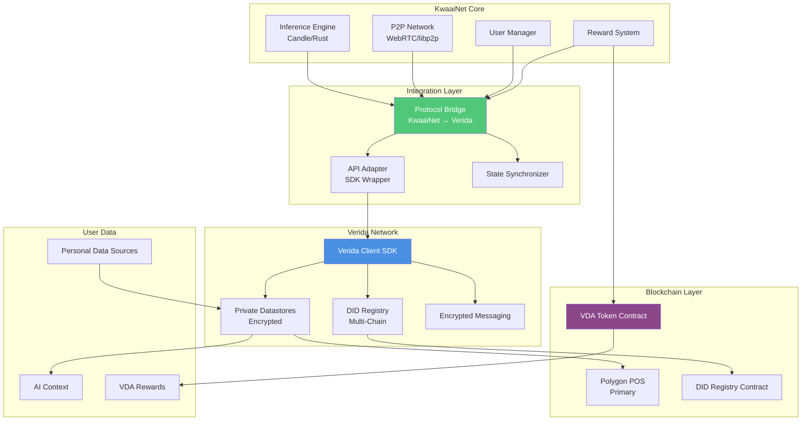
```mermaid
graph TB
    subgraph "KwaaiNet Core"
        Engine[Inference Engine<br/>Candle/Rust]
        P2P[P2P Network<br/>WebRTC/libp2p]
        UserMgr[User Manager]
        RewardSys[Reward System]
    end

    subgraph "Integration Layer"
        Bridge[Protocol Bridge<br/>KwaaiNet ↔ Verida]
        Adapter[API Adapter<br/>SDK Wrapper]
        Sync[State Synchronizer]
    end

    subgraph "Verida Network"
        VeridaClient[Verida Client SDK]
        Storage[Private Datastores<br/>Encrypted]
        DID[DID Registry<br/>Multi-Chain]
        Messaging[Encrypted Messaging]
    end

    subgraph "Blockchain Layer"
        Polygon[Polygon POS<br/>Primary]
        VDAToken[VDA Token Contract]
        DIDContract[DID Registry Contract]
    end

    subgraph "User Data"
        Personal[Personal Data Sources]
        AIContext[AI Context]
        Rewards[VDA Rewards]
    end

    Engine --> Bridge
    P2P --> Bridge
    UserMgr --> Bridge
    RewardSys --> Bridge

    Bridge --> Adapter
    Adapter --> VeridaClient
    Bridge --> Sync

    VeridaClient --> Storage
    VeridaClient --> DID
    VeridaClient --> Messaging

    DID --> DIDContract
    Storage --> Polygon
    RewardSys --> VDAToken

    Personal --> Storage
    Storage --> AIContext
    VDAToken --> Rewards

    style Bridge fill:#50C878,color:#fff
    style VeridaClient fill:#4A90E2,color:#fff
    style VDAToken fill:#8B4789,color:#fff
```

### 1.2 Integration Components Overview

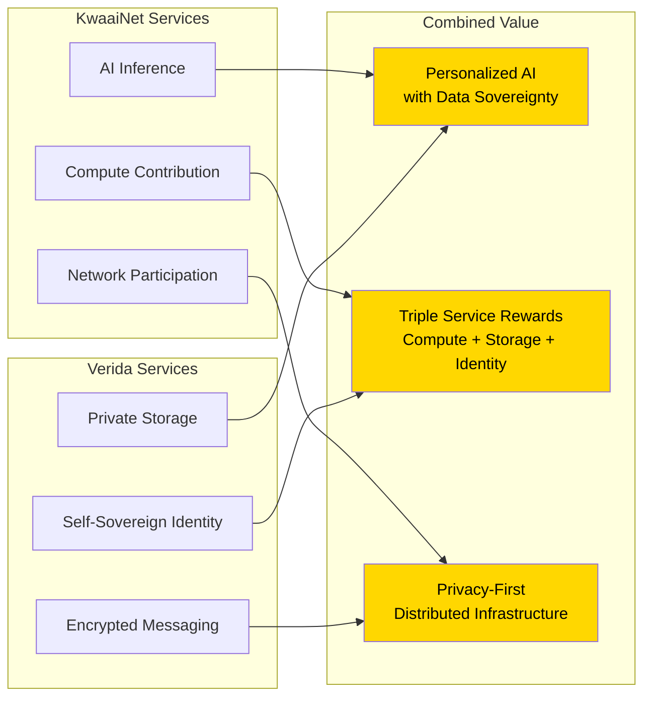
```mermaid
graph LR
    subgraph "KwaaiNet Services"
        K1[AI Inference]
        K2[Compute Contribution]
        K3[Network Participation]
    end

    subgraph "Verida Services"
        V1[Private Storage]
        V2[Self-Sovereign Identity]
        V3[Encrypted Messaging]
    end

    subgraph "Combined Value"
        C1[Personalized AI<br/>with Data Sovereignty]
        C2[Triple Service Rewards<br/>Compute + Storage + Identity]
        C3[Privacy-First<br/>Distributed Infrastructure]
    end

    K1 --> C1
    V1 --> C1

    K2 --> C2
    V2 --> C2

    K3 --> C3
    V3 --> C3

    style C1 fill:#FFD700,color:#000
    style C2 fill:#FFD700,color:#000
    style C3 fill:#FFD700,color:#000
```

---

## Protocol Bridge Design

### 2.1 Protocol Bridge Architecture

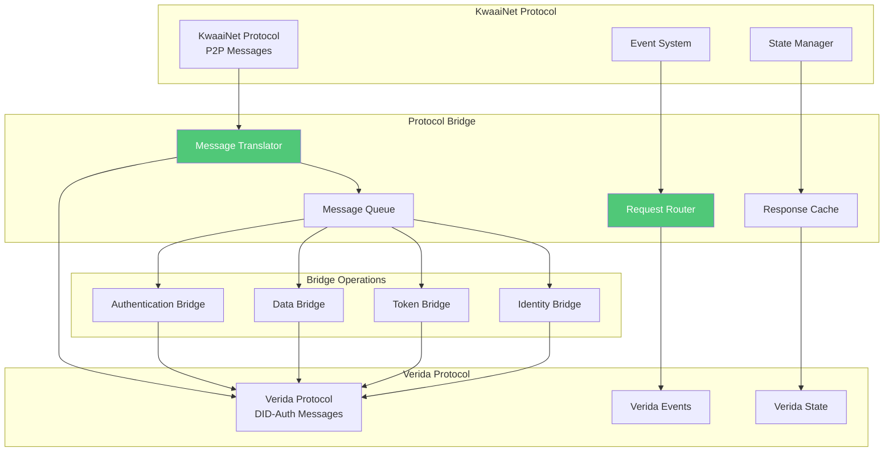
```mermaid
graph TB
    subgraph "KwaaiNet Protocol"
        KProto[KwaaiNet Protocol<br/>P2P Messages]
        KEvents[Event System]
        KState[State Manager]
    end

    subgraph "Protocol Bridge"
        Translator[Message Translator]
        Router[Request Router]
        Cache[Response Cache]
        Queue[Message Queue]
    end

    subgraph "Verida Protocol"
        VProto[Verida Protocol<br/>DID-Auth Messages]
        VEvents[Verida Events]
        VState[Verida State]
    end

    subgraph "Bridge Operations"
        Auth[Authentication Bridge]
        Data[Data Bridge]
        Token[Token Bridge]
        Identity[Identity Bridge]
    end

    KProto --> Translator
    KEvents --> Router
    KState --> Cache

    Translator --> VProto
    Router --> VEvents
    Cache --> VState

    Translator --> Queue
    Queue --> Auth
    Queue --> Data
    Queue --> Token
    Queue --> Identity

    Auth --> VProto
    Data --> VProto
    Token --> VProto
    Identity --> VProto

    style Translator fill:#50C878,color:#fff
    style Router fill:#50C878,color:#fff
```

### 2.2 Message Translation Flow

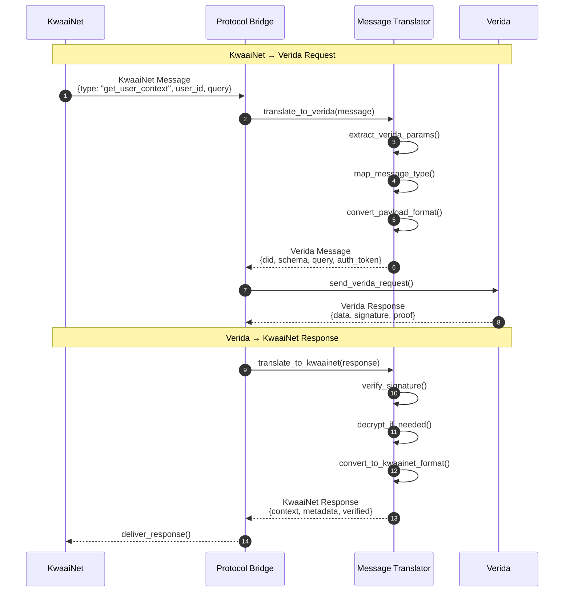
```mermaid
sequenceDiagram
    autonumber
    participant KwaaiNet
    participant Bridge as Protocol Bridge
    participant Translator as Message Translator
    participant Verida

    Note over KwaaiNet,Verida: KwaaiNet → Verida Request

    KwaaiNet->>Bridge: KwaaiNet Message<br/>{type: "get_user_context", user_id, query}
    Bridge->>Translator: translate_to_verida(message)

    Translator->>Translator: extract_verida_params()
    Translator->>Translator: map_message_type()
    Translator->>Translator: convert_payload_format()

    Translator-->>Bridge: Verida Message<br/>{did, schema, query, auth_token}

    Bridge->>Verida: send_verida_request()
    Verida-->>Bridge: Verida Response<br/>{data, signature, proof}

    Note over KwaaiNet,Verida: Verida → KwaaiNet Response

    Bridge->>Translator: translate_to_kwaainet(response)

    Translator->>Translator: verify_signature()
    Translator->>Translator: decrypt_if_needed()
    Translator->>Translator: convert_to_kwaainet_format()

    Translator-->>Bridge: KwaaiNet Response<br/>{context, metadata, verified}

    Bridge-->>KwaaiNet: deliver_response()
```

### 2.3 Bridge State Synchronization

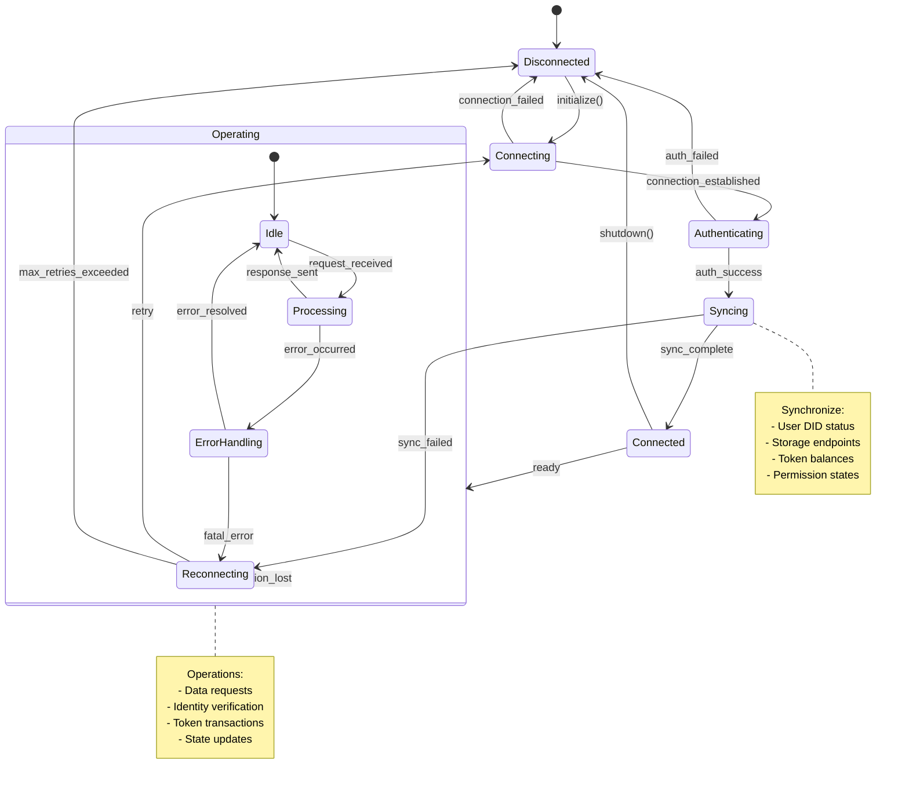
```mermaid
stateDiagram-v2
    [*] --> Disconnected

    Disconnected --> Connecting: initialize()

    Connecting --> Authenticating: connection_established
    Connecting --> Disconnected: connection_failed

    Authenticating --> Syncing: auth_success
    Authenticating --> Disconnected: auth_failed

    Syncing --> Connected: sync_complete
    Syncing --> Reconnecting: sync_failed

    Connected --> Operating: ready

    state Operating {
        [*] --> Idle
        Idle --> Processing: request_received
        Processing --> Idle: response_sent
        Processing --> ErrorHandling: error_occurred
        ErrorHandling --> Idle: error_resolved
        ErrorHandling --> Reconnecting: fatal_error
    }

    Operating --> Reconnecting: connection_lost
    Reconnecting --> Connecting: retry
    Reconnecting --> Disconnected: max_retries_exceeded

    Connected --> Disconnected: shutdown()

    note right of Syncing
        Synchronize:
        - User DID status
        - Storage endpoints
        - Token balances
        - Permission states
    end note

    note right of Operating
        Operations:
        - Data requests
        - Identity verification
        - Token transactions
        - State updates
    end note
```

---

## Identity Management Architecture

### 3.1 DID (Decentralized Identifier) Architecture

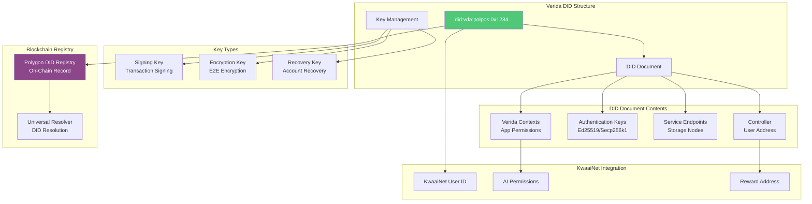
```mermaid
graph TB
    subgraph "Verida DID Structure"
        DID[did:vda:polpos:0x1234...]
        DidDoc[DID Document]
        Keys[Key Management]
    end

    subgraph "DID Document Contents"
        Controller[Controller<br/>User Address]
        AuthKeys[Authentication Keys<br/>Ed25519/Secp256k1]
        ServiceEndpoints[Service Endpoints<br/>Storage Nodes]
        Context[Verida Contexts<br/>App Permissions]
    end

    subgraph "Key Types"
        SigningKey[Signing Key<br/>Transaction Signing]
        EncryptionKey[Encryption Key<br/>E2E Encryption]
        RecoveryKey[Recovery Key<br/>Account Recovery]
    end

    subgraph "Blockchain Registry"
        PolygonDID[Polygon DID Registry<br/>On-Chain Record]
        Resolver[Universal Resolver<br/>DID Resolution]
    end

    subgraph "KwaaiNet Integration"
        UserID[KwaaiNet User ID]
        Permissions[AI Permissions]
        RewardAddress[Reward Address]
    end

    DID --> DidDoc
    DidDoc --> Controller
    DidDoc --> AuthKeys
    DidDoc --> ServiceEndpoints
    DidDoc --> Context

    Keys --> SigningKey
    Keys --> EncryptionKey
    Keys --> RecoveryKey

    DID --> PolygonDID
    PolygonDID --> Resolver

    DID --> UserID
    Context --> Permissions
    Controller --> RewardAddress

    style DID fill:#50C878,color:#fff
    style PolygonDID fill:#8B4789,color:#fff
```

### 3.2 Identity Creation Flow

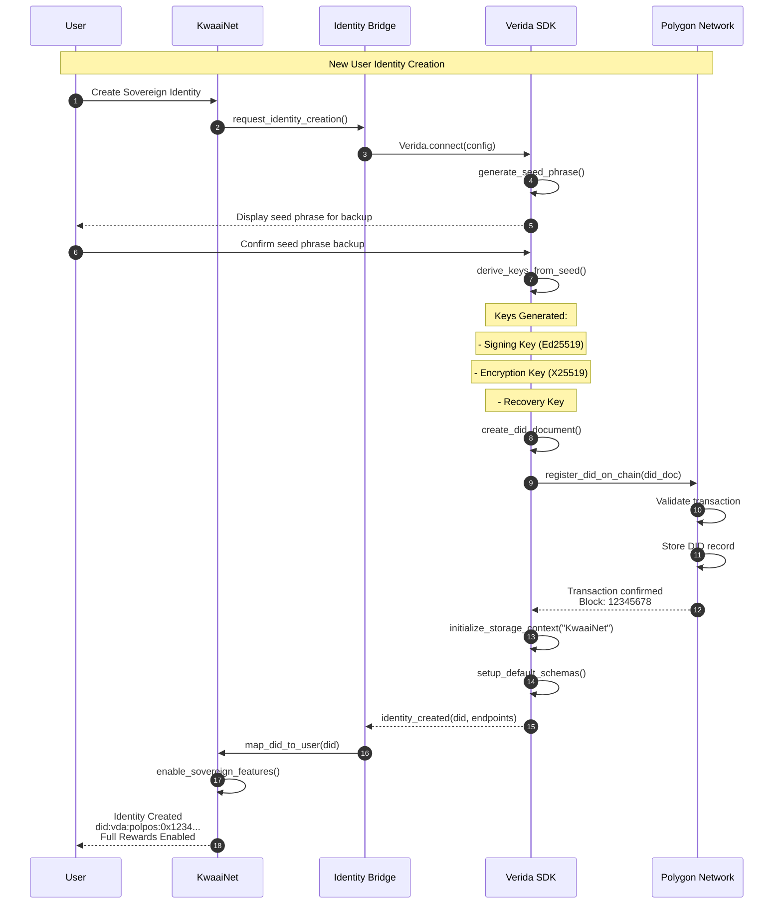
```mermaid
sequenceDiagram
    autonumber
    participant User
    participant KwaaiNet
    participant Bridge as Identity Bridge
    participant Verida as Verida SDK
    participant Polygon as Polygon Network

    Note over User,Polygon: New User Identity Creation

    User->>KwaaiNet: Create Sovereign Identity
    KwaaiNet->>Bridge: request_identity_creation()

    Bridge->>Verida: Verida.connect(config)
    Verida->>Verida: generate_seed_phrase()
    Verida-->>User: Display seed phrase for backup

    User->>Verida: Confirm seed phrase backup
    Verida->>Verida: derive_keys_from_seed()

    Note over Verida: Keys Generated:
    Note over Verida: - Signing Key (Ed25519)
    Note over Verida: - Encryption Key (X25519)
    Note over Verida: - Recovery Key

    Verida->>Verida: create_did_document()
    Verida->>Polygon: register_did_on_chain(did_doc)

    Polygon->>Polygon: Validate transaction
    Polygon->>Polygon: Store DID record
    Polygon-->>Verida: Transaction confirmed<br/>Block: 12345678

    Verida->>Verida: initialize_storage_context("KwaaiNet")
    Verida->>Verida: setup_default_schemas()

    Verida-->>Bridge: identity_created(did, endpoints)

    Bridge->>KwaaiNet: map_did_to_user(did)
    KwaaiNet->>KwaaiNet: enable_sovereign_features()

    KwaaiNet-->>User: Identity Created<br/>did:vda:polpos:0x1234...<br/>Full Rewards Enabled
```

### 3.3 Multi-Context Identity Management

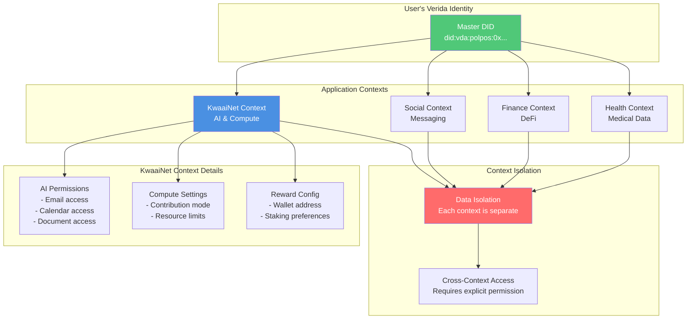
```mermaid
graph TB
    subgraph "User's Verida Identity"
        MasterDID[Master DID<br/>did:vda:polpos:0x...]
    end

    subgraph "Application Contexts"
        KwaaiNetCtx[KwaaiNet Context<br/>AI & Compute]
        SocialCtx[Social Context<br/>Messaging]
        FinanceCtx[Finance Context<br/>DeFi]
        HealthCtx[Health Context<br/>Medical Data]
    end

    subgraph "KwaaiNet Context Details"
        AIPerms[AI Permissions<br/>- Email access<br/>- Calendar access<br/>- Document access]
        ComputeSettings[Compute Settings<br/>- Contribution mode<br/>- Resource limits]
        RewardConfig[Reward Config<br/>- Wallet address<br/>- Staking preferences]
    end

    subgraph "Context Isolation"
        Isolation[Data Isolation<br/>Each context is separate]
        CrossAccess[Cross-Context Access<br/>Requires explicit permission]
    end

    MasterDID --> KwaaiNetCtx
    MasterDID --> SocialCtx
    MasterDID --> FinanceCtx
    MasterDID --> HealthCtx

    KwaaiNetCtx --> AIPerms
    KwaaiNetCtx --> ComputeSettings
    KwaaiNetCtx --> RewardConfig

    KwaaiNetCtx --> Isolation
    SocialCtx --> Isolation
    FinanceCtx --> Isolation
    HealthCtx --> Isolation

    Isolation --> CrossAccess

    style MasterDID fill:#50C878,color:#fff
    style KwaaiNetCtx fill:#4A90E2,color:#fff
    style Isolation fill:#FF6B6B,color:#fff
```

---

## Storage Layer Architecture

### 4.1 Verida Storage Architecture

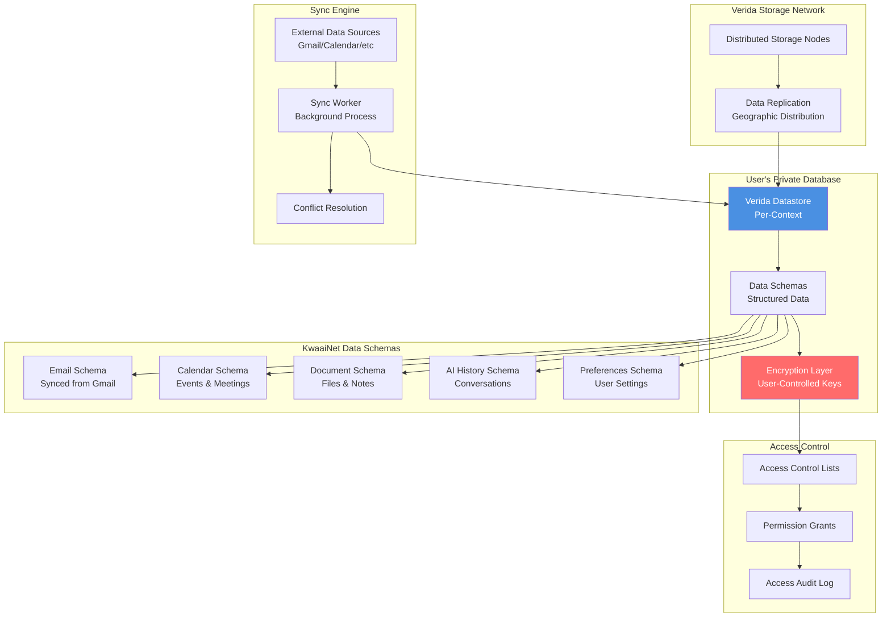
```mermaid
graph TB
    subgraph "Verida Storage Network"
        StorageNodes[Distributed Storage Nodes]
        Replication[Data Replication<br/>Geographic Distribution]
    end

    subgraph "User's Private Database"
        Datastore[Verida Datastore<br/>Per-Context]
        Schemas[Data Schemas<br/>Structured Data]
        Encryption[Encryption Layer<br/>User-Controlled Keys]
    end

    subgraph "KwaaiNet Data Schemas"
        EmailSchema[Email Schema<br/>Synced from Gmail]
        CalendarSchema[Calendar Schema<br/>Events & Meetings]
        DocumentSchema[Document Schema<br/>Files & Notes]
        AIHistorySchema[AI History Schema<br/>Conversations]
        PreferencesSchema[Preferences Schema<br/>User Settings]
    end

    subgraph "Access Control"
        ACL[Access Control Lists]
        Permissions[Permission Grants]
        Audit[Access Audit Log]
    end

    subgraph "Sync Engine"
        DataSources[External Data Sources<br/>Gmail/Calendar/etc]
        SyncWorker[Sync Worker<br/>Background Process]
        Conflict[Conflict Resolution]
    end

    StorageNodes --> Replication
    Replication --> Datastore

    Datastore --> Schemas
    Schemas --> Encryption

    Schemas --> EmailSchema
    Schemas --> CalendarSchema
    Schemas --> DocumentSchema
    Schemas --> AIHistorySchema
    Schemas --> PreferencesSchema

    Encryption --> ACL
    ACL --> Permissions
    Permissions --> Audit

    DataSources --> SyncWorker
    SyncWorker --> Datastore
    SyncWorker --> Conflict

    style Datastore fill:#4A90E2,color:#fff
    style Encryption fill:#FF6B6B,color:#fff
```

### 4.2 Data Schema Integration

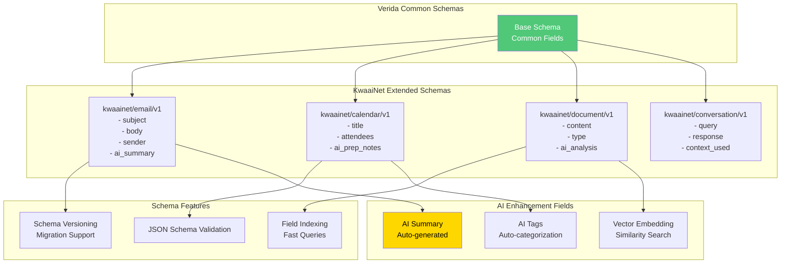
```mermaid
graph TB
    subgraph "Verida Common Schemas"
        BaseSchema[Base Schema<br/>Common Fields]
    end

    subgraph "KwaaiNet Extended Schemas"
        EmailExt[kwaainet/email/v1<br/>- subject<br/>- body<br/>- sender<br/>- ai_summary]
        CalendarExt[kwaainet/calendar/v1<br/>- title<br/>- attendees<br/>- ai_prep_notes]
        DocumentExt[kwaainet/document/v1<br/>- content<br/>- type<br/>- ai_analysis]
        ConversationExt[kwaainet/conversation/v1<br/>- query<br/>- response<br/>- context_used]
    end

    subgraph "Schema Features"
        Versioning[Schema Versioning<br/>Migration Support]
        Validation[JSON Schema Validation]
        Indexing[Field Indexing<br/>Fast Queries]
    end

    subgraph "AI Enhancement Fields"
        Summary[AI Summary<br/>Auto-generated]
        Embedding[Vector Embedding<br/>Similarity Search]
        Tags[AI Tags<br/>Auto-categorization]
    end

    BaseSchema --> EmailExt
    BaseSchema --> CalendarExt
    BaseSchema --> DocumentExt
    BaseSchema --> ConversationExt

    EmailExt --> Versioning
    CalendarExt --> Validation
    DocumentExt --> Indexing

    EmailExt --> Summary
    DocumentExt --> Embedding
    CalendarExt --> Tags

    style BaseSchema fill:#50C878,color:#fff
    style Summary fill:#FFD700,color:#000
```

### 4.3 Data Sync Flow

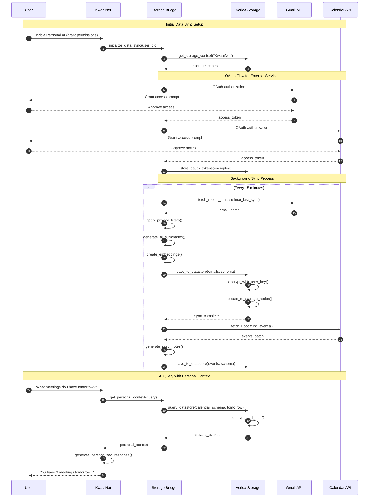
```mermaid
sequenceDiagram
    autonumber
    participant User
    participant KwaaiNet
    participant Bridge as Storage Bridge
    participant Verida as Verida Storage
    participant Gmail as Gmail API
    participant Calendar as Calendar API

    Note over User,Calendar: Initial Data Sync Setup

    User->>KwaaiNet: Enable Personal AI (grant permissions)
    KwaaiNet->>Bridge: initialize_data_sync(user_did)

    Bridge->>Verida: get_storage_context("KwaaiNet")
    Verida-->>Bridge: storage_context

    Note over Bridge,Calendar: OAuth Flow for External Services

    Bridge->>Gmail: OAuth authorization
    Gmail-->>User: Grant access prompt
    User-->>Gmail: Approve access
    Gmail-->>Bridge: access_token

    Bridge->>Calendar: OAuth authorization
    Calendar-->>User: Grant access prompt
    User-->>Calendar: Approve access
    Calendar-->>Bridge: access_token

    Bridge->>Verida: store_oauth_tokens(encrypted)

    Note over Bridge,Calendar: Background Sync Process

    loop Every 15 minutes
        Bridge->>Gmail: fetch_recent_emails(since_last_sync)
        Gmail-->>Bridge: email_batch

        Bridge->>Bridge: apply_privacy_filters()
        Bridge->>Bridge: generate_ai_summaries()
        Bridge->>Bridge: create_embeddings()

        Bridge->>Verida: save_to_datastore(emails, schema)
        Verida->>Verida: encrypt_with_user_key()
        Verida->>Verida: replicate_to_storage_nodes()
        Verida-->>Bridge: sync_complete

        Bridge->>Calendar: fetch_upcoming_events()
        Calendar-->>Bridge: events_batch

        Bridge->>Bridge: generate_prep_notes()
        Bridge->>Verida: save_to_datastore(events, schema)
    end

    Note over User,Calendar: AI Query with Personal Context

    User->>KwaaiNet: "What meetings do I have tomorrow?"
    KwaaiNet->>Bridge: get_personal_context(query)
    Bridge->>Verida: query_datastore(calendar_schema, tomorrow)
    Verida->>Verida: decrypt_and_filter()
    Verida-->>Bridge: relevant_events
    Bridge-->>KwaaiNet: personal_context
    KwaaiNet->>KwaaiNet: generate_personalized_response()
    KwaaiNet-->>User: "You have 3 meetings tomorrow..."
```

---

## Token Economics Integration

### 5.1 VDA Token Integration Architecture

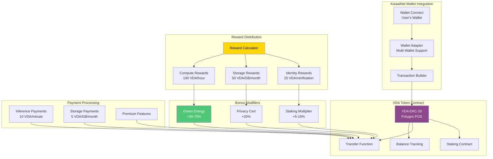
```mermaid
graph TB
    subgraph "VDA Token Contract"
        Contract[VDA ERC-20<br/>Polygon POS]
        Balance[Balance Tracking]
        Transfer[Transfer Function]
        Staking[Staking Contract]
    end

    subgraph "KwaaiNet Wallet Integration"
        WalletConnect[Wallet Connect<br/>User's Wallet]
        WalletAdapter[Wallet Adapter<br/>Multi-Wallet Support]
        TxBuilder[Transaction Builder]
    end

    subgraph "Reward Distribution"
        RewardCalc[Reward Calculator]
        ComputeRewards[Compute Rewards<br/>100 VDA/hour]
        StorageRewards[Storage Rewards<br/>50 VDA/GB/month]
        IdentityRewards[Identity Rewards<br/>25 VDA/verification]
    end

    subgraph "Bonus Modifiers"
        GreenBonus[Green Energy<br/>+30-70%]
        PrivacyBonus[Privacy Cert<br/>+20%]
        StakingBonus[Staking Multiplier<br/>+5-15%]
    end

    subgraph "Payment Processing"
        InferencePay[Inference Payments<br/>10 VDA/minute]
        StoragePay[Storage Payments<br/>5 VDA/GB/month]
        PremiumPay[Premium Features]
    end

    Contract --> Balance
    Contract --> Transfer
    Contract --> Staking

    WalletConnect --> WalletAdapter
    WalletAdapter --> TxBuilder
    TxBuilder --> Contract

    RewardCalc --> ComputeRewards
    RewardCalc --> StorageRewards
    RewardCalc --> IdentityRewards

    ComputeRewards --> GreenBonus
    StorageRewards --> PrivacyBonus
    IdentityRewards --> StakingBonus

    GreenBonus --> Transfer
    PrivacyBonus --> Transfer
    StakingBonus --> Transfer

    InferencePay --> Transfer
    StoragePay --> Transfer
    PremiumPay --> Transfer

    style Contract fill:#8B4789,color:#fff
    style GreenBonus fill:#50C878,color:#fff
    style RewardCalc fill:#FFD700,color:#000
```

### 5.2 Reward Distribution Flow

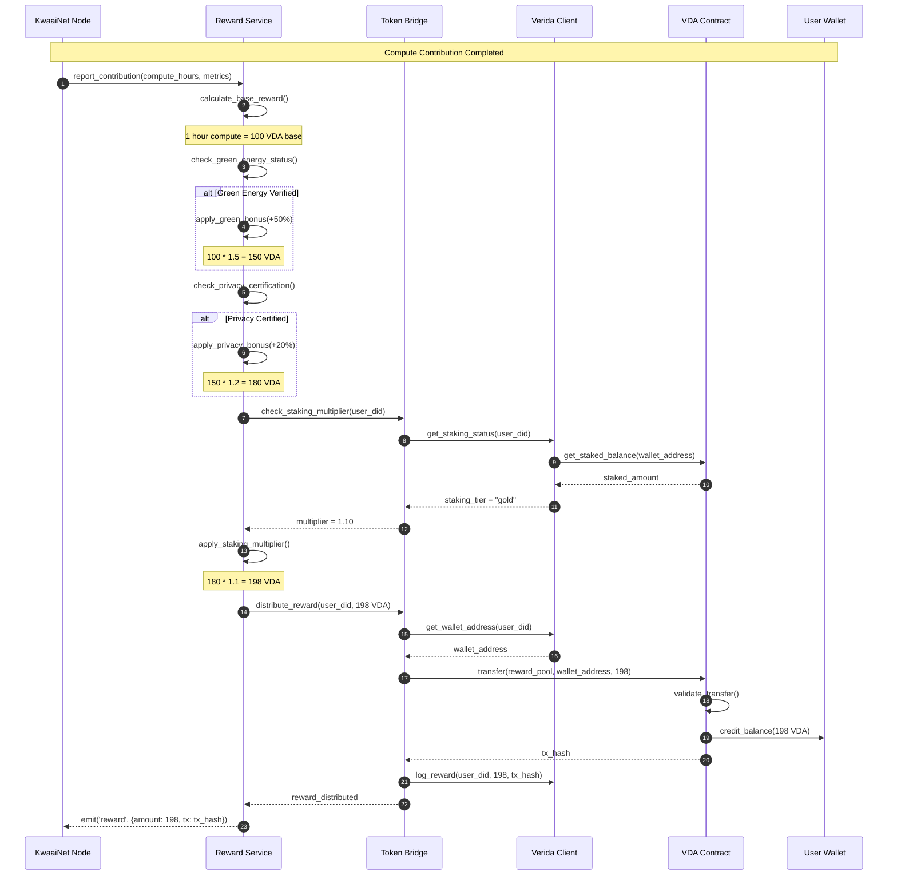
```mermaid
sequenceDiagram
    autonumber
    participant Node as KwaaiNet Node
    participant RewardSvc as Reward Service
    participant Bridge as Token Bridge
    participant Verida as Verida Client
    participant Contract as VDA Contract
    participant Wallet as User Wallet

    Note over Node,Wallet: Compute Contribution Completed

    Node->>RewardSvc: report_contribution(compute_hours, metrics)

    RewardSvc->>RewardSvc: calculate_base_reward()
    Note over RewardSvc: 1 hour compute = 100 VDA base

    RewardSvc->>RewardSvc: check_green_energy_status()
    alt Green Energy Verified
        RewardSvc->>RewardSvc: apply_green_bonus(+50%)
        Note over RewardSvc: 100 * 1.5 = 150 VDA
    end

    RewardSvc->>RewardSvc: check_privacy_certification()
    alt Privacy Certified
        RewardSvc->>RewardSvc: apply_privacy_bonus(+20%)
        Note over RewardSvc: 150 * 1.2 = 180 VDA
    end

    RewardSvc->>Bridge: check_staking_multiplier(user_did)
    Bridge->>Verida: get_staking_status(user_did)
    Verida->>Contract: get_staked_balance(wallet_address)
    Contract-->>Verida: staked_amount

    Verida-->>Bridge: staking_tier = "gold"
    Bridge-->>RewardSvc: multiplier = 1.10

    RewardSvc->>RewardSvc: apply_staking_multiplier()
    Note over RewardSvc: 180 * 1.1 = 198 VDA

    RewardSvc->>Bridge: distribute_reward(user_did, 198 VDA)

    Bridge->>Verida: get_wallet_address(user_did)
    Verida-->>Bridge: wallet_address

    Bridge->>Contract: transfer(reward_pool, wallet_address, 198)
    Contract->>Contract: validate_transfer()
    Contract->>Wallet: credit_balance(198 VDA)
    Contract-->>Bridge: tx_hash

    Bridge->>Verida: log_reward(user_did, 198, tx_hash)

    Bridge-->>RewardSvc: reward_distributed
    RewardSvc-->>Node: emit('reward', {amount: 198, tx: tx_hash})
```

### 5.3 Staking Tiers and Benefits

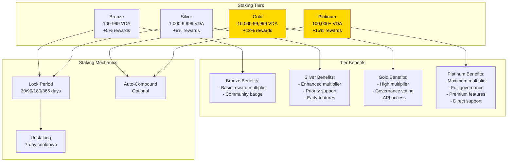
```mermaid
graph TB
    subgraph "Staking Tiers"
        Bronze[Bronze<br/>100-999 VDA<br/>+5% rewards]
        Silver[Silver<br/>1,000-9,999 VDA<br/>+8% rewards]
        Gold[Gold<br/>10,000-99,999 VDA<br/>+12% rewards]
        Platinum[Platinum<br/>100,000+ VDA<br/>+15% rewards]
    end

    subgraph "Tier Benefits"
        BronzeBenefits[Bronze Benefits:<br/>- Basic reward multiplier<br/>- Community badge]
        SilverBenefits[Silver Benefits:<br/>- Enhanced multiplier<br/>- Priority support<br/>- Early features]
        GoldBenefits[Gold Benefits:<br/>- High multiplier<br/>- Governance voting<br/>- API access]
        PlatinumBenefits[Platinum Benefits:<br/>- Maximum multiplier<br/>- Full governance<br/>- Premium features<br/>- Direct support]
    end

    subgraph "Staking Mechanics"
        Lock[Lock Period<br/>30/90/180/365 days]
        Compound[Auto-Compound<br/>Optional]
        Unstake[Unstaking<br/>7-day cooldown]
    end

    Bronze --> BronzeBenefits
    Silver --> SilverBenefits
    Gold --> GoldBenefits
    Platinum --> PlatinumBenefits

    Bronze --> Lock
    Silver --> Lock
    Gold --> Compound
    Platinum --> Compound

    Lock --> Unstake

    style Platinum fill:#FFD700,color:#000
    style Gold fill:#FFD700,color:#000
```

---

## Security Architecture

### 6.1 End-to-End Encryption Architecture

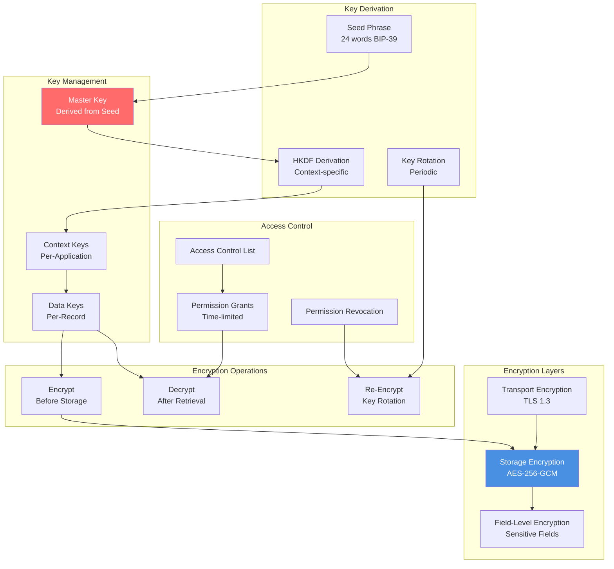
```mermaid
graph TB
    subgraph "Key Management"
        MasterKey[Master Key<br/>Derived from Seed]
        ContextKeys[Context Keys<br/>Per-Application]
        DataKeys[Data Keys<br/>Per-Record]
    end

    subgraph "Encryption Layers"
        Transport[Transport Encryption<br/>TLS 1.3]
        Storage[Storage Encryption<br/>AES-256-GCM]
        Field[Field-Level Encryption<br/>Sensitive Fields]
    end

    subgraph "Key Derivation"
        Seed[Seed Phrase<br/>24 words BIP-39]
        HKDF[HKDF Derivation<br/>Context-specific]
        Rotation[Key Rotation<br/>Periodic]
    end

    subgraph "Encryption Operations"
        Encrypt[Encrypt<br/>Before Storage]
        Decrypt[Decrypt<br/>After Retrieval]
        ReEncrypt[Re-Encrypt<br/>Key Rotation]
    end

    subgraph "Access Control"
        ACL[Access Control List]
        Permissions[Permission Grants<br/>Time-limited]
        Revocation[Permission Revocation]
    end

    Seed --> MasterKey
    MasterKey --> HKDF
    HKDF --> ContextKeys
    ContextKeys --> DataKeys

    DataKeys --> Encrypt
    DataKeys --> Decrypt

    Encrypt --> Storage
    Storage --> Field

    Transport --> Storage

    ACL --> Permissions
    Permissions --> Decrypt
    Revocation --> ReEncrypt
    Rotation --> ReEncrypt

    style MasterKey fill:#FF6B6B,color:#fff
    style Storage fill:#4A90E2,color:#fff
```

### 6.2 Zero-Knowledge Authentication Flow

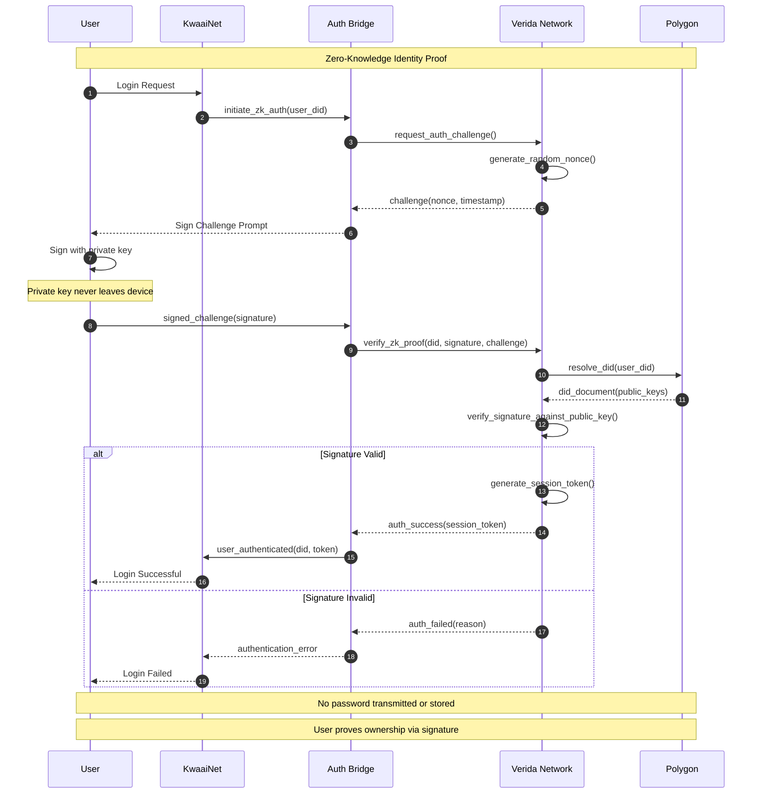
```mermaid
sequenceDiagram
    autonumber
    participant User
    participant KwaaiNet
    participant Bridge as Auth Bridge
    participant Verida as Verida Network
    participant Blockchain as Polygon

    Note over User,Blockchain: Zero-Knowledge Identity Proof

    User->>KwaaiNet: Login Request
    KwaaiNet->>Bridge: initiate_zk_auth(user_did)

    Bridge->>Verida: request_auth_challenge()
    Verida->>Verida: generate_random_nonce()
    Verida-->>Bridge: challenge(nonce, timestamp)

    Bridge-->>User: Sign Challenge Prompt

    User->>User: Sign with private key
    Note over User: Private key never leaves device

    User->>Bridge: signed_challenge(signature)

    Bridge->>Verida: verify_zk_proof(did, signature, challenge)

    Verida->>Blockchain: resolve_did(user_did)
    Blockchain-->>Verida: did_document(public_keys)

    Verida->>Verida: verify_signature_against_public_key()

    alt Signature Valid
        Verida->>Verida: generate_session_token()
        Verida-->>Bridge: auth_success(session_token)
        Bridge->>KwaaiNet: user_authenticated(did, token)
        KwaaiNet-->>User: Login Successful
    else Signature Invalid
        Verida-->>Bridge: auth_failed(reason)
        Bridge-->>KwaaiNet: authentication_error
        KwaaiNet-->>User: Login Failed
    end

    Note over User,Blockchain: No password transmitted or stored
    Note over User,Blockchain: User proves ownership via signature
```

### 6.3 Privacy-Preserving Data Access

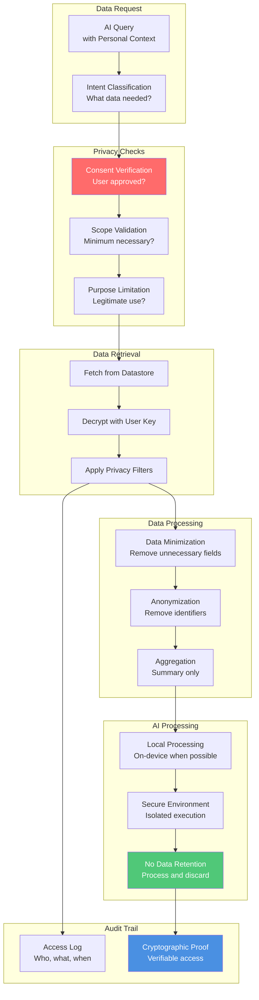
```mermaid
graph TB
    subgraph "Data Request"
        Query[AI Query<br/>with Personal Context]
        Intent[Intent Classification<br/>What data needed?]
    end

    subgraph "Privacy Checks"
        Consent[Consent Verification<br/>User approved?]
        Scope[Scope Validation<br/>Minimum necessary?]
        Purpose[Purpose Limitation<br/>Legitimate use?]
    end

    subgraph "Data Retrieval"
        Fetch[Fetch from Datastore]
        Decrypt[Decrypt with User Key]
        Filter[Apply Privacy Filters]
    end

    subgraph "Data Processing"
        Minimize[Data Minimization<br/>Remove unnecessary fields]
        Anonymize[Anonymization<br/>Remove identifiers]
        Aggregate[Aggregation<br/>Summary only]
    end

    subgraph "AI Processing"
        LocalProcess[Local Processing<br/>On-device when possible]
        SecureEnv[Secure Environment<br/>Isolated execution]
        NoRetention[No Data Retention<br/>Process and discard]
    end

    subgraph "Audit Trail"
        Log[Access Log<br/>Who, what, when]
        Proof[Cryptographic Proof<br/>Verifiable access]
    end

    Query --> Intent
    Intent --> Consent

    Consent --> Scope
    Scope --> Purpose

    Purpose --> Fetch
    Fetch --> Decrypt
    Decrypt --> Filter

    Filter --> Minimize
    Minimize --> Anonymize
    Anonymize --> Aggregate

    Aggregate --> LocalProcess
    LocalProcess --> SecureEnv
    SecureEnv --> NoRetention

    Filter --> Log
    NoRetention --> Proof

    style Consent fill:#FF6B6B,color:#fff
    style NoRetention fill:#50C878,color:#fff
    style Proof fill:#4A90E2,color:#fff
```

### 6.4 Security Threat Model

```mermaid
graph TB
    subgraph "Threat Categories"
        T1[T1: Unauthorized Access<br/>to Personal Data]
        T2[T2: Identity Theft<br/>DID Compromise]
        T3[T3: Token Theft<br/>VDA Wallet Compromise]
        T4[T4: Network Attacks<br/>P2P Manipulation]
    end

    subgraph "Mitigations for T1"
        M1a[E2E Encryption<br/>User-controlled keys]
        M1b[Zero-Knowledge Auth<br/>No password storage]
        M1c[Access Control<br/>Granular permissions]
    end

    subgraph "Mitigations for T2"
        M2a[Multi-Factor Auth<br/>Biometric + Key]
        M2b[Key Recovery<br/>Social recovery]
        M2c[DID Rotation<br/>Compromised key recovery]
    end

    subgraph "Mitigations for T3"
        M3a[Hardware Wallet<br/>Secure key storage]
        M3b[Transaction Limits<br/>Rate limiting]
        M3c[Multi-Sig<br/>High-value transactions]
    end

    subgraph "Mitigations for T4"
        M4a[Peer Verification<br/>DID-based trust]
        M4b[Message Signing<br/>Authenticated comms]
        M4c[Reputation System<br/>Bad actor detection]
    end

    T1 --> M1a
    T1 --> M1b
    T1 --> M1c

    T2 --> M2a
    T2 --> M2b
    T2 --> M2c

    T3 --> M3a
    T3 --> M3b
    T3 --> M3c

    T4 --> M4a
    T4 --> M4b
    T4 --> M4c

    style T1 fill:#FF6B6B,color:#fff
    style T2 fill:#FF6B6B,color:#fff
    style T3 fill:#FF6B6B,color:#fff
    style T4 fill:#FF6B6B,color:#fff

    style M1a fill:#50C878,color:#fff
    style M2a fill:#50C878,color:#fff
    style M3a fill:#50C878,color:#fff
    style M4a fill:#50C878,color:#fff
```

---

## Related Documentation

- [Main Architecture](../ARCHITECTURE.md) - High-level system architecture
- [Verida Integration Guide](./VERIDA_INTEGRATION.md) - Integration implementation details
- [Challenge Architectures](./CHALLENGE_ARCHITECTURES.md) - Challenge 2 Verida details
- [Data Flows](./DATA_FLOWS.md) - Authentication and data flows
- [Deployment Architecture](./DEPLOYMENT_ARCHITECTURE.md) - Platform deployment patterns

---

**Document Status**: Draft - Technical Specification
**Next Review**: December 2025
**Maintainer**: KwaaiNet Architecture Team
