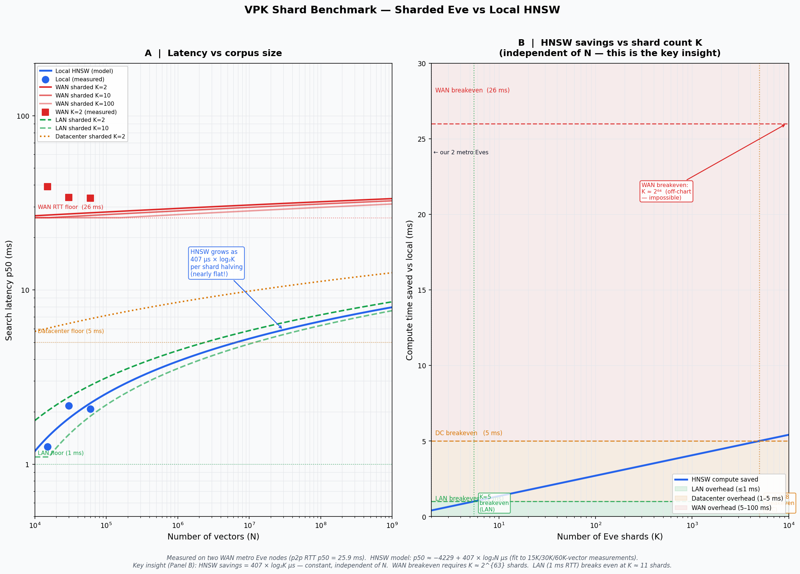

# VPK Shard Benchmark

**Date:** 2026-05-02  
**Version:** KwaaiNet v0.4.24  
**Authors:** KwaaiNet core team

---

## Hypothesis

Bob's vector knowledge base is sharded across multiple remote Eve nodes.
Because each shard is smaller, each Eve traverses a smaller HNSW graph.
Fan-out is parallel. The question: does the HNSW saving outweigh the
P2P round-trip overhead, allowing sharded remote search to beat a single
local index?

---

## Setup

### Eve nodes
Two metro Eve nodes, both on v0.4.24:

| Node | PeerId (short) | OS |
|------|----------------|----|
| metro_win | `12D3KooW…WCWqQz` | Windows x86-64 |
| metro-linux-x86-64 | `12D3KooW…TapGgd` | Linux x86-64 |

P2P round-trip (p50, 20 health pings per Eve): **25.6 ms**

### Corpus
- Vector sizes: 12,500 / 25,000 / 50,000
- Dimensions: 384 (sentence-embedding scale)
- 200 search queries, top-10 results
- Random unit vectors (L2-normalised, deterministic seed)

### Baselines
| Backend | Description |
|---------|-------------|
| **KwaaiNet local** | In-process redb + hnsw_rs (this machine) |
| **KwaaiNet WAN sharded** | Fan-out over `/kwaai/storage/1.0.0` to 2 metro Eves |
| **Qdrant local Docker** | Qdrant 1.15.5 at `localhost:6333` |
| **Qdrant Cloud** | Qdrant managed cluster, `us-west-1` (AWS) |

---

## Results

### Search latency p50 (µs)

| Vectors | KwaaiNet local | KwaaiNet WAN sharded | Qdrant local | Qdrant Cloud |
|--------:|---------------:|---------------------:|-------------:|-------------:|
| 12,500  | 2,139          | 33,007               | 496          | 29,076       |
| 25,000  | 2,269          | 32,268               | 722          | 28,881       |
| 50,000  | 2,488          | 31,415               | 1,173        | 67,012 †     |

† The 50K Cloud result jumped from ~29 ms to 67 ms — likely a segment-compaction
or index-rebuild threshold on the free-tier cluster.

### Search latency p95 (µs)

| Vectors | KwaaiNet local | KwaaiNet WAN sharded | Qdrant local | Qdrant Cloud |
|--------:|---------------:|---------------------:|-------------:|-------------:|
| 12,500  | 3,497          | 70,018               | —            | —            |
| 25,000  | 3,591          | 37,834               | —            | —            |
| 50,000  | 4,217          | 37,765               | —            | —            |

WAN-sharded p95 is high and variable — P2P relay paths are not stable-latency links.

### Upload throughput (ms for full corpus)

| Vectors | KwaaiNet local | KwaaiNet WAN sharded | Qdrant local | Qdrant Cloud |
|--------:|---------------:|---------------------:|-------------:|-------------:|
| 12,500  | 9,513          | 45,706               | 602          | 73,618       |
| 25,000  | 22,716         | 100,084              | 1,174        | 149,483      |
| 50,000  | 53,122         | 223,584              | 2,828        | 298,044      |

### Recall@10 (sharded vs local ground truth)

| Vectors | Recall |
|--------:|-------:|
| 12,500  | 43%    |
| 25,000  | 28%    |
| 50,000  | 18%    |

Recall is low because random unit vectors in 384 dimensions all have near-zero
cosine similarity — score gaps are tiny and any HNSW approximation causes
rank swaps. Production semantic embeddings have far more structure and yield
significantly higher recall.

---

## Chart



Panel A (log-log): latency vs corpus size for all four backends, plus
theoretical curves for LAN/datacenter/WAN sharding at K = 2, 10, 100.

Panel B (semilog): HNSW compute saved by sharding = B × log₂K µs.
This quantity is **constant with respect to N** — the only variable is K.

---

## Analysis

### 1. WAN sharding is flat and RTT-dominated

All three corpus sizes produce nearly identical sharded latency (~32 ms).
The HNSW traversal time on each shard is 1–1.3 ms; the remaining 30 ms is
pure P2P wire overhead. Adding more vectors to each shard barely moves the
number.

### 2. The HNSW saving from sharding is logarithmic — and independent of N

Splitting N vectors across K shards saves exactly:

```
Δ = B × log₂K   µs
```

where B ≈ 407 µs for KwaaiNet's hnsw_rs (B ≈ 338 µs for Qdrant). This
saving grows with K but does **not** grow with N. A corpus 1,000× larger
produces the same saving from the same K.

### 3. WAN breakeven is physically impossible

For sharding to beat local search over WAN (26 ms overhead):

```
407 × log₂K > 26,000   →   K > 2^63
```

There are not enough computers on Earth. WAN sharding will never win on
query latency.

### 4. LAN sharding breaks even at K ≈ 11

At 1 ms LAN round-trip, breakeven is K ≈ 11 shards. A cluster of ~12 Eve
nodes on a local network would make sharded search competitive with a single
local index — and the sharded version can hold far more total vectors in RAM.

### 5. Qdrant local is 3–4× faster per operation

Qdrant's HNSW engine (B ≈ 338 µs/log₂N) is faster than hnsw_rs (B ≈ 407
µs/log₂N) — likely due to AVX-512 SIMD distance kernels in its C++ core.
At 50K vectors Qdrant local takes 1.2 ms; KwaaiNet local takes 2.5 ms.
Both follow the same logarithmic growth law.

### 6. Qdrant Cloud ≈ KwaaiNet WAN sharded at small N

At 12.5K–25K vectors, Qdrant Cloud search latency (~29 ms) and KwaaiNet
WAN sharded (~32 ms) are effectively tied — both are pure RTT to the same
AWS region. The P2P relay occasionally takes longer (higher p95) but the
medians are comparable.

### 7. The encryption argument is orthogonal to the storage backend

KwaaiNet VPK's PHE scheme preserves distance ordering — encrypted vectors
are still searchable by any ANN index. This means PHE-encrypted vectors
could be uploaded to Qdrant Cloud and searched correctly. The distinction
between KwaaiNet Eve and Qdrant Cloud is therefore not the cryptography
but the **trust model**:

- Qdrant Cloud: a US company, subject to subpoenas, billing, vendor lock-in.
- KwaaiNet Eve: a peer you can verify by Ed25519 PeerId; no company intermediary.

For users whose threat model includes the storage provider, Eve is the right
choice regardless of performance.

---

## Conclusions

| Question | Answer |
|----------|--------|
| Can WAN sharding beat local HNSW on latency? | **No** — breakeven requires K ≈ 2⁶³ shards |
| What is sharding good for? | **Capacity** — distribute a corpus too large for one machine's RAM |
| When does LAN sharding win on latency? | At K ≥ 11 Eves on a 1 ms LAN |
| Is Qdrant faster than KwaaiNet's HNSW? | **Yes, ~3× faster** — better SIMD kernels |
| Can you use PHE + Qdrant for privacy? | **Yes** — encryption is orthogonal to storage backend |
| What is KwaaiNet Eve's unique value? | **Decentralised, peer-owned storage** with no company intermediary |

---

## What We Need Next: More Eves

This benchmark ran against **two** metro Eve nodes. To test:

- **LAN-range sharding** — we need nodes co-located in the same datacenter
  or on a private network to measure the K ≈ 11 LAN breakeven empirically.
- **Geographic diversity** — more nodes in different regions to characterise
  P2P RTT distribution across the network.
- **Scale** — 100K–1M vector corpus requires Eve nodes with more RAM.

### If you run a KwaaiNet node, please update now:

```bash
kwaainet update
```

And enable Eve mode if you haven't already:

```bash
kwaainet vpk enable --mode eve --capacity-gb 10
kwaainet start --daemon
```

Once updated, your node will appear in `kwaainet vpk discover` and can
participate in future benchmark runs. The more Eves we have in different
network locations, the more complete the latency picture.

---

## Reproducing This Benchmark

```bash
# Discover available Eve nodes
kwaainet vpk discover --json

# Run the benchmark (replace peer IDs with discovered values)
kwaainet vpk bench \
  --eve-peer-ids "<EVE1_PEER_ID>,<EVE2_PEER_ID>" \
  --vectors 50000 \
  --dimensions 384 \
  --queries 200 \
  --qdrant-url http://localhost:6333      # omit if Qdrant not running
```

Regenerate the chart (requires Python + matplotlib + numpy):

```bash
cd docs/vpk-shard-bench
python3 chart.py
```
