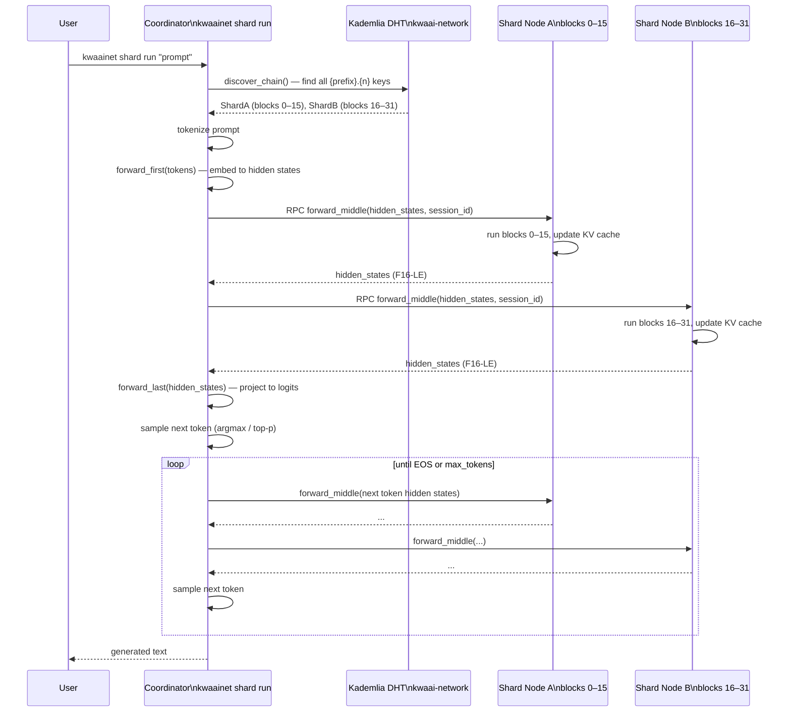
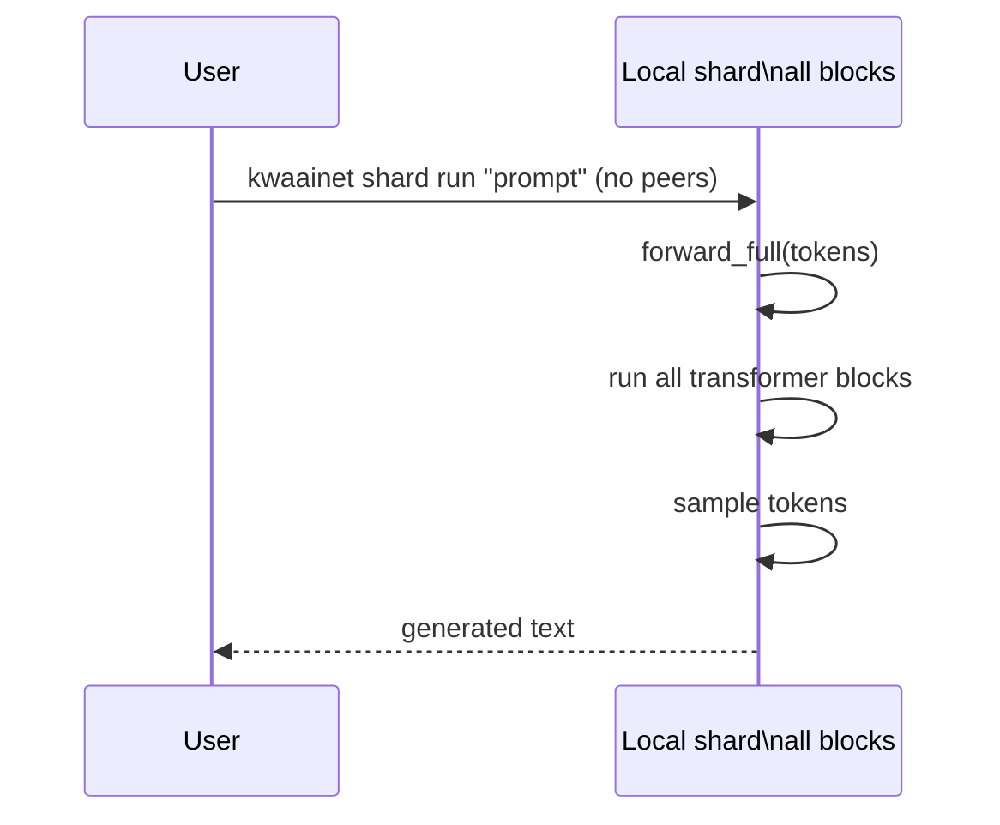
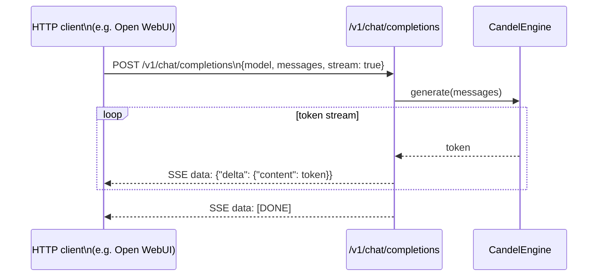
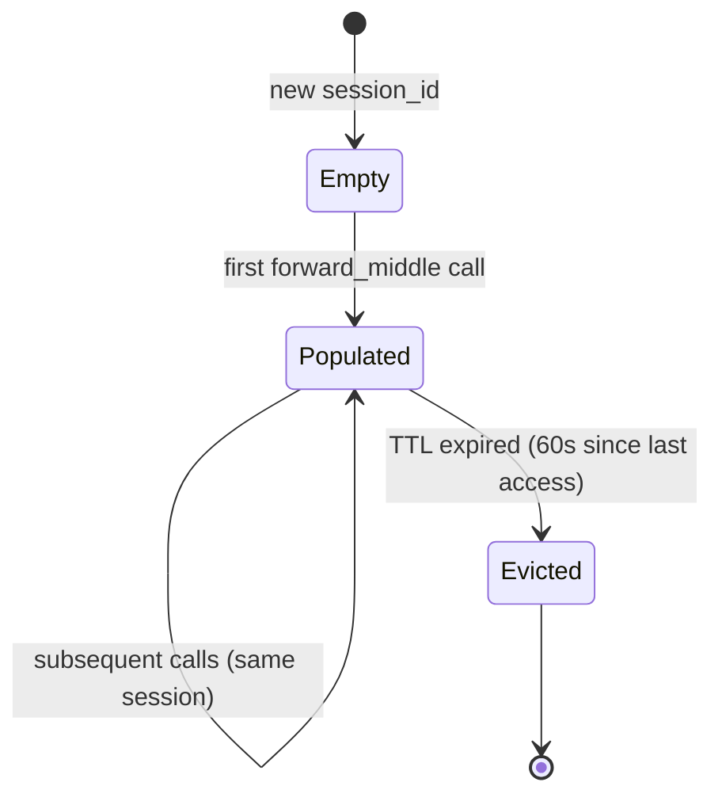

# kwaai-compute — Data Flows

## Distributed inference (multi-node shard chain)

```mermaid
sequenceDiagram
    participant User
    participant Coord as Coordinator\nkwaainet shard run
    participant DHT as Kademlia DHT\nkwaai-network
    participant ShardA as Shard Node A\nblocks 0–15
    participant ShardB as Shard Node B\nblocks 16–31

    User->>Coord: kwaainet shard run "prompt"
    Coord->>DHT: discover_chain() — find all {prefix}.{n} keys
    DHT-->>Coord: ShardA (blocks 0–15), ShardB (blocks 16–31)
    Coord->>Coord: tokenize prompt
    Coord->>Coord: forward_first(tokens) — embed to hidden states
    Coord->>ShardA: RPC forward_middle(hidden_states, session_id)
    ShardA->>ShardA: run blocks 0–15, update KV cache
    ShardA-->>Coord: hidden_states (F16-LE)
    Coord->>ShardB: RPC forward_middle(hidden_states, session_id)
    ShardB->>ShardB: run blocks 16–31, update KV cache
    ShardB-->>Coord: hidden_states (F16-LE)
    Coord->>Coord: forward_last(hidden_states) — project to logits
    Coord->>Coord: sample next token (argmax / top-p)
    loop until EOS or max_tokens
        Coord->>ShardA: forward_middle(next token hidden states)
        ShardA-->>Coord: ...
        Coord->>ShardB: forward_middle(...)
        ShardB-->>Coord: ...
        Coord->>Coord: sample next token
    end
    Coord-->>User: generated text
```

## Single-node inference (all blocks on one machine)

```mermaid
sequenceDiagram
    participant User
    participant Shard as Local shard\nall blocks

    User->>Shard: kwaainet shard run "prompt" (no peers)
    Shard->>Shard: forward_full(tokens)
    Shard->>Shard: run all transformer blocks
    Shard->>Shard: sample tokens
    Shard-->>User: generated text
```

## OpenAI-compatible API request

```mermaid
sequenceDiagram
    participant Client as HTTP client\n(e.g. Open WebUI)
    participant API as /v1/chat/completions
    participant Engine as CandelEngine

    Client->>API: POST /v1/chat/completions\n{model, messages, stream: true}
    API->>Engine: generate(messages)
    loop token stream
        Engine-->>API: token
        API-->>Client: SSE data: {"delta": {"content": token}}
    end
    API-->>Client: SSE data: [DONE]
```

## KV cache lifecycle

```mermaid
stateDiagram-v2
    [*] --> Empty: new session_id
    Empty --> Populated: first forward_middle call
    Populated --> Populated: subsequent calls (same session)
    Populated --> Evicted: TTL expired (60s since last access)
    Evicted --> [*]
```
