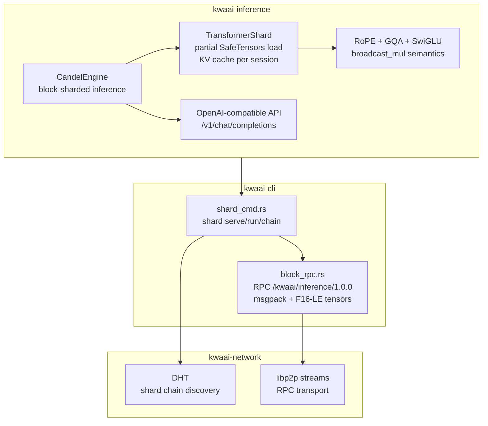
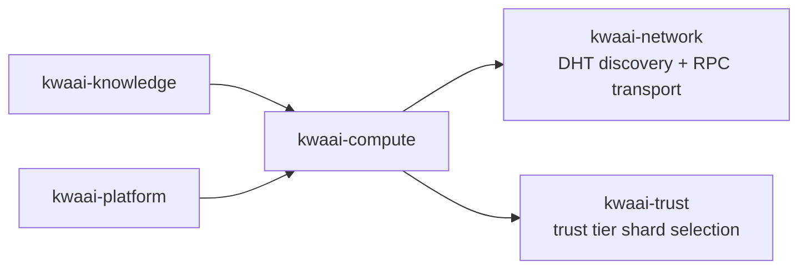

# kwaai-compute — Design Overview

## What it solves

Large open models (70B+) don't fit on a single consumer GPU. kwaai-compute implements Petals-style
block sharding so the transformer layers are split across multiple machines, each holding a contiguous
block range and serving forward passes over the P2P network.

## How it fits the whitepaper architecture

The whitepaper describes "Compute: shared, sharded LLM infrastructure". kwaai-compute is the
implementation. CandelEngine handles the math (candle primitives, no private candle_transformers
internals). The shard protocol uses the same DHT and RPC infrastructure as the rest of the network.

## Component diagram



## Dependency diagram



## Block sharding protocol

```
Model: 32 transformer blocks
Node A: blocks 0–15  (shard serve --start-block 0 --blocks 16)
Node B: blocks 16–31 (shard serve --start-block 16 --blocks 16)

Coordinator:
  tokens → embed → [Node A: blocks 0-15] → [Node B: blocks 16-31] → sample → text
```

## RPC wire format

```
Request:  msgpack { session_id, block_start, block_end, hidden_states: F16-LE bytes, ... }
Response: msgpack { hidden_states: F16-LE bytes, ... }
Protocol: /kwaai/inference/1.0.0 over libp2p stream
```

## Session KV cache

Each `TransformerShard` holds a `HashMap<session_id, KVCache>` with 60s TTL.
Sessions are identified by the coordinator's session UUID. The cache persists across
multiple `forward_middle` calls from the same session (multi-turn chat).
