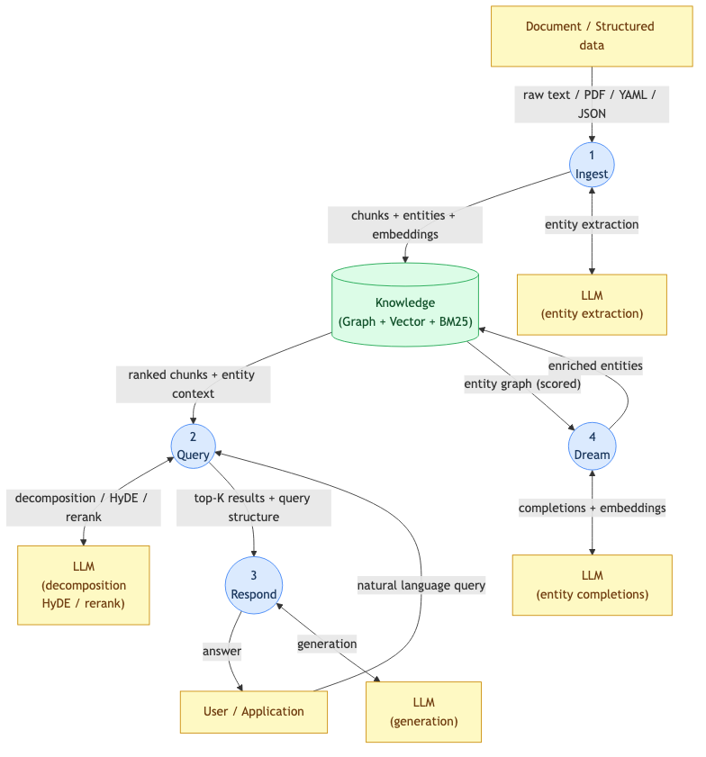
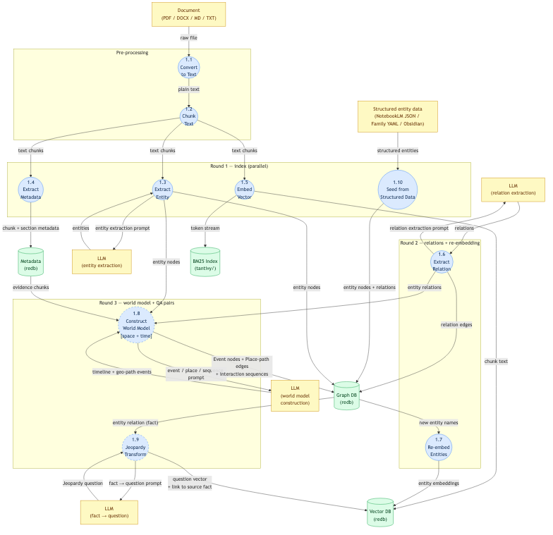
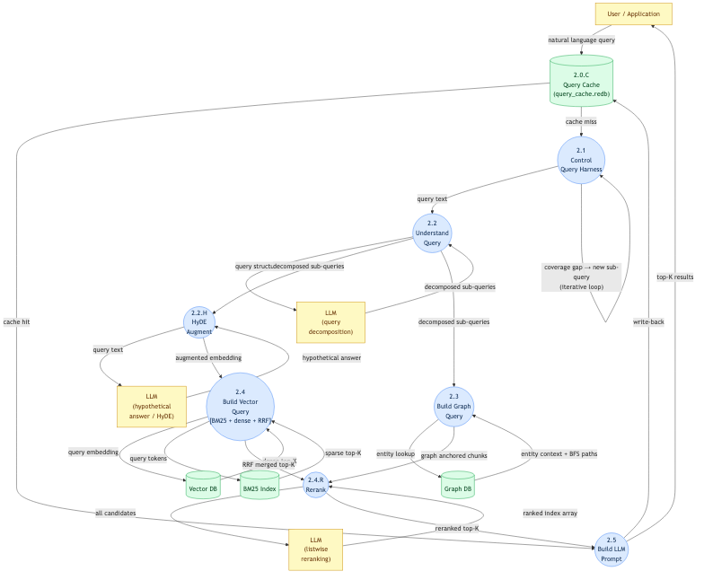
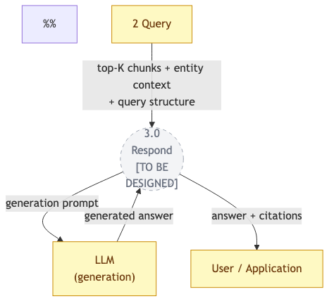
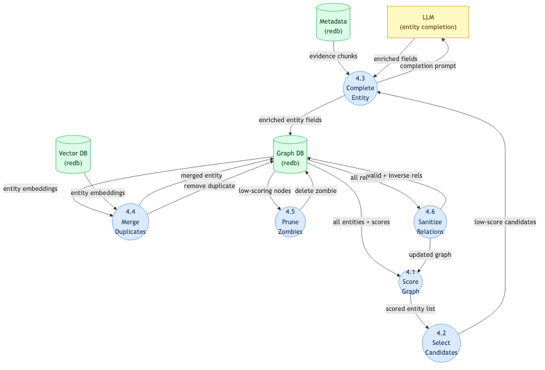
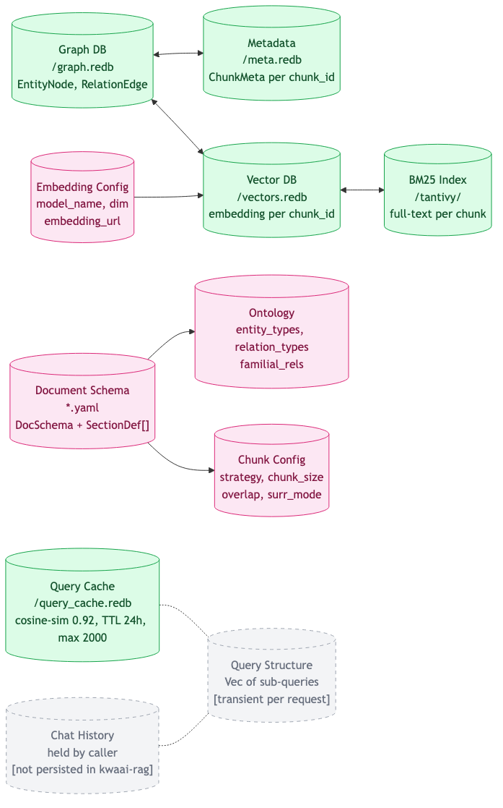

# kwaai-rag — DFD Architecture

Yourdon Data Flow Diagrams synced to the running code. Use these as the live map of the system —
propose architectural changes by editing a `.mmd` file, and implementation follows the diagram.

## Diagrams

| Diagram | What it shows |
|---------|---------------|
| [DFD 0 — Overview](dfd-0.mmd) | Four top-level bubbles: Ingest, Query, Respond, Dream |
| [DFD 1 — Ingest](dfd-1-ingest.mmd) | 1.1 Convert → 1.8 World model; + 1.10 structured seed path |
| [DFD 2 — Query](dfd-2-query.mmd) | Hybrid retrieval with cache, HyDE, BM25+RRF, iterative loop, reranker |
| [DFD 3 — Respond](dfd-3-respond.mmd) | Placeholder — not yet decomposed |
| [DFD 4 — Dream](dfd-4-dream.mmd) | Iterative entity enrichment: score → complete → merge → prune → sanitize |
| [Knowledge Stores](dfd-knowledge.mmd) | All persistent and transient data stores |

## Notation

| Yourdon element | Mermaid shape | Visual |
|-----------------|---------------|--------|
| Process (circle) | `(("label"))` | Blue fill |
| External entity (rectangle) | `["label"]` | Yellow fill |
| Data store (cylinder) | `[("label")]` | Green fill |
| Unimplemented node | dashed border | Grey fill |

Every process node has a `%% → src/file.rs : fn()` annotation in the source for code traceability.

## Rendered PNGs

## Workflow

**To propose a code change via diagram:**
1. Edit the relevant `.mmd` file (or mark up the PNG and share the image)
2. Show me the change — I'll read the diff or your image
3. I implement the code change and re-render the PNG in the same commit

**When code changes:** the relevant `.mmd` + `.png` are updated in the same commit.

## What's in code but not in the original DFDs

These components exist in the codebase but were absent from the hand-drawn diagrams:

| Component | Where in diagrams |
|-----------|-------------------|
| BM25 hybrid retrieval (tantivy) | DFD 2: inside 2.4 |
| HyDE query augmentation | DFD 2: node 2.2.H |
| LLM reranker | DFD 2: node 2.4.R |
| Iterative coverage-based retrieval | DFD 2: 2.1 loop annotation |
| Query result cache | DFD 2: 2.0.C store |
| Eval harness | DFD 2: feeds into scoring metrics |
| Obsidian vault import | DFD 1: inside 1.10 |
| NotebookLM / Family YAML seeding | DFD 1: node 1.10 |

## What's in the original DFDs but not yet implemented

| Node | Status |
|------|--------|
| 1.9 Jeopardy transform | Stub (`wiki.rs`) — marked NOT IMPL in DFD 1 |
| 3.0 Respond decomposition | Not designed — DFD 3 is a placeholder |
