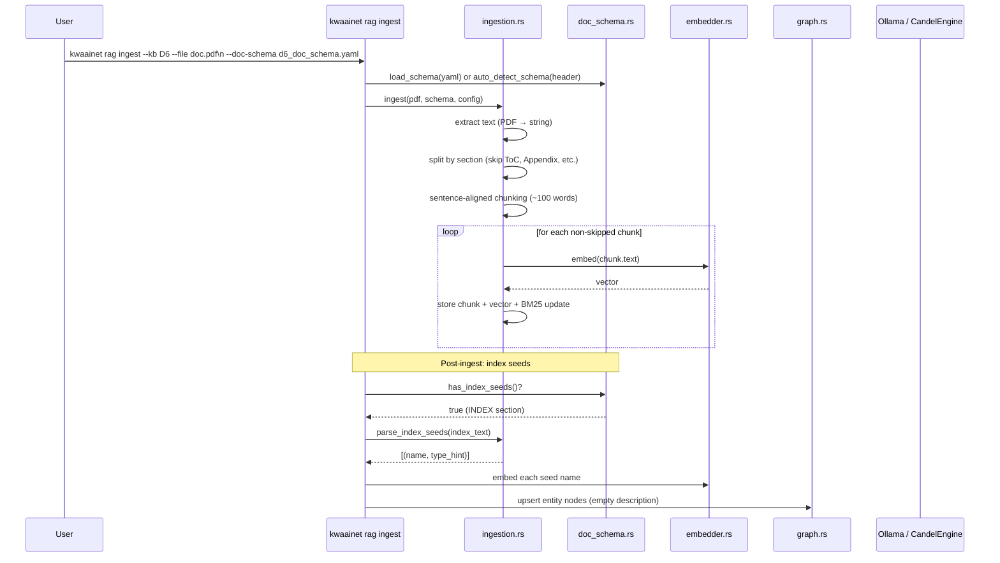
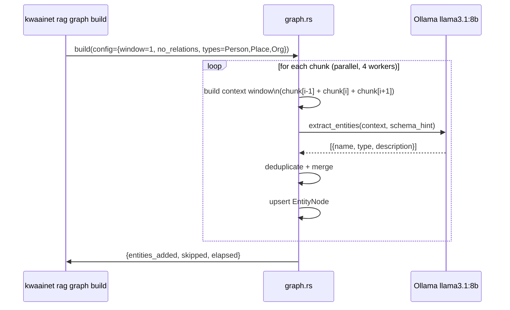
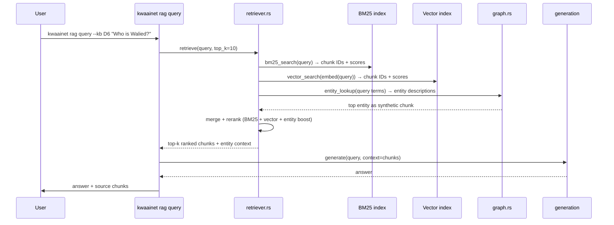
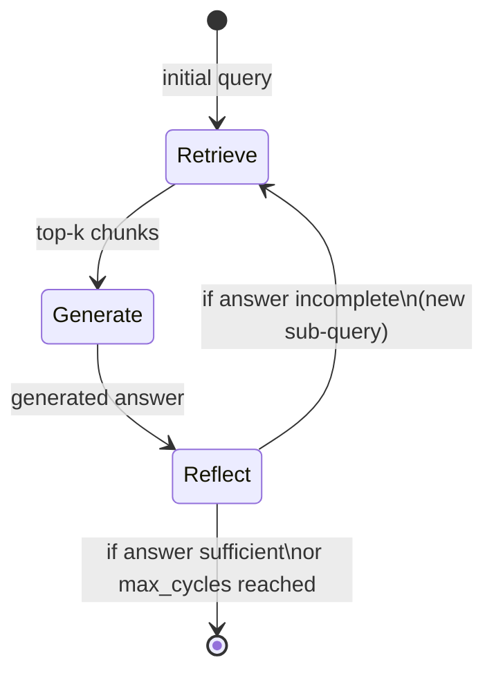
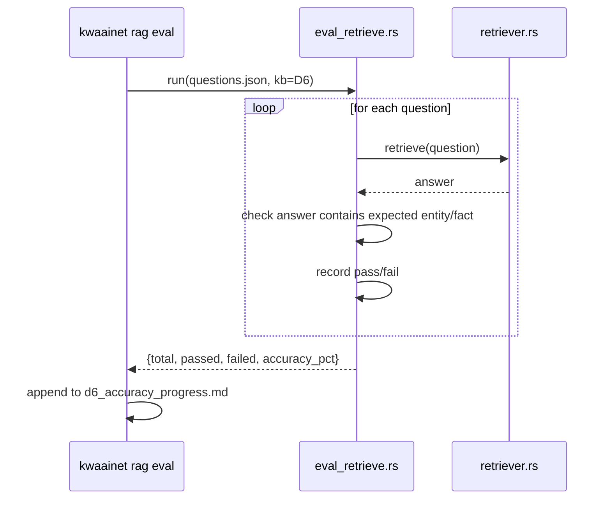

# kwaai-knowledge — Data Flows

## Document ingestion pipeline

```mermaid
sequenceDiagram
    participant User
    participant CLI as kwaainet rag ingest
    participant Ingest as ingestion.rs
    participant Schema as doc_schema.rs
    participant Embed as embedder.rs
    participant Graph as graph.rs
    participant LLM as Ollama / CandelEngine

    User->>CLI: kwaainet rag ingest --kb D6 --file doc.pdf\n  --doc-schema d6_doc_schema.yaml
    CLI->>Schema: load_schema(yaml) or auto_detect_schema(header)
    CLI->>Ingest: ingest(pdf, schema, config)
    Ingest->>Ingest: extract text (PDF → string)
    Ingest->>Ingest: split by section (skip ToC, Appendix, etc.)
    Ingest->>Ingest: sentence-aligned chunking (~100 words)
    loop for each non-skipped chunk
        Ingest->>Embed: embed(chunk.text)
        Embed-->>Ingest: vector
        Ingest->>Ingest: store chunk + vector + BM25 update
    end
    Note over CLI,Schema: Post-ingest: index seeds
    CLI->>Schema: has_index_seeds()?
    Schema-->>CLI: true (INDEX section)
    CLI->>Ingest: parse_index_seeds(index_text)
    Ingest-->>CLI: [(name, type_hint)]
    CLI->>Embed: embed each seed name
    CLI->>Graph: upsert entity nodes (empty description)
```

## Graph build (entity extraction)

```mermaid
sequenceDiagram
    participant CLI as kwaainet rag graph build
    participant Graph as graph.rs
    participant LLM as Ollama llama3.1:8b

    CLI->>Graph: build(config={window=1, no_relations, types=Person,Place,Org})
    loop for each chunk (parallel, 4 workers)
        Graph->>Graph: build context window\n(chunk[i-1] + chunk[i] + chunk[i+1])
        Graph->>LLM: extract_entities(context, schema_hint)
        LLM-->>Graph: [{name, type, description}]
        Graph->>Graph: deduplicate + merge
        Graph->>Graph: upsert EntityNode
    end
    Graph->>CLI: {entities_added, skipped, elapsed}
```

## Hybrid retrieval

```mermaid
sequenceDiagram
    participant User
    participant CLI as kwaainet rag query
    participant Retriever as retriever.rs
    participant BM25 as BM25 index
    participant Vector as Vector index
    participant Graph as graph.rs
    participant LLM as generation

    User->>CLI: kwaainet rag query --kb D6 "Who is Walied?"
    CLI->>Retriever: retrieve(query, top_k=10)
    Retriever->>BM25: bm25_search(query) → chunk IDs + scores
    Retriever->>Vector: vector_search(embed(query)) → chunk IDs + scores
    Retriever->>Graph: entity_lookup(query terms) → entity descriptions
    Graph-->>Retriever: top entity as synthetic chunk
    Retriever->>Retriever: merge + rerank (BM25 + vector + entity boost)
    Retriever-->>CLI: top-k ranked chunks + entity context
    CLI->>LLM: generate(query, context=chunks)
    LLM-->>CLI: answer
    CLI->>User: answer + source chunks
```

## Dream (iterative self-RAG)

```mermaid
stateDiagram-v2
    [*] --> Retrieve: initial query
    Retrieve --> Generate: top-k chunks
    Generate --> Reflect: generated answer
    Reflect --> Retrieve: if answer incomplete\n(new sub-query)
    Reflect --> [*]: if answer sufficient\nor max_cycles reached
```

## Eval harness

```mermaid
sequenceDiagram
    participant CLI as kwaainet rag eval
    participant Eval as eval_retrieve.rs
    participant Retriever as retriever.rs

    CLI->>Eval: run(questions.json, kb=D6)
    loop for each question
        Eval->>Retriever: retrieve(question)
        Retriever-->>Eval: answer
        Eval->>Eval: check answer contains expected entity/fact
        Eval->>Eval: record pass/fail
    end
    Eval-->>CLI: {total, passed, failed, accuracy_pct}
    CLI->>CLI: append to d6_accuracy_progress.md
```
