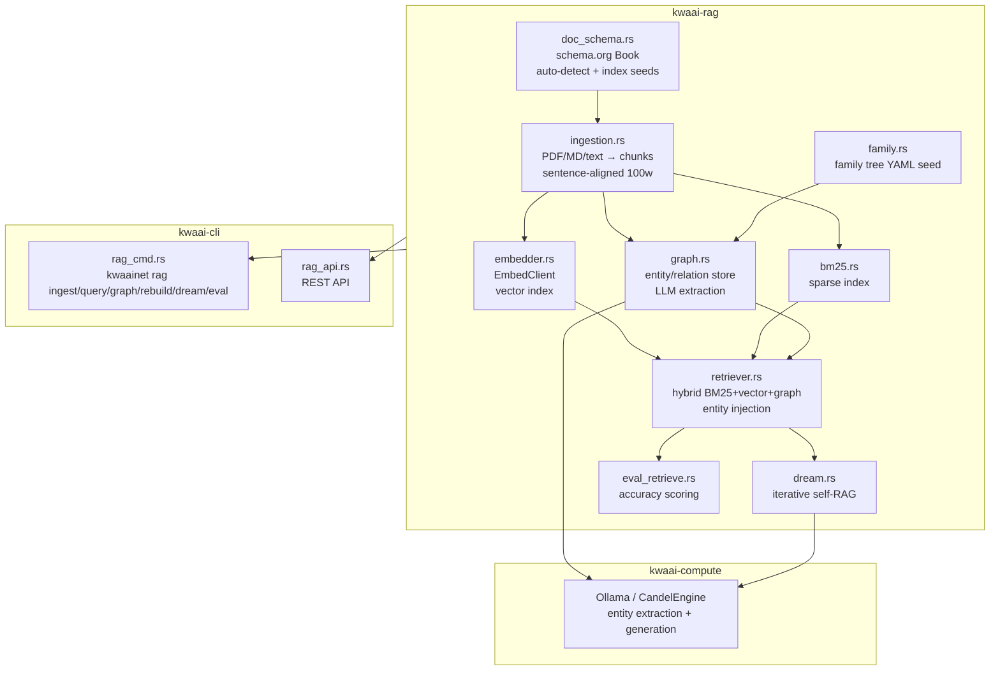
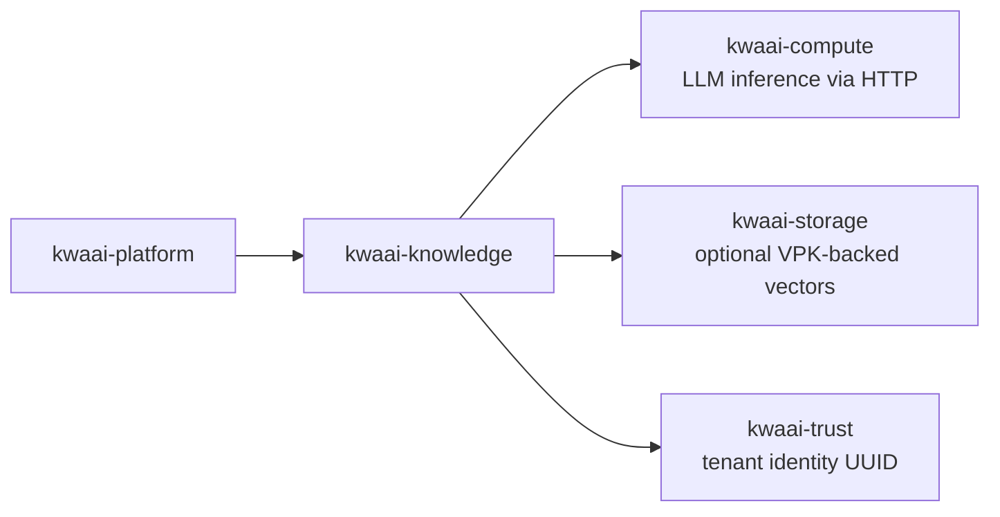

# kwaai-knowledge — Design Overview

## What it solves

Personal and organizational knowledge locked in PDFs and documents needs to be queryable in natural
language. kwaai-knowledge implements a hybrid RAG pipeline that combines dense vector search,
sparse BM25 retrieval, and a knowledge graph — with iterative self-RAG (dream) for multi-step
reasoning and an eval harness to track accuracy improvements.

## How it fits the whitepaper architecture

The whitepaper's Knowledge layer is "private, trust-anchored AI memory". kwaai-knowledge is the
current implementation, focused on the D6 memoir as the primary accuracy benchmark.
The active research direction is maximizing entity recall and precision using 8B models
to prove the approach before scaling to larger models.

## Component diagram

## Dependency diagram

## GraphIngestConfig

The key struct governing entity extraction quality:

| Field | Default | Effect |
|-------|---------|--------|
| `context_window` | 1 | N adjacent chunks added to prompt (+7pp recall) |
| `entity_cap` | 25 | Max entities per chunk (prevents hallucination floods) |
| `entity_types` | Person,Place,Org | Types to extract |
| `extract_relations` | false | Disabled — 8B models have 0–17% precision |

## D6 accuracy progression

Target: ≥ 80% on `d6_eval_questions.json` (60 questions).
See `tests/kwaai-knowledge/d6_accuracy_progress.md` for per-milestone results.
