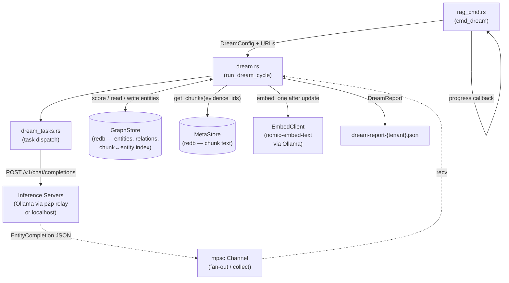
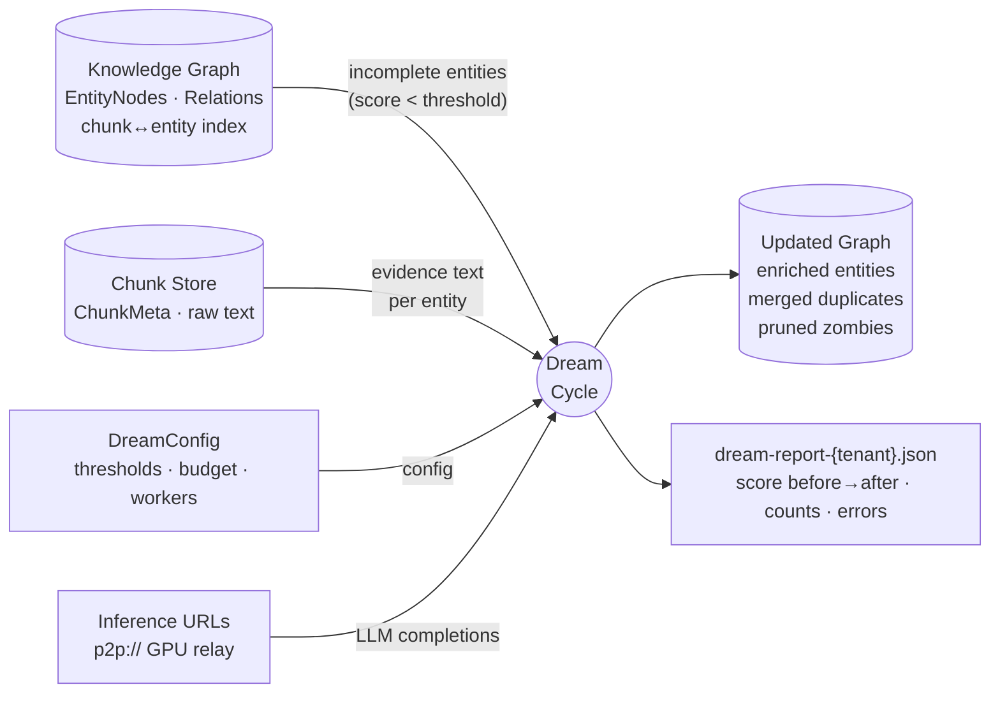
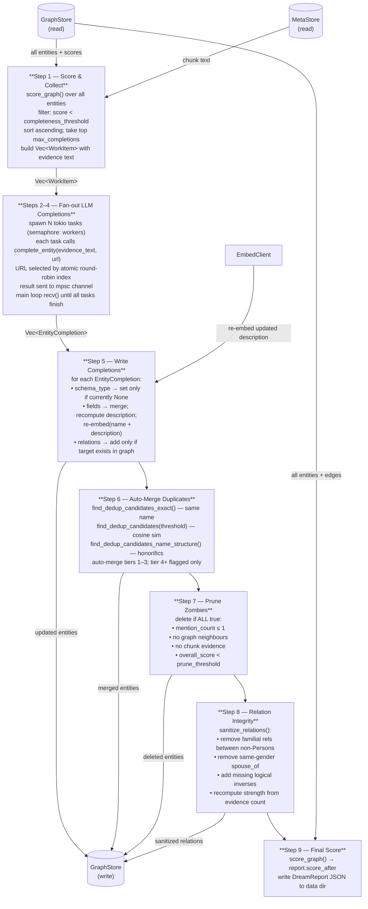
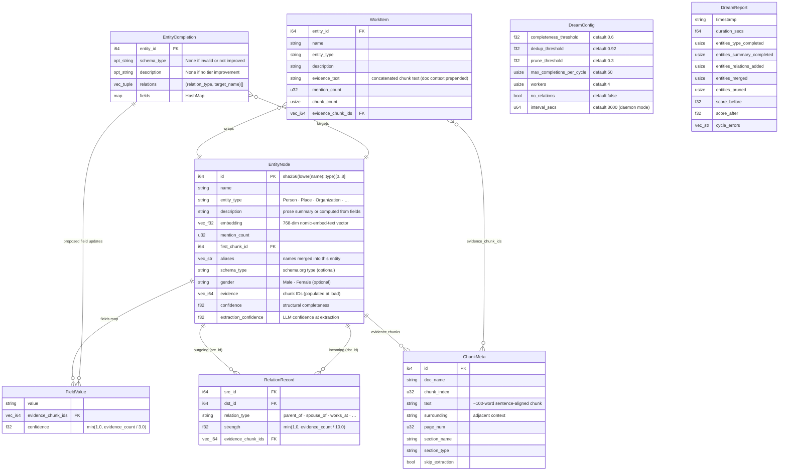
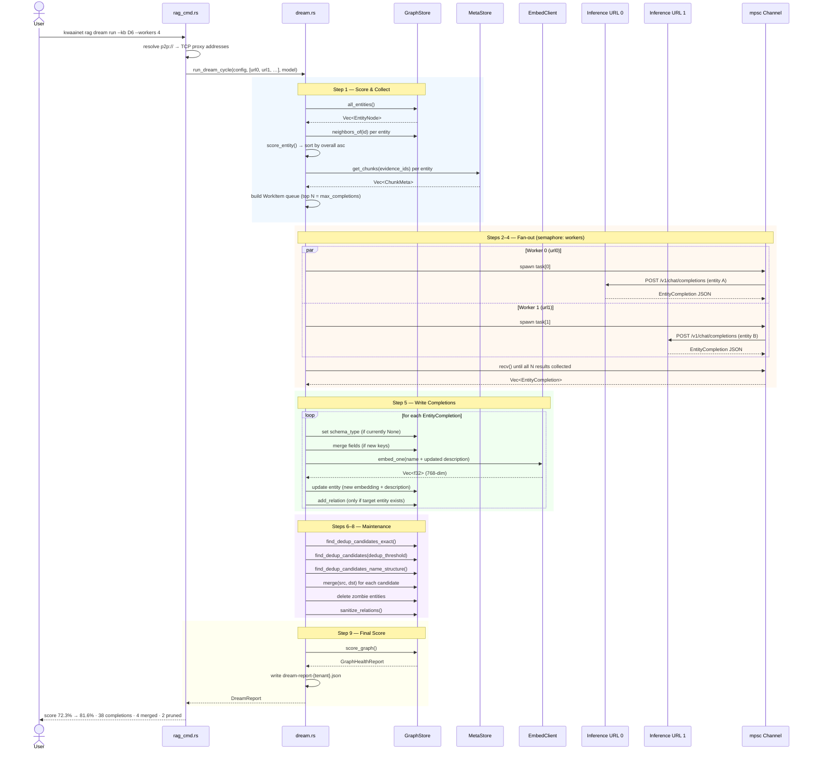

# Dream RAG — Reference Documentation

Dream is the autonomous graph-improvement loop in kwaai-knowledge. After initial ingestion and
graph extraction, entities vary in completeness: some have rich descriptions and relations, others
are stubs with just a name and type. Dream iterates over the lowest-scoring entities, enriches
them via LLM inference, deduplicates near-duplicates, prunes zombies, and fixes relation integrity
— all in one cycle that can be re-run until the graph score stabilises.

**Key design principles:**
- **Conservative acceptance** — LLM output is only applied if it strictly improves the entity (type not yet set, description gets longer/better-tiered, relation target already exists in graph)
- **Evidence-first** — the LLM receives the actual chunk text mentioning the entity, not just the entity name; completions are grounded in the source document
- **Load-balanced fan-out** — concurrent tokio tasks distribute work round-robin across multiple inference URLs; GPU relay machines work in parallel
- **Graceful degradation** — any LLM failure returns an empty completion; the cycle continues and records the error in the report

---

## 1. Component Diagram

Runtime components and their relationships.



---

## 2. DFD Level 0 — Context Diagram

Dream as a black box: what flows in and what comes out.



---

## 3. DFD Level 1 — 9-Step Cycle

Internal data flow through all nine steps. Steps 2–4 are the fan-out phase; they share one
numbered block because the tokio spawn, channel send, and channel receive are interleaved.



---

## 4. Entity Scoring

Scoring lives in `scorer.rs`. Each entity gets three independent pillar scores; `overall` is their
unweighted mean. The work queue in Step 1 targets entities with `overall < completeness_threshold`
(default 0.6), sorted worst-first.

### Pillars

| Pillar | Range | Logic |
|--------|-------|-------|
| **type_score** | 0.0 / 0.4 / 1.0 | 0.0 = Unknown (no schema type); 0.4 = `schema:Thing` (vague but valid); 1.0 = specific type |
| **summary_score** | 0.0 – 1.0 | Field-based if `expected_fields()` defined for type; otherwise description-length: empty=0.0, <50 chars=0.3, <150 chars=0.6, ≥2 sentences=1.0 |
| **relation_score** | 0.0 – 1.0 | Fraction of expected relation groups (from `expected_relation_groups()`) that have ≥1 match. Peripheral entities (mention_count ≤ 2) only need 1 group. `schema:Thing` / no expectations → neutral 0.5 |

```
overall = (type_score + summary_score + relation_score) / 3.0
```

### Expected relation groups by schema type (examples)

| Schema type | Group 1 | Group 2 | Group 3 |
|-------------|---------|---------|---------|
| `schema:Person` | family rels | works_at / founded / manages | located_in / associated_with |
| `schema:Organization` | located_in / belongs_to | founded / part_of / contains | — |
| `schema:Place` | located_in / contains / part_of | — | — |
| `schema:Event` | occurred_on / started / ended | located_in / associated_with | — |

---

## 5. Entity Relationship Diagram (ERD)

Data structures that Dream reads and writes. Arrows show foreign-key / containment relationships.



---

## 6. Sequence Diagram — One Full Dream Cycle

Interactions between all participants for a single `kwaainet rag dream run` invocation.
The fan-out phase (Steps 2–4) shows two parallel workers for illustration; real concurrency
is governed by the `--workers` semaphore.



---

## 7. LLM Completion Call — What the Model Receives and Returns

Each `complete_entity()` call posts to `/v1/chat/completions` (OpenAI-compatible, temperature=0.25,
max_tokens=700). The prompt structure:

```
[system]
You are a knowledge-graph enrichment assistant. Given entity information and source text,
output a JSON object with schema_type, description, relations, and fields.

[user]
ENTITY: {name} ({entity_type})
CURRENT DESCRIPTION: {description}
CURRENT SCHEMA TYPE: {schema_type or "none"}
CURRENT FIELDS: {fields as key: value}

DOCUMENT CONTEXT:
{doc_name} — {section_name} — {section_type}
---
EVIDENCE TEXT:
{evidence_text}  ← actual chunk text from source document

Return JSON: {schema_type, description, relations: [{type, target}], fields: {key: value}}
```

**Validation before acceptance:**

| Output field | Accepted if |
|--------------|-------------|
| `schema_type` | In the 14-type whitelist AND entity currently has `None` |
| `description` | Moves to a higher length tier OR is ≥20 chars longer in the same tier |
| `relations[]` | `relation_type` in `RELATION_TYPES`; target entity already exists in graph; `no_relations=false` |
| `fields{}` | Any new key-value pair; description recomputed from `description_from_fields()` after merge |

**Schema type whitelist (14 types):** Person, Organization, Place, Event, Product, CreativeWork,
SoftwareApplication, DefinedTerm, HowTo, Role, QuantitativeValue, Statement, Date, Thing

---

## 8. Deduplication Strategy

Three candidate-finding strategies run in sequence; all auto-merge in the same pass:

| Tier | Strategy | Auto-merge? |
|------|----------|-------------|
| 1 — Exact | Same canonical name (case-insensitive) | Yes |
| 2 — Fuzzy | Entity embedding cosine similarity > `dedup_threshold` (default 0.92) | Yes |
| 3 — Structural | Honorific variant ("Dr. Abdulla" ↔ "Abdulla") or name subset | Yes |
| 4+ — Subset/fuzzy overlap | Partial name inclusion, lower similarity | Flag only — manual review |

On merge: the lower-score entity's chunks, aliases, relations, and fields are transferred to the
higher-score entity; the source entity is deleted.

---

## 9. Configuration Reference

### `DreamConfig` / `kwaainet rag dream run` flags

| Flag | Default | Effect | Tuning guidance |
|------|---------|--------|-----------------|
| `--threshold` | 0.6 | Entities with `overall < threshold` become candidates | Lower → more work per cycle; raise if cycle takes too long |
| `--dedup-threshold` | 0.92 | Cosine similarity above this triggers auto-merge | Raise to be more conservative; 0.95+ rarely auto-merges |
| `--prune-threshold` | 0.3 | Score below this + isolated → deleted | Lower to keep more stubs; raise to prune aggressively |
| `--max-completions` | 50 | Total LLM budget for the cycle | Increase for a bigger single-pass improvement |
| `--workers` | 4 | Max concurrent inference tasks (semaphore) | Match to `OLLAMA_NUM_PARALLEL` on the GPU machine |
| `--no-relations` | off | Disable relation extraction | **Recommended on** for 8B models (precision 0–17%) |
| `--relation-summary` | off | Cross-cutting mode (see below) — replaces threshold-based selection | Use for a one-time comprehensive resummarization pass |
| `--inference-urls` | config | Comma-separated `p2p://` URLs | Use all available GPU relays for parallel load balancing |
| `--model` | default | Ollama model name | `llama3.1:8b` is the tested model |

### `--relation-summary` mode

A cross-cutting alternative to the score-threshold selection in Step 1, added for "resummarize
every well-connected entity from all its evidence, not just a capped sample." When set:

- **Selection**: every entity with `neighbors_of(id).len() >= 1`, **excluding** YAML-seeded
  entities (`extraction_confidence >= 1.0` — their descriptions are curated ground truth and must
  never be auto-resummarized). Sorted by relation count descending, so the most well-connected
  entities are covered first within `--max-completions`.
- **Evidence**: every chunk associated with the entity, uncapped (the normal path caps at 20
  chunks per entity) — `dream_tasks::run_full_summary_task` (`DreamTaskKind::FullSummary`).
- **Map-reduce**: chunks are grouped into ~6 000-char batches; each batch is summarized down to
  only the facts about the entity ("map"); if more than one batch exists, the batch summaries are
  combined into one final description ("reduce").
- **Write-back**: the resulting description always replaces the existing one
  (`EntityCompletion.force_description = true`), bypassing both the normal "must move up a summary
  tier or be +20 chars longer" gate and field-derived-description precedence — the whole point is a
  comprehensive resummarization, not an incremental nudge. Schema_type/relations/fields are never
  touched by this task, to avoid handing the LLM a large concatenated blob alongside a free-choice
  relation ask (the same hallucination risk pattern documented elsewhere in this codebase for
  large-context relation prompts).

---

## 10. Pipeline Integration Map

Where Dream sits in the full kwaai-knowledge pipeline:

```
kwaainet rag ingest          ← PDF → chunks → embeddings → MetaStore + HNSW index
         ↓
kwaainet rag graph build     ← LLM entity/relation extraction per chunk → GraphStore
         ↓
kwaainet rag graph score     ← EntityScore per entity; print worst offenders
         ↓
kwaainet rag dream run  ×N   ← iterative enrichment until score stabilises
         ↓
kwaainet rag graph seed      ← optional: inject trusted family-tree YAML
         ↓
kwaainet rag eval            ← score against eval questions
```

**Dream reads (never modifies):**
- MetaStore — chunk text and metadata
- HNSW vector index — chunk embeddings (entity embeddings are stored separately in GraphStore)

**Dream modifies:**
- GraphStore — entity fields, embeddings, schema types, descriptions, relations
- `dream-report-{tenant_id}.json` — written to the data directory after every cycle

**Dream does not touch:**
- Timeline events (`TIMELINE_TABLE`) — managed by `kwaainet rag graph timeline build`
- Sequence interactions (`INTERACTION_TABLE`) — extracted during graph build
- Chunk text / page numbers — read-only; never re-chunked by dream

---

## 11. Key Source Files

| File | Role |
|------|------|
| `core/crates/kwaai-rag/src/dream.rs` | `run_dream_cycle()`, `complete_entity()`, `DreamConfig`, `DreamReport`, `WorkItem`, `EntityCompletion` |
| `core/crates/kwaai-rag/src/dream_tasks.rs` | Task-type dispatch: Biography (Person), General; constructs task-specific prompts |
| `core/crates/kwaai-rag/src/scorer.rs` | `score_entity()`, `score_graph()`, `EntityScore`, `GraphHealthReport`, `expected_relation_groups()` |
| `core/crates/kwaai-rag/src/graph.rs` | `GraphStore`, `EntityNode`, `RelationRecord`, `FieldValue`; all graph read/write |
| `core/crates/kwaai-rag/src/meta_store.rs` | `MetaStore`, `ChunkMeta`; chunk text storage |
| `core/crates/kwaai-rag/src/embedder.rs` | `EmbedClient`; `embed_one()`, `embed_batch()` |
| `core/crates/kwaai-cli/src/rag_cmd.rs` | `cmd_dream()`: URL resolution, progress callback, report printing |
