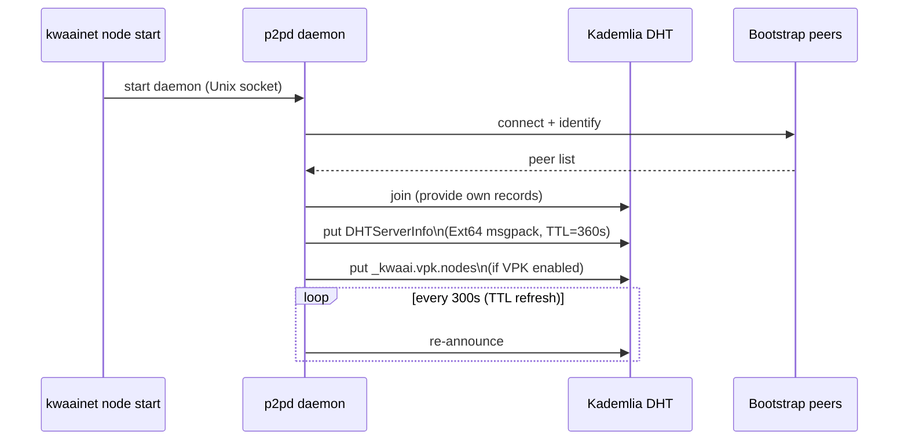
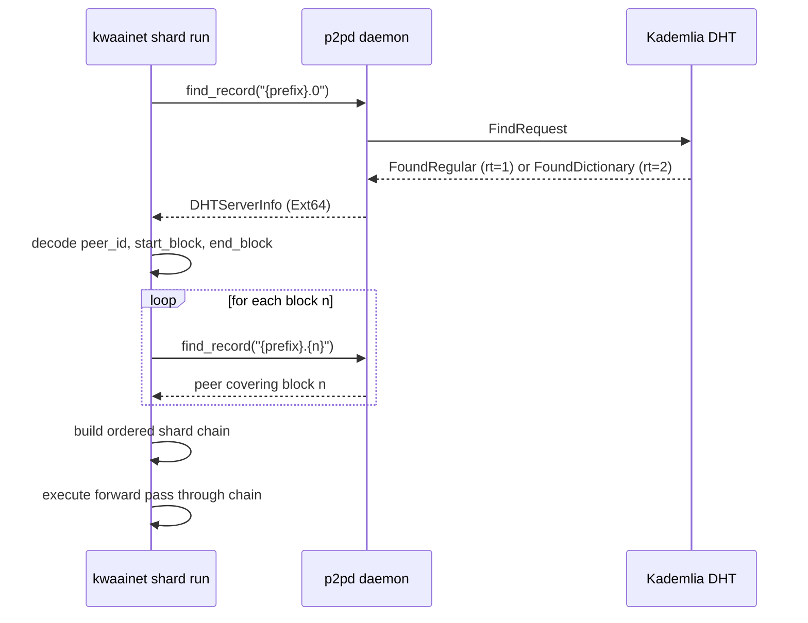
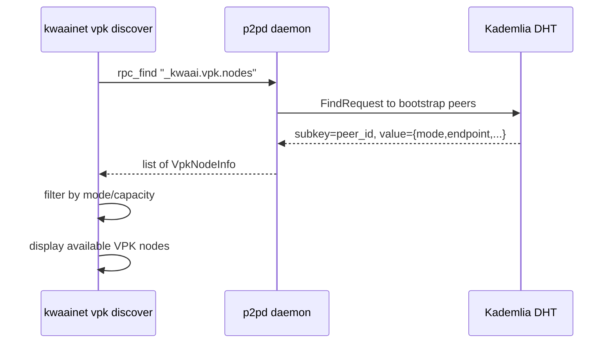
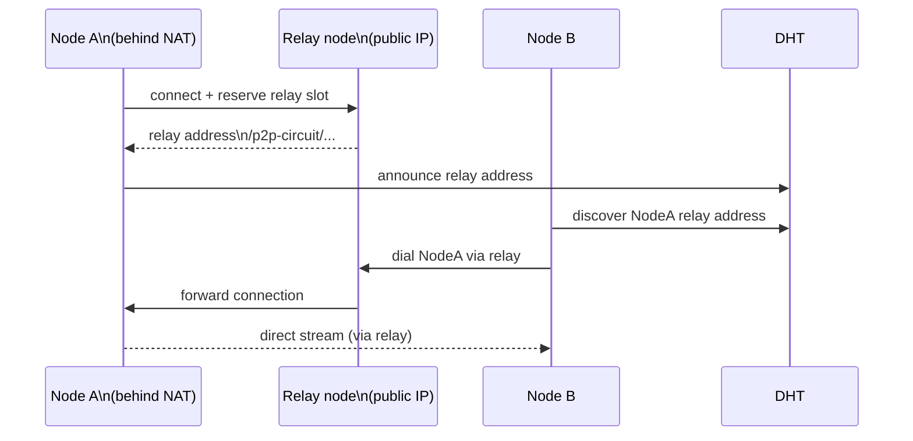

# kwaai-network — Data Flows

## Node startup and DHT announcement

```mermaid
sequenceDiagram
    participant CLI as kwaainet node start
    participant p2pd as p2pd daemon
    participant DHT as Kademlia DHT
    participant Bootstrap as Bootstrap peers

    CLI->>p2pd: start daemon (Unix socket)
    p2pd->>Bootstrap: connect + identify
    Bootstrap-->>p2pd: peer list
    p2pd->>DHT: join (provide own records)
    p2pd->>DHT: put DHTServerInfo\n(Ext64 msgpack, TTL=360s)
    p2pd->>DHT: put _kwaai.vpk.nodes\n(if VPK enabled)
    loop every 300s (TTL refresh)
        p2pd->>DHT: re-announce
    end
```

## Shard chain discovery

```mermaid
sequenceDiagram
    participant CLI as kwaainet shard run
    participant p2pd as p2pd daemon
    participant DHT as Kademlia DHT

    CLI->>p2pd: find_record("{prefix}.0")
    p2pd->>DHT: FindRequest
    DHT-->>p2pd: FoundRegular (rt=1) or FoundDictionary (rt=2)
    p2pd-->>CLI: DHTServerInfo (Ext64)
    CLI->>CLI: decode peer_id, start_block, end_block
    loop for each block n
        CLI->>p2pd: find_record("{prefix}.{n}")
        p2pd-->>CLI: peer covering block n
    end
    CLI->>CLI: build ordered shard chain
    CLI->>CLI: execute forward pass through chain
```

## VPK node discovery

```mermaid
sequenceDiagram
    participant CLI as kwaainet vpk discover
    participant p2pd as p2pd daemon
    participant DHT as Kademlia DHT

    CLI->>p2pd: rpc_find "_kwaai.vpk.nodes"
    p2pd->>DHT: FindRequest to bootstrap peers
    DHT-->>p2pd: subkey=peer_id, value={mode,endpoint,...}
    p2pd-->>CLI: list of VpkNodeInfo
    CLI->>CLI: filter by mode/capacity
    CLI->>CLI: display available VPK nodes
```

## Circuit relay (NAT traversal)

```mermaid
sequenceDiagram
    participant NodeA as Node A\n(behind NAT)
    participant Relay as Relay node\n(public IP)
    participant NodeB as Node B

    NodeA->>Relay: connect + reserve relay slot
    Relay-->>NodeA: relay address\n/p2p-circuit/...
    NodeA->>DHT: announce relay address
    NodeB->>DHT: discover NodeA relay address
    NodeB->>Relay: dial NodeA via relay
    Relay->>NodeA: forward connection
    NodeA-->>NodeB: direct stream (via relay)
```
