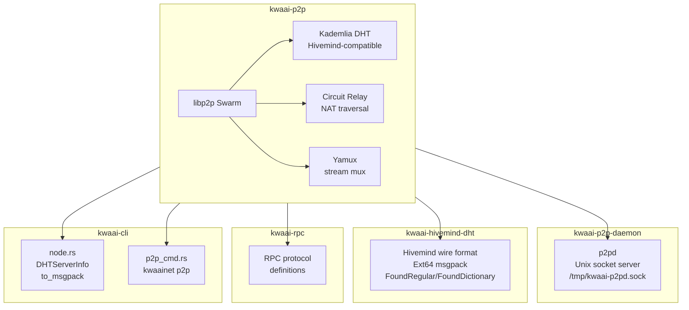
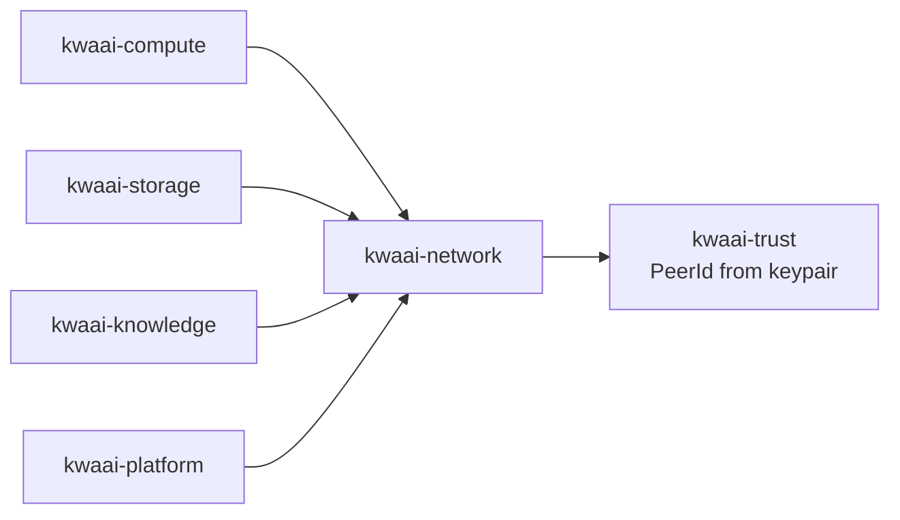

# kwaai-network — Design Overview

## What it solves

Nodes need to find each other and exchange data without central brokers. kwaai-network provides a
Hivemind-compatible Kademlia DHT so KwaaiNet nodes interoperate with the existing Python Hivemind
network, plus circuit relay so nodes behind residential NAT can participate fully.

## How it fits the whitepaper architecture

The whitepaper defines Layer 8 as "credibly neutral shared infrastructure". kwaai-network is the
transport substrate — every other project (compute, storage, knowledge) uses it to announce presence
and route requests. The Hivemind compatibility constraint means we share bootstrap peers with the
broader open AI community.

## Component diagram



## Dependency diagram



## DHT wire format reference

### DHTServerInfo (Ext type 64)
```
msgpack([
  state: i32,
  throughput: f64,
  {
    "start_block": u32,
    "end_block": u32,
    "peer_id": string (base58),
    "public_name": string,
    "vpk": { mode, endpoint, capacity_gb, tenant_count, vpk_version },
    ...  ← unknown keys silently ignored by legacy peers
  }
])
```

### VPK node record (_kwaai.vpk.nodes)
```
subkey: msgpack(peer_id_base58)
value:  msgpack({ mode, endpoint, capacity_gb, tenant_count, vpk_version })
TTL:    360s
```
