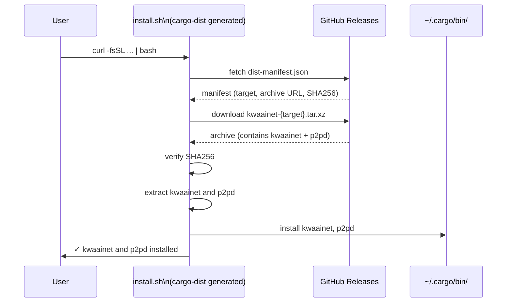
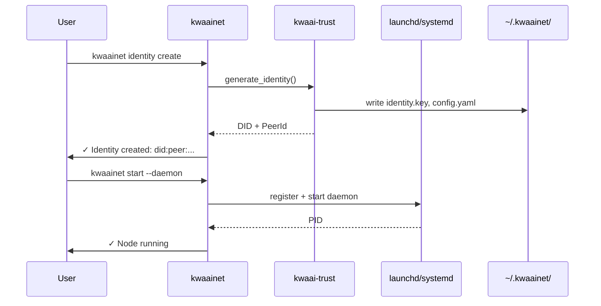
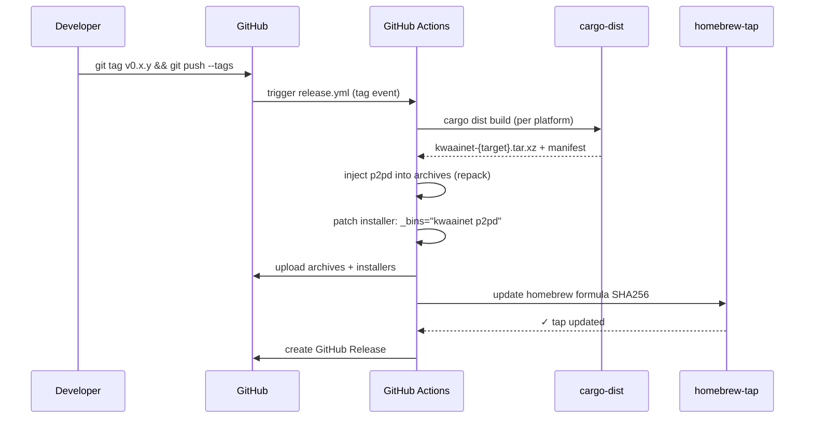
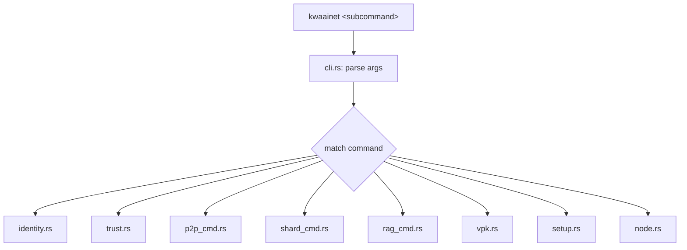

# kwaai-platform — Data Flows

## User installation (shell installer)

```mermaid
sequenceDiagram
    participant User
    participant Shell as install.sh\n(cargo-dist generated)
    participant GitHub as GitHub Releases
    participant FS as ~/.cargo/bin/

    User->>Shell: curl -fsSL ... | bash
    Shell->>GitHub: fetch dist-manifest.json
    GitHub-->>Shell: manifest (target, archive URL, SHA256)
    Shell->>GitHub: download kwaainet-{target}.tar.xz
    GitHub-->>Shell: archive (contains kwaainet + p2pd)
    Shell->>Shell: verify SHA256
    Shell->>Shell: extract kwaainet and p2pd
    Shell->>FS: install kwaainet, p2pd
    Shell->>User: ✓ kwaainet and p2pd installed
```

## First-time setup

```mermaid
sequenceDiagram
    participant User
    participant CLI as kwaainet
    participant Trust as kwaai-trust
    participant Service as launchd/systemd
    participant Config as ~/.kwaainet/

    User->>CLI: kwaainet identity create
    CLI->>Trust: generate_identity()
    Trust->>Config: write identity.key, config.yaml
    Trust-->>CLI: DID + PeerId
    CLI->>User: ✓ Identity created: did:peer:...

    User->>CLI: kwaainet start --daemon
    CLI->>Service: register + start daemon
    Service-->>CLI: PID
    CLI->>User: ✓ Node running
```

## Release pipeline (cargo-dist)

```mermaid
sequenceDiagram
    participant Dev as Developer
    participant Git as GitHub
    participant CI as GitHub Actions
    participant Dist as cargo-dist
    participant Tap as homebrew-tap

    Dev->>Git: git tag v0.x.y && git push --tags
    Git->>CI: trigger release.yml (tag event)
    CI->>Dist: cargo dist build (per platform)
    Dist-->>CI: kwaainet-{target}.tar.xz + manifest
    CI->>CI: inject p2pd into archives (repack)
    CI->>CI: patch installer: _bins="kwaainet p2pd"
    CI->>Git: upload archives + installers
    CI->>Tap: update homebrew formula SHA256
    Tap-->>CI: ✓ tap updated
    CI->>Git: create GitHub Release
```

## Command dispatch (main.rs)

```mermaid
graph TD
    Input[kwaainet &lt;subcommand&gt;] --> Parse[cli.rs: parse args]
    Parse --> Dispatch{match command}
    Dispatch --> Identity[identity.rs]
    Dispatch --> Trust[trust.rs]
    Dispatch --> P2P[p2p_cmd.rs]
    Dispatch --> Shard[shard_cmd.rs]
    Dispatch --> Rag[rag_cmd.rs]
    Dispatch --> Vpk[vpk.rs]
    Dispatch --> Setup[setup.rs]
    Dispatch --> Node[node.rs]
```
