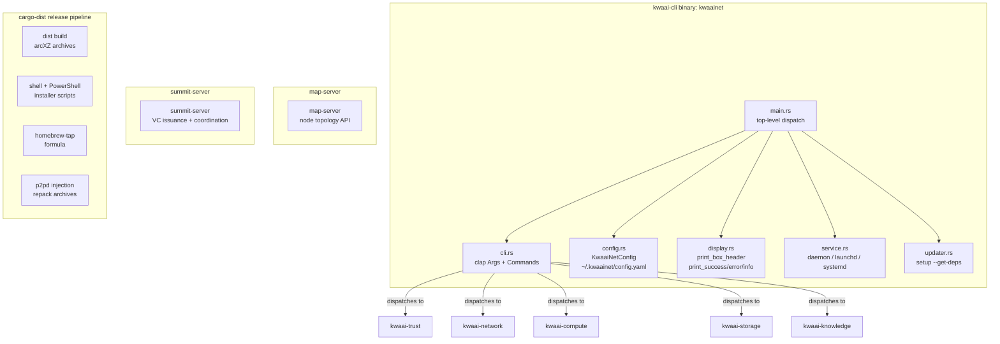
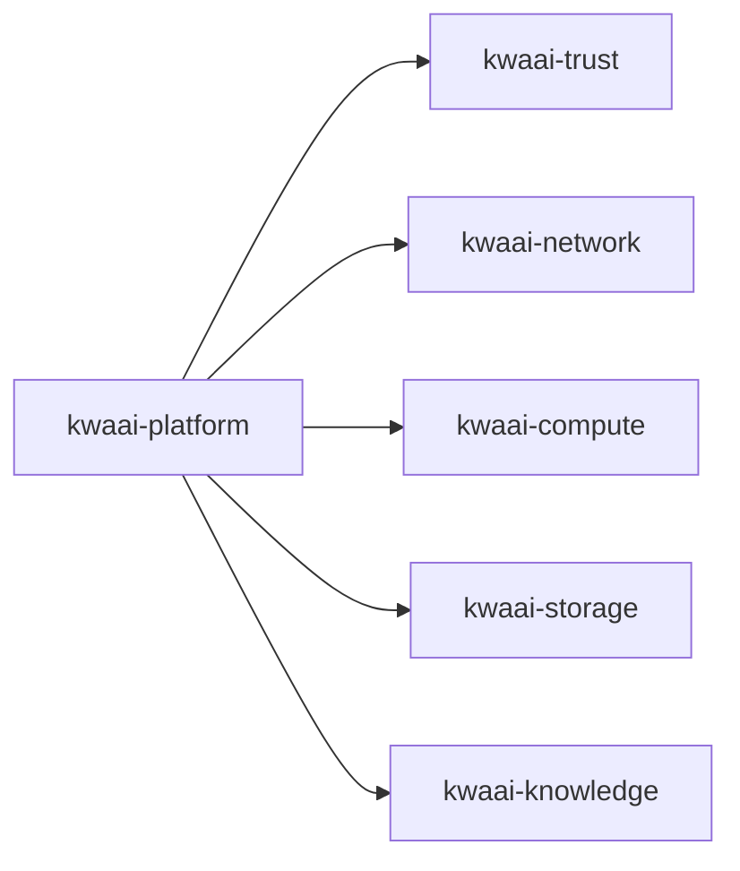

# kwaai-platform — Design Overview

## What it solves

Every domain crate needs a user-facing interface and a way to be distributed to end users.
kwaai-platform is the integration layer: it dispatches all subcommands, manages configuration,
packages the binary with its dependencies (p2pd), and delivers it via cargo-dist installers,
Homebrew, and the `kwaainet setup` command.

## How it fits the whitepaper architecture

kwaai-platform has no whitepaper section of its own — it is the delivery mechanism for everything
else. Its quality determines whether end users (non-developers) can actually run KwaaiNet.

## Component diagram



## Dependency diagram



## Config field pattern

New config fields must use:
```rust
#[serde(default)]
pub new_field: Option<T>,
// in serialization: #[serde(skip_serializing_if = "Option::is_none")]
```
This ensures old `config.yaml` files without the field remain valid.

## p2pd bundling architecture

cargo-dist produces per-platform `.tar.xz` / `.zip` archives containing only the Rust binary.
p2pd (Go binary) is not a cargo crate, so it cannot be built by cargo-dist directly.
Solution:
1. `build-local-artifacts` job: after `dist build`, unpack archives, inject p2pd, repack + update SHA256 in `dist-manifest.json`
2. `build-global-artifacts` job: sed-patch installer scripts to include p2pd in `$_bins`
