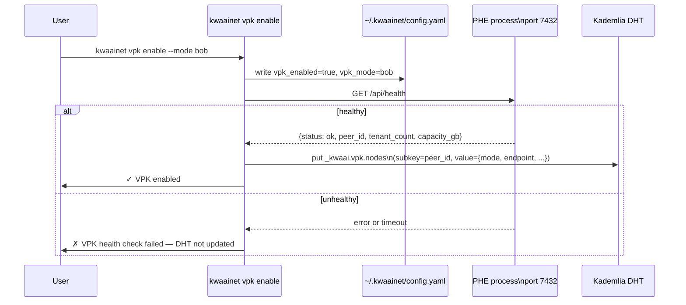
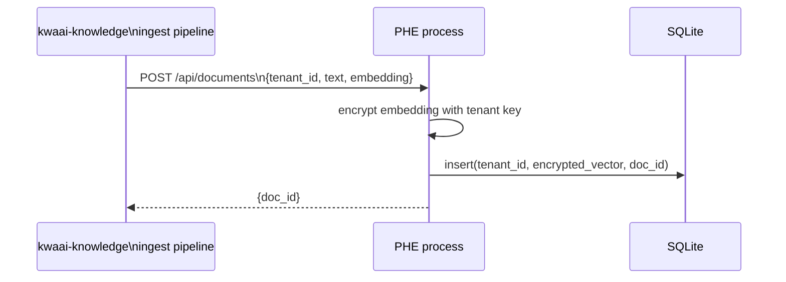
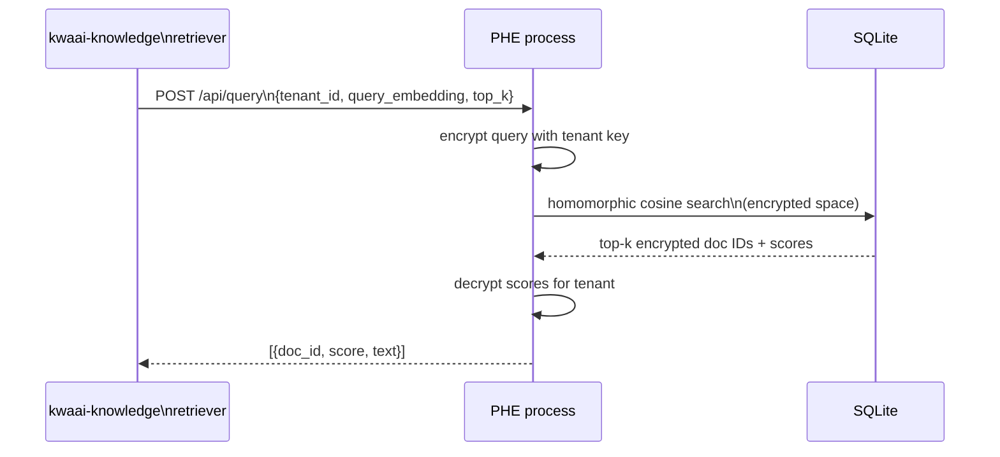
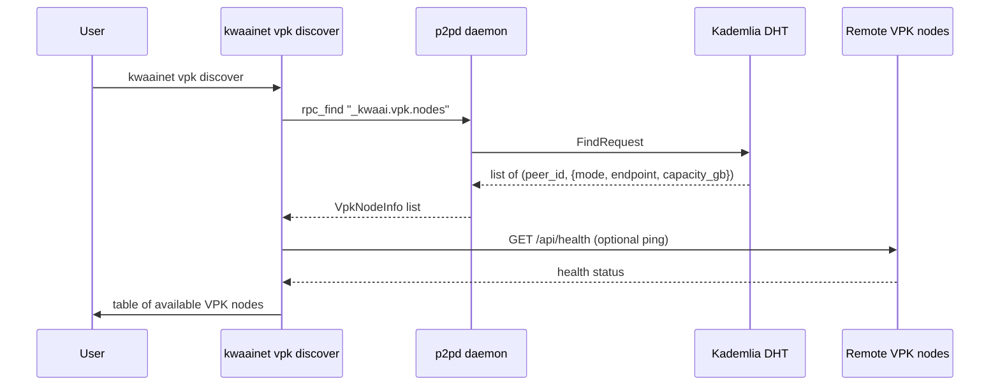

# kwaai-storage — Data Flows

## VPK enable and DHT announcement

```mermaid
sequenceDiagram
    participant User
    participant CLI as kwaainet vpk enable
    participant Config as ~/.kwaainet/config.yaml
    participant VPK as PHE process\nport 7432
    participant DHT as Kademlia DHT

    User->>CLI: kwaainet vpk enable --mode bob
    CLI->>Config: write vpk_enabled=true, vpk_mode=bob
    CLI->>VPK: GET /api/health
    alt healthy
        VPK-->>CLI: {status: ok, peer_id, tenant_count, capacity_gb}
        CLI->>DHT: put _kwaai.vpk.nodes\n(subkey=peer_id, value={mode, endpoint, ...})
        CLI->>User: ✓ VPK enabled
    else unhealthy
        VPK-->>CLI: error or timeout
        CLI->>User: ✗ VPK health check failed — DHT not updated
    end
```

## Vector storage (ingest)

```mermaid
sequenceDiagram
    participant RAG as kwaai-knowledge\ningest pipeline
    participant VPK as PHE process
    participant DB as SQLite

    RAG->>VPK: POST /api/documents\n{tenant_id, text, embedding}
    VPK->>VPK: encrypt embedding with tenant key
    VPK->>DB: insert(tenant_id, encrypted_vector, doc_id)
    VPK-->>RAG: {doc_id}
```

## Encrypted vector search

```mermaid
sequenceDiagram
    participant RAG as kwaai-knowledge\nretriever
    participant VPK as PHE process
    participant DB as SQLite

    RAG->>VPK: POST /api/query\n{tenant_id, query_embedding, top_k}
    VPK->>VPK: encrypt query with tenant key
    VPK->>DB: homomorphic cosine search\n(encrypted space)
    DB-->>VPK: top-k encrypted doc IDs + scores
    VPK->>VPK: decrypt scores for tenant
    VPK-->>RAG: [{doc_id, score, text}]
```

## VPK node discovery

```mermaid
sequenceDiagram
    participant User
    participant CLI as kwaainet vpk discover
    participant p2pd as p2pd daemon
    participant DHT as Kademlia DHT
    participant Remote as Remote VPK nodes

    User->>CLI: kwaainet vpk discover
    CLI->>p2pd: rpc_find "_kwaai.vpk.nodes"
    p2pd->>DHT: FindRequest
    DHT-->>p2pd: list of (peer_id, {mode, endpoint, capacity_gb})
    p2pd-->>CLI: VpkNodeInfo list
    CLI->>Remote: GET /api/health (optional ping)
    Remote-->>CLI: health status
    CLI->>User: table of available VPK nodes
```
