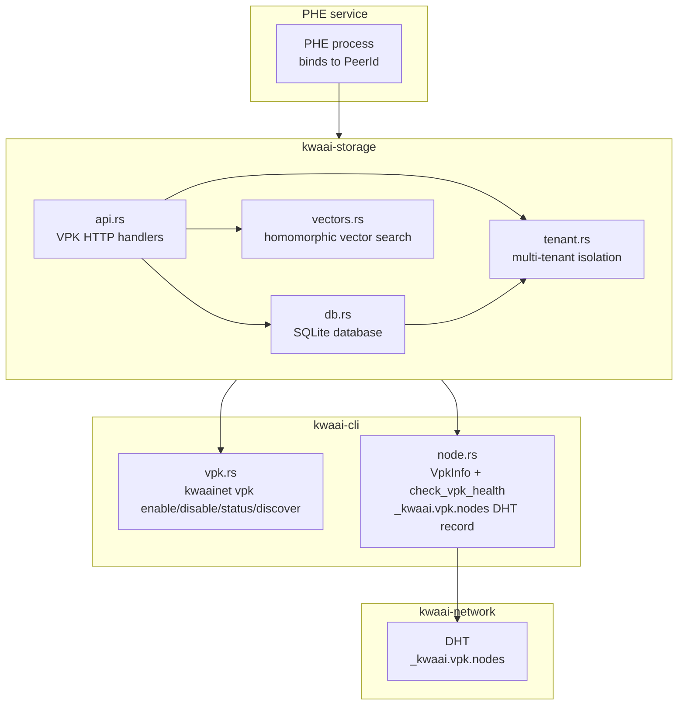
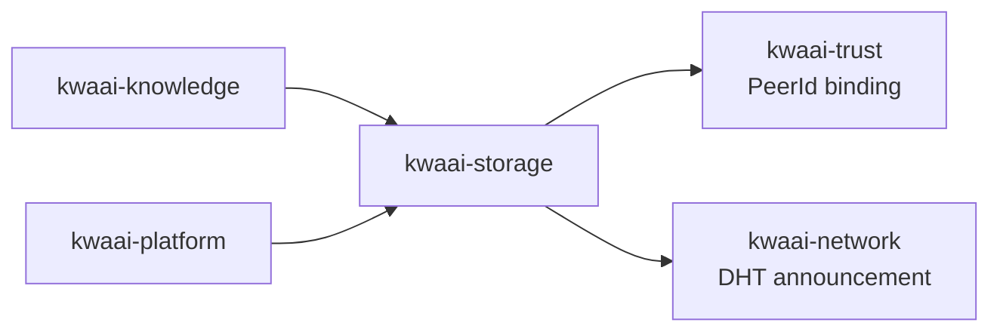

# kwaai-storage — Design Overview

## What it solves

Personal knowledge should be queryable without exposing it to untrusted parties.
kwaai-storage provides VPK: a multi-tenant vector store where vectors are homomorphically encrypted
so search can run on untrusted nodes without leaking the underlying documents.

## How it fits the whitepaper architecture

The whitepaper describes "Virtual Private Knowledge: multi-tenant knowledge base bound to node
identity and credentials". kwaai-storage is the implementation of VPK Phase 1.
The PHE (Personal Homomorphic Encryption) service runs as a separate process (separate repo)
binding to the node's `PeerId`; kwaai-storage manages DHT advertisement and CLI integration.

## Component diagram

## Dependency diagram

## VPK roles

| Role | Vectors visible to | Use case |
|------|-------------------|----------|
| `bob` | Owner only | Personal private knowledge |
| `eve` | Encrypted inference peers | Shared inference without exposing data |
| `both` | Owner + encrypted peers | Combined personal + shared |

## Multi-tenant isolation model

Each tenant is identified by a UUID. Vector tables, index mappings, and audit logs are all
partitioned by `tenant_id`. The PHE encryption key is derived per-tenant from the node keypair.
A query for tenant A cannot access vectors belonging to tenant B even if the PHE process
is compromised — the encrypted vectors are unintelligible without the per-tenant key.
