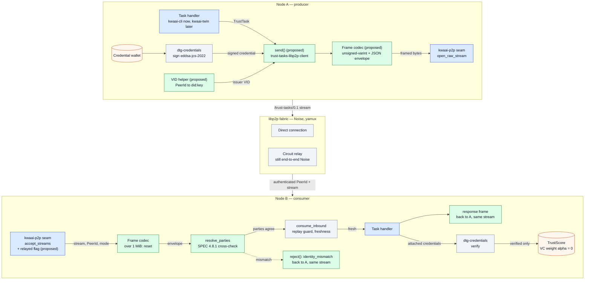
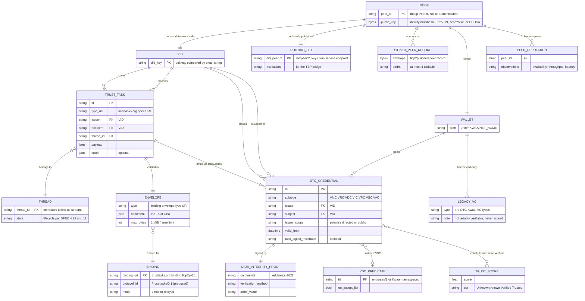
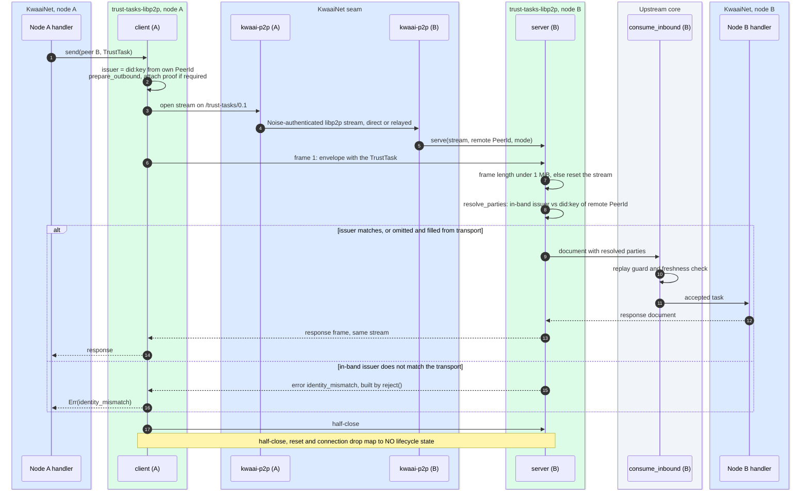
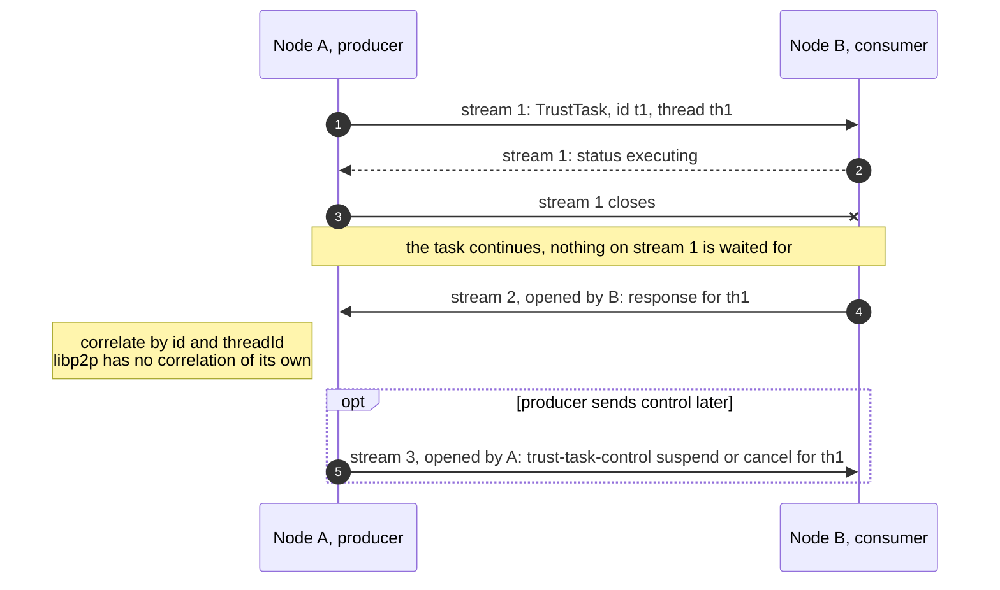
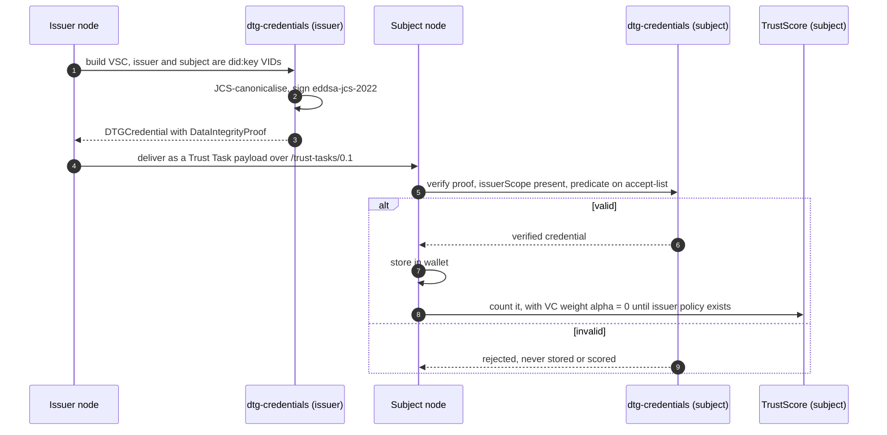

# DTGWG trust stack — design diagrams

Diagrams for [`plans/DTGWG-TrustStack-plan.md`](../plans/DTGWG-TrustStack-plan.md). They
show the **target state after Phase 3 (Q1 2027)**. Names marked *(proposed)* do not exist
yet in any codebase; everything else exists today in KwaaiNet `main` or in upstream
`trustoverip/dtgwg-trust-tasks-tf` at `trust-tasks-rs` 0.26.0.

Ownership is the point of the design, so every diagram keeps it visible:

| Colour | Owner | Changes when Trust Tasks changes? |
|---|---|---|
| Blue | KwaaiNet tree | **No** — only the `(PeerId, stream)` seam lives here |
| Green | `trust-tasks-libp2p` — contributed by Kwaai, in the upstream workspace, co-maintained | Yes, carried by upstream's lockstep releases |
| Grey | Upstream core (`trust-tasks-rs`) and third-party crates (OpenVTC, Affinidi) | Their releases |

## 1. Data flow — one Trust Task between two nodes

What crosses the KwaaiNet seam is only a stream, a `PeerId` and a direct/relayed flag.
The Trust Task document, its parties, framing, the replay guard and the VID mapping all
live in the contributed crate (green) or upstream (grey). That is why an upstream release
does not touch our code.

## 2. Entity relationships

Mapping of today's credential types to DTG subtypes (from the plan):

| Today | DTG credential | Notes |
|---|---|---|
| PeerEndorsementVC | VSC `endorses/1` | |
| UptimeVC, ThroughputVC | VSC, Kwaai-namespaced predicate | `witnessed/1` needs a `taskContext`; ours are self-measured |
| FiduciaryPledgeVC | VSC | |
| SummitAttendeeVC | VMC, `issuerScope: public` | |
| VerifiedNodeVC | VMC | |
| BindingVC | VDC grant/accept | Re-issue depends on summit-server's removal |

## 3. Sequence — request, response, and a rejected sender

## 4. Sequence — late response on a fresh stream

## 5. Sequence — credential issued and verified

