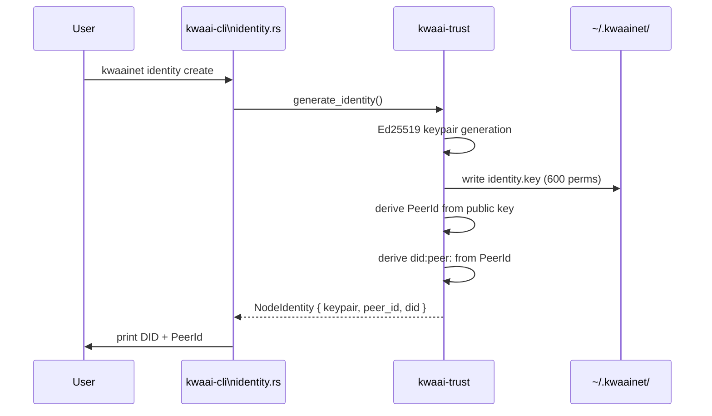
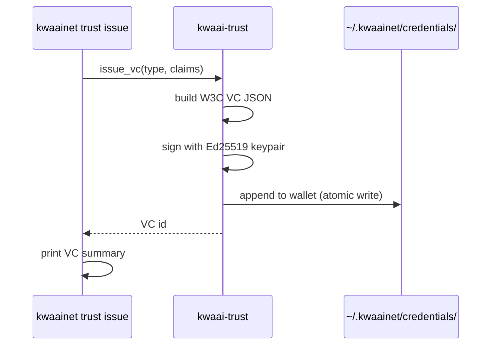
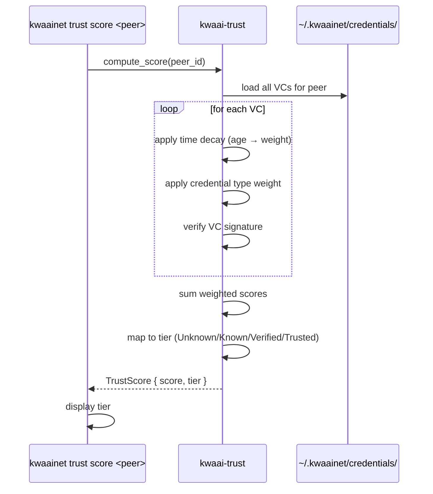
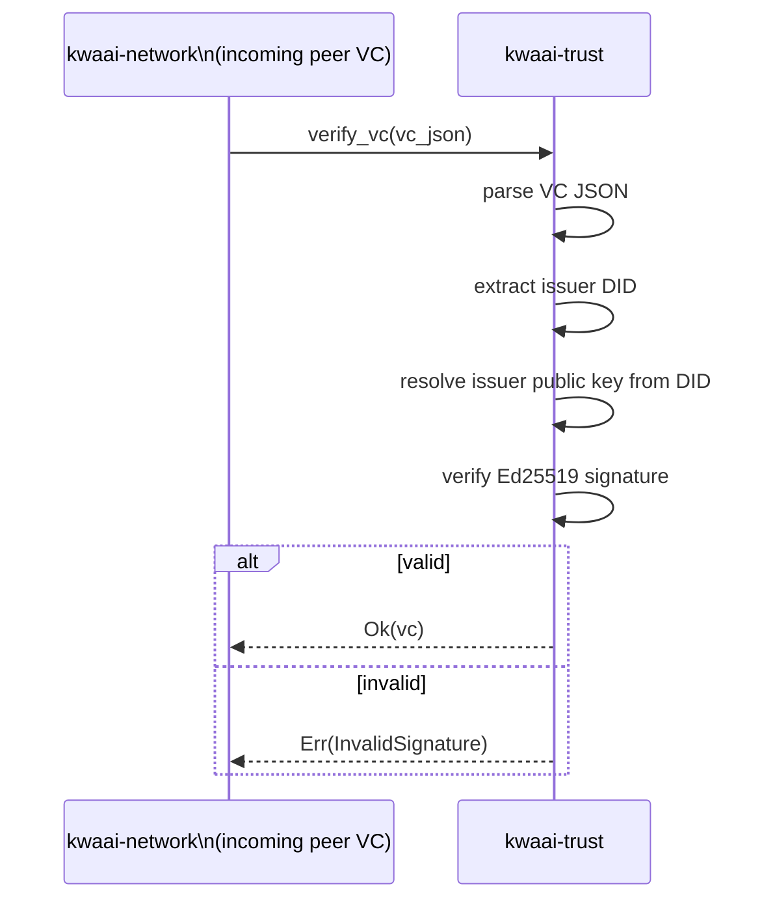

# kwaai-trust — Data Flows

## Identity creation (first run)

```mermaid
sequenceDiagram
    participant User
    participant CLI as kwaai-cli\nidentity.rs
    participant Trust as kwaai-trust
    participant FS as ~/.kwaainet/

    User->>CLI: kwaainet identity create
    CLI->>Trust: generate_identity()
    Trust->>Trust: Ed25519 keypair generation
    Trust->>FS: write identity.key (600 perms)
    Trust->>Trust: derive PeerId from public key
    Trust->>Trust: derive did:peer: from PeerId
    Trust-->>CLI: NodeIdentity { keypair, peer_id, did }
    CLI->>User: print DID + PeerId
```

## VC issuance and storage

```mermaid
sequenceDiagram
    participant CLI as kwaainet trust issue
    participant Trust as kwaai-trust
    participant FS as ~/.kwaainet/credentials/

    CLI->>Trust: issue_vc(type, claims)
    Trust->>Trust: build W3C VC JSON
    Trust->>Trust: sign with Ed25519 keypair
    Trust->>FS: append to wallet (atomic write)
    Trust-->>CLI: VC id
    CLI->>CLI: print VC summary
```

## Trust score computation

```mermaid
sequenceDiagram
    participant CLI as kwaainet trust score <peer>
    participant Trust as kwaai-trust
    participant FS as ~/.kwaainet/credentials/

    CLI->>Trust: compute_score(peer_id)
    Trust->>FS: load all VCs for peer
    loop for each VC
        Trust->>Trust: apply time decay (age → weight)
        Trust->>Trust: apply credential type weight
        Trust->>Trust: verify VC signature
    end
    Trust->>Trust: sum weighted scores
    Trust->>Trust: map to tier (Unknown/Known/Verified/Trusted)
    Trust-->>CLI: TrustScore { score, tier }
    CLI->>CLI: display tier
```

## VC verification (incoming credential)

```mermaid
sequenceDiagram
    participant Net as kwaai-network\n(incoming peer VC)
    participant Trust as kwaai-trust

    Net->>Trust: verify_vc(vc_json)
    Trust->>Trust: parse VC JSON
    Trust->>Trust: extract issuer DID
    Trust->>Trust: resolve issuer public key from DID
    Trust->>Trust: verify Ed25519 signature
    alt valid
        Trust-->>Net: Ok(vc)
    else invalid
        Trust-->>Net: Err(InvalidSignature)
    end
```
