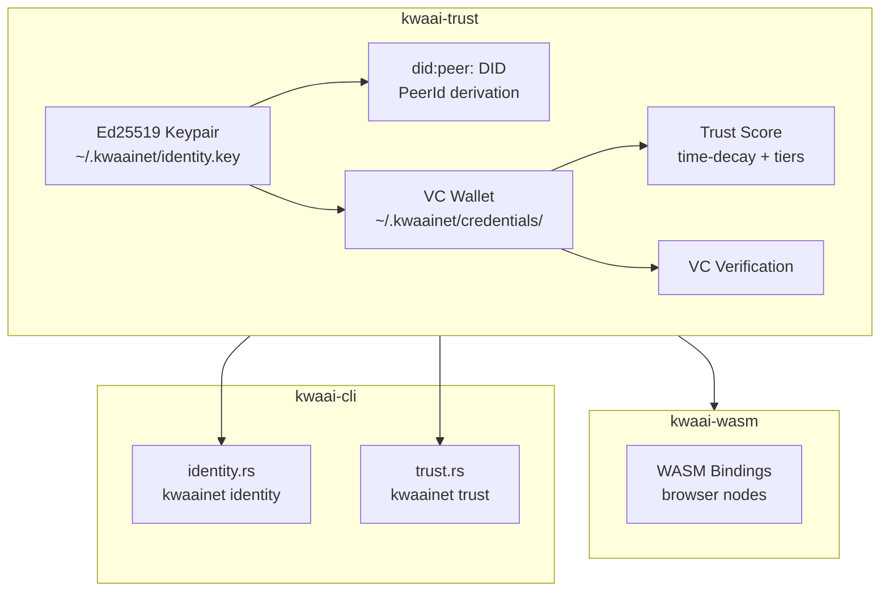
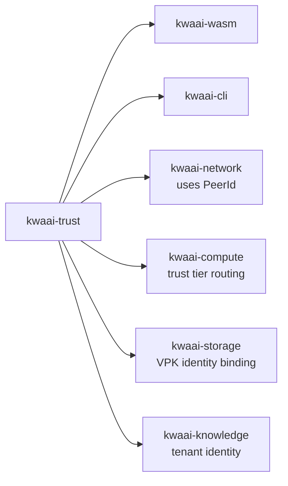

# kwaai-trust — Design Overview

## What it solves

KwaaiNet is a decentralized network where nodes need to trust each other without a central registry.
kwaai-trust provides the five-layer trust pipeline from the whitepaper: cryptographic identity →
verifiable credentials → local trust score → testable credentials (planned) → EigenTrust propagation (planned).

## How it fits the whitepaper architecture

The whitepaper defines Layer 8 trust as "portable, cryptographically anchored reputation earned
through demonstrated behaviour". kwaai-trust is the implementation of layers 1–3 of that pipeline.
It is a leaf crate — it has no KwaaiNet dependencies and is used by every other project.

## Component diagram

## Dependency diagram

## VC types

| Type | Issued by | Meaning |
|------|-----------|---------|
| `FiduciaryPledgeVC` | Self | Node commits to fiduciary obligations |
| `VerifiedNodeVC` | Summit / GliaNet | Node passed external verification |
| `UptimeVC` | Self (measured) | Historical uptime record |
| `ThroughputVC` | Self (measured) | Historical throughput record |
| `EventAttendeeVC` | Event organizer | Attended a Kwaai event |
| `PeerEndorsementVC` | Peer node | Another node endorses this one |

## Trust tier mapping

| Score range | Tier | Meaning |
|-------------|------|---------|
| 0 | Unknown | No credentials |
| 1–49 | Known | Some credentials, low confidence |
| 50–79 | Verified | Externally verified |
| 80–100 | Trusted | High credential density + endorsements |
